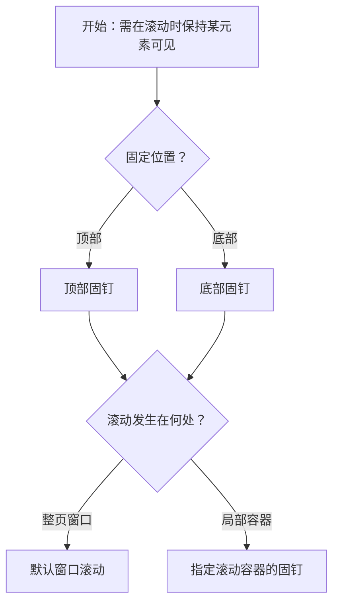

# 1. 简洁易读部份

## 1.0. 组件描述

固钉组件用于将页面中的某个元素钉在可视范围内，当用户滚动页面时，该元素在达到设定偏移量后固定在视口顶部或底部，保持操作或导航入口始终可见。

## 1.1. 组件构成

固钉由以下基础要素构成，可按需组合使用：

> <!-- 附图占位：建议附上一张示例图，展示固钉的触发元素、固钉后的固定位置（顶部/底部）、偏移量、以及滚动容器的构成关系 -->

&emsp;&emsp;1. **目标元素** 需要被固钉的内容，如导航菜单、操作按钮组、筛选栏等，通常为页面中需要持续可见的入口。

&emsp;&emsp;2. **固定位置** 固钉生效时的锚定位置，可为视口顶部或底部，通过偏移量精确控制。

&emsp;&emsp;3. **偏移量** 固钉元素距离视口顶部或底部的距离，用于避开页头、页脚或其它固定区域。

&emsp;&emsp;4. **滚动容器** 监听滚动的元素，默认为窗口，也可指定为局部滚动容器。

---

## 1.2. 组件包含哪些不同类型

### 1.2.1 顶部固钉

&emsp;**是什么**：当页面向下滚动、目标元素到达设定偏移量后，将其固定在视口顶部，常用于导航、筛选栏、操作栏。

> <!-- 附图占位：建议附上一张示例图，展示固钉生效前与生效后，元素从文档流位置移动到视口顶部的效果 -->

&emsp;**简单用法**：必须用于需在滚动时持续可见的顶部导航或操作；偏移量需考虑页头高度；适合长内容页的导航与操作入口

&emsp;**典型场景**：侧边菜单、筛选栏、表格操作栏、步骤条、返回顶部按钮的容器

> <!-- 附图占位：建议附上一张场景图，展示长文档页中顶部固钉的侧边导航或筛选栏 -->

&emsp;**替代方案**：若元素本身已在页头且无需随内容滚动，可不用固钉

### 1.2.2 底部固钉

&emsp;**是什么**：当页面向上滚动、目标元素到达设定偏移量后，将其固定在视口底部，常用于底部操作栏、提示条。

> <!-- 附图占位：建议附上一张示例图，展示固钉生效后元素固定在视口底部的效果 -->

&emsp;**简单用法**：必须用于需在滚动时持续可见的底部操作或提示；偏移量需考虑页脚或安全区；适合长表单底部提交、多选操作栏等

&emsp;**典型场景**：批量操作栏、表单底部提交区、底部提示条

> <!-- 附图占位：建议附上一张场景图，展示长列表底部固钉的批量操作栏 -->

&emsp;**替代方案**：若操作不依赖滚动中的可见性，可放在内容底部即可

### 1.2.3 指定滚动容器的固钉

&emsp;**是什么**：固钉监听指定容器的滚动，而非窗口，元素在容器内达到偏移量后固定，适用于局部可滚动区域。

> <!-- 附图占位：建议附上一张示例图，展示在局部滚动容器内固钉生效的效果 -->

&emsp;**简单用法**：必须用于有独立滚动容器的布局；需正确绑定容器的 DOM 引用；元素固定位置相对于该容器

&emsp;**典型场景**：侧边栏内独立滚动时的导航、弹窗内的表头固钉、多栏布局中某一栏的固钉

> <!-- 附图占位：建议附上一张场景图，展示侧边栏或弹窗内指定滚动容器的固钉效果 -->

&emsp;**替代方案**：若为整页滚动，使用默认窗口监听即可

---

## 1.3. 各类型典型场景案例

### 1.3.1 顶部导航固钉

> <!-- 附图占位：建议附上一张对比图，左侧展示长文档页顶部固钉导航（符合规范），右侧展示无固钉时滚动后导航消失（体验差） -->

✅ **推荐：** 长内容页的导航、筛选、操作栏使用顶部固钉，保持入口可见

❌ **不推荐：** 关键操作在滚动后不可见，用户需反复滚动才能操作

### 1.3.2 固钉与视口大小

> <!-- 附图占位：建议附上一张对比图，左侧展示视口充足时固钉不遮挡内容（符合规范），右侧展示小视口固钉占用过多空间（违反规范） -->

✅ **推荐：** 视口较大时使用固钉；视口过小时慎用，避免遮挡过多内容

❌ **不推荐：** 在手机等小屏上固钉过多元素，导致内容区域被严重压缩

### 1.3.3 固钉元素的内容量

> <!-- 附图占位：建议附上一张对比图，左侧展示固钉区域内容简洁（符合规范），右侧展示固钉区域内容过多（违反规范） -->

✅ **推荐：** 固钉区域保持简洁，仅放置必要的导航或操作

❌ **不推荐：** 固钉区域内容过多，占用大量可视空间，影响主体内容阅读

---

# 2. 选型指南

## 2.1 选择流程

---

# 3. 细致专业部份（交互与排版规则）

## 3.1 何时使用固钉

* **适用场景**：内容区域较长需滚动；与当前视图对应的操作或导航需在滚动范围内始终可见；如侧边菜单、筛选栏、操作按钮组。
* **慎用场景**：页面可视范围过小时，固钉可能占用过多空间、遮挡内容，需谨慎使用。
* **与 Sticky 的区别**：固钉在达到偏移量后固定在视口指定位置；CSS `position: sticky` 在父容器内粘滞。固钉更适合需要精确控制偏移、或绑定非窗口滚动容器的场景。

> <!-- 附图占位：建议附上一张对比图，展示适合固钉与不适合固钉的页面类型 -->

## 3.2 偏移量的设置

* **顶部固钉**：偏移量通常为页头高度或 0，确保固钉后不与页头重叠；若存在固定页头，需预留其高度。
* **底部固钉**：偏移量通常为 0 或考虑页脚、安全区；移动端需考虑底部安全区域。
* **一致性**：同一页面内若有多个固钉区域，偏移量应统一或形成清晰层级，避免重叠或错位。

> <!-- 附图占位：建议附上一张示例图，展示顶部固钉偏移量与页头的关系 -->

## 3.3 固钉状态的变化与回调

* **状态变化**：固钉有「未固定」与「已固定」两种状态，滚动经过临界点时切换。
* **回调**：可通过回调获知固钉状态变化，用于切换样式、高亮当前区域、记录埋点等。
* **过渡**：从文档流切换到固定定位时，应有平滑过渡，避免突兀跳动。

> <!-- 附图占位：建议附上一张场景图，展示固钉状态切换时的视觉与交互反馈 -->

## 3.4 指定滚动容器的注意事项

* **绑定方式**：需传入返回容器 DOM 的函数，确保在容器渲染完成后再绑定。
* **容器边界**：固钉相对于该容器计算偏移，元素不会超出容器范围；若容器尺寸或结构变化，需保证绑定正确。
* **常见问题**：绑定容器时，若仅监听容器滚动而窗体 also 滚动，固钉可能表现异常；水平滚动容器内固钉的横向位置可能不准确，固钉更适用于垂直滚动。

> <!-- 附图占位：建议附上一张说明图，展示指定滚动容器固钉的适用场景与限制 -->

## 3.5 固钉元素的内容设计

* **简洁**：固钉区域应只放置必要的导航或操作，避免信息过载。
* **高度**：固钉区域高度不宜过大，以免压缩内容可视区域。
* **交互**：固钉内的按钮、链接等需保持可点击、可聚焦，确保无障碍访问。

> <!-- 附图占位：建议附上一张示例图，展示固钉区域的推荐内容量与高度控制 -->

## 3.6 定位与布局约束

* **避免绝对定位子元素**：固钉内部不宜使用会脱离文档流的绝对定位，否则可能导致布局错乱。
* **若需绝对定位效果**：可将 Affix 本身设为绝对定位，由 Affix 控制整体位置，内部保持正常流式布局。
* **与页面布局的配合**：固钉需与整体布局（如侧边栏、主内容区）协调，避免固定后遮挡关键内容或与其它固定元素重叠。

> <!-- 附图占位：建议附上一张示例图，展示固钉与页面布局的配合及定位约束 -->

---

## 4.0. 常见问题

### 1. 固钉和 Sticky 有什么区别？

- **固钉（Affix）**：通过监听滚动，在达到偏移量后将元素设为 `position: fixed`，可精确控制偏移、绑定指定滚动容器，适合复杂布局与多容器场景。
- **Sticky**：CSS `position: sticky`，在父容器内粘滞，实现简单，但偏移与滚动容器控制相对有限。简单场景可用 Sticky，需精细控制时用 Affix。

### 2. 固钉绑定容器时，元素跑到容器外怎么办？

从实现上，Affix 主要监听绑定容器的滚动。若实际滚动发生在窗体而容器不滚动，固钉可能表现异常。需要根据真实滚动发生在窗体还是容器，正确配置 target。若希望任意滚动都生效，可在窗体上添加滚动监听并自行控制固定逻辑。

### 3. 水平滚动容器里能用固钉吗？

固钉一般适用于垂直滚动。在水平滚动容器中使用时，元素的 `left` 等横向位置可能不准确。若需求是水平容器内的粘滞效果，建议考虑使用原生 `position: sticky` 或自定义实现。
