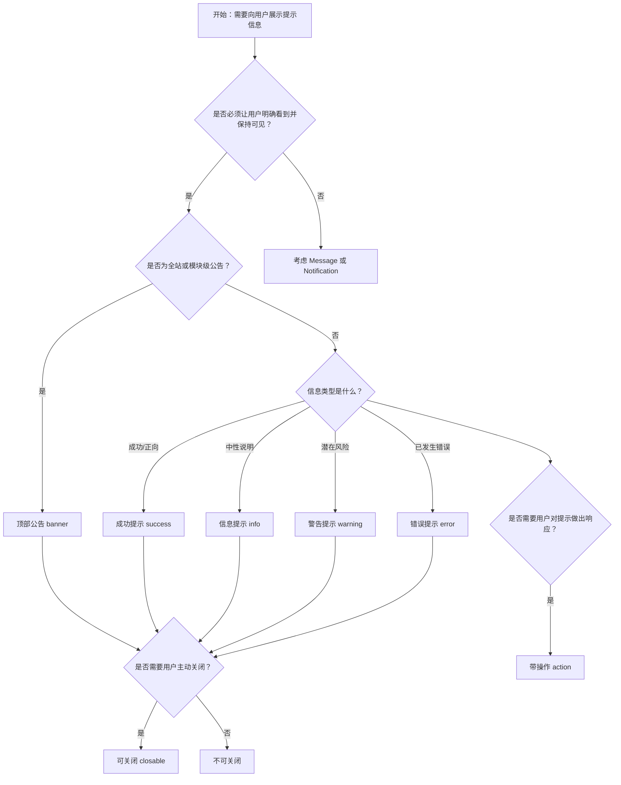

# 1. 简洁易读部份

## 1.0. 组件描述

警告提示（Alert）组件用于在页面中静态展现需要用户关注的警示、说明或反馈信息，采用非浮层形式，始终可见且不会自动消失，用户可选择性关闭。

## 1.1. 组件构成

警告提示由以下基础要素构成，可按需组合使用：

> <!-- 附图占位：建议附上一张示例图，展示警告提示的容器、图标、标题、描述、操作区与关闭按钮的构成关系，标注各要素名称与位置 -->

&emsp;&emsp;1. **容器** 定义提示框的视觉边界与整体形态，承载不同严重等级（成功、信息、警告、错误）的背景与边框样式。

&emsp;&emsp;2. **图标** 传达信息类型与严重程度，可显示或隐藏，用于快速识别反馈性质。

&emsp;&emsp;3. **标题** 表达核心警示内容，为主信息层级。

&emsp;&emsp;4. **描述** 提供辅助性说明或建议，用于补充标题之外的详细信息。

&emsp;&emsp;5. **操作区** 可放置「撤销」「接受」等操作按钮，供用户对提示内容做出响应。

&emsp;&emsp;6. **关闭按钮** 用于可关闭类型的提示，允许用户主动收起不再需要的提示。

---

## 1.2. 组件包含哪些不同类型

### 1.2.1 成功提示（success）

&emsp;**是什么**：传达操作成功完成或目标达成后的正向反馈

> <!-- 附图占位：建议附上一张示例图，展示成功提示（绿色系背景与边框、成功图标）的视觉形态，体现正向反馈的语义 -->

&emsp;**简单用法**：必须用于已成功完成的操作反馈；不可用于尚未完成或失败场景；适合配合表单提交、保存、删除等操作的确认

&emsp;**典型场景**：表单提交成功、数据保存成功、配置更新完成

> <!-- 附图占位：建议附上一张场景图，展示表单提交后页面顶部出现的成功提示，传达操作已完成的反馈 -->

&emsp;**替代方案**：若仅需轻量、短时反馈，改用 Message；若需系统级推送，改用 Notification

### 1.2.2 信息提示（info）

&emsp;**是什么**：传达中性、辅助性的说明或说明类信息

> <!-- 附图占位：建议附上一张示例图，展示信息提示（蓝色系背景与边框、信息图标）的视觉形态，体现中性说明的语义 -->

&emsp;**简单用法**：必须用于非警示、非错误的中性说明；不可用于成功或危险类反馈；适合引导用户了解当前状态或可选操作

&emsp;**典型场景**：系统说明、使用提示、功能说明

> <!-- 附图占位：建议附上一张场景图，展示页面中的信息提示说明某项功能的用法，体现辅助说明的用途 -->

&emsp;**替代方案**：若信息非常简短且可自动消失，改用 Message

### 1.2.3 警告提示（warning）

&emsp;**是什么**：传达需引起注意但尚未造成严重后果的提醒

> <!-- 附图占位：建议附上一张示例图，展示警告提示（橙色/黄色系背景与边框、警告图标）的视觉形态，体现需关注但非严重问题的语义 -->

&emsp;**简单用法**：必须用于潜在风险或需用户注意的情况；不可用于已发生的错误；适合数据即将过期、配额即将用尽等场景

&emsp;**典型场景**：配额即将用尽、即将过期提醒、操作前的注意说明

> <!-- 附图占位：建议附上一张场景图，展示存储空间或配额即将用尽时的警告提示，体现预警用途 -->

&emsp;**替代方案**：若需用户立即确认或存在不可逆风险，改用 Modal 确认框

### 1.2.4 错误提示（error）

&emsp;**是什么**：传达操作失败、数据异常或系统错误的负面反馈

> <!-- 附图占位：建议附上一张示例图，展示错误提示（红色系背景与边框、错误图标）的视觉形态，体现严重问题的语义 -->

&emsp;**简单用法**：必须用于已发生的错误或失败；不可用于成功或中性说明；应配合明确的错误原因或建议操作

&emsp;**典型场景**：提交失败、网络异常、数据校验错误

> <!-- 附图占位：建议附上一张场景图，展示表单提交失败后页面中的错误提示，体现失败反馈与建议操作 -->

&emsp;**替代方案**：若错误需用户明确确认后才能继续，改用 Modal；若为轻量反馈，改用 Message

### 1.2.5 顶部公告（banner）

&emsp;**是什么**：以页面顶部全宽形式展示的系统级公告或重要提示

> <!-- 附图占位：建议附上一张示例图，展示顶部公告（横跨页面顶部、默认带图标）的视觉形态，体现系统级公告的醒目性 -->

&emsp;**简单用法**：必须用于全站或当前模块级的重要公告；默认展示图标以强化识别；适合维护通知、政策变更、活动公告

&emsp;**典型场景**：系统维护公告、版本更新说明、活动或政策变更

> <!-- 附图占位：建议附上一张场景图，展示页面顶部横跨全宽的系统维护公告，体现全站级公告的摆放位置 -->

&emsp;**替代方案**：若为单页面内的局部提示，改用普通 Alert

### 1.2.6 可关闭提示（closable）

&emsp;**是什么**：允许用户通过关闭按钮主动收起不再需要的提示

> <!-- 附图占位：建议附上一张示例图，展示可关闭提示在标题或操作区右侧的关闭图标，体现用户主动关闭的交互方式 -->

&emsp;**简单用法**：必须用于非强制的、用户可选择忽略的提示；关闭后提示应平滑淡出；适合一次性说明或可忽略的提醒

&emsp;**典型场景**：新功能说明、可忽略的温馨提示

> <!-- 附图占位：建议附上一张场景图，展示用户点击关闭后提示平滑消失的效果，体现可关闭交互 -->

&emsp;**替代方案**：若信息必须持续可见，不提供关闭按钮

### 1.2.7 带操作提示（action）

&emsp;**是什么**：在提示中提供操作按钮，引导用户对提示内容做出响应

> <!-- 附图占位：建议附上一张示例图，展示带操作区的提示（如「撤销」「接受」「拒绝」按钮）的视觉结构，体现可响应的交互 -->

&emsp;**简单用法**：必须用于需要用户选择或确认的提示；操作按钮应语义明确；不宜放置过多操作

&emsp;**典型场景**：撤销刚执行的操作、接受条款、跳转帮助文档

> <!-- 附图占位：建议附上一张场景图，展示删除成功后带「撤销」按钮的提示，体现操作响应的典型用法 -->

&emsp;**替代方案**：若需强确认或复杂操作，改用 Modal

---

## 1.3. 各类型典型场景案例

### 1.3.1 成功与错误反馈

> <!-- 附图占位：建议附上一张对比图，左侧展示操作成功后使用成功提示（符合规范），右侧展示失败时误用成功样式（违反规范） -->

✅ **推荐：** 按操作结果选用 success 或 error 类型，并给出清晰说明或建议

❌ **不推荐：** 错误场景使用成功样式，或成功场景使用错误样式

### 1.3.2 警告与错误区分

> <!-- 附图占位：建议附上一张对比图，左侧展示潜在风险用警告、已发生问题用错误（符合规范），右侧展示两者混用导致语义不清（违反规范） -->

✅ **推荐：** 尚未发生的问题用 warning，已发生的问题用 error

❌ **不推荐：** 将警告与错误混用，或夸大/弱化问题严重程度

### 1.3.3 顶部公告使用

> <!-- 附图占位：建议附上一张对比图，左侧展示全站公告使用 banner 形式（符合规范），右侧展示局部提示误用全宽公告（违反规范） -->

✅ **推荐：** 全站或模块级重要公告使用 banner，局部提示使用普通 Alert

❌ **不推荐：** 仅针对局部内容的提示使用全宽顶部公告

---

# 2. 选型指南

## 2.1 选择流程

---

# 3. 细致专业部份（交互与排版规则）

为保持界面清晰并避免提示干扰过度，当在页面中展示警告提示时，请参考以下排版和交互规则：

## 3.1 展示位置与数量

在页面中放置 Alert 时，需遵循以下原则：

* **位置**：常规提示放在与触发场景相关的内容附近（如表单上方、列表顶部），顶部公告固定于页面顶部。
* **数量**：同一可见区域内的提示不宜超过 2–3 条，过多提示会削弱每一条的注意力。
* **层级**：错误类提示视觉上应高于信息类；在同一区域多条并存时，按重要程度排序。

> <!-- 附图占位：建议附上一张场景图，展示表单上方合理的 1–2 条提示布局，体现数量与位置的把控 -->

## 3.2 类型与语义一致性

**如何正确选择提示类型？**

* **success**：操作已成功完成，用户可继续后续操作。
* **info**：中性说明，无成功/失败含义，用于解释或引导。
* **warning**：潜在风险或需注意的情况，尚未造成实质问题。
* **error**：已发生的错误或失败，需要用户知晓并处理。

**建议：**

* **语义一致**：颜色和图标必须与信息类型一致，不可为追求美观而改变类型含义。
* **文案清晰**：标题简洁传达核心信息，描述用于补充与建议，避免冗长或模糊。

> <!-- 附图占位：建议附上一张对比图，展示正确使用 success/error 的示例与错误混用类型的反例 -->

## 3.3 可关闭与持久展示

* **可关闭**：用于非强制的、用户可忽略的提示；关闭按钮应易于识别；关闭后动画宜自然。
* **不可关闭**：用于必须持续可见的提示（如安全相关、合规说明），不应提供关闭入口。
* **顶部公告**：公告类提示通常可关闭，以便用户确认后收起。

> <!-- 附图占位：建议附上一张场景图，展示可关闭提示与不可关闭提示的对比，体现关闭策略的差异 -->

## 3.4 操作区与按钮

当提示需承载操作时：

* **按钮数量**：操作区不宜超过 2–3 个，避免选择负担。
* **主次关系**：主操作（如「撤销」「接受」）视觉优先，次要操作可弱化。
* **位置**：操作区放在提示内容右侧或底部，与标题、描述保持清晰区隔。

> <!-- 附图占位：建议附上一张示例图，展示带 1–2 个操作按钮的提示布局，体现操作区与主次关系 -->

## 3.5 与 Message、Notification 的边界

* **Alert**：静态、持久、不自动消失，适合页面内与内容强相关的提示。
* **Message**：顶部居中、短时、自动消失，适合操作结果的轻量反馈。
* **Notification**：四角弹出、可含标题与描述、支持操作，适合系统级或较复杂通知。

当信息很短且仅需即时反馈时，优先 Message；当需要系统级推送或更丰富内容时，考虑 Notification。

> <!-- 附图占位：建议附上一张对比图，展示 Alert、Message、Notification 在位置、时长、内容量上的差异 -->

## 3.6 响应式与可访问性

* **响应式**：在窄屏设备上，提示宽度应随容器适配，避免溢出或遮挡。
* **可读性**：背景与文字对比度需达标，图标与文字语义应一致。
* **关闭操作**：可关闭提示应支持键盘操作（如 Esc）及屏幕阅读器可识别的关闭方式。

> <!-- 附图占位：建议附上一张示意图，展示窄屏下提示的适配效果，体现响应式与可读性 -->

---

## 4.0. 常见问题

### 1. Alert 和 Message 的区别是什么？

- **Alert（警告提示）**：非浮层、静态、始终展示，不会自动消失，用户需手动关闭（若支持关闭）。适合页面内与当前内容相关的、需要持续可见的提示。

- **Message（全局提示）**：顶部居中浮层、短时展示、自动消失，无需用户操作。适合操作结果的轻量反馈，如「保存成功」「删除成功」。

### 2. 何时用 warning，何时用 error？

- **warning（警告）**：用于潜在风险或需注意但尚未发生的问题，如「配额即将用尽」「该操作可能影响性能」。
- **error（错误）**：用于已发生的失败或异常，如「提交失败」「网络连接中断」。

### 3. 顶部公告和普通 Alert 如何选择？

- **顶部公告（banner）**：横跨页面顶部的全宽形式，适合全站或模块级的重要公告，如维护通知、政策更新。
- **普通 Alert**：嵌入在页面内容区域，适合与当前模块或操作相关的局部提示。
