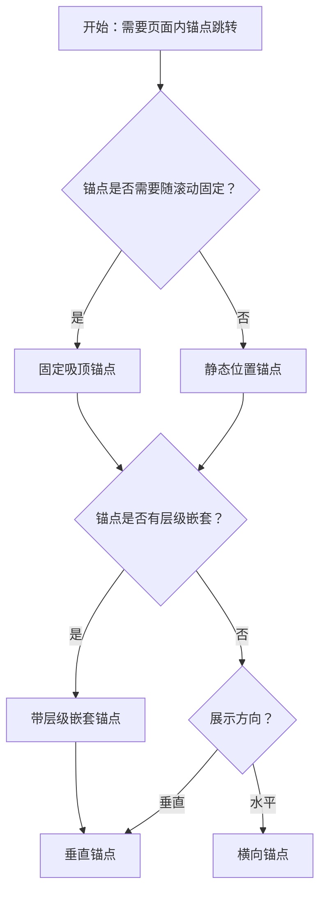

# 1. 简洁易读部份

## 1.0. 组件描述

锚点组件用于展示当前页面上可供跳转的锚点链接，并支持快速在锚点之间跳转，帮助用户在长文档或单页多区块中高效定位。

## 1.1. 组件构成

锚点由以下基础要素构成，可按需组合使用：

> <!-- 附图占位：建议附上一张示例图，展示锚点的四个基础要素（根容器、链接项、标题文字、高亮指示器）的构成关系，标注当前激活项与指示器位置 -->

&emsp;&emsp;1. **根容器** 承载所有锚点链接，可固定吸顶或静态嵌入页面。

&emsp;&emsp;2. **链接项** 对应页面内某个区块的跳转入口，可嵌套形成层级。

&emsp;&emsp;3. **标题文字** 描述锚点对应的区块内容，需简洁可读。

&emsp;&emsp;4. **高亮指示器** 标识当前滚动位置对应的锚点，提供「当前位置」的视觉反馈。

---

## 1.2. 组件包含哪些不同类型

### 1.2.1 垂直锚点

&emsp;**是什么**：锚点链接垂直排列，最常用的默认形态，支持多级嵌套

> <!-- 附图占位：建议附上一张示例图，展示垂直排列的锚点列表，含一级与二级嵌套，以及高亮指示器在当前项左侧的形态 -->

&emsp;**简单用法**：适用于长文档、多区块单页；不设置时默认为垂直；支持 children 嵌套形成层级结构

&emsp;**典型场景**：文档目录、产品说明页、FAQ 页面的章节导航

> <!-- 附图占位：建议附上一张场景图，展示文档页左侧垂直锚点导航与右侧长内容的对应关系，体现垂直锚点的典型用法 -->

&emsp;**替代方案**：若区块较少且横向空间充足，可考虑横向锚点

### 1.2.2 横向锚点

&emsp;**是什么**：锚点链接水平排列，适用于区块较少、需要横向展示的场景

> <!-- 附图占位：建议附上一张示例图，展示横向排列的锚点链接，类似 Tab 的横向导航形态 -->

&emsp;**简单用法**：必须设置方向为水平；水平方向不支持嵌套 children；适合顶部或内容区上方的横向导航

&emsp;**典型场景**：产品页多 Tab 式锚点、简化的章节导航、顶部横向目录

> <!-- 附图占位：建议附上一张场景图，展示内容区上方横向锚点导航，点击后滚动至对应区块 -->

&emsp;**替代方案**：若层级较多或需嵌套，改用垂直锚点

### 1.2.3 固定吸顶锚点

&emsp;**是什么**：锚点容器随页面滚动固定于视口内，始终可见便于快速跳转

> <!-- 附图占位：建议附上一张示例图，展示锚点容器在滚动时固定在视口左侧或右侧的形态，高亮随滚动变化 -->

&emsp;**简单用法**：默认 affix 为 true 即固定模式；可配置 offsetTop 等控制固定触发条件；适用于长文档，用户需在浏览过程中随时跳转

&emsp;**典型场景**：长文档侧边导航、产品详情页目录、帮助中心文章

> <!-- 附图占位：建议附上一张场景图，展示用户滚动长文档时，锚点始终固定在侧边，高亮随当前区块变化 -->

&emsp;**替代方案**：若希望锚点随内容流滚动，使用静态位置

### 1.2.4 静态位置锚点

&emsp;**是什么**：锚点容器不固定，随页面内容流排列，高亮不随滚动自动变化（或需自定义）

> <!-- 附图占位：建议附上一张示例图，展示锚点嵌入在页面流中、不吸顶的形态，与固定模式对比 -->

&emsp;**简单用法**：设置 affix 为 false；适用于锚点区域较短、或希望与周边内容一起滚动的场景；高亮逻辑可能需配合 getCurrentAnchor 等自定义

&emsp;**典型场景**：页面顶部横向锚点、与正文混排的简要目录、弹窗内的锚点导航

> <!-- 附图占位：建议附上一张场景图，展示锚点作为页面内一块静态内容，不吸顶的布局 -->

&emsp;**替代方案**：若需长文档中始终可见的导航，改用固定吸顶

### 1.2.5 带层级嵌套锚点

&emsp;**是什么**：锚点项支持多级嵌套，形成树状目录结构

> <!-- 附图占位：建议附上一张示例图，展示一级、二级甚至三级锚点的缩进嵌套形态，体现层级关系 -->

&emsp;**简单用法**：通过 children 配置嵌套；仅垂直方向支持嵌套；适用于文档有多级标题（如 H1、H2、H3）的场景

&emsp;**典型场景**：技术文档、法律条款、长教程的多级目录

> <!-- 附图占位：建议附上一张场景图，展示文档内 H1/H2/H3 与锚点多级嵌套的对应关系 -->

&emsp;**替代方案**：若仅有一级标题，使用扁平锚点即可

---

## 1.3. 各类型典型场景案例

### 1.3.1 垂直锚点

> <!-- 附图占位：建议附上一张对比图，左侧展示垂直锚点与长文档正确对应、高亮准确（符合规范），右侧展示锚点与内容区块不对应或高亮错乱（违反规范） -->

✅ **推荐：** 锚点与页面内区块一一对应，高亮指示器准确反映当前视口所在区块

❌ **不推荐：** 锚点与内容区块错位，或滚动时高亮不更新

### 1.3.2 横向锚点

> <!-- 附图占位：建议附上一张对比图，左侧展示横向锚点数量适中、排列清晰（符合规范），右侧展示横向锚点过多导致拥挤或换行混乱（违反规范） -->

✅ **推荐：** 横向锚点数量不宜过多，保证每项可读可点；空间不足时考虑垂直或收纳

❌ **不推荐：** 横向塞入过多锚点导致拥挤、换行或难以点击

### 1.3.3 固定吸顶锚点

> <!-- 附图占位：建议附上一张对比图，左侧展示固定锚点不遮挡主要内容、offset 合理（符合规范），右侧展示固定锚点遮挡关键内容或与顶栏重叠（违反规范） -->

✅ **推荐：** 固定锚点位置与 offset 合理，不遮挡主要内容，与顶栏、侧栏协调

❌ **不推荐：** 固定后遮挡正文或与其他固定元素重叠

---

# 2. 选型指南

## 2.1 选择流程

---

# 3. 细致专业部份（交互与排版规则）

## 3.1 多操作的展示与折叠策略

* **锚点数量**：锚点项不宜过多，建议单层级不超过 7–9 项；过多时可考虑分组或收纳至「更多」。
* **嵌套深度**：层级不宜过深，建议最多 2–3 级，过深会占用大量纵向空间且难以扫读。
* **与页面其他导航**：若页面已有顶栏导航、侧栏菜单，锚点应与之区分——锚点是当前页内的区块跳转，不替代全局导航。

> <!-- 附图占位：建议附上一张场景图，展示锚点数量适中、层级清晰，与顶栏、侧栏的职责划分 -->

## 3.2 危险操作（删除/清空/停用）

* 锚点组件本身不承载危险操作；若锚点所在区块涉及危险操作，应遵循危险操作的通用规范。
* 锚点仅负责跳转与高亮，不直接触发数据修改。

> <!-- 附图占位：此处可省略或展示锚点与内容区块中危险操作的隔离关系 -->

## 3.3 摆放位置（按页面场景划分）

* **长文档左侧**：垂直锚点常用于页面左侧，与主内容区并列，固定时随滚动始终可见。
* **长文档上方**：横向锚点可用于内容区上方，作为章节的快速导航。
* **弹窗/抽屉内**：在弹窗或抽屉内有长内容时，锚点可置于顶部或侧边，协助快速定位。
* **与 Breadcrumb 配合**：Breadcrumb 表示「从哪来」，Anchor 表示「当前页内去哪」，二者可同时存在，职责不同。

> <!-- 附图占位：建议附上一张场景图，展示锚点在长文档左侧、上方，以及弹窗内的典型摆放位置 -->

## 3.4 顺序与对齐逻辑

* **顺序**：锚点顺序必须与页面内区块的阅读顺序一致，自上而下、自左而右。
* **嵌套缩进**：子级锚点应有视觉缩进，与父级形成清晰层级；缩进不宜过大，保持紧凑。
* **高亮指示器**：指示器位置应明确指向当前激活项，与链接项视觉关联清晰。

> <!-- 附图占位：建议附上一张示例图，展示锚点顺序与页面区块的对应关系，以及嵌套缩进与指示器位置 -->

## 3.5 状态与交互反馈

* **默认**：链接可点击，文字清晰可读。
* **悬停**：链接应有悬停样式（如颜色变化、下划线），表明可点击。
* **当前高亮**：滚动至某区块时，对应锚点应高亮，指示器同步移动；高亮样式需与未激活项明显区分。
* **点击跳转**：点击锚点后，页面应平滑滚动至目标区块，目标区块顶部与视口的关系（如与 offsetTop 对齐）需符合预期。

> <!-- 附图占位：建议附上一张示例图，展示锚点链接的默认、悬停、高亮三种状态，以及点击后的滚动对齐 -->

## 3.6 视觉规范与形态选择

* **方向选择**：层级多、项多时用垂直；项少、需横向紧凑时用水平。
* **固定与静态**：长文档优先固定吸顶；短文档或弹窗内可用静态。
* **层级深度**：根据文档结构选择是否嵌套；扁平结构用单层，多级标题用嵌套。
* **offset 与 targetOffset**：固定时的 offsetTop、滚动对齐的 targetOffset 需根据顶栏高度、阅读习惯设置，保证目标区块不被遮挡。

> <!-- 附图占位：建议附上一张示例图，展示垂直与横向、固定与静态的形态对比，以及 offset 对滚动对齐的影响 -->

---

## 4.0. 常见问题

### 1. 锚点和面包屑有什么区别？

- **锚点**：用于当前页面内的区块跳转，帮助用户在长文档中快速定位到某一段落或章节。
- **面包屑**：用于展示「从哪来」的层级路径，支持跨页面向上返回，表示系统结构的层级关系。

### 2. 什么时候用横向锚点？

- 当锚点数量较少（如 3–5 个）、无需嵌套，且希望节省纵向空间时，可用横向锚点；层级多或项多时建议用垂直锚点。

### 3. 固定锚点会遮挡内容吗？

- 可通过 offsetTop 控制固定触发的位置，以及目标区块滚动后的偏移量（targetOffset），使固定锚点不遮挡主要内容；需根据顶栏高度和阅读习惯调整。
