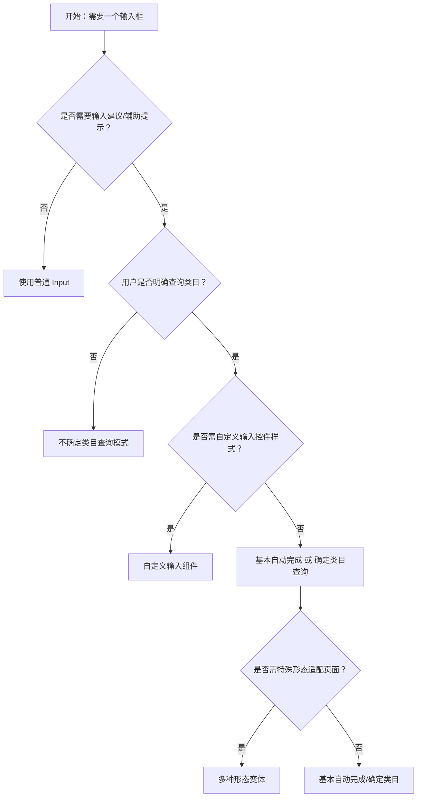

# 1. 简洁易读部份

## 1.0. 组件描述

AutoComplete 自动完成组件是一个带提示的文本输入框，用户在输入时可获得建议或辅助提示。与 Select 的区别在于：AutoComplete 强调「输入」，用户可自由输入任意内容；Select 强调「选择」，用户仅能从限定选项中挑选。

## 1.1. 组件构成

自动完成由以下基础要素构成，可按需组合使用：

> <!-- 附图占位：建议附上一张示例图，展示自动完成的基础要素（输入框、下拉建议列表、清除按钮）的构成关系，标注各要素名称与位置 -->

&emsp;&emsp;1. **输入框** 定义用户输入区域，承载用户键入的文本，可自定义为普通输入框或文本域。

&emsp;&emsp;2. **下拉建议列表** 根据输入内容动态展示匹配的候选项，用户可从中选择或继续输入。

&emsp;&emsp;3. **清除按钮** 用于快速清空已输入或已选择的内容，可配置是否显示。

---

## 1.2. 组件包含哪些不同类型

### 1.2.1 基本自动完成

&emsp;**是什么**：输入时根据本地或预设选项列表进行匹配，展示建议候选项供用户选择或参考

> <!-- 附图占位：建议附上一张示例图，展示基本自动完成（输入框 + 下拉建议列表）的视觉形态，体现输入与建议联动的关系 -->

&emsp;**简单用法**：适用于选项数量有限、数据源固定的场景；用户既可输入任意文本，也可从建议中选择；默认首项高亮，支持键盘快速选择

&emsp;**典型场景**：搜索联想、地址输入、标签输入

> <!-- 附图占位：建议附上一张场景图，展示搜索框输入关键词时出现的联想建议列表，体现辅助输入的典型用法 -->

&emsp;**替代方案**：若选项非常多或需服务端检索，需配合异步加载；若用户只能选不能输入，改用 Select

### 1.2.2 确定类目查询模式

&emsp;**是什么**：用户已知要查询的类别，输入框与类目选择分离，先选类目再输入，建议结果限定在选定类目内

> <!-- 附图占位：建议附上一张示例图，展示确定类目模式（类目选择器 + 输入框 + 限定类目内的建议列表）的结构，体现「先选类目再输入」的流程 -->

&emsp;**简单用法**：必须用于「类目固定、结果在类目内」的查询；类目需清晰可辨、数量不宜过多；输入与类目联动，建议仅展示当前类目下的匹配项

&emsp;**典型场景**：电商搜索（先选品类再搜商品）、知识库检索（先选模块再搜文档）

> <!-- 附图占位：建议附上一张场景图，展示类目选择器与输入框组合，用户选择「服装」后输入「衬衫」出现该类目下的建议，体现确定类目的使用方式 -->

&emsp;**替代方案**：若类目不固定或用户不知道类目，改用不确定类目查询模式

### 1.2.3 不确定类目查询模式

&emsp;**是什么**：用户不确定查询属于哪一类，输入时在全部数据中匹配，建议结果可跨类目展示

> <!-- 附图占位：建议附上一张示例图，展示不确定类目模式（单一输入框 + 可包含多类目的建议列表）的结构，体现全量匹配、跨类目展示 -->

&emsp;**简单用法**：必须用于「用户不明确类目、希望全局搜索」的场景；建议列表需能区分或标注来源类目；匹配规则可支持模糊、不区分大小写

&emsp;**典型场景**：全局搜索、智能客服、通用检索

> <!-- 附图占位：建议附上一张场景图，展示用户输入关键词后出现来自不同模块/类目的混合建议，体现不确定类目下全量匹配的使用方式 -->

&emsp;**替代方案**：若业务强依赖类目筛选，改用确定类目查询模式

### 1.2.4 自定义输入组件

&emsp;**是什么**：将自动完成能力与自定义输入控件（如 TextArea、带前缀的输入框）结合，保留输入与建议的交互逻辑

> <!-- 附图占位：建议附上一张示例图，展示使用 TextArea 或带图标的输入框作为自动完成载体的形态，体现自定义输入组件的灵活性 -->

&emsp;**简单用法**：必须用于需要多行输入、特殊布局或业务定制样式的场景；自定义组件需支持聚焦、输入、失焦等基础能力；建议列表的触发与展示逻辑与默认一致

&emsp;**典型场景**：评论输入联想、长文本编辑补全、带单位或前缀的数值输入

> <!-- 附图占位：建议附上一张场景图，展示多行输入框中输入时出现建议下拉，体现自定义输入组件在复杂输入场景下的使用 -->

&emsp;**替代方案**：若仅需标准单行输入，使用默认输入框即可

### 1.2.5 多种形态变体

&emsp;**是什么**：通过形态（outlined、filled、borderless、underlined）控制输入框的视觉风格，适配不同页面氛围

> <!-- 附图占位：建议附上一张示例图，展示四种形态（描边、填充、无边框、下划线）的并列对比，体现同一组件不同视觉形态的差异 -->

&emsp;**简单用法**：outlined 为默认，适合常规表单；filled 适合强调输入区域；borderless 适合嵌入表格或紧凑布局；underlined 适合极简风格；同一页面内同类输入控件应统一形态

&emsp;**典型场景**：表单设计、仪表盘、表格内联编辑

> <!-- 附图占位：建议附上一张场景图，展示同一表单中不同形态输入框的搭配，体现形态与页面风格的一致性 -->

&emsp;**替代方案**：无特殊视觉需求时使用默认 outlined

---

## 1.3. 各类型典型场景案例

### 1.3.1 基本自动完成

> <!-- 附图占位：建议附上一张对比图，左侧展示输入时出现匹配建议、用户可输入或选择（符合规范），右侧展示无建议或建议与输入无关（违反规范） -->

✅ **推荐：** 建议内容与用户输入强相关，匹配逻辑清晰可预期

❌ **不推荐：** 建议列表与输入脱节，或匹配规则难以理解

### 1.3.2 确定类目与不确定类目

> <!-- 附图占位：建议附上一张对比图，左侧展示确定类目时先选类目再输入、结果限定类目内（符合规范），右侧展示不确定类目时全量匹配、结果可跨类目（符合规范），两者场景不同需正确区分 -->

✅ **推荐：** 根据业务是否强制类目筛选，正确选用确定类目或不确定类目模式

❌ **不推荐：** 在需要类目限定的场景用不确定类目，或在全局搜索场景强加类目选择

### 1.3.3 自定义输入与形态

> <!-- 附图占位：建议附上一张对比图，左侧展示自定义输入组件保留建议交互且与页面风格一致（符合规范），右侧展示形态与同页其它输入控件混乱（违反规范） -->

✅ **推荐：** 自定义输入保留建议能力；形态与同一页面其它输入控件统一

❌ **不推荐：** 为追求特殊样式牺牲建议交互；同一表单内自动完成形态与其它输入框风格割裂

---

# 2. 选型指南

## 2.1 选择流程

---

# 3. 细致专业部份（交互与排版规则）

## 3.1 多操作的展示与折叠策略

自动完成本身通常作为单一输入控件使用，不涉及多操作折叠。若输入框所在区域（如搜索栏）有多个操作（搜索、筛选、高级搜索），可参考：

* **输入优先**：自动完成输入框应占据主要视觉位置，其它操作可收纳至「更多」或次要区域。
* **建议列表**：建议项数量较多时，可通过虚拟滚动或数量限制控制展示，避免列表过长影响选择效率。

> <!-- 附图占位：建议附上一张场景图，展示搜索栏中自动完成输入框为主、其它操作次要收纳的布局 -->

## 3.2 危险操作（删除/清空/停用）

自动完成的「清除」属于轻量操作，不涉及数据删除：

* **清除按钮**：仅清空当前输入或选中内容，不视为危险操作；可配置是否显示清除按钮。
* **无危险语义**：自动完成不承载删除、停用等高危操作，无需二次确认。

## 3.3 摆放位置（按页面场景划分）

* **搜索栏（页面顶部或中部）**：作为主搜索入口时，放在页面显眼位置，宽度足够输入完整查询词。
* **表单内**：作为表单字段时，放在对应标签下方，与其它表单项对齐；长表单中可吸底或固定在可视区域。
* **表格内联**：在表格单元格内使用时，与单元格宽度适配，建议列表需避免被表格边界遮挡。

> <!-- 附图占位：建议附上一张场景图，展示自动完成在搜索栏、表单、表格内联三种位置的典型摆放 -->

## 3.4 顺序与对齐逻辑

* **表单内**：自动完成与其它输入框按标签顺序自上而下、或按网格从左到右排列，与整体表单对齐规则一致。
* **与按钮组合**：若输入框后跟「搜索」「确定」等按钮，输入框与按钮左对齐或右对齐，保持统一边距。

> <!-- 附图占位：建议附上一张场景图，展示搜索栏中「自动完成输入框 + 搜索按钮」的对齐与间距 -->

## 3.5 状态与交互反馈

* **默认**：输入框可编辑，有清晰的边界与占位提示。
* **聚焦**：获得焦点时展开建议列表（若有匹配项）；输入框边框或背景有聚焦态变化。
* **输入中**：随输入实时更新建议列表；无匹配时显示「未找到」或空状态。
* **选中**：选择建议项后，输入框展示选中内容，下拉关闭；支持键盘上下选择、回车确认。
* **禁用**：置灰不可输入，不展示建议；禁用时需明确原因（如权限、条件未满足）。
* **错误/警告**：校验失败时通过 status 或边框色、提示文案标明错误或警告状态。

## 3.6 视觉规范与形态选择

* **建议列表**：选项高度与内边距需保证可点性；选中项与悬停项有明显区分；列表宽度可与输入框同宽或略宽，避免内容截断。
* **形态一致性**：同一页面内所有自动完成控件应统一形态（outlined、filled、borderless、underlined 择一），与同页其它输入框风格协调。
* **占位符**：占位文案需说明输入内容或格式，避免模糊描述。

> <!-- 附图占位：建议附上一张示例图，展示建议列表的选项高度、选中态、悬停态以及不同形态的输入框对比 -->

---

## 4.0. 常见问题

### 1. AutoComplete 和 Select 有什么区别？

- **AutoComplete**：用户可自由输入任意文本，建议列表是辅助；关键词是「输入」。
- **Select**：用户只能从既定选项中选择，不能输入非列表内容；关键词是「选择」。

### 2. 何时用确定类目、何时用不确定类目？

- **确定类目**：用户先选类目再输入，结果限定在类目内；适用于类目明确、结果有边界的场景。
- **不确定类目**：用户直接输入，结果跨类目；适用于全局搜索、用户不关心类目的场景。
