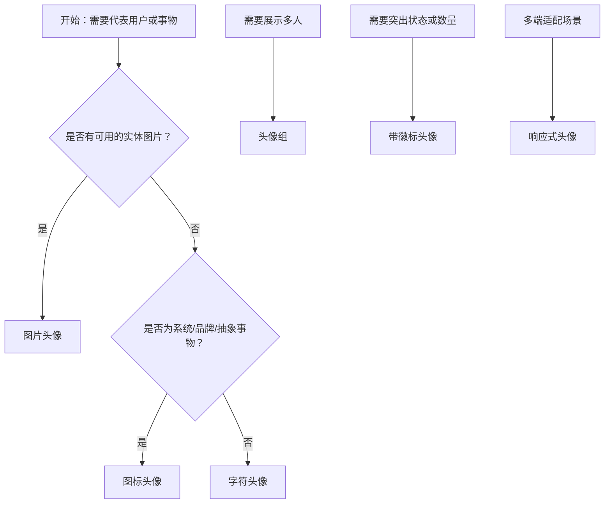

# 1. 简洁易读部份

## 1.0. 组件描述

头像组件用于代表用户或事物，通过视觉形态快速建立身份识别与归属感，支持图片、图标或字符多种展示方式。

## 1.1. 组件构成

头像由以下基础要素构成，可按需组合使用：

> <!-- 附图占位：建议附上一张示例图，展示头像的三种展示形态（图片、图标、字符）及其容器、内容区域的构成关系，标注各要素名称与位置 -->

&emsp;&emsp;1. **容器** 定义头像的点击区域与整体形态，支持圆形与方形两种形状，用于承载不同尺寸与内容类型。

&emsp;&emsp;2. **展示内容** 承载用户或事物的视觉标识，可为图片、图标或字符，用于建立身份或归属的可视化表达。

&emsp;&emsp;3. **尺寸** 定义头像的视觉层级与空间占用，支持大、中、小三种规格及响应式适配。

---

## 1.2. 组件包含哪些不同类型

### 1.2.1 图片头像

&emsp;**是什么**：以用户或事物的真实或代表性图片作为展示内容

> <!-- 附图占位：建议附上一张示例图，展示图片头像（圆形、方形各一）的视觉形态，体现图片在容器内的填充与裁切方式 -->

&emsp;**简单用法**：必须用于有明确视觉形象的实体；图片加载失败时需提供 fallback 展示；必须确保图片比例与容器匹配，避免拉伸变形

&emsp;**典型场景**：用户资料、评论列表、团队展示、产品缩略

> <!-- 附图占位：建议附上一张场景图，展示评论区内使用图片头像标识发言者身份的布局，体现头像与内容归属的对应关系 -->

&emsp;**替代方案**：若无可用图片，改用字符头像或图标头像

### 1.2.2 字符头像

&emsp;**是什么**：以名称首字母或简称作为头像内容，通过背景色与字符组合形成识别

> <!-- 附图占位：建议附上一张示例图，展示字符头像（单字「张」、双字「张三」）的视觉形态，体现字符自动缩放与背景色搭配 -->

&emsp;**简单用法**：必须用于无图片或需要统一风格时的身份标识；字符过长时自动缩小以适应容器；可自定义背景色增强区分度

&emsp;**典型场景**：用户列表、成员展示、系统角色、匿名标识

> <!-- 附图占位：建议附上一张场景图，展示通讯录或成员列表中字符头像与姓名并排的布局，体现简洁身份识别的使用方式 -->

&emsp;**替代方案**：若有品牌或产品图片，改用图片头像

### 1.2.3 图标头像

&emsp;**是什么**：以图标作为头像内容，用于代表系统、品牌或抽象事物

> <!-- 附图占位：建议附上一张示例图，展示图标头像（应用图标、品牌图标）的视觉形态，体现图标与背景色的搭配 -->

&emsp;**简单用法**：必须用于非个人实体的代表； icon 与字符可 custom 颜色与背景；不可用于需要人脸识别的个人场景

&emsp;**典型场景**：应用入口、品牌展示、系统角色、功能模块标识

> <!-- 附图占位：建议附上一张场景图，展示应用列表或导航中使用图标头像标识各模块的布局，体现非个人实体的代表方式 -->

&emsp;**替代方案**：若代表个人用户且有图片，改用图片头像

### 1.2.4 头像组

&emsp;**是什么**：将多个头像横向堆叠展示，用于表示成员集合或协作关系

> <!-- 附图占位：建议附上一张示例图，展示头像组（3-5 个头像重叠排列，「+N」超出提示）的视觉形态，体现堆叠层级与数量展示 -->

&emsp;**简单用法**：必须设置最多展示数量，超出部分用「+N」或类似形式表达；堆叠顺序需符合业务优先级（如主负责人在前）；必须确保重叠区域不遮挡关键信息

&emsp;**典型场景**：项目成员、协作组、评论参与人、共享文件协作者

> <!-- 附图占位：建议附上一张场景图，展示任务卡片或文件卡片右侧头像组展示参与成员的布局，体现成员集合的紧凑表达 -->

&emsp;**替代方案**：若仅展示一人，使用单个头像

### 1.2.5 带徽标头像

&emsp;**是什么**：在头像角位叠加徽标（如 Badge），用于提示未读消息、在线状态或特殊标记

> <!-- 附图占位：建议附上一张示例图，展示带徽标的头像（右上角红点或数字）的视觉形态，体现徽标与头像的层级关系 -->

&emsp;**简单用法**：必须用于需要突出状态或数量的场景；徽标位置通常置于右上角；徽标语义需与头像所代表实体的状态相关

&emsp;**典型场景**：消息未读、在线状态、成员活跃度、待处理事项提醒

> <!-- 附图占位：建议附上一张场景图，展示即时通讯或联系人列表中使用带徽标头像标识未读消息的布局，体现状态提示的使用方式 -->

&emsp;**替代方案**：若无状态或数量需突出，使用普通头像

### 1.2.6 响应式头像

&emsp;**是什么**：根据屏幕或容器尺寸自动调整头像大小，适配多端展示

> <!-- 附图占位：建议附上一张示例图，展示同一头像在不同 breakpoint 下的尺寸变化，体现响应式适配效果 -->

&emsp;**简单用法**：必须用于需要多端适配的列表或布局；尺寸变化需保持视觉层级一致性；不可在单端场景下过度使用

&emsp;**典型场景**：移动端列表、平板布局、响应式仪表盘、自适应卡片

> <!-- 附图占位：建议附上一张场景图，展示同一页面在桌面与移动端下头像尺寸自动调整的对比，体现响应式使用场景 -->

&emsp;**替代方案**：若仅单端使用，使用固定尺寸头像

---

## 1.3. 各类型典型场景案例

### 1.3.1 图片与字符头像

> <!-- 附图占位：建议附上一张对比图，左侧展示有头像时优先使用图片头像（符合规范），右侧展示无图片时使用字符头像作为 fallback（符合规范） -->

✅ **推荐：** 有可用图片时优先使用图片头像，无图片时用字符头像建立识别

❌ **不推荐：** 无图片时留空或使用占位图，导致无法建立身份关联

### 1.3.2 头像组

> <!-- 附图占位：建议附上一张对比图，左侧展示头像组设置合理展示数量与「+N」（符合规范），右侧展示过多头像平铺造成拥挤（违反规范） -->

✅ **推荐：** 头像组限制展示数量，超出用「+N」表达

❌ **不推荐：** 过多头像平铺占用大量空间，影响信息密度

### 1.3.3 徽标与语义

> <!-- 附图占位：建议附上一张对比图，左侧展示徽标语义与头像实体相关（如未读消息）（符合规范），右侧展示无关徽标造成干扰（违反规范） -->

✅ **推荐：** 徽标语义必须与头像所代表实体的状态相关

❌ **不推荐：** 在头像上叠加与实体无关的装饰性徽标

---

# 2. 选型指南

## 2.1 选择流程

---

# 3. 细致专业部份（交互与排版规则）

为了保持界面清晰并建立有效的视觉层级，当使用头像时，请参考以下排版和交互规则：

## 3.1 展示形态与 fallback 策略

当头像内容加载失败或不可用时，需按以下逻辑决定 fallback 展示：

* **优先级**：图片加载失败时，优先使用 icon，其次使用 children（字符），最后使用默认占位。
* **一致性**：同一列表中，fallback 策略必须一致，避免部分头像为占位、部分为字符造成视觉混乱。
* **可识别**：字符 fallback 时，取名称首字或前两字，确保可读性；超长字符需自动缩放。

> <!-- 附图占位：建议附上一张场景图，展示列表中存在图片加载成功与失败两种状态时，fallback 后的统一展示效果 -->

## 3.2 尺寸与层级关系

**如何界定头像尺寸？**

* **大号**：用于个人主页、详情头部、重要成员展示，需要高识别度。
* **中号**：用于列表、评论、卡片等常规场景，为默认尺寸。
* **小号**：用于紧凑布局、表格行内、次要信息区，需确保最小可点击与可读性。

**针对尺寸的展示建议：**

* **同级一致**：同一层级内的头像必须使用相同尺寸，确保视觉对齐。
* **层级区分**：不同模块可用不同尺寸表达主次，如详情区大、列表区中。
* **最小限制**：小号头像需保证不小于可点击区域规范，避免误触困难。

> <!-- 附图占位：建议附上一张场景图，展示同一页面中主详情区大号头像与侧边列表中小号头像的层级对比 -->

## 3.3 形状选择

头像形状的选择应顺应用户对场景的认知：

* **圆形**：默认形态，适用于个人用户、团队成员等「人」的场景，符合人脸与身份联想。
* **方形**：适用于产品、品牌、应用等「物」的场景，或需要与整体直角风格统一的界面。

> <!-- 附图占位：建议附上一张对比图，展示圆形头像用于用户、方形头像用于应用/品牌的场景区分 -->

## 3.4 头像组展示规则

当使用头像组展示多人时，需遵循：

* **堆叠顺序**：按业务优先级从左到右排列，主负责人或关键成员靠前。
* **数量控制**：同一组内建议最多展示 5 个可见头像，超出用「+N」表达，N 需准确反映剩余人数。
* **边界处理**：确保重叠区域不遮挡头像的关键识别部分；组容器需预留足够宽度。

> <!-- 附图占位：建议附上一张场景图，展示头像组从左到右的堆叠顺序与「+3」的超出表达方式 -->

## 3.5 徽标搭配规范

当头像需要叠加徽标时：

* **位置**：默认置于头像右上角，与阅读顺序一致；RTL 环境下需随布局调整。
* **语义**：徽标必须与头像所代表实体的状态相关（如未读数量、在线状态），不可用于无关装饰。
* **干扰控制**：徽标不应过度遮挡头像主体；数字过大时可使用封顶表达（如 99+）。

> <!-- 附图占位：建议附上一张场景图，展示徽标在头像右上角的标准位置及与头像主体的比例关系 -->

## 3.6 响应式与可访问性

* **响应式**：在移动端或窄屏下，头像尺寸可随 breakpoint 自动调整，保持与文字、间距的比例协调。
* **替代文本**：图片头像必须提供 alt 文本，供读屏与加载失败时使用。
* **对比度**：字符头像的背景色与文字颜色需满足对比度规范，确保可读性。

> <!-- 附图占位：建议附上一张示例图，展示头像在桌面与移动端下的尺寸适配与 alt 文本的使用场景 -->

---

## 4.0. 常见问题

### 1. 图片头像和字符头像分别在什么场景使用

- **图片头像**：当用户或事物有可用的视觉形象（如用户头像、产品图）时优先使用，能最快建立身份识别与信任感。

- **字符头像**：当无图片或需要统一视觉风格时使用，通过名称首字母或简称配合背景色建立识别，适合列表、成员展示等场景。

### 2. 头像组最多展示几个合适

- 建议同一组内**最多展示 5 个可见头像**，超出部分用「+N」表达。过多平铺会占用大量空间且降低识别效率；过少则无法有效表达「多人」的语义。

### 3. 圆形和方形头像如何选择

- **圆形**：适用于个人用户、团队成员等与「人」相关的场景，符合用户对身份头像的直觉认知。
- **方形**：适用于产品、品牌、应用等「物」的场景，或需要与界面直角风格保持一致的场景。
