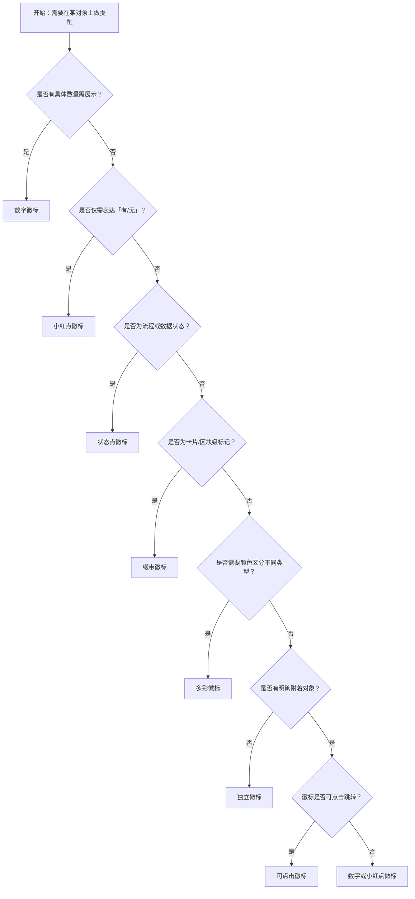

# 1. 简洁易读部份

## 1.0. 组件描述

徽标数组件用于在图标或头像的角位展示需要处理的消息条数、状态或标记，通过醒目的视觉形式吸引用户关注并驱动操作。

## 1.1. 组件构成

徽标由以下基础要素构成，可按需组合使用：

> <!-- 附图占位：建议附上一张示例图，展示徽标的三个基础要素（附着对象、指示器、数字或点）的构成关系，标注各要素名称与位置 -->

&emsp;&emsp;1. **附着对象** 徽标所依附的宿主元素，通常为图标、头像或可点击入口，定义徽标的展示位置基准。

&emsp;&emsp;2. **指示器** 徽标的主体区域，承载数字、小红点或状态样式，用于传达数量或状态信息。

&emsp;&emsp;3. **数值或形态** 指示器内的具体内容，可为数字、纯点或状态色，定义徽标所传达的语义。

---

## 1.2. 组件包含哪些不同类型

### 1.2.1 数字徽标

&emsp;**是什么**：在角位展示具体数字，用于表达待处理数量或统计信息

> <!-- 附图占位：建议附上一张示例图，展示数字徽标（如 5、99、99+）的视觉形态，体现数字在圆角矩形或圆形内的排版 -->

&emsp;**简单用法**：必须用于有明确数量可展示的场景；数值为 0 时默认不展示（可配置展示）；超过封顶值（如 99）时显示为「99+」等截断形式

&emsp;**典型场景**：消息未读数、待办数量、购物车件数、通知提醒

> <!-- 附图占位：建议附上一张场景图，展示导航栏或侧边栏图标上的数字徽标，体现待处理数量的提醒作用 -->

&emsp;**替代方案**：若仅需「有/无」提醒而无具体数量，改用小红点

### 1.2.2 小红点徽标

&emsp;**是什么**：不展示数字，仅显示一个小红点，用于表达「有待处理」的二元状态

> <!-- 附图占位：建议附上一张示例图，展示小红点徽标（无数字、纯色圆点）的视觉形态，与数字徽标对比体现简化表达 -->

&emsp;**简单用法**：必须用于仅需表达「有内容」而非具体数量的场景；不可与数字徽标混用于同一语义；红点需足够醒目但不过度抢眼

&emsp;**典型场景**：新消息提醒、功能更新提示、待办存在标记

> <!-- 附图占位：建议附上一张场景图，展示设置图标或功能入口上的小红点，体现二元状态提醒的使用方式 -->

&emsp;**替代方案**：若需展示具体数量，改用数字徽标

### 1.2.3 状态点徽标

&emsp;**是什么**：以小圆点配合颜色表达状态（如成功、处理中、错误、警告），可附带文字说明

> <!-- 附图占位：建议附上一张示例图，展示状态点徽标（成功绿、错误红、处理中蓝、警告黄）的视觉形态及与文字的搭配 -->

&emsp;**简单用法**：必须用于流程状态、数据状态或系统状态的可视化；颜色语义需符合通用约定；可搭配 status 与 text 展示

&emsp;**典型场景**：订单状态、审核进度、设备在线状态、任务执行结果

> <!-- 附图占位：建议附上一张场景图，展示列表项或详情区域中状态点与「已完成」「处理中」等文字并排的布局 -->

&emsp;**替代方案**：若需展示数量而非状态，改用数字徽标

### 1.2.4 独立徽标

&emsp;**是什么**：不包裹任何子元素，独立展示的徽标，可自定义布局与样式

> <!-- 附图占位：建议附上一张示例图，展示独立徽标（无附着对象、自定位置）的视觉形态 -->

&emsp;**简单用法**：必须用于需要将徽标作为独立视觉元素的场景；右上角独立徽标限定为红色；需明确其与页面其他元素的语义关联

&emsp;**典型场景**：统计角标、独立数量展示、自定义布局的提醒区

> <!-- 附图占位：建议附上一张场景图，展示独立徽标在页面某区域角位的使用位置，体现无附着对象的展示方式 -->

&emsp;**替代方案**：若有明确附着对象，优先使用包裹式徽标

### 1.2.5 缎带徽标

&emsp;**是什么**：以缎带形态附着于卡片或内容块边缘，用于标记状态或分类

> <!-- 附图占位：建议附上一张示例图，展示缎带徽标（斜角缎带、内含文字）的视觉形态，体现与卡片边缘的附着关系 -->

&emsp;**简单用法**：必须用于卡片、区块级别的状态或分类标记；可设置置于 start 或 end；文字需简短清晰

&emsp;**典型场景**：促销标签、新品标识、状态分类（如「已结束」「进行中」）

> <!-- 附图占位：建议附上一张场景图，展示卡片列表中用缎带标记「促销」「新品」的布局，体现区块级标记的使用方式 -->

&emsp;**替代方案**：若为图标或头像角位的小型标记，改用数字或小红点徽标

### 1.2.6 多彩徽标

&emsp;**是什么**：使用预设或自定义颜色区分不同业务语义的徽标

> <!-- 附图占位：建议附上一张示例图，展示多彩徽标（红、蓝、绿、金等不同颜色）的视觉形态，体现颜色与语义的对应 -->

&emsp;**简单用法**：必须用于需要按类型、层级或业务线区分徽标语义的场景；颜色选择需符合可访问性对比度要求；同一页面内颜色语义需一致

&emsp;**典型场景**：多类型消息区分、多业务线统计、优先级标识

> <!-- 附图占位：建议附上一张场景图，展示不同入口使用不同颜色徽标区分业务类型的布局 -->

&emsp;**替代方案**：若无需颜色区分，使用默认红色徽标

### 1.2.7 可点击徽标

&emsp;**是什么**：徽标及其附着对象整体可点击，作为跳转或操作的入口

> <!-- 附图占位：建议附上一张示例图，展示可点击徽标（用链接包裹）的视觉形态及悬停态，体现可交互性 -->

&emsp;**简单用法**：必须用于徽标所提醒的内容有对应跳转目标的场景；点击需跳转到相关列表或详情；需提供明确的焦点与悬停反馈

&emsp;**典型场景**：消息图标点击进入消息列表、待办徽标点击进入待办页

> <!-- 附图占位：建议附上一张场景图，展示用户点击带徽标的图标后跳转到对应页面的交互流程 -->

&emsp;**替代方案**：若徽标仅为提示无跳转，使用静态徽标

---

## 1.3. 各类型典型场景案例

### 1.3.1 数字与小红点

> <!-- 附图占位：建议附上一张对比图，左侧展示有具体数量时使用数字徽标（符合规范），右侧展示仅需提醒存在时使用小红点（符合规范） -->

✅ **推荐：** 有具体数量时用数字徽标，仅需「有待处理」时用小红点

❌ **不推荐：** 无数量信息时强行展示数字 0 或「?」，或本可展示数量却用小红点弱化信息

### 1.3.2 封顶与展示

> <!-- 附图占位：建议附上一张对比图，左侧展示超过 99 时使用 99+ 封顶（符合规范），右侧展示超长数字造成拥挤（违反规范） -->

✅ **推荐：** 数字过大时使用封顶表达（如 99+），保持视觉简洁

❌ **不推荐：** 超长数字完整展示，导致徽标过宽或可读性下降

### 1.3.3 缎带与角标

> <!-- 附图占位：建议附上一张对比图，左侧展示卡片级标记使用缎带（符合规范），右侧展示图标角位使用缎带造成比例失调（违反规范） -->

✅ **推荐：** 卡片或区块级标记使用缎带，图标角位使用数字或小红点

❌ **不推荐：** 在图标或头像等小尺寸对象上使用缎带，导致比例失调

---

# 2. 选型指南

## 2.1 选择流程

---

# 3. 细致专业部份（交互与排版规则）

为了保持提醒有效且不干扰主线任务，当使用徽标时，请参考以下排版和交互规则：

## 3.1 展示与隐藏策略

当徽标所代表的数值或状态发生变化时，需按以下逻辑决定展示与隐藏：

* **数值为 0**：默认不展示徽标，避免无意义的视觉干扰；若业务要求「0 也需可见」（如表示已读），可配置显示。
* **封顶表达**：超过约定封顶值（如 99）时，统一使用「99+」等形式，不宜展示过长数字。
* **动态更新**：数值变化时需有平滑过渡，避免突兀闪烁；加载中可考虑骨架或占位。

> <!-- 附图占位：建议附上一张场景图，展示消息数量从 5 到 0 时徽标从显示到隐藏的过渡效果 -->

## 3.2 位置与偏移

**如何确定徽标位置？**

* **默认**：置于宿主对象右上角，符合从左到右阅读视线落点与「新/待处理」的联想。
* **偏移**：当默认位置与宿主元素重叠或与其它 UI 冲突时，可微调偏移量，格式为 [left, top]。
* **RTL**：在从右到左界面中，位置需随布局方向调整，保持语义一致。

**针对位置的建议：**

* **不遮挡**：徽标不得过度遮挡宿主元素的关键识别区域（如图标主体、头像面部）。
* **对齐一致**：同一页面内多个徽标的位置风格需统一，避免部分偏上、部分偏右等混乱感。

> <!-- 附图占位：建议附上一张场景图，展示徽标在图标右上角的标准位置及偏移微调后的对比 -->

## 3.3 颜色与语义

徽标颜色应与其传达的语义一致：

* **默认红**：用于通用提醒、未读、待处理，符合用户对「需要注意」的共识。
* **状态色**：成功绿、错误红、警告黄、处理中蓝，需符合 Ant Design 状态色规范。
* **多彩区分**：按业务类型使用预设色时，同一类型在同一产品内颜色需一致，避免混淆。

> <!-- 附图占位：建议附上一张示例图，展示不同状态对应的徽标颜色及其与文字说明的搭配 -->

## 3.4 尺寸与可读性

* **常规尺寸**：适用于大部分场景，数字需清晰可读。
* **小尺寸**：用于紧凑布局或小图标上的徽标，需保证最小可识别度。
* **与宿主比例**：徽标大小需与宿主元素成合理比例，过大抢眼、过小难以察觉。

> <!-- 附图占位：建议附上一张对比图，展示常规尺寸与小尺寸徽标在不同场景下的使用 -->

## 3.5 可点击与反馈

当徽标区域可点击时：

* **可点击范围**：整个图标 + 徽标区域应作为统一可点击区，避免只有图标可点、徽标不可点。
* **焦点与悬停**：需提供清晰的焦点与悬停反馈，符合无障碍规范。
* **跳转目标**：点击后需跳转到与徽标语义明确相关的页面（如消息徽标→消息列表）。

> <!-- 附图占位：建议附上一张场景图，展示可点击徽标的悬停态与点击后的跳转目标 -->

## 3.6 缎带使用规范

* **附着对象**：缎带适用于卡片、内容块等较大容器，不适用于图标、头像等小元素。
* **位置**：可置于 start 或 end，随文字方向自动适配；不得遮挡卡片标题或关键内容。
* **文案**：缎带内文字宜简短（如 2–4 字），避免过长导致折行或溢出。

> <!-- 附图占位：建议附上一张场景图，展示缎带在卡片上的标准位置与文案长度 -->

---

## 4.0. 常见问题

### 1. 数字徽标和小红点徽标的区别是什么

- **数字徽标**：展示具体数量（如 5、99+），适用于需要用户了解「有多少」的场景，如未读消息数、购物车件数。
- **小红点徽标**：不展示数字，仅表达「有待处理」的二元状态，适用于只需提醒「有」而不关心具体数量的场景，如功能更新提示。

### 2. 什么时候用缎带、什么时候用角标

- **缎带**：用于卡片、内容块等区块级元素的边缘标记，适合促销、状态、分类等需较强视觉存在感的场景。
- **角标（数字/小红点）**：用于图标、头像等小尺寸对象的角位，适合轻量提醒，不抢占主体注意力。

### 3. 徽标数值为 0 时要不要显示

- 默认**不显示**，避免无意义的「0」造成干扰。若业务需要强调「已读/已处理」等零值状态（如已读消息数为 0 需可见），可配置为显示零值。
