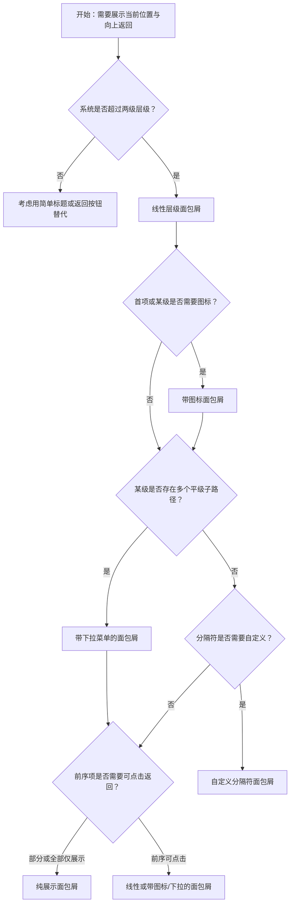

# 1. 简洁易读部份

## 1.0. 组件描述

面包屑组件用于显示当前页面在系统层级结构中的位置，并能向上返回，帮助用户理解「我在哪里」以及如何逐级返回上级路径。

## 1.1. 组件构成

面包屑由以下基础要素构成，可按需组合使用：

> <!-- 附图占位：建议附上一张示例图，展示面包屑的三个基础要素（根容器、层级项、分隔符）的构成关系，标注从首页到当前页的路径结构 -->

&emsp;&emsp;1. **根容器** 承载整条面包屑路径，内部为有序的层级项列表。

&emsp;&emsp;2. **层级项** 路径上的每一级节点，通常为可点击链接（除当前页外），表示从根到当前的层级结构。

&emsp;&emsp;3. **分隔符** 位于相邻层级项之间，用于视觉分隔（如 `/`、`>`），默认使用 `/`。

---

## 1.2. 组件包含哪些不同类型

### 1.2.1 线性层级面包屑

&emsp;**是什么**：以线性路径展示从根到当前的层级，每级为单一节点，无分支展开

> <!-- 附图占位：建议附上一张示例图，展示「首页 / 产品 / 详情」这样的线性面包屑，每级一个节点，分隔符清晰 -->

&emsp;**简单用法**：适用于层级清晰、无多分支的系统；每级一项，除最后一项外均为可点击链接；层级深度建议 2–5 级

&emsp;**典型场景**：后台管理系统、电商分类路径、文档库目录层级

> <!-- 附图占位：建议附上一张场景图，展示后台「首页 / 用户管理 / 用户列表」的线性面包屑，体现典型层级路径 -->

&emsp;**替代方案**：若某级存在多个子路径可选，改用带下拉菜单的面包屑

### 1.2.2 带图标面包屑

&emsp;**是什么**：在首项或某些层级项前增加图标，强化识别或表达「首页」等固定节点

> <!-- 附图占位：建议附上一张示例图，展示首项带首页图标的「首页 / 产品 / 详情」面包屑，体现图标对首项的强化 -->

&emsp;**简单用法**：图标应置于文字前，且不改变文字语义；常用于首项（如首页图标）；图标不宜过多，避免喧宾夺主

&emsp;**典型场景**：首项为首页、某级为固定入口（如工作台）时，用图标增强识别

> <!-- 附图占位：建议附上一张场景图，展示首项带首页图标的面包屑在页面头部的典型位置 -->

&emsp;**替代方案**：若层级语义已足够清晰，可不用图标

### 1.2.3 带下拉菜单的面包屑

&emsp;**是什么**：某级存在多个同级子路径时，将该级展示为可展开的下拉菜单，用户选择后跳转

> <!-- 附图占位：建议附上一张示例图，展示某级带下拉箭头的面包屑项，展开后显示多个同级路径选项 -->

&emsp;**简单用法**：必须用于「一个父级下存在多个平级子级」的场景；下拉项应为真实可跳转的路径；下拉项不宜过多，过多时考虑收缩或分组

&emsp;**典型场景**：产品下多分类、文档多章节、多子模块的入口选择

> <!-- 附图占位：建议附上一张场景图，展示「产品」级展开下拉显示「分类A」「分类B」等子路径的面包屑用法 -->

&emsp;**替代方案**：若每级路径唯一，使用线性层级即可

### 1.2.4 自定义分隔符面包屑

&emsp;**是什么**：使用非默认分隔符（如 `>`、`|`、`·`）以贴合业务或品牌风格

> <!-- 附图占位：建议附上一张示例图，展示使用 `>` 或 `|` 作为分隔符的面包屑，与默认 `/` 对比 -->

&emsp;**简单用法**：分隔符应简洁、易识别，不干扰层级阅读；可全局统一或按模块自定义；需与整体视觉风格协调

&emsp;**典型场景**：品牌规范要求特定分隔符、与现有系统风格统一

> <!-- 附图占位：建议附上一张场景图，展示不同分隔符风格的面包屑在页面中的呈现 -->

&emsp;**替代方案**：若无特殊要求，使用默认 `/` 即可

### 1.2.5 纯展示面包屑（不可点击）

&emsp;**是什么**：部分或全部层级项不可点击，仅作路径展示，不提供向上返回

> <!-- 附图占位：建议附上一张示例图，展示最后一项或全部项为纯文本、无链接的面包屑形态 -->

&emsp;**简单用法**：当前页（最后一项）通常不可点击；若整站无需向上返回，可全部为纯展示；需确保用户理解「仅展示位置」的语义

&emsp;**典型场景**：流程步骤展示、只读路径、当前页即终点的场景

> <!-- 附图占位：建议附上一张场景图，展示仅最后一项为当前页、前序为链接的面包屑，以及全部不可点击的变体 -->

&emsp;**替代方案**：若需向上导航，前序项应设为可点击链接

---

## 1.3. 各类型典型场景案例

### 1.3.1 线性层级面包屑

> <!-- 附图占位：建议附上一张对比图，左侧展示层级清晰、每级可点击返回（符合规范），右侧展示层级过深或项名过长导致拥挤（违反规范） -->

✅ **推荐：** 层级在 2–5 级之间，每级名称简短清晰，除当前页外均可点击返回

❌ **不推荐：** 层级过深（如超过 6 级）或单级名称过长导致面包屑难以阅读

### 1.3.2 带下拉菜单的面包屑

> <!-- 附图占位：建议附上一张对比图，左侧展示父级下确有多个子路径时使用下拉（符合规范），右侧展示单一路径也做下拉造成多余操作（违反规范） -->

✅ **推荐：** 仅当某级存在多个平级子路径时使用下拉，下拉项为真实可跳转路径

❌ **不推荐：** 单一路径也做成下拉，增加无意义的点击步骤

### 1.3.3 纯展示面包屑

> <!-- 附图占位：建议附上一张对比图，左侧展示当前页不可点击、前序可点击的合理设计（符合规范），右侧展示全部可点击但当前页点击无意义（违反规范） -->

✅ **推荐：** 当前页（最后一项）为纯文本不可点击；前序层级若需返回，应可点击

❌ **不推荐：** 当前页做成可点击但跳转至自身，造成困惑

---

# 2. 选型指南

## 2.1 选择流程

---

# 3. 细致专业部份（交互与排版规则）

## 3.1 多操作的展示与折叠策略

* **层级数量**：面包屑层级不宜过深，建议 2–5 级；过深时可考虑折叠中间级（如「…/ 父级 / 当前」）或重新规划信息架构。
* **下拉收纳**：当某级存在大量平级子路径时，用下拉菜单收纳；下拉项数量建议不超过 10 个，过多时可分组或搜索。
* **与导航配合**：面包屑是辅助导航，不替代主导航菜单；应与顶栏、侧栏等主导航职责清晰区分。

> <!-- 附图占位：建议附上一张场景图，展示面包屑与主导航的配合，以及下拉收纳大量子路径的用法 -->

## 3.2 危险操作（删除/清空/停用）

* 面包屑本身不承载危险操作；其展示的路径可能与删除、移动等操作相关，但危险操作应在具体页面或弹窗中完成。
* 若面包屑某级对应「已删除」或「已停用」的节点，建议以灰色或禁用样式展示，并提示状态。

> <!-- 附图占位：建议附上一张场景图，展示某级为「已停用」时的面包屑展示方式 -->

## 3.3 摆放位置（按页面场景划分）

* **页面顶部**：面包屑通常位于页面标题上方或左侧，作为整页的「定位标签」。
* **与标题关系**：面包屑在上、标题在下，或面包屑与标题同一行（标题居左、面包屑可辅助）；需保证视觉层级清晰。
* **表格/列表页**：列表页上面包屑可帮助用户理解当前列表所属的上级模块。
* **详情页**：详情页上面包屑尤为重要，标明从列表到详情的路径。

> <!-- 附图占位：建议附上一张场景图，展示面包屑在页面顶部、与标题的典型位置关系 -->

## 3.4 顺序与对齐逻辑

* **路径顺序**：从左到右必须与层级从根到叶的顺序一致，不可逆序。
* **最后一项**：最后一项为当前页，通常不可点击，视觉上可略强调（如加粗、深色）以表明「当前位置」。
* **分隔符**：分隔符位于相邻项之间，不单独成项；前后应有适当间距，便于扫读。

> <!-- 附图占位：建议附上一张示例图，展示面包屑从左到右的路径顺序，以及最后一项与分隔符的视觉处理 -->

## 3.5 状态与交互反馈

* **默认**：可点击项应有链接样式（如颜色、下划线），与纯文本区分。
* **悬停**：可点击项悬停时应有反馈（颜色变化、下划线），表明可交互。
* **当前页**：最后一项为当前页时，通常无悬停效果，或仅弱反馈。
* **下拉展开**：带下拉的面包屑项，点击或悬停展开下拉菜单，选项可点击跳转。

> <!-- 附图占位：建议附上一张示例图，展示面包屑项的默认、悬停、当前页状态，以及下拉展开的交互 -->

## 3.6 视觉规范与形态选择

* **分隔符**：默认 `/` 通用易读；`>` 有方向感；`|` 较中性；需与整体风格一致。
* **文字长度**：每级名称不宜过长，过长时可截断并配合 Tooltip 展示完整路径。
* **与路由配合**：若与 react-router 等路由配合，需通过 itemRender 等方式生成正确链接，避免使用 `#` 导致的 browserHistory 兼容问题。

> <!-- 附图占位：建议附上一张示例图，展示不同分隔符风格及长名称截断的视觉处理 -->

---

## 4.0. 常见问题

### 1. 面包屑和锚点有什么区别？

- **面包屑**：表示系统层级的「从哪里来」，支持跨页面向上返回，如「首页 / 产品 / 详情」表示从首页经产品到详情页的路径。
- **锚点**：表示当前页内的「去哪里」，用于在同一页面内跳转到不同区块，不涉及跨页面。

### 2. 什么时候用带下拉的面包屑？

- 当某级在业务上存在多个平级子路径（如同一产品下多分类、同一模块下多子模块），且用户可能需要在兄弟路径间切换时，使用带下拉的面包屑；若路径唯一，用线性即可。

### 3. 最后一项一定要不可点击吗？

- 通常最后一项表示当前页，点击无意义，故设为纯文本；若业务上有「刷新当前页」等特殊需求，可保留点击，但需明确语义，避免与「向上返回」混淆。
