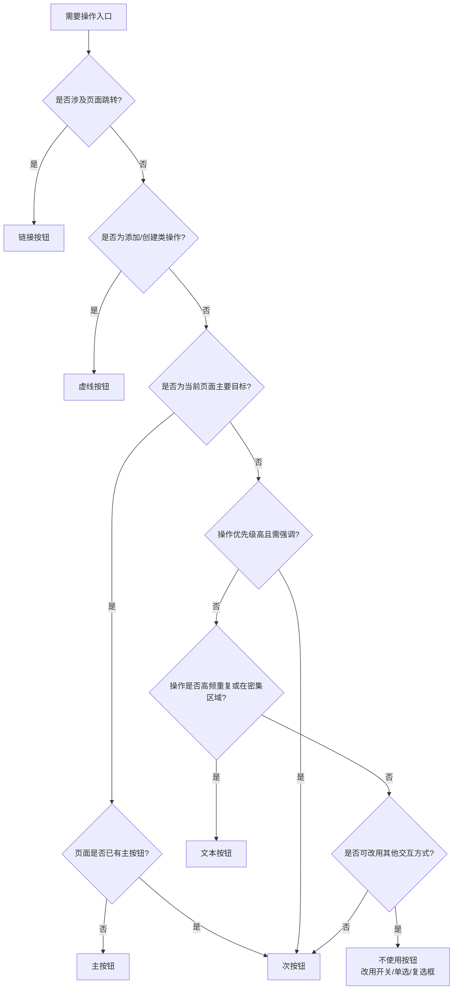

# 1. 简洁易读部份

## 1.0. 一句话价值

按钮组件用于明确标识用户可执行的操作入口，并通过视觉层级引导用户做出符合业务优先级的决策。

## 1.1. 组件包含哪些不同类型

| 类型名 | 是什么 | 简单用法 | 典型场景 | 边界替代 |
|--------|--------|----------|----------|----------|
| 主按钮 | 标识页面或流程中最重要的唯一主操作 | 一个页面或对话框中只能有一个主按钮；必须用于用户当前任务的主要目标操作；必须放置在操作组的首位或最显眼位置 | 表单提交、确认对话框、流程推进 | 若页面有多个同等重要操作，改用次按钮 |
| 次按钮 | 标识常规操作或与主操作并列的次要操作 | 可与主按钮配合使用；可在同一页面出现多个；必须用于非主流程但仍需强调的操作 | 重置表单、取消操作、查看详情 | 若操作不需要强调，改用文本按钮或链接按钮 |
| 虚线按钮 | 标识添加或创建类的辅助操作入口 | 必须用于引导用户添加内容或创建新项；不可用于删除或确认类操作；常与列表或卡片配合 | 添加表单项、上传文件区域、创建新条目 | 若不涉及添加创建，改用次按钮或文本按钮 |
| 文本按钮 | 提供弱化的操作入口，不干扰主要内容 | 必须用于低优先级或高频重复操作；不可用于首次或关键任务的主操作；必须确保文字足够清晰可点击 | 表格内批量操作、展开收起、查看更多 | 若操作需要跳转到新页面，改用链接按钮 |
| 链接按钮 | 提供页面跳转或外链访问的入口 | 必须用于导航到其他页面或打开外部资源；不可用于当前页面的状态改变或数据提交；必须符合用户对"点击后离开当前页"的预期 | 跳转到详情页、打开帮助文档、访问外部系统 | 若操作不涉及跳转，改用文本按钮 |

## 1.2. 各类型典型场景案例

### 主按钮

#### 正面案例 vs 反面案例

| 维度 | 正面案例 | 反面案例 |
|------|----------|----------|
| **目标** | 用户填写完注册表单后提交信息 | 用户在设置页面修改多个配置项 |
| **上下文** | 注册表单底部操作区域 | 设置页面底部有"保存"、"应用"、"重置"三个按钮 |
| **做法** | 仅"注册"按钮使用主按钮样式，"返回"使用次按钮 | 三个按钮都使用主按钮样式 |
| **关键规则** | 一个表单只能有一个主按钮；主按钮必须对应用户当前最重要目标；主按钮必须位于操作组最前方或最右侧 | 同上 |
| **后果** | ✓ 符合规则 | ✗ 造成视觉混乱，用户无法快速识别主操作，可能误触错误按钮导致数据丢失 |

### 次按钮

#### 正面案例 vs 反面案例

| 维度 | 正面案例 | 反面案例 |
|------|----------|----------|
| **目标** | 用户提交表单后需要选择"保存"或"取消" | 用户需要删除重要数据 |
| **上下文** | 确认对话框底部操作区域 | 数据列表中的删除操作 |
| **做法** | "保存"用主按钮，"取消"用次按钮 | "删除"操作使用次按钮 |
| **关键规则** | 次按钮必须用于非主操作；可与主按钮配合形成明确层级；不可用于高风险操作 | 同上 |
| **后果** | ✓ 符合规则 | ✗ 用户可能因按钮样式过于常规而忽视操作风险，误触删除导致不可逆数据损失 |

### 虚线按钮

#### 正面案例 vs 反面案例

| 维度 | 正面案例 | 反面案例 |
|------|----------|----------|
| **目标** | 用户需要在表单中添加新的联系人信息项 | 用户需要删除已有的联系人信息 |
| **上下文** | 动态表单底部，已有两个联系人条目 | 联系人列表中每个条目后的操作区 |
| **做法** | "添加联系人"使用虚线按钮 | "删除"操作使用虚线按钮 |
| **关键规则** | 虚线按钮只能用于添加创建类操作；必须传递"可添加内容"的语义；不可用于删除或确认 | 同上 |
| **后果** | ✓ 符合规则 | ✗ 语义混乱，用户无法从样式判断操作性质，可能误将删除理解为低风险操作 |

### 文本按钮

#### 正面案例 vs 反面案例

| 维度 | 正面案例 | 反面案例 |
|------|----------|----------|
| **目标** | 用户在长表格中对每行数据进行编辑或删除 | 用户首次进入系统需要完成账号激活 |
| **上下文** | 数据表格每行末尾操作列 | 账号激活页面主要操作区 |
| **做法** | "编辑"和"删除"使用文本按钮 | "激活账号"使用文本按钮 |
| **关键规则** | 文本按钮必须用于低优先级或高频操作；不可用于首次或关键任务；必须确保在密集信息环境中仍可识别 | 同上 |
| **后果** | ✓ 符合规则 | ✗ 主要任务缺乏视觉强调，用户可能忽视或无法快速定位操作入口，导致任务流程中断 |

### 链接按钮

#### 正面案例 vs 反面案例

| 维度 | 正面案例 | 反面案例 |
|------|----------|----------|
| **目标** | 用户需要查看订单详细信息 | 用户需要确认删除当前记录 |
| **上下文** | 订单列表中每行的查看入口 | 删除确认对话框 |
| **做法** | "查看详情"使用链接按钮，点击跳转到详情页 | "确认删除"使用链接按钮 |
| **关键规则** | 链接按钮必须用于页面跳转或外链；不可用于当前页状态改变；必须符合用户"点击后离开"预期 | 同上 |
| **后果** | ✓ 符合规则 | ✗ 用户预期点击后会跳转，实际却执行删除，导致认知错位和误操作风险 |

# 2. 选型指南

## 2.1 选择流程

# 3. 细致专业部份

## 3.1. 关键信息速记

**三条最关键规则**
1. 一个页面或对话框中主按钮有且仅有一个，必须对应用户当前最重要目标
2. 按钮类型必须与操作后果匹配：页面跳转用链接按钮，添加创建用虚线按钮，状态改变或提交用主次按钮
3. 高风险操作（删除、不可逆变更）不可使用低强调样式（文本按钮、链接按钮），必须使用次按钮并配合二次确认

**两个最典型场景**
1. 表单提交页面底部：主按钮用于提交，次按钮用于取消或重置
2. 数据表格操作列：文本按钮用于编辑查看，链接按钮用于跳转详情

**常见误用与后果**
误用：在同一页面使用多个主按钮 → 后果：视觉层级混乱，用户无法识别主要操作，决策时间延长，易误触次要操作

## 3.2. 适用 / 不适用

**适用**
1. 当用户需要在页面中明确执行某个会改变系统状态的操作时
2. 当操作具有明确优先级且需要通过视觉层级引导用户决策时
3. 当操作入口需要在复杂界面中保持可识别性和可点击性时

**不适用**
1. 当操作是开关型二态切换时 → 改用开关组件
2. 当操作是多选一的选择时 → 改用单选按钮组或下拉选择器
3. 当操作是实时生效的配置勾选时 → 改用复选框

## 3.3. 详情阅读指引

**阅读建议**
适合产品经理、设计师和前端工程师在进行按钮选型时查阅，读完可判断在当前场景中应使用哪种按钮类型以及是否需要使用按钮。

**检索关键词**
按钮、主按钮、次按钮、虚线按钮、文本按钮、链接按钮、操作入口、视觉层级、表单提交、页面跳转、添加创建、高风险操作、交互反馈
