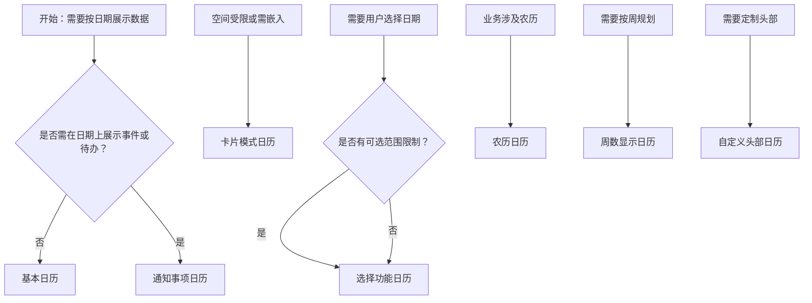

# 1. 简洁易读部份

## 1.0. 组件描述

日历组件用于按照日历形式展示与日期相关的数据，支持按年、月切换视图，适用于日程、课表、价格日历等与时间强关联的场景。

## 1.1. 组件构成

日历由以下基础要素构成，可按需组合使用：

> <!-- 附图占位：建议附上一张示例图，展示日历的头部（年/月切换）、主体（日期网格）、单元格的构成关系，标注各要素名称与位置 -->

&emsp;&emsp;1. **头部** 包含年份选择、月份选择与视图模式切换，用于控制当前展示的时间范围。

&emsp;&emsp;2. **主体网格** 按周排列的日期单元格矩阵，用于展示每一天及附着于其上的数据或事件。

&emsp;&emsp;3. **单元格** 单个日期的展示单元，可承载自定义内容（如事件列表、标记、禁用态）。

---

## 1.2. 组件包含哪些不同类型

### 1.2.1 基本日历

&emsp;**是什么**：按月份展示的通用日历面板，支持年/月切换，无额外业务定制

> <!-- 附图占位：建议附上一张示例图，展示基本日历（月视图、年/月选择器、日期网格）的视觉形态 -->

&emsp;**简单用法**：必须用于数据按日期划分的展示场景；支持月/年两种模式切换；单元格默认展示日期数字

&emsp;**典型场景**：通用日程查看、日期导航、简单日历展示

> <!-- 附图占位：建议附上一张场景图，展示基本日历作为日程入口的布局，体现年/月切换与日期浏览 -->

&emsp;**替代方案**：若需在日期上展示事件或自定义内容，改用通知事项日历或自定义渲染

### 1.2.2 通知事项日历

&emsp;**是什么**：在日期单元格内展示当日事件或待办，通过列表或标记提示用户关注

> <!-- 附图占位：建议附上一张示例图，展示通知事项日历（单元格内带事件列表或圆点标记）的视觉形态 -->

&emsp;**简单用法**：必须用于日程、待办、提醒等与日期强绑定的数据；事件数量需控制，避免单元格溢出；重要事件可做视觉强调

&emsp;**典型场景**：日程管理、待办日历、会议安排、课程表

> <!-- 附图占位：建议附上一张场景图，展示日程应用中某月某日单元格内的事件列表，体现按日期附着数据的用法 -->

&emsp;**替代方案**：若仅需选择日期无事件展示，使用日期选择器

### 1.2.3 卡片模式日历

&emsp;**是什么**：以卡片形态展示的紧凑日历，占用空间较小，适用于侧边或嵌入场景

> <!-- 附图占位：建议附上一张示例图，展示卡片模式日历（非全屏、有边框、紧凑布局）的视觉形态 -->

&emsp;**简单用法**：必须用于空间受限的布局；可关闭全屏模式以适配卡片容器；需保持日期可读与可点击

&emsp;**典型场景**：侧边栏日历、弹窗内日历、仪表盘嵌入式日历

> <!-- 附图占位：建议附上一张场景图，展示仪表盘或侧边栏中嵌入的卡片日历，体现紧凑展示方式 -->

&emsp;**替代方案**：若空间充足且需完整展示，使用全屏日历

### 1.2.4 选择功能日历

&emsp;**是什么**：强调日期选择能力的日历，支持选择单日或范围，并配合不可选日期限制

> <!-- 附图占位：建议附上一张示例图，展示选择功能日历（选中态高亮、禁用日期灰显）的视觉形态 -->

&emsp;**简单用法**：必须用于预订、预约、排期等需用户明确选择日期的场景；可通过 disabledDate 限制可选范围；选中态需清晰反馈

&emsp;**典型场景**：会议室预约、酒店预订、排班选择、活动报名

> <!-- 附图占位：建议附上一张场景图，展示预订流程中用户通过日历选择日期的交互，体现选择功能的用法 -->

&emsp;**替代方案**：若仅浏览不选择，使用只读日历

### 1.2.5 农历日历

&emsp;**是什么**：在公历基础上展示农历信息，适用于传统节日或农历相关业务

> <!-- 附图占位：建议附上一张示例图，展示农历日历（单元格内显示农历日期）的视觉形态 -->

&emsp;**简单用法**：必须用于需要农历对照的场景；公历与农历需清晰区分层级；节假日或传统节日可做标记

&emsp;**典型场景**：传统节日提醒、黄历、农历生日、节庆活动

> <!-- 附图占位：建议附上一张场景图，展示日历中某日同时显示公历与农历的布局 -->

&emsp;**替代方案**：若业务与农历无关，使用公历日历

### 1.2.6 周数显示日历

&emsp;**是什么**：在日历左侧或首列展示周数，便于按周规划与跨周查看

> <!-- 附图占位：建议附上一张示例图，展示周数显示日历（首列或左侧有周序号）的视觉形态 -->

&emsp;**简单用法**：必须用于按周管理、周报、周计划的场景；周数计算需符合国际或业务约定；与日期列对齐清晰

&emsp;**典型场景**：周计划、周报填写、按周排课、项目管理

> <!-- 附图占位：建议附上一张场景图，展示带周数的日历在项目或课程规划中的使用方式 -->

&emsp;**替代方案**：若无需按周视图，使用标准月视图

### 1.2.7 自定义头部日历

&emsp;**是什么**：通过自定义头部内容替代默认年/月选择器，满足特定交互或品牌需求

> <!-- 附图占位：建议附上一张示例图，展示自定义头部日历（自定义按钮、文案、布局）的视觉形态 -->

&emsp;**简单用法**：必须用于需要特殊头部样式或交互的场景；自定义内容需保留切换年/月的核心能力；不可影响日历主体可读性

&emsp;**典型场景**：品牌定制、简化头部、嵌入特定导航

> <!-- 附图占位：建议附上一张场景图，展示使用自定义头部的日历在品牌页面中的展示 -->

&emsp;**替代方案**：若默认头部满足需求，使用标准日历

---

## 1.3. 各类型典型场景案例

### 1.3.1 基本与通知事项

> <!-- 附图占位：建议附上一张对比图，左侧展示无事件时使用基本日历（符合规范），右侧展示有事件时在单元格内展示事项（符合规范） -->

✅ **推荐：** 无事件时保持单元格简洁，有事件时在单元格内清晰展示

❌ **不推荐：** 在无事件时堆砌占位内容，或有大量事件时导致单元格溢出难以阅读

### 1.3.2 全屏与卡片模式

> <!-- 附图占位：建议附上一张对比图，左侧展示主内容区用全屏日历（符合规范），右侧展示侧边栏用卡片模式（符合规范） -->

✅ **推荐：** 主视图用全屏日历，侧边或嵌入式场景用卡片模式

❌ **不推荐：** 在狭窄区域强用全屏日历导致布局错乱，或在主视图用过小卡片日历导致可读性差

### 1.3.3 选择与禁用

> <!-- 附图占位：建议附上一张对比图，左侧展示可选与不可选日期的清晰区分（符合规范），右侧展示禁用日期与可选日期视觉混淆（违反规范） -->

✅ **推荐：** 不可选日期需灰显或弱化，选中态需明确高亮

❌ **不推荐：** 禁用日期与可选日期视觉区分不足，或选中态不够明显

---

# 2. 选型指南

## 2.1 选择流程

---

# 3. 细致专业部份（交互与排版规则）

为了保持日历清晰可读并符合用户对时间信息的预期，当使用日历时，请参考以下排版和交互规则：

## 3.1 视图切换与导航

当用户需要在不同时间范围间切换时，需遵循：

* **模式**：支持月视图与年视图切换，月视图为默认，满足大多数日程场景。
* **切换反馈**：切换年/月后，主体网格需立即更新，选中态与今日标记需同步。
* **有效范围**：可通过 validRange 限制可展示的日期范围，避免用户进入无效时间段。

> <!-- 附图占位：建议附上一张场景图，展示用户切换月份后日历主体更新的交互流程 -->

## 3.2 单元格内容与自定义渲染

**如何决定单元格内展示什么？**

* **默认**：仅展示日期数字，今日可做高亮。
* **自定义**：通过 cellRender 或 fullCellRender 在单元格内追加事件、标记、数量等。
* **溢出**：事件过多时，优先展示重要项或数量汇总，避免撑破单元格；可配合点击展开详情。

**针对自定义内容的建议：**

* **层级清晰**：日期数字为主，附加内容为辅，不可喧宾夺主。
* **一致性**：同一类型事件采用统一的视觉样式（如颜色、图标）。
* **可点击**：若单元格内元素可点击，需提供明确的 hover 与 focus 态。

> <!-- 附图占位：建议附上一张场景图，展示单元格内事件列表的层级与溢出时的处理方式 -->

## 3.3 选中与不可选

* **选中态**：选中的日期需有明确的背景色或描边，与未选中形成清晰对比。
* **不可选日期**：通过 disabledDate 禁用的日期需灰显或降低对比度，且不可点击。
* **选择来源**：若需区分「来自面板点击」与「来自头部切换」等不同来源，可依据 onSelect 的 source 做差异化处理。

> <!-- 附图占位：建议附上一张对比图，展示可选、选中、不可选三种日期的视觉区分 -->

## 3.4 全屏与卡片模式

* **全屏**：默认模式，适合作为主内容展示，占用较大空间，信息完整。
* **卡片模式**：设置 fullscreen 为 false，适合侧边栏、弹窗、仪表盘等嵌入场景；需保证最小可读尺寸。

> <!-- 附图占位：建议附上一张场景图，展示全屏日历与卡片模式日历在同一产品中的使用位置对比 -->

## 3.5 国际化与 locale

* **语言**：Calendar 的 locale 与 value 关联，需正确设置 dayjs 的 locale 以匹配界面语言。
* **周起始日**：不同地区对「一周从周几开始」有不同约定，需按目标用户配置。
* **日期格式**：年、月、日的展示格式需符合 locale 规范。

> <!-- 附图占位：建议附上一张示例图，展示中英文环境下日历头部与日期格式的差异 -->

## 3.6 今日与范围高亮

* **今日**：当前日期需有明确视觉标识（如边框、背景色），便于用户快速定位。
* **范围选择**：若支持范围选择，起止日期与中间日期需有区分（如起止高亮、范围浅色填充）。
* **跨月**：范围跨月时，需在月切换后保持范围态的可视化一致。

> <!-- 附图占位：建议附上一张场景图，展示今日标记与日期范围选择的视觉呈现 -->

---

## 4.0. 常见问题

### 1. 日历和日期选择器的区别是什么

- **日历**：以月/年视图展示完整日历面板，适合浏览与附着事件数据，强调「按日期查看」。
- **日期选择器**：以输入框 + 弹层形式出现，主要目的是「选择日期」并回填，不强调长期展示。

### 2. 什么时候用全屏、什么时候用卡片模式

- **全屏**：日历作为页面主内容（如日程中心、课程表主视图）时使用，占用主要区域。
- **卡片模式**：日历嵌入侧边栏、弹窗、仪表盘卡片等空间有限区域时使用，保持紧凑。

### 3. 如何只响应面板内点击日期、不响应头部切换触发的选择

- `onSelect` 回调会提供来源信息（如 `source: 'date'` 表示来自面板点击），可据此过滤，仅在处理面板点击时执行业务逻辑，忽略来自年/月切换等来源的触发。
