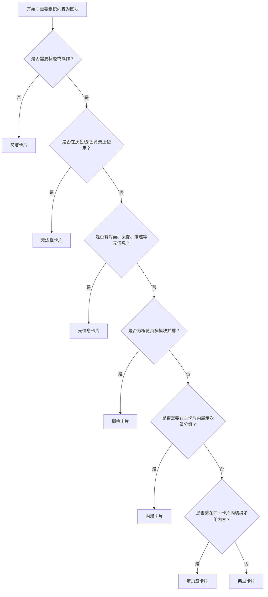

# 1. 简洁易读部份

## 1.0. 组件描述

卡片组件作为通用内容容器，用于将相关信息组织成独立区块，承载文字、列表、图片、段落等内容，常用于后台概览、信息聚合与模块化布局。

## 1.1. 组件构成

卡片由以下基础要素构成，可按需组合使用：

> <!-- 附图占位：建议附上一张示例图，展示卡片的头部、封面、内容区、操作区的构成关系，标注各要素名称与位置 -->

&emsp;&emsp;1. **容器** 定义卡片的边界、背景与阴影，用于承载不同形态（有边框、无边框）与尺寸。

&emsp;&emsp;2. **头部** 卡片标题与右上角操作区，用于概括区块主题并放置快捷操作。

&emsp;&emsp;3. **内容区** 卡片主体的文字、列表、图片或自定义内容，用于承载核心信息。

&emsp;&emsp;4. **可选封面/操作区** 顶部封面图或底部操作组，用于增强视觉或提供区块级操作入口。

---

## 1.2. 组件包含哪些不同类型

### 1.2.1 典型卡片

&emsp;**是什么**：包含标题、内容与底部操作区的完整卡片，为最基础的卡片形态

> <!-- 附图占位：建议附上一张示例图，展示典型卡片（标题、内容、底部操作按钮）的视觉形态 -->

&emsp;**简单用法**：必须用于需要明确区块主题与操作的场景；标题需简要概括内容；操作区不宜超过 3 个主要动作

&emsp;**典型场景**：数据概览、统计模块、配置面板、信息汇总

> <!-- 附图占位：建议附上一张场景图，展示后台概览页中多个典型卡片并排的布局，体现模块化信息组织 -->

&emsp;**替代方案**：若仅需承载内容无标题无操作，改用简洁卡片

### 1.2.2 无边框卡片

&emsp;**是什么**：去掉边框的卡片形态，在灰色或深色背景上更显融合

> <!-- 附图占位：建议附上一张示例图，展示无边框卡片（无描边、靠背景色区分）的视觉形态 -->

&emsp;**简单用法**：必须用于背景色与卡片需视觉融合的场景；需通过背景或阴影保持卡片与背景的层次区分；不可在纯白背景上使用导致边界消失

&emsp;**典型场景**：灰色背景的仪表盘、深色主题、紧凑布局的概览区

> <!-- 附图占位：建议附上一张场景图，展示灰色背景上无边框卡片与背景融合的布局 -->

&emsp;**替代方案**：若背景为白或浅色，使用有边框卡片

### 1.2.3 简洁卡片

&emsp;**是什么**：仅包含内容区域，无标题、无封面、无操作区的轻量卡片

> <!-- 附图占位：建议附上一张示例图，展示简洁卡片（纯内容区、无头部）的视觉形态 -->

&emsp;**简单用法**：必须用于内容即主题、无需额外标题或操作的场景；内容需自解释或与上下文明确关联

&emsp;**典型场景**：简单说明、单一段落、占位内容、轻量信息块

> <!-- 附图占位：建议附上一张场景图，展示列表或栅格中简洁卡片作为内容块的用法 -->

&emsp;**替代方案**：若需标题或操作，使用典型卡片

### 1.2.4 元信息卡片

&emsp;**是什么**：包含封面、头像、标题与描述的卡片，适用于人物、对象或内容摘要的展示

> <!-- 附图占位：建议附上一张示例图，展示元信息卡片（封面图、头像、标题、描述）的视觉形态 -->

&emsp;**简单用法**：必须用于需要多元素组合展示的场景；封面、头像、标题、描述各司其职；可通过 Card.Meta 统一结构化

&emsp;**典型场景**：用户卡片、产品卡片、文章摘要、对象预览

> <!-- 附图占位：建议附上一张场景图，展示列表中使用元信息卡片展示用户或产品信息的布局 -->

&emsp;**替代方案**：若结构简单无封面无头像，使用典型卡片

### 1.2.5 栅格卡片

&emsp;**是什么**：与栅格系统配合，在列内等分或响应式排列的卡片组

> <!-- 附图占位：建议附上一张示例图，展示栅格卡片（多列等分布局）的视觉形态 -->

&emsp;**简单用法**：必须用于概览页、仪表盘等多模块并排场景；列数与间距需符合栅格规范；卡片内容不宜过长导致高度参差过大

&emsp;**典型场景**：数据概览、统计卡片组、功能模块入口、仪表盘

> <!-- 附图占位：建议附上一张场景图，展示后台概览页中栅格布局的卡片组 -->

&emsp;**替代方案**：若仅单卡片或少量卡片，可直接流式布局

### 1.2.6 内部卡片

&emsp;**是什么**：置于普通卡片内容区内的次级卡片，用于展示多层级结构

> <!-- 附图占位：建议附上一张示例图，展示内部卡片（外层卡片内含一个或多个内嵌卡片）的视觉形态 -->

&emsp;**简单用法**：必须用于主从或层级明确的信息结构；内嵌卡片需在视觉上弱于外层；层级不宜超过两层，避免嵌套过深

&emsp;**典型场景**：主卡内分组、子项列表、配置分组、嵌套信息

> <!-- 附图占位：建议附上一张场景图，展示主卡片内容区内嵌多个内部卡片的层级关系 -->

&emsp;**替代方案**：若层级扁平，使用单层卡片或列表

### 1.2.7 带页签卡片

&emsp;**是什么**：卡片头部下方或内部集成页签，用于在同一卡片内切换多组内容

> <!-- 附图占位：建议附上一张示例图，展示带页签卡片（标题下方为 tab、内容区随 tab 切换）的视觉形态 -->

&emsp;**简单用法**：必须用于同一主题下多类内容需要切换展示的场景；页签数量不宜过多；默认展示第一个页签

&emsp;**典型场景**：多维度数据切换、不同状态内容、分类信息收纳

> <!-- 附图占位：建议附上一张场景图，展示带页签卡片在数据模块中切换不同维度的用法 -->

&emsp;**替代方案**：若内容单一，使用典型卡片；若内容过多，考虑拆分为多卡片

---

## 1.3. 各类型典型场景案例

### 1.3.1 典型与简洁

> <!-- 附图占位：建议附上一张对比图，左侧展示需要标题与操作时使用典型卡片（符合规范），右侧展示纯内容块使用简洁卡片（符合规范） -->

✅ **推荐：** 需要标题与操作时用典型卡片，纯内容块用简洁卡片

❌ **不推荐：** 纯内容块强加标题造成冗余，或需要操作却用简洁卡片导致操作入口缺失

### 1.3.2 栅格与间距

> <!-- 附图占位：建议附上一张对比图，左侧展示栅格卡片组间距统一、对齐规整（符合规范），右侧展示卡片间距不一、错位（违反规范） -->

✅ **推荐：** 栅格卡片组保持统一间距与对齐

❌ **不推荐：** 卡片间距混乱、高度差异过大导致视觉不齐

### 1.3.3 内部卡片层级

> <!-- 附图占位：建议附上一张对比图，左侧展示内部卡片视觉层级清晰、最多两层（符合规范），右侧展示嵌套过深、层级混乱（违反规范） -->

✅ **推荐：** 内部卡片层级清晰，嵌套不超过两层

❌ **不推荐：** 卡片嵌套过深，用户难以理解信息归属

---

# 2. 选型指南

## 2.1 选择流程

---

# 3. 细致专业部份（交互与排版规则）

为了保持卡片清晰易读并建立有效的信息层级，当使用卡片时，请参考以下排版和交互规则：

## 3.1 标题与操作区

当卡片包含标题与操作时，需遵循：

* **标题**：简明概括卡片主题，避免过长；可与 extra 区配合，标题左、操作右。
* **操作数量**：底部操作组建议不超过 3 个主操作，过多可收纳至「更多」。
* **extra 区**：右上角用于放置单个或少量快捷操作（如「更多」、链接），不宜堆放大量按钮。

> <!-- 附图占位：建议附上一张场景图，展示卡片标题与 extra 区、底部操作组的布局关系 -->

## 3.2 封面与元信息

**如何组织封面、头像、标题与描述？**

* **封面**：置于顶部，横向铺满卡片宽度；图片需保证比例与清晰度，避免拉伸。
* **元信息**：头像 + 标题 + 描述可组合使用，头像左、文字右，描述置于标题下方。
* **层级**：标题权重高于描述，避免字号、颜色过于接近导致层级模糊。

**针对元信息卡片的建议：**

* **一致性**：同一列表内元信息结构宜统一（如都有头像 + 标题 + 描述）。
* **截断**：标题或描述过长时需省略，避免撑破卡片或影响栅格对齐。

> <!-- 附图占位：建议附上一张场景图，展示元信息卡片中封面、头像、标题、描述的排版与层级 -->

## 3.3 悬浮与加载态

* **悬浮**：当卡片可点击或可交互时，可设置 hoverable 提供悬浮反馈，增强可点击感。
* **加载态**：内容加载中时，可用 loading 展示骨架或占位，避免空白造成疑惑。
* **不可 hover**：纯展示型卡片可不设置悬浮，减少干扰。

> <!-- 附图占位：建议附上一张场景图，展示卡片悬浮态与加载态的视觉差异 -->

## 3.4 尺寸与间距

* **尺寸**：支持默认与小号两种尺寸，小号适用于紧凑布局。
* **内边距**：内容区内边距需统一，与卡片间外边距形成清晰节奏。
* **栅格**：栅格卡片时，列间距需符合栅格系统规范，保持视觉秩序。

> <!-- 附图占位：建议附上一张场景图，展示卡片内边距与栅格卡片间距的规范 -->

## 3.5 网格型内容区

当卡片内容区需要分块展示（如网格内嵌卡片）时：

* **Card.Grid**：将内容区划分为等分网格，每格可独立承载信息或操作。
* **悬浮**：网格单元可单独设置悬浮，用于可点击项。
* **数量**：网格数量不宜过多，保持单屏可览与可操作。

> <!-- 附图占位：建议附上一张场景图，展示卡片内容区使用 Card.Grid 的网格布局 -->

## 3.6 带页签卡片的页签位置

* **位置**：页签通常置于标题下方、内容区上方，与内容紧密关联。
* **切换**：页签切换时内容区需平滑切换，避免闪烁。
* **默认**：首次进入时展示第一个页签，或通过 defaultActiveTabKey 指定。

> <!-- 附图占位：建议附上一张场景图，展示带页签卡片的页签位置与切换后的内容区 -->

---

## 4.0. 常见问题

### 1. 典型卡片和简洁卡片的区别是什么

- **典型卡片**：包含标题、内容区与底部操作，适用于需要明确区块主题并提供操作入口的场景，如数据概览、配置面板。
- **简洁卡片**：仅包含内容区，无标题、无操作，适用于内容即主题或与上下文明确关联的轻量信息块。

### 2. 什么时候用无边框卡片

- 当卡片置于**灰色或深色背景**上，希望与背景视觉融合、减少边框割裂感时使用。若背景为白或浅色，使用有边框卡片更利于层次区分。

### 3. 内部卡片可以嵌套几层

- 建议**最多两层**（外层主卡 + 内嵌卡片）。层级过深会降低可读性，增加认知负担，此时应考虑拆分为多个平级卡片或使用其他布局方式。
