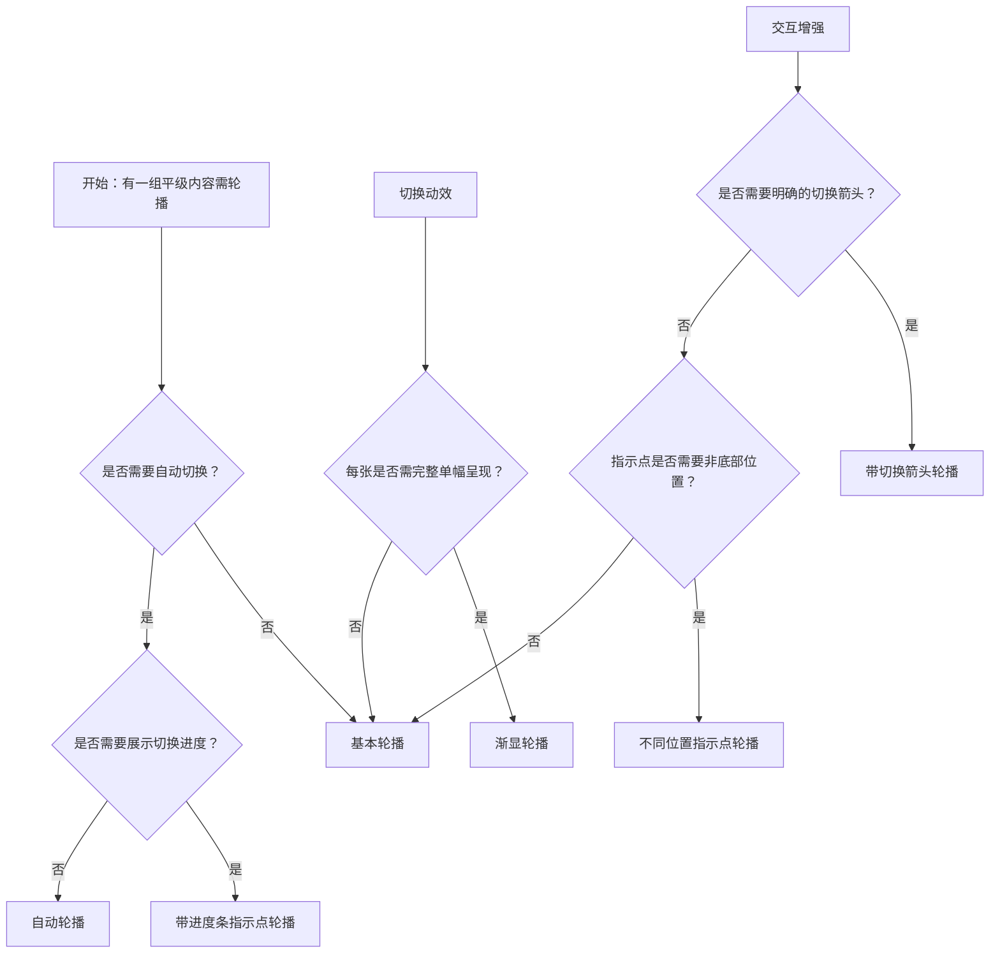

# 1. 简洁易读部份

## 1.0. 组件描述

走马灯组件用于在固定区域内轮播展示一组平级内容，当空间不足时通过轮播形式收纳多幅内容，常用于图片轮播、卡片轮播或横幅展示。

## 1.1. 组件构成

走马灯由以下基础要素构成，可按需组合使用：

> <!-- 附图占位：建议附上一张示例图，展示走马灯的展示区、指示点、切换箭头的构成关系，标注各要素名称与位置 -->

&emsp;&emsp;1. **展示区** 当前可见的轮播面板，用于承载图片、卡片或自定义内容。

&emsp;&emsp;2. **指示点** 用于标识当前页码与总页数，支持点击切换，通常置于底部或侧边。

&emsp;&emsp;3. **切换箭头** 可选的前后切换入口，用于主动控制轮播方向。

---

## 1.2. 组件包含哪些不同类型

### 1.2.1 基本轮播

&emsp;**是什么**：最基础的轮播形式，包含多张面板与底部指示点，支持手动切换，无自动播放

> <!-- 附图占位：建议附上一张示例图，展示基本轮播（当前面板、底部圆点指示、无箭头）的视觉形态 -->

&emsp;**简单用法**：必须用于有一组平级内容需轮播展示的场景；面板数量不宜过多；指示点默认展示

&emsp;**典型场景**：产品图轮播、内容卡片轮播、简单横幅

> <!-- 附图占位：建议附上一张场景图，展示商品详情页中的图片轮播，体现基本轮播的用法 -->

&emsp;**替代方案**：若需自动切换，改用自动轮播；若需更强切换引导，启用箭头

### 1.2.2 自动轮播

&emsp;**是什么**：按设定间隔自动切换至下一张，无需用户操作即可浏览全部内容

> <!-- 附图占位：建议附上一张示例图，展示自动轮播（与基本轮播形态类似，强调定时切换）的视觉形态 -->

&emsp;**简单用法**：必须用于希望用户被动浏览多幅内容的场景；间隔不宜过短（建议 3 秒以上）；循环播放时首尾衔接需自然

&emsp;**典型场景**：首页 Banner、活动推广、精选内容展示

> <!-- 附图占位：建议附上一张场景图，展示首页顶部 Banner 自动轮播的布局与切换节奏 -->

&emsp;**替代方案**：若内容重要需用户主动控制节奏，使用基本轮播

### 1.2.3 渐显轮播

&emsp;**是什么**：切换动效为渐隐渐显，替代默认的横向滑动，适用于强调单幅内容完整呈现的场景

> <!-- 附图占位：建议附上一张示例图，展示渐显轮播（切换时为淡入淡出）的动效形态 -->

&emsp;**简单用法**：必须用于希望每张内容以完整画面呈现、不与其他张并排出现的场景；动效时长需适中，过长影响节奏、过短显仓促

&emsp;**典型场景**：全屏大图、品牌视觉、单幅重点内容

> <!-- 附图占位：建议附上一张场景图，展示全屏或大图场景下渐显切换的效果 -->

&emsp;**替代方案**：若希望用户感知「多张并列」的轮播感，使用滑动效果

### 1.2.4 带切换箭头轮播

&emsp;**是什么**：在展示区左右两侧显示前后箭头，提供明确的切换入口

> <!-- 附图占位：建议附上一张示例图，展示带箭头的轮播（左右箭头、指示点）的视觉形态 -->

&emsp;**简单用法**：必须用于需要强化用户主动切换能力的场景；箭头需在悬停时显示或常显，避免与内容抢眼；箭头位置不得遮挡关键内容

&emsp;**典型场景**：图片画廊、产品多图、需快速定位某张的场景

> <!-- 附图占位：建议附上一张场景图，展示带箭头轮播在图片浏览中的使用方式 -->

&emsp;**替代方案**：若空间紧凑或用户以被动浏览为主，可仅保留指示点

### 1.2.5 不同位置指示点轮播

&emsp;**是什么**：指示点可置于顶部、底部、左侧或右侧，适配不同布局与阅读习惯

> <!-- 附图占位：建议附上一张示例图，展示指示点置于顶部、底部、左侧、右侧的四种布局形态 -->

&emsp;**简单用法**：必须根据整体布局选择指示点位置；底部为默认；侧边放置时需考虑与内容的关系，避免遮挡

&emsp;**典型场景**：竖向布局、侧边导航配合、特殊版式需求

> <!-- 附图占位：建议附上一张场景图，展示指示点置于右侧与竖向轮播配合的布局 -->

&emsp;**替代方案**：若无特殊版式需求，使用底部指示点

### 1.2.6 带进度条指示点轮播

&emsp;**是什么**：指示点以进度条形式展示当前张的停留进度，便于用户感知自动切换节奏

> <!-- 附图占位：建议附上一张示例图，展示带进度条的指示点（每张对应一条进度、当前张进度随时间增加）的视觉形态 -->

&emsp;**简单用法**：必须用于自动轮播且希望用户感知「即将切换」的场景；进度条长度或时长需与自动切换间隔一致

&emsp;**典型场景**：自动 Banner、活动倒计时感、强调时长的轮播

> <!-- 附图占位：建议附上一张场景图，展示 Banner 轮播中进度条指示与自动切换的配合 -->

&emsp;**替代方案**：若为手动切换或不需要进度感知，使用普通圆点指示

---

## 1.3. 各类型典型场景案例

### 1.3.1 自动与手动

> <!-- 附图占位：建议附上一张对比图，左侧展示推广类 Banner 使用自动轮播（符合规范），右侧展示需精细查看的产品图使用手动轮播（符合规范） -->

✅ **推荐：** 推广、概览类内容用自动轮播，需精细查看的内容用手动轮播

❌ **不推荐：** 产品细节图使用过快的自动轮播，或推广 Banner 完全不自动切换导致曝光不足

### 1.3.2 滑动与渐显

> <!-- 附图占位：建议附上一张对比图，左侧展示多图并列感用滑动效果（符合规范），右侧展示单幅大图用渐显效果（符合规范） -->

✅ **推荐：** 多张并排感用滑动，单幅完整呈现用渐显

❌ **不推荐：** 全屏单图用滑动导致割裂感，或需对比的多图用渐显导致无法并览

### 1.3.3 指示点与箭头

> <!-- 附图占位：建议附上一张对比图，左侧展示需快速定位时启用箭头（符合规范），右侧展示紧凑空间仅保留指示点（符合规范） -->

✅ **推荐：** 需快速定位时启用箭头，空间紧凑时仅保留指示点

❌ **不推荐：** 在极小空间内同时堆砌箭头与大型指示点，造成拥挤

---

# 2. 选型指南

## 2.1 选择流程

---

# 3. 细致专业部份（交互与排版规则）

为了保持轮播清晰可读且不影响用户对单幅内容的聚焦，当使用走马灯时，请参考以下排版和交互规则：

## 3.1 面板数量与切换节奏

当轮播包含多张面板时，需遵循：

* **数量**：面板数量不宜过多，建议不超过 7 张；过多会降低单张曝光并增加切换成本。
* **自动间隔**：自动轮播间隔建议 3 秒以上，过短会造成阅读压力。
* **循环**：默认支持无限循环，首尾衔接需自然，避免切换跳跃感。

> <!-- 附图占位：建议附上一张场景图，展示 4–5 张面板的轮播与 3 秒切换节奏的配合 -->

## 3.2 指示点与可点击性

**如何设计指示点？**

* **可见性**：指示点需清晰可见，与背景有足够对比度；当前项需有明确的高亮态。
* **可点击**：每个指示点必须可点击，点击后切换至对应面板。
* **位置**：默认底部居中；可置于 top、bottom、start、end 以适配布局。

**针对指示点的建议：**

* **不遮挡**：指示点不得遮挡内容关键区域；可半透明或置于内容外区域。
* **进度条**：若使用进度条形式，需与自动切换间隔同步，让用户感知「即将切换」。

> <!-- 附图占位：建议附上一张场景图，展示指示点与当前面板的对应关系及点击切换效果 -->

## 3.3 切换箭头的展示与反馈

* **显示时机**：可常显或悬停时显示；悬停显示可减少对内容的干扰。
* **位置**：通常置于左右两侧居中，与边缘保持间距；不得遮挡主要内容。
* **反馈**：悬停与点击需有明确反馈；到达首张时上一张、末张时下一张可根据循环策略禁用或循环。

> <!-- 附图占位：建议附上一张场景图，展示箭头位置、悬停态及与内容的间距 -->

## 3.4 动效选择

* **滑动（scrollx）**：默认效果，适用于多张内容需体现「并列轮播」感的场景。
* **渐显（fade）**：适用于单幅内容需完整呈现、不希望与其他张并排出现的场景。
* **时长**：切换动效时长需适中（如 500ms），过长影响节奏、过短显得生硬。

> <!-- 附图占位：建议附上一张对比图，展示滑动与渐显两种动效的视觉差异 -->

## 3.5 高度与自适应

* **固定高度**：常见做法，需保证单张内容在容器内完整展示，避免裁切。
* **自适应高度**：若各张高度差异大，可开启高度自适应，切换时容器高度随当前面板变化；需注意避免布局抖动。
* **宽高比**：内容需保持统一宽高比或裁切规范，避免单张过窄或过扁。

> <!-- 附图占位：建议附上一张场景图，展示固定高度轮播与高度自适应的对比 -->

## 3.6 拖拽与键盘支持

* **拖拽**：可选择性支持拖拽切换，增强移动端或触屏场景的操控感。
* **键盘**：若轮播为焦点关键路径，可支持左右键切换，提升无障碍体验。
* **焦点**：轮播获得焦点时，需有清晰的焦点标识。

> <!-- 附图占位：建议附上一张示例图，展示轮播的拖拽与键盘焦点态 -->

---

## 4.0. 常见问题

### 1. 自动轮播和手动轮播分别在什么场景用

- **自动轮播**：适用于推广 Banner、活动入口、精选内容等希望用户被动浏览、提高曝光量的场景；间隔不宜过短。
- **手动轮播**：适用于产品图、详情图、需用户主动控制节奏并仔细查看内容的场景。

### 2. 滑动和渐显效果怎么选

- **滑动**：强调「多张并列轮播」的节奏感，适合多图浏览、卡片轮播等。
- **渐显**：强调单幅内容的完整呈现，适合全屏大图、品牌视觉、单幅重点内容。

### 3. 什么时候显示切换箭头

- 当用户需要**快速定位到某一张**（如第 3 张）或频繁前后切换时，显示箭头可提升效率。若空间紧凑或用户以被动浏览为主，可仅保留指示点，减少视觉干扰。
