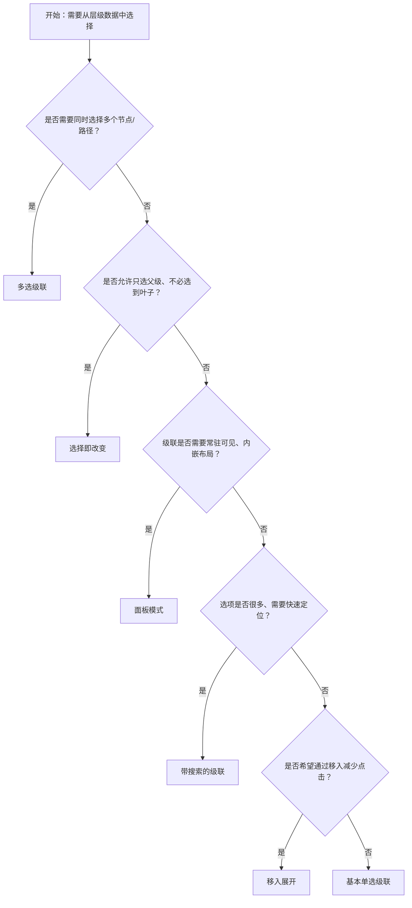

# 1. 简洁易读部份

## 1.0. 组件描述

级联选择组件用于从一组具有层级关系的数据中进行选择，可在同一浮层内逐级展开并完成选择。适用于省市区、组织架构、分类目录等具有父子层级的数据结构，相比 Select 能在同一弹层中完成多级选择，体验更连贯。

## 1.1. 组件构成

级联选择由以下基础要素构成，可按需组合使用：

> <!-- 附图占位：建议附上一张示例图，展示级联选择的基础要素（触发器、下拉浮层、多列菜单、选中回填）的构成关系，标注各要素名称与位置 -->

&emsp;&emsp;1. **触发器** 展示当前选中结果或占位提示，点击后展开下拉浮层；可自定义为按钮或其它样式。

&emsp;&emsp;2. **下拉浮层** 承载多级选项的展开区域，可配置弹出位置与宽度。

&emsp;&emsp;3. **多列菜单** 每级选项占据一列，选择父级后展开子级，形成级联关系。

&emsp;&emsp;4. **选中回填** 选择完成后，触发器展示选中路径（如「浙江 / 杭州 / 西湖」），支持自定义回填格式。

---

## 1.2. 组件包含哪些不同类型

### 1.2.1 基本单选级联

&emsp;**是什么**：逐级点击展开子级，必须选到叶子节点才算完成选择，选中路径以文本形式回填

> <!-- 附图占位：建议附上一张示例图，展示基本单选级联（省/市/区逐列展开、选至叶子节点、路径回填）的视觉形态 -->

&emsp;**简单用法**：适用于数据结构清晰、层级固定的场景；用户必须选到最末级；默认点击展开子级，选择完成后浮层关闭

&emsp;**典型场景**：省市区选择、组织架构选择、多级分类选择

> <!-- 附图占位：建议附上一张场景图，展示表单中省市区级联选择器的使用，体现逐级展开至叶子节点的典型流程 -->

&emsp;**替代方案**：若只需选父级不选子级，改用「选择即改变」；若选项过多需搜索，改用带搜索的级联

### 1.2.2 多选级联

&emsp;**是什么**：在同一层级结构中可勾选多个节点，选中项以标签或聚合形式回填，支持父子联动

> <!-- 附图占位：建议附上一张示例图，展示多选级联（选项带复选框、可勾选多个、标签回填）的视觉形态 -->

&emsp;**简单用法**：必须用于「需同时选择多个层级路径」的场景；可配置回填策略（只显子节点或父节点）；父子选中关系可联动（全选父级即选子级，或反之）

&emsp;**典型场景**：批量选择地区、多品类筛选、权限树多选

> <!-- 附图占位：建议附上一张场景图，展示筛选条件中多选省市区或多个分类的级联，体现多选级联的典型用法 -->

&emsp;**替代方案**：若只需选一条路径，用单选级联；若结构非层级而是平铺，用 Checkbox 组或 TreeSelect

### 1.2.3 移入展开

&emsp;**是什么**：鼠标移入选项即可展开子级，无需点击；点击选项完成选择

> <!-- 附图占位：建议附上一张示例图，展示移入展开的交互（悬停即展开下一列），与点击展开形成对比 -->

&emsp;**简单用法**：适用于层级较多、用户需快速浏览的场景；移入即展开减少点击次数；点击仍用于确认选择

&emsp;**典型场景**：深层级分类浏览、地区快速定位

> <!-- 附图占位：建议附上一张场景图，展示用户通过移入快速浏览省市区层级并点击完成选择，体现移入展开的效率优势 -->

&emsp;**替代方案**：若层级较浅或用户易误触，用默认点击展开

### 1.2.4 选择即改变

&emsp;**是什么**：点击任意层级选项即可完成选择，不必选到叶子节点；父级选项也可作为最终值

> <!-- 附图占位：建议附上一张示例图，展示选择即改变（点击「浙江」即可完成、不必选到区县）的交互形态 -->

&emsp;**简单用法**：必须用于「父级本身可作为有效选择」的场景；选中父级后浮层关闭，回填父级路径；适用于可选范围灵活的配置

&emsp;**典型场景**：仅选省份、仅选大分类、灵活粒度选择

> <!-- 附图占位：建议附上一张场景图，展示用户只选「浙江省」作为配送范围而不必细化到区县，体现选择即改变的灵活用法 -->

&emsp;**替代方案**：若业务要求必须选到叶子节点，用基本单选级联

### 1.2.5 带搜索的级联

&emsp;**是什么**：在选择框中显示搜索输入，用户输入关键词可快速过滤并定位到匹配节点

> <!-- 附图占位：建议附上一张示例图，展示带搜索的级联（搜索框 + 过滤后的选项列表）的视觉形态 -->

&emsp;**简单用法**：适用于选项数量大、层级深的场景；搜索在当前数据源内匹配，暂不支持服务端搜索；匹配结果需能明确展示层级路径

&emsp;**典型场景**：省市区快速搜索、大量分类的快速定位

> <!-- 附图占位：建议附上一张场景图，展示用户输入「西湖」快速定位到「浙江 / 杭州 / 西湖」，体现搜索提升选择效率 -->

&emsp;**替代方案**：若选项不多无需搜索，用基本级联；若需服务端检索，可考虑 AutoComplete 或自定义组合

### 1.2.6 面板模式（内嵌）

&emsp;**是什么**：级联选择不以浮层形式弹出，而是内嵌在页面或卡片中，作为固定面板使用

> <!-- 附图占位：建议附上一张示例图，展示面板模式的级联（多列菜单直接嵌入页面布局，无弹出层）的视觉形态 -->

&emsp;**简单用法**：必须用于「级联需常驻可见、与周围内容协同展示」的场景；不占用浮层层级，适合侧边栏、筛选区等固定区域

&emsp;**典型场景**：筛选侧边栏、配置页内嵌分类选择、看板内的分类切换

> <!-- 附图占位：建议附上一张场景图，展示侧边栏中内嵌的级联分类面板，体现面板模式与页面布局的一体化 -->

&emsp;**替代方案**：若空间有限或选择为辅助操作，用默认浮层模式

---

## 1.3. 各类型典型场景案例

### 1.3.1 基本单选与选择即改变

> <!-- 附图占位：建议附上一张对比图，左侧展示必须选到叶子节点才能完成的场景（符合基本单选规范），右侧展示父级即可作为有效选择的场景（符合选择即改变规范） -->

✅ **推荐：** 根据业务是否要求「选到最末级」正确选用基本单选或选择即改变

❌ **不推荐：** 在需要父级作为有效值的场景强求选到叶子节点；在必须精确到末级的场景允许只选父级

### 1.3.2 多选与单选

> <!-- 附图占位：建议附上一张对比图，左侧展示单选级联用于单一配送地址选择（符合规范），右侧展示多选级联用于多地区筛选（符合规范） -->

✅ **推荐：** 单选用于「只选一条路径」；多选用于「同时选多条路径或多个节点」

❌ **不推荐：** 在只需一条路径的场景滥用多选；在需多选的场景用单选导致重复操作

### 1.3.3 带搜索与面板模式

> <!-- 附图占位：建议附上一张对比图，左侧展示选项多时启用搜索提升效率（符合规范），右侧展示面板模式在侧边栏等固定区域内嵌使用（符合规范） -->

✅ **推荐：** 选项多、层级深时启用搜索；级联需常驻可见时使用面板模式

❌ **不推荐：** 选项很少时强行加搜索增加复杂度；浮层模式在狭窄空间使用导致遮挡或滚动问题

---

# 2. 选型指南

## 2.1 选择流程

---

# 3. 细致专业部份（交互与排版规则）

## 3.1 多操作的展示与折叠策略

级联选择作为单控件时，不涉及多操作折叠。若所在区域（如筛选栏）有多个筛选项：

* **级联优先展示**：当级联为常用筛选项时，可直接展示；当筛选项过多时，可将低频级联收纳至「更多筛选」。
* **多列宽度**：级联每列宽度需保证选项文本完整展示，列数过多时考虑横向滚动或限制展示列数。

> <!-- 附图占位：建议附上一张场景图，展示筛选栏中级联选择与其它筛选项的排列，体现级联在复杂筛选中的位置 -->

## 3.2 危险操作（删除/清空/停用）

* **清除选择**：级联的清除属于轻量操作，仅清空当前选中值，不涉及数据删除；可配置清除按钮。
* **禁用选项**：通过数据源中的 disabled 标记可禁用某些节点，用户无法选择该节点；适用于「存在但不能选」的配置。

> <!-- 附图占位：建议附上一张示例图，展示级联中禁用选项的视觉与交互表现 -->

## 3.3 摆放位置（按页面场景划分）

* **表单内**：作为表单项时，放在对应标签下方，与其它控件对齐；宽度与同表单其它输入控件协调。
* **筛选区**：作为筛选条件时，放在筛选栏中，与其它筛选项（如 Select、DatePicker）统一排列规则。
* **侧边栏 / 固定面板**：使用面板模式时，放在侧边栏或固定配置区内，与周围区块对齐。

> <!-- 附图占位：建议附上一张场景图，展示级联在表单、筛选区、侧边栏三种位置的典型摆放 -->

## 3.4 顺序与对齐逻辑

* **多筛选项**：级联与其它筛选项按业务重要性或使用频率排列；常见顺序为「关键词 → 分类/级联 → 时间 → 其它」。
* **表单内**：与同组表单项保持相同对齐方式（左对齐或网格对齐），标签与控件的对齐关系一致。

> <!-- 附图占位：建议附上一张场景图，展示筛选栏中多个筛选项的排列顺序与对齐 -->

## 3.5 状态与交互反馈

* **默认**：触发器展示占位文案或已选路径，边框与背景清晰。
* **展开**：点击后浮层展开，首列选项展示；若有默认值，可高亮已选路径。
* **逐级选择**：选择父级后子级列展开；选中项高亮，路径可追溯。
* **选择完成**：选到有效节点后浮层关闭，触发器回填；多选时回填策略（子节点或父节点）需符合业务预期。
* **禁用**：触发器置灰，不可展开；或部分节点禁用，不可选。
* **错误/警告**：校验失败时通过 status 或边框色、提示文案标明。

## 3.6 视觉规范与形态选择

* **形态变体**：支持 outlined、filled、borderless、underlined，与同页其它输入类控件统一。
* **回填展示**：路径过长时可通过省略、tooltip 展示完整路径；多选时标签数量可限制，超出部分折叠。
* **浮层层级**：确保浮层不被其它元素遮挡，z-index 与弹窗、抽屉等协调。

> <!-- 附图占位：建议附上一张示例图，展示级联的形态变体与回填展示的差异 -->

---

## 4.0. 常见问题

### 1. Cascader 和 Select、TreeSelect 的区别？

- **Cascader**：层级数据逐列展开选择，同一浮层完成多级选择；适合省市区、分类等明确层级。
- **Select**：扁平选项单选或多选，无层级展开；适合简单列表选择。
- **TreeSelect**：树形结构，可展开折叠节点；适合树形数据且需展示完整树结构时使用。

### 2. 选择即改变和基本单选如何选择？

- **基本单选**：必须选到叶子节点；适用于需要精确到最末级的场景（如详细地址）。
- **选择即改变**：任意层级可选；适用于父级本身有意义的场景（如仅选省份、仅选大分类）。
