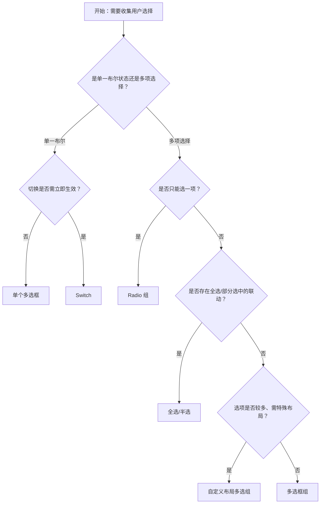

# 1. 简洁易读部份

## 1.0. 组件描述

多选框组件用于在一组可选项中进行多项选择，或单独使用时表示两种状态之间的切换。与 Switch 的区别在于：Switch 切换会直接触发状态改变；Checkbox 一般用于状态标记，需要与提交等操作配合，适合「选择后统一处理」的场景。

## 1.1. 组件构成

多选框由以下基础要素构成，可按需组合使用：

> <!-- 附图占位：建议附上一张示例图，展示多选框的基础要素（选框、标签文本）的构成关系，标注各要素名称与位置 -->

&emsp;&emsp;1. **选框** 定义可点击的勾选区域，承载选中、未选中、半选（indeterminate）三种视觉状态。

&emsp;&emsp;2. **标签文本** 表达选项含义，与选框形成可点击整体；可为空（如纯选框），但需确保语义可被识别。

---

## 1.2. 组件包含哪些不同类型

### 1.2.1 单个多选框

&emsp;**是什么**：独立的勾选控件，表示单一布尔状态（如同意协议、记住密码），需与提交等操作配合生效

> <!-- 附图占位：建议附上一张示例图，展示单个多选框（选框 + 标签）的视觉形态，以及选中与未选中的状态对比 -->

&emsp;**简单用法**：适用于「是/否」两种状态且不要求立即生效的场景；状态变更不直接提交，需用户执行主操作（如点击提交）后一并生效；可与 Switch 区分：Checkbox 强调「标记」、Switch 强调「即时切换」

&emsp;**典型场景**：同意条款、记住登录、启用/停用某项设置（延迟生效）

> <!-- 附图占位：建议附上一张场景图，展示登录表单中「记住密码」单个多选框的使用，体现状态标记与提交配合 -->

&emsp;**替代方案**：若切换需立即生效，改用 Switch

### 1.2.2 多选框组

&emsp;**是什么**：将多个平级选项组合为 Checkbox.Group，用户可勾选多项，选中值以数组形式收集

> <!-- 附图占位：建议附上一张示例图，展示多选框组（多个选框横向或纵向排列）的视觉形态，体现多选能力 -->

&emsp;**简单用法**：必须用于「可选多项、选项平级」的场景；选项数量不宜过多，建议不超过 7 项；选项间逻辑上应互斥或可多选，语义清晰

&emsp;**典型场景**：选择兴趣爱好、选择通知方式、表单多选项（如「接收哪些类型的消息」）

> <!-- 附图占位：建议附上一张场景图，展示表单中「兴趣爱好」多选框组的排列，体现多选平级选项的典型用法 -->

&emsp;**替代方案**：若只能选一项，改用 Radio；若选项有层级，改用 TreeSelect 或 Cascader

### 1.2.3 全选 / 半选

&emsp;**是什么**：通过「全选」父级 Checkbox 控制整组子项；当部分选中时父级呈半选（indeterminate）状态

> <!-- 附图占位：建议附上一张示例图，展示全选、半选、全不选三种状态下父级与子项的关系，体现 indeterminate 的视觉与联动 -->

&emsp;**简单用法**：必须用于「存在全选/全不选」需求的列表或选项组；全选勾选时子项全选，全选取消时子项全不选；部分选中时全选呈半选态；半选为纯视觉状态，不表示「第三种值」

&emsp;**典型场景**：表格批量选择、权限配置全选、筛选条件全选

> <!-- 附图占位：建议附上一张场景图，展示表格表头全选与行内多选框的联动，以及半选态的展示 -->

&emsp;**替代方案**：若无全选需求，使用普通多选框组即可

### 1.2.4 自定义布局

&emsp;**是什么**：通过 Grid 或 Flex 将多选框组按自定义行列排布，如多列、网格、与其它控件混排

> <!-- 附图占位：建议附上一张示例图，展示多选框组的多种布局（横向、纵向、多列网格）的视觉形态 -->

&emsp;**简单用法**：适用于选项较多、需节省空间或按逻辑分组的场景；布局需保证可点性，选项间距合理；同一组内对齐方式一致

&emsp;**典型场景**：偏好设置多列展示、筛选条件网格布局、表单项与多选混合排列

> <!-- 附图占位：建议附上一张场景图，展示偏好设置中多选框按 2～3 列网格排列，体现布局灵活性 -->

&emsp;**替代方案**：若选项少、无布局需求，使用默认纵向或横向排列即可

---

## 1.3. 各类型典型场景案例

### 1.3.1 单个多选框与 Switch

> <!-- 附图占位：建议附上一张对比图，左侧展示需要与提交配合的「记住密码」用 Checkbox（符合规范），右侧展示需立即生效的开关用 Switch（符合规范） -->

✅ **推荐：** 状态标记、延迟生效用 Checkbox；立即切换生效用 Switch

❌ **不推荐：** 在需立即生效的场景用 Checkbox 且无提交步骤；在需标记后统一提交的场景用 Switch

### 1.3.2 多选框组与单选框组

> <!-- 附图占位：建议附上一张对比图，左侧展示可多选的兴趣爱好用 Checkbox 组（符合规范），右侧展示只能选一项的性别用 Radio 组（符合规范） -->

✅ **推荐：** 可选多项用 Checkbox 组；只能选一项用 Radio 组

❌ **不推荐：** 在只能选一项的场景用 Checkbox 并额外限制；在可多选场景用多个 Radio 导致逻辑混乱

### 1.3.3 全选与半选

> <!-- 附图占位：建议附上一张对比图，左侧展示表格全选与行选择的正确联动（符合规范），右侧展示全选与子项无联动或半选态缺失（违反规范） -->

✅ **推荐：** 有全选需求时正确实现父子联动；部分选中时父级展示半选态

❌ **不推荐：** 全选与子项无联动；部分选中时父级仍为未选或全选态，语义不清

---

# 2. 选型指南

## 2.1 选择流程

---

# 3. 细致专业部份（交互与排版规则）

## 3.1 多操作的展示与折叠策略

多选框本身不涉及多操作折叠。若同一区域（如表格工具栏）有基于多选结果的操作（批量删除、批量导出）：

* **选择与操作分离**：多选框负责选择，操作按钮负责执行；选中项变化时，操作按钮的可用状态需同步更新。
* **操作数量**：与多选框相关的批量操作不宜过多，超出时可收纳至「更多」下拉。

> <!-- 附图占位：建议附上一张场景图，展示表格中多选与批量删除、导出等操作的配合 -->

## 3.2 危险操作（删除/清空/停用）

* **多选触发的危险操作**：当多选用于批量删除、批量停用等危险操作时，执行前必须二次确认；确认弹窗中执行按钮需使用危险样式。
* **禁用选项**：通过 disabled 可禁用单个或多选框组中的某些选项，表示不可选；禁用时需明确原因（如权限不足、业务限制）。

> <!-- 附图占位：建议附上一张场景图，展示批量删除前的二次确认弹窗，体现危险操作的保护 -->

## 3.3 摆放位置（按页面场景划分）

* **表单内**：作为表单项时，放在对应标签下方或右侧；与同组其它控件对齐。
* **列表/表格**：行内多选放在每行最左侧或与操作列相邻；表头全选放在首列表头。
* **设置/配置区块**：多选组放在对应设置项下方，与区块标题和说明文案关系明确。

> <!-- 附图占位：建议附上一张场景图，展示多选框在表单、表格、设置区块三种位置的典型摆放 -->

## 3.4 顺序与对齐逻辑

* **多选组内**：选项按逻辑顺序或使用频率排列；横向排列时从左到右，纵向排列时从上到下。
* **与其它表单项**：多选框与输入框、Select 等保持相同的标签对齐方式（左对齐标签或顶对齐标签）。
* **表格行内**：多选框列固定宽度，与操作列、数据列对齐，避免错位。

> <!-- 附图占位：建议附上一张场景图，展示多选组的选项顺序与表单项对齐 -->

## 3.5 状态与交互反馈

* **未选**：选框为空，可点击。
* **选中**：选框显示勾选标记，可点击取消。
* **半选**：仅在全选场景下，部分子项选中时父级展示；表示「部分选中」。
* **禁用**：选框与标签置灰，不可点击；禁用时不可通过点击改变状态。
* **悬停**：可点击时提供悬停反馈（如背景或边框变化），增强可点性感知。

## 3.6 视觉规范与形态选择

* **选框与标签间距**：选框与标签之间保持稳定间距，确保整体可点区域充足。
* **对齐**：多个多选框并列时，选框垂直中线对齐，标签左对齐或与选框左缘对齐。
* **长标签**：标签过长时可换行，换行后与选框保持正确对齐，不破坏可点区域。

> <!-- 附图占位：建议附上一张示例图，展示多选框的选框与标签间距、多选项对齐方式 -->

---

## 4.0. 常见问题

### 1. Checkbox 和 Switch 的区别？

- **Checkbox**：用于状态标记，通常需要与提交等操作配合后才生效；适合「勾选后统一处理」的场景。
- **Switch**：切换后立即生效；适合「开关式」的即时配置。

### 2. 多选框组和 Radio 组的区别？

- **Checkbox 组**：可选多项，选中值为数组；适用于兴趣、通知方式等可多选场景。
- **Radio 组**：只能选一项，选中值为单一值；适用于性别、唯一选项等场景。

### 3. 半选（indeterminate）是什么？

- 半选表示「部分子项选中」的中间状态，仅用于全选场景下的父级展示；不是第三种独立的值，只是视觉与交互状态。
