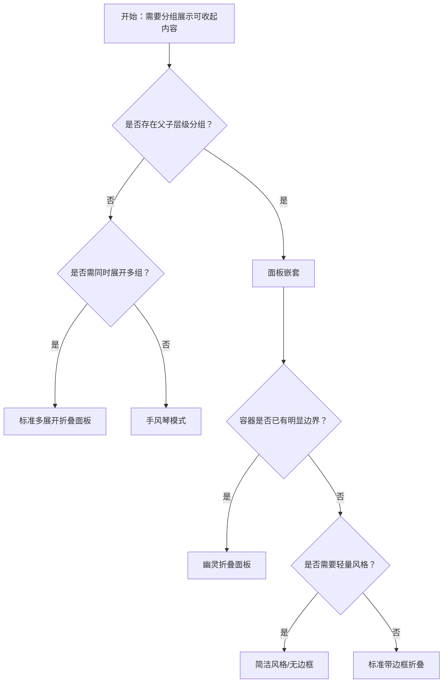

# 1. 简洁易读部份

## 1.0. 组件描述

折叠面板用于对复杂区域进行分组和隐藏，通过可展开或收起的面板来保持页面整洁，用户可按需查看摘要与详情的层级关系。

## 1.1. 组件构成

折叠面板由以下基础要素构成，可按需组合使用：

> <!-- 附图占位：建议附上一张示例图，展示折叠面板的头部、内容区、展开图标的构成关系，标注各要素名称与位置 -->

&emsp;&emsp;1. **面板头部** 展示每项的摘要或标题，是用户点击展开/收起的触发区域。

&emsp;&emsp;2. **展开图标** 指示当前面板的展开或收起状态，通常位于头部左侧或右侧。

&emsp;&emsp;3. **内容区域** 收起时隐藏，展开时显示详细内容，用于承载分组后的次要信息。

---

## 1.2. 组件包含哪些不同类型

### 1.2.1 标准多展开折叠面板

&emsp;**是什么**：可同时展开多个面板，默认的折叠展示方式

> <!-- 附图占位：建议附上一张示例图，展示多个面板、其中两个为展开态、其余为收起态，体现多面板可同时展开的视觉形态 -->

&emsp;**简单用法**：适用于各分组内容相互独立、用户需对比或同时查看多组信息的场景；默认可展开第一个面板以引导用户理解结构

&emsp;**典型场景**：常见问题 FAQ、产品规格说明、多模块配置项分组

> <!-- 附图占位：建议附上一张场景图，展示 FAQ 页面中多个问题面板同时展开的布局，体现用户可自由展开多处内容的使用方式 -->

&emsp;**替代方案**：若只需查看单组内容且不希望多处同时展开，改用手风琴模式

### 1.2.2 手风琴模式

&emsp;**是什么**：同一时刻只允许一个面板处于展开状态，展开新的会自动收起旧的

> <!-- 附图占位：建议附上一张示例图，展示手风琴模式下仅一个面板展开、其他全部收起的形态，体现互斥展开的视觉约束 -->

&emsp;**简单用法**：必须用于内容互斥、一次只需聚焦一组的场景；展开新项时需有流畅的收起与展开过渡

&emsp;**典型场景**：步骤说明、单选项的详情、层级导航的次级内容

> <!-- 附图占位：建议附上一张场景图，展示步骤说明或选项详情中「只能展开一个」的布局，体现手风琴聚焦单一内容的用法 -->

&emsp;**替代方案**：若用户需同时查看多组内容，改用标准多展开模式

### 1.2.3 面板嵌套

&emsp;**是什么**：在某个折叠面板的内容区域内再嵌套一级折叠面板，形成多级折叠结构

> <!-- 附图占位：建议附上一张示例图，展示外层面板展开后内含内层折叠项的嵌套结构，体现层级折叠关系 -->

&emsp;**简单用法**：必须用于存在明显父子层级的信息分组；嵌套层级不宜超过两层，否则易造成认知负担

&emsp;**典型场景**：分类下的子分类、大模块下的子模块配置

> <!-- 附图占位：建议附上一张场景图，展示分类详情中外层「产品 A」展开后内含「规格」「参数」等内层折叠的布局 -->

&emsp;**替代方案**：若层级扁平，改用单层标准折叠；若层级过深，考虑改用树形控件或分页

### 1.2.4 简洁风格（无边框）

&emsp;**是什么**：去除边框与背景的轻量化折叠样式，视觉更简洁

> <!-- 附图占位：建议附上一张示例图，展示无边框、无背景色的折叠面板形态，与带边框版本对比体现简约风格 -->

&emsp;**简单用法**：适用于页面整体风格偏轻量、或折叠区作为次要辅助内容时；需确保展开图标和标题仍足够醒目

&emsp;**典型场景**：侧边说明、辅助信息区块、仪表盘中的可收起模块

> <!-- 附图占位：建议附上一张场景图，展示侧边栏或卡片内简洁风格折叠与整体轻量设计的一致性 -->

&emsp;**替代方案**：若需要明确边界和分组感，改用带边框的标准折叠

### 1.2.5 幽灵折叠面板

&emsp;**是什么**：背景透明、无边框的折叠面板，与容器融为一体

> <!-- 附图占位：建议附上一张示例图，展示幽灵风格折叠面板在深色或浅色背景上的透明融底效果 -->

&emsp;**简单用法**：适用于嵌入卡片、弹窗等已有明显容器边界的场景；需保证标题与内容的可读性

&emsp;**典型场景**：弹窗内的可折叠详情、卡片内的扩展说明

> <!-- 附图占位：建议附上一张场景图，展示弹窗或卡片内幽灵折叠与父容器的融合效果 -->

&emsp;**替代方案**：若需要独立边界或品牌感，改用带边框或简洁风格

### 1.2.6 可折叠触发区域定制

&emsp;**是什么**：通过配置仅图标可点击、或仅标题可点击、或整项禁用折叠，控制用户的触发范围

> <!-- 附图占位：建议附上一张示例图，展示「仅图标可点」「仅标题可点」「禁用折叠」三种触发区的区别 -->

&emsp;**简单用法**：标题区域包含链接或操作按钮时，建议仅图标可折叠以避免误触；若某项为固定展示，则禁用折叠

&emsp;**典型场景**：带操作按钮的列表项、固定公示条款、可选展开的配置说明

> <!-- 附图占位：建议附上一张场景图，展示标题含「更多」按钮时仅图标触发折叠的布局，避免点击操作误触折叠 -->

&emsp;**替代方案**：若标题区无交互元素，使用默认整头可点击

### 1.2.7 额外节点（头部右侧内容）

&emsp;**是什么**：在面板头部右侧预留区域，可放置操作按钮、状态标签等辅助内容

> <!-- 附图占位：建议附上一张示例图，展示头部右侧「编辑」「状态标签」等额外节点的位置与布局 -->

&emsp;**简单用法**：用于与当前面板相关的快捷操作或状态展示；额外内容不宜过长，以免挤压标题空间

&emsp;**典型场景**：配置项的编辑入口、任务的状态标签、展开时的快捷操作

> <!-- 附图占位：建议附上一张场景图，展示配置面板头部右侧「编辑」按钮与标题的配合布局 -->

&emsp;**替代方案**：若无头部操作需求，可不使用额外节点

---

## 1.3. 各类型典型场景案例

### 1.3.1 多展开与手风琴

> <!-- 附图占位：建议附上一张对比图，左侧展示 FAQ 等多展开场景（符合规范），右侧展示同一场景误用手风琴导致无法对比查看（不推荐） -->

✅ **推荐：** 需同时查看多组内容时使用多展开模式

❌ **不推荐：** 在需对比多组信息的场景中强制使用手风琴

### 1.3.2 嵌套层级

> <!-- 附图占位：建议附上一张对比图，左侧展示两层嵌套的清晰层级（符合规范），右侧展示三层以上嵌套造成混乱（不推荐） -->

✅ **推荐：** 嵌套不超过两层，且父子关系语义明确

❌ **不推荐：** 过深嵌套导致结构难以理解

### 1.3.3 触发区域与操作

> <!-- 附图占位：建议附上一张对比图，左侧展示标题含操作时仅图标触发折叠（符合规范），右侧展示整头可点导致操作与折叠冲突（不推荐） -->

✅ **推荐：** 标题含操作时，将折叠触发区设为仅图标

❌ **不推荐：** 在标题可点击折叠的同时放置易误触的操作按钮

---

# 2. 选型指南

## 2.1 选择流程

---

# 3. 细致专业部份（交互与排版规则）

## 3.1 面板数量与标题设计

* **面板数量**：同一折叠组内面板数量不宜过多，建议控制在 5～10 项内；超出时考虑分页或改用树形控件。
* **标题 brevity**：面板标题应简洁、具概括性，避免长句；标题过长时可截断并配合 Tooltip 展示全文。
* **默认展开**：若希望引导用户关注某组内容，可默认展开对应面板；手风琴模式下默认展开第一项较常见。

> <!-- 附图占位：建议附上一张场景图，展示面板数量适中、标题简洁且默认展开首项的布局，体现数量与标题设计原则 -->

## 3.2 展开图标与触发反馈

* **图标位置**：图标可置于标题左侧或右侧，同一产品内应统一；Ant Design 默认在左侧，部分设计系统偏好右侧。
* **状态反馈**：展开与收起时图标应有旋转或形态变化，使用户能清晰感知当前状态。
* **可点击范围**：整头可点时，悬停应提供视觉反馈（如背景色或下划线），确保用户理解可点击。

> <!-- 附图占位：建议附上一张对比图，展示展开/收起两种状态下图标的旋转变化与悬停反馈，传达清晰的状态指示 -->

## 3.3 内容区排版与容量

* **内容密度**：内容区不宜过长，单面板内容超出两屏时考虑分页或拆成多个面板。
* **内边距**：内容区需保持合适内边距，与头部视觉对齐；带边框与无边框风格的内边距可略有差异。
* **动态内容**：若内容包含表格、表单等动态元素，展开时需保证布局稳定，避免抖动。

> <!-- 附图占位：建议附上一张场景图，展示内容区内表格或表单的合理内边距与布局对齐，体现内容区排版原则 -->

## 3.4 顺序与分组逻辑

* **逻辑排序**：面板顺序应按业务逻辑或重要性排列，如按步骤、按模块、按使用频率等。
* **视觉分隔**：面板之间应有清晰分隔（边框或留白），避免视觉粘连。
* **关键信息前置**：用户最常查看的内容所在面板应靠前，或通过默认展开引导。

> <!-- 附图占位：建议附上一张场景图，展示按步骤或模块顺序排列的面板及分隔方式，体现排序与分组逻辑 -->

## 3.5 状态与动效

* **过渡动画**：展开与收起应有平滑过渡，避免内容突兀出现或消失；动画时长不宜过长。
* **加载状态**：若内容异步加载，展开时需提供骨架屏或加载提示，加载完成后再展示真实内容。
* **禁用状态**：不可折叠的面板应明确展示禁用态（如收起图标置灰或隐藏），不可让用户误以为可点击。

> <!-- 附图占位：建议附上一张场景图，展示展开时的过渡动效与异步加载时的骨架屏，体现状态与动效处理 -->

## 3.6 无障碍与可访问性

* **键盘操作**：面板头部需支持键盘聚焦与 Enter/Space 触发展开收起。
* **语义标记**：使用正确的 ARIA 属性标识展开/收起状态，便于辅助技术读取。
* **焦点管理**：展开时焦点可保留在头部或移入内容区，需根据业务场景统一策略。

> <!-- 附图占位：建议附上一张说明图，展示键盘焦点在折叠头部时的视觉提示及与 ARIA 状态的对应关系 -->

---

## 4.0. 常见问题

### 1. 手风琴和标准多展开的区别是什么

- **标准多展开**：用户可以同时展开多个面板，适合需要对比或多处查看的场景。
- **手风琴**：同一时刻只能展开一个面板，展开新的会自动收起旧的，适合聚焦单一内容的场景。

### 2. 何时使用幽灵或简洁风格

- **幽灵风格**：当折叠区嵌入在已有明显边界的容器（如卡片、弹窗）内时，使用幽灵风格可避免重复边框与背景。
- **简洁风格**：当页面整体偏轻量、或折叠为辅助内容时，无边框能降低视觉负担。

### 3. 折叠面板和 Tabs 如何选择

- **折叠面板**：内容以「摘要 + 详情」形式呈现，用户通过展开查看详情，适合层级式的说明或配置。
- **Tabs**：各 Tab 内容地位相当，切换为平级切换，适合并列模块或视图的切换。
