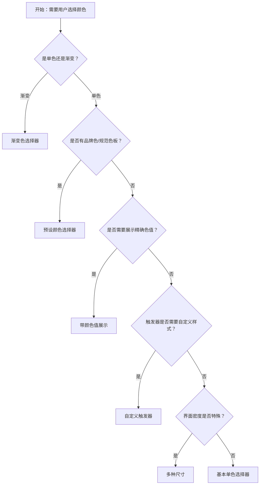

# 1. 简洁易读部份

## 1.0. 组件描述

颜色选择器用于让用户自定义选择颜色，支持单色与渐变色，可配置预设颜色、透明度、颜色格式等。当用户需要自定义颜色（如主题色、标注色、图表色）时使用此组件。

## 1.1. 组件构成

颜色选择器由以下基础要素构成，可按需组合使用：

> <!-- 附图占位：建议附上一张示例图，展示颜色选择器的基础要素（触发器色块、弹出面板、色板/滑块、预设区）的构成关系，标注各要素名称与位置 -->

&emsp;&emsp;1. **触发器** 展示当前选中颜色，点击或悬停后展开选择面板；默认以色块形式展示，可自定义为按钮或文本。

&emsp;&emsp;2. **弹出面板** 承载色板、透明度滑块、颜色格式输入等控件，支持自定义布局与扩展。

&emsp;&emsp;3. **色板与滑块** 提供可视化选色区域和明度、饱和度、透明度等调节滑块。

&emsp;&emsp;4. **预设颜色** 可选区域，展示常用颜色供快速选择，减少精细调节步骤。

---

## 1.2. 组件包含哪些不同类型

### 1.2.1 基本单色选择器

&emsp;**是什么**：通过色板与滑块选择单一颜色，支持透明度调节，选中颜色以色块形式回填到触发器

> <!-- 附图占位：建议附上一张示例图，展示基本单色选择器（色块触发器 + 色板 + 透明度滑块）的视觉形态 -->

&emsp;**简单用法**：适用于无预设、需自由选色的场景；支持 hex、rgb、hsb 等格式；触发器默认展示当前颜色色块，可配置是否展示颜色值文本

&emsp;**典型场景**：主题色配置、标注颜色、图表颜色、通用颜色输入

> <!-- 附图占位：建议附上一张场景图，展示配置页中主题色选择器的使用，体现基本单色选色的典型用法 -->

&emsp;**替代方案**：若颜色范围固定且数量少，可用 Select 或一组色块；若需选渐变，用渐变色模式

### 1.2.2 渐变色选择器

&emsp;**是什么**：支持选择或编辑线性渐变，可设置多个色标及其位置，输出渐变定义供样式使用

> <!-- 附图占位：建议附上一张示例图，展示渐变色选择器（渐变条 + 色标 + 位置调节）的视觉形态 -->

&emsp;**简单用法**：必须用于「需要渐变效果」的场景；可添加、删除、移动色标；支持透明度；输出格式需与使用场景匹配（如 CSS gradient）

&emsp;**典型场景**：背景渐变、图表渐变、卡片渐变、装饰性渐变

> <!-- 附图占位：建议附上一张场景图，展示设计工具或配置页中渐变背景的选择与编辑，体现渐变选的典型用法 -->

&emsp;**替代方案**：若仅需单色，用基本单色选择器

### 1.2.3 预设颜色选择器

&emsp;**是什么**：在弹出面板中提供预设颜色列表，用户可快速点选，也可在色板上微调

> <!-- 附图占位：建议附上一张示例图，展示预设颜色选择器（色板 + 预设色块列表）的视觉形态，体现快速选色能力 -->

&emsp;**简单用法**：适用于有品牌色、常用色或规范色板的场景；预设色需与业务强相关；用户可从预设中选择，亦可继续在色板上自定义；预设可按组分类展示

&emsp;**典型场景**：品牌色板、图表配色、主题预设、设计规范中的推荐色

> <!-- 附图占位：建议附上一张场景图，展示配置页中预设品牌色与自定义色的结合使用，体现预设提升效率 -->

&emsp;**替代方案**：若无固定色板，使用基本单色选择器；若仅能用预设不能自定义，可用一组色块点击选择

### 1.2.4 自定义触发器

&emsp;**是什么**：将颜色选择器的触发器替换为自定义元素（如按钮、文本、图标），保留弹出选色面板的交互

> <!-- 附图占位：建议附上一张示例图，展示自定义触发器（如「选择颜色」按钮、带颜色的文本）的形态，与默认色块触发器对比 -->

&emsp;**简单用法**：必须用于需要适配特定布局、文案或样式的场景；自定义触发器需能传达「可点击选色」的语义；弹出面板与默认一致或可自定义

&emsp;**典型场景**：工具栏中的颜色按钮、表格内联颜色编辑、与其它控件混排的选色入口

> <!-- 附图占位：建议附上一张场景图，展示编辑器中「字体颜色」按钮触发颜色选择器，体现自定义触发器在工具栏中的用法 -->

&emsp;**替代方案**：若空间充足且无特殊样式需求，使用默认色块触发器

### 1.2.5 带颜色值展示

&emsp;**是什么**：触发器除色块外展示颜色编码（如 #1677ff、rgb(22,119,255)），便于复制或精确校对

> <!-- 附图占位：建议附上一张示例图，展示带颜色值文本的触发器（色块 + HEX/RGB 文本）的视觉形态 -->

&emsp;**简单用法**：适用于需要传达精确色值的场景（如开发、设计协作）；可配置显示格式（hex、rgb、hsb）；文本可选择、可复制，便于传递

&emsp;**典型场景**：设计稿标注、开发配置、色彩规范文档

> <!-- 附图占位：建议附上一张场景图，展示设计工具中颜色选择器附带色值展示，便于开发实现 -->

&emsp;**替代方案**：若用户不关心色值，仅展示色块即可

### 1.2.6 多种尺寸

&emsp;**是什么**：触发器支持 large、medium、small 三种尺寸，适配不同界面密度

> <!-- 附图占位：建议附上一张示例图，展示大、中、小三种尺寸的色块触发器并列对比 -->

&emsp;**简单用法**：大尺寸适合强调或宽松布局；中尺寸为默认，适合常规表单；小尺寸适合紧凑区域（如表格、工具栏）；同一页面内同类选色控件应统一尺寸

&emsp;**典型场景**：表单配置用中号、工具栏用小号、独立配置区用大号

> <!-- 附图占位：建议附上一张场景图，展示表单与工具栏中不同尺寸颜色选择器的使用，体现尺寸与场景的匹配 -->

&emsp;**替代方案**：无特殊密度需求时使用默认中号

---

## 1.3. 各类型典型场景案例

### 1.3.1 单色与渐变

> <!-- 附图占位：建议附上一张对比图，左侧展示单色场景（如主题色）使用基本单色选择器（符合规范），右侧展示渐变场景（如背景渐变）使用渐变色选择器（符合规范） -->

✅ **推荐：** 单色需求用单色模式；渐变需求用渐变色模式

❌ **不推荐：** 在需渐变时强用单色无法表达；在仅需单色时使用渐变增加复杂度

### 1.3.2 预设与自定义

> <!-- 附图占位：建议附上一张对比图，左侧展示有品牌色时提供预设并允许微调（符合规范），右侧展示无预设时仅提供自由选色（符合规范） -->

✅ **推荐：** 有规范色板时提供预设，同时保留自定义能力；无规范时以自由选色为主

❌ **不推荐：** 预设色与业务无关或过多干扰；在需严格品牌色时缺少预设导致选择偏差

### 1.3.3 触发器与尺寸

> <!-- 附图占位：建议附上一张对比图，左侧展示自定义触发器在工具栏中适配布局（符合规范），右侧展示尺寸与所在区域密度匹配（符合规范） -->

✅ **推荐：** 触发器形态与所在布局协调；尺寸与界面密度一致

❌ **不推荐：** 默认色块在狭窄空间过大或过小；同一区域颜色选择器尺寸混乱

---

# 2. 选型指南

## 2.1 选择流程

---

# 3. 细致专业部份（交互与排版规则）

## 3.1 多操作的展示与折叠策略

颜色选择器通常作为单一控件使用。若同一区域有多个颜色相关配置（如前景色、背景色、边框色）：

* **并列展示**：颜色配置项不多时可并列展示多个颜色选择器，每个有清晰标签。
* **分组收纳**：颜色相关配置过多时，可收纳至「颜色设置」展开区或弹窗中。

> <!-- 附图占位：建议附上一张场景图，展示多个颜色配置项（前景色、背景色）的排列方式 -->

## 3.2 危险操作（删除/清空/停用）

* **清除颜色**：允许清除时，用户可将已选颜色清空；适用于「颜色可选」的场景；清除为轻量操作，不视为危险。
* **禁用**：通过 disabled 禁用颜色选择器，表示当前不可修改颜色；禁用时需明确原因。

> <!-- 附图占位：建议附上一张示例图，展示颜色选择器的清除与禁用状态 -->

## 3.3 摆放位置（按页面场景划分）

* **表单内**：作为表单项时，放在对应标签下方或右侧，与其它控件对齐。
* **工具栏**：作为绘图、编辑工具之一时，放在工具栏中，与其它工具按钮统一排列。
* **配置面板**：在配置页或侧边栏中，与相关配置项（如字体、大小）分组展示。

> <!-- 附图占位：建议附上一张场景图，展示颜色选择器在表单、工具栏、配置面板三种位置的典型摆放 -->

## 3.4 顺序与对齐逻辑

* **表单内**：与同组表单项保持相同对齐；若有多个颜色配置，按业务逻辑排列（如前景色在前、背景色在后）。
* **工具栏**：与其它工具按钮按使用频率或逻辑分组排列，颜色选择器可与其他格式类工具（如字体、字号）相邻。

> <!-- 附图占位：建议附上一张场景图，展示工具栏中颜色选择器与其它工具的顺序 -->

## 3.5 状态与交互反馈

* **默认**：触发器展示当前颜色色块，边框清晰，可点击。
* **展开**：点击或悬停后弹出面板，色板与滑块可交互；触发器保持高亮或边框变化表示展开态。
* **选色中**：拖拽色板或滑块时实时更新预览；支持 hex、rgb、hsb 格式切换。
* **选中完成**：选择完成后可点击外部关闭面板；触发器更新为新颜色。
* **禁用**：触发器置灰，不可点击；不展开面板。

## 3.6 视觉规范与形态选择

* **色块对比**：触发器色块与背景需有足够对比，深色背景上的浅色、浅色背景上的深色需可辨。
* **弹出位置**：面板默认在触发器下方展开，空间不足时可配置为上方或侧方；避免被裁剪或遮挡。
* **触发方式**：默认点击展开；在需快速预览的场景可配置为悬停展开，需权衡误触与效率。

> <!-- 附图占位：建议附上一张示例图，展示色块与背景的对比、弹出位置及触发方式的选择 -->

---

## 4.0. 常见问题

### 1. 颜色选择器何时用预设、何时用自由选色？

- **预设**：有品牌色、规范色板或常用色时，提供预设可提升效率；建议预设与自由选色并存。
- **自由选色**：无固定色板或需精细调节时，以色板与滑块为主。

### 2. 点击触发和悬停触发的区别？

- **点击**：需明确点击才展开，避免误触；适合表单、配置等低频操作。
- **悬停**：移入即展开，适合需要快速预览、频繁切换颜色的场景（如设计工具）；需注意误触与焦点管理。
