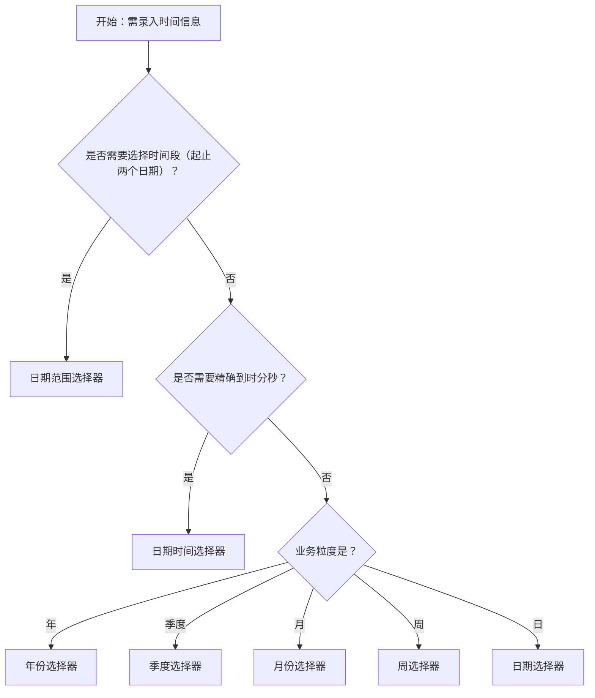

# 1. 简洁易读部份

## 1.0. 组件描述

日期选择框用于让用户输入或选择一个日期，点击输入框即可弹出日期面板，通过点选或输入完成日期录入，适用于需要精确日期的表单场景。

## 1.1. 组件构成

日期选择框由以下基础要素构成，可按需组合使用：

> <!-- 附图占位：建议附上一张示例图，展示日期选择框的三个基础要素（输入框、日期图标、弹出面板）的构成关系，标注各要素名称与位置 -->

&emsp;&emsp;1. **输入框** 展示已选日期或占位提示，支持键盘输入日期；点击可唤起弹出面板。

&emsp;&emsp;2. **日期图标** 用于强化「选择日期」的语义，通常置于输入框右侧后缀位置。

&emsp;&emsp;3. **弹出面板** 承载日历或时间选择界面，用户通过点选完成选择；支持预设范围、自定义页脚等扩展。

---

## 1.2. 组件包含哪些不同类型

### 1.2.1 日期选择器

&emsp;**是什么**：选择具体日（年-月-日），是最常用的日期录入形式

> <!-- 附图占位：建议附上一张示例图，展示日期选择器（默认 picker=date）的视觉形态，包含输入框与展开的日期面板 -->

&emsp;**简单用法**：用于需要精确到某天的业务；可直接点选或输入；失去焦点或选择后即生效（可按需开启确认按钮）

&emsp;**典型场景**：出生日期、预约日期、合同签署日期

> <!-- 附图占位：建议附上一张场景图，展示表单中「预约日期」使用日期选择器的布局，体现其作为基础日期录入的典型用法 -->

&emsp;**替代方案**：若只需年到月，改用月份选择器；若需时间段，改用日期范围选择器

### 1.2.2 月份选择器

&emsp;**是什么**：选择年月（年-月），不精确到具体日

> <!-- 附图占位：建议附上一张示例图，展示月份选择器的面板形态（按月份陈列），体现其与日期选择器的层级差异 -->

&emsp;**简单用法**：必须用于只关心月份、不关心具体日的场景；格式通常为 YYYY-MM

&emsp;**典型场景**：入职月份、账期、统计周期选择

> <!-- 附图占位：建议附上一张场景图，展示筛选区中「统计月份」使用月份选择器的布局 -->

&emsp;**替代方案**：若需精确到日，改用日期选择器；若需季度维度，改用季度选择器

### 1.2.3 年份选择器

&emsp;**是什么**：仅选择年份，层级最粗的时间粒度

> <!-- 附图占位：建议附上一张示例图，展示年份选择器的面板形态（按年份陈列），体现其极简选择方式 -->

&emsp;**简单用法**：必须用于只关心年份的场景；格式通常为 YYYY；常用于筛选或统计维度

&emsp;**典型场景**：毕业年份、成立年份、年度报表筛选

> <!-- 附图占位：建议附上一张场景图，展示筛选区中「年度」使用年份选择器的布局 -->

&emsp;**替代方案**：若需精确到月或日，改用月份选择器或日期选择器

### 1.2.4 季度选择器

&emsp;**是什么**：选择年份和季度（如 2024-Q1）

> <!-- 附图占位：建议附上一张示例图，展示季度选择器的面板形态（Q1-Q4 陈列），体现季度维度选择 -->

&emsp;**简单用法**：必须用于按季度统计、汇报或筛选的业务；格式通常为 YYYY-Qn

&emsp;**典型场景**：季度报表、季度目标、财务周期

> <!-- 附图占位：建议附上一张场景图，展示筛选区中「统计季度」使用季度选择器的布局 -->

&emsp;**替代方案**：若需精确到月，改用月份选择器；若业务无季度概念，改用月份选择器

### 1.2.5 周选择器

&emsp;**是什么**：选择所属周，以周为最小粒度

> <!-- 附图占位：建议附上一张示例图，展示周选择器的面板形态（以周为单位高亮），体现周维度的选择方式 -->

&emsp;**简单用法**：必须用于以周为统计或计划单位的场景；格式通常为 YYYY-Wn 或类似形式；需注意周起始日与业务是否一致

&emsp;**典型场景**：周报、排班、教学周

> <!-- 附图占位：建议附上一张场景图，展示排班或周报选择「所属周」的使用方式 -->

&emsp;**替代方案**：若业务以日或月为主，改用日期选择器或月份选择器

### 1.2.6 日期范围选择器

&emsp;**是什么**：一次性选择起止日期，形成连续时间段

> <!-- 附图占位：建议附上一张示例图，展示日期范围选择器的输入框形态（起止日期用分隔符连接）及展开的双面板或范围选择界面 -->

&emsp;**简单用法**：必须用于需要「开始日期 + 结束日期」的场景；支持预设范围（如最近 7 天、本月）；可允许部分留空（如「至今」）

&emsp;**典型场景**：筛选时间范围、活动周期、出差日期、合同有效期

> <!-- 附图占位：建议附上一张场景图，展示数据筛选区中日期范围选择器与「查询」按钮组合的布局，体现预设范围与起止选择的配合 -->

&emsp;**替代方案**：若只需单个日期，改用日期选择器

### 1.2.7 日期时间选择器

&emsp;**是什么**：在日期基础上增加时分秒选择，形成完整时间点

> <!-- 附图占位：建议附上一张示例图，展示日期时间选择器的面板形态（日期区 + 时间区），体现日期与时间的组合录入 -->

&emsp;**简单用法**：必须用于需要精确到时分秒的场景；需配合确认按钮或明确交互逻辑（选择即确认或需点击确认）；支持禁用部分日期或时间

&emsp;**典型场景**：会议时间、预约时段、任务截止时间、日志时间戳

> <!-- 附图占位：建议附上一张场景图，展示预约表单中「预约时间」使用日期时间选择器的布局，体现日期与时间一体化选择 -->

&emsp;**替代方案**：若只需日期不需时间，改用日期选择器；若只需时间不需日期，改用 TimePicker

---

## 1.3. 各类型典型场景案例

### 1.3.1 日期选择器

> <!-- 附图占位：建议附上一张对比图，左侧展示表单中单一日期间使用日期选择器（符合规范），右侧展示只需月份的场合误用日期选择器（违反规范） -->

✅ **推荐：** 需要精确到某一天时使用日期选择器

❌ **不推荐：** 只需年月或季度时仍使用日期选择器，增加无效操作

### 1.3.2 月份 / 年份 / 季度选择器

> <!-- 附图占位：建议附上一张对比图，左侧展示统计筛选使用月份选择器（符合规范），右侧展示同类场景使用日期选择器（违反规范） -->

✅ **推荐：** 业务粒度与选择器粒度一致（月用月份、年用年份、季度用季度）

❌ **不推荐：** 业务只需要年月或季度，却使用日期选择器让用户多选一步

### 1.3.3 日期范围选择器

> <!-- 附图占位：建议附上一张对比图，左侧展示筛选时间范围使用范围选择器 + 预设（符合规范），右侧展示用两个独立日期选择器拼接（违反规范） -->

✅ **推荐：** 筛选或录入时间范围时使用日期范围选择器，并可提供常用预设

❌ **不推荐：** 用两个独立的日期选择器拼「起止日期」，导致校验与交互割裂

### 1.3.4 日期时间选择器

> <!-- 附图占位：建议附上一张对比图，左侧展示需要精确时刻的场景使用日期时间选择器（符合规范），右侧展示仅需日期的场景使用日期时间选择器（违反规范） -->

✅ **推荐：** 需要精确到时分秒时使用日期时间选择器

❌ **不推荐：** 只需日期时使用日期时间选择器，增加无谓操作负担

---

# 2. 选型指南

## 2.1 选择流程

---

# 3. 细致专业部份（交互与排版规则）

## 3.1 多操作的展示与折叠策略

日期选择器通常作为单控件使用，不涉及多操作折叠。但在筛选栏中与「查询」「重置」等按钮并存时：

* **输入优先**：日期选择器作为核心筛选条件，应放在按钮前、视线优先落点。
* **预设优先**：若存在「今天」「本周」「本月」等预设，应置于面板内易于发现的位置；范围选择器尤其适合预设。
* **避免堆叠**：同一筛选区不宜同时使用多个不同粒度的日期选择器（如既有日期又有月份），应通过切换或 Tab 区分场景。

> <!-- 附图占位：建议附上一张场景图，展示筛选栏中日期范围选择器、预设快捷项与「查询」按钮的合理排列 -->

## 3.2 危险操作（删除/清空/停用）

* **清除**：日期选择器支持清除按钮（allowClear），用于一键清空已选日期；清除属于轻量可逆操作，无需二次确认。
* **禁用**：通过 `disabled` 或 `disabledDate` / `disabledTime` 禁用部分日期或时间；禁用样式需清晰可辨，不可与可选日期混淆。
* **留空**：范围选择器可配置 `allowEmpty`，允许起止任一侧留空（如「至今」）；需在文案或帮助信息中说明留空含义。

> <!-- 附图占位：建议附上一张示例图，展示日期选择器清除按钮的视觉效果，以及禁用日期的灰色不可选状态 -->

## 3.3 摆放位置（按页面场景划分）

* **表单字段**：与标签左对齐或右对齐，按表单整体布局（水平/垂直）统一；长表单中可考虑吸底提交区，日期选择器随表单滚动。
* **筛选区**：通常置于筛选条件区前端或中部，与筛选项、下拉框同排；操作按钮（查询、重置）置于末位。
* **表格内**：若表格列内嵌日期选择，需考虑弹出面板不被表格边界遮挡，必要时调整 placement 或 getPopupContainer。

> <!-- 附图占位：建议附上一张场景图，展示表单中日期选择器与标签、其他输入控件的对齐关系 -->

## 3.4 顺序与对齐逻辑

* **范围选择器**：起止顺序固定为「开始 → 结束」，不可颠倒；分隔符（如波浪线、箭头）需清晰区分起止。
* **与按钮顺序**：在筛选场景中，推荐顺序为：日期选择器 → 其他筛选控件 → 查询 → 重置；主操作（查询）靠右。
* **多筛选条件**：按业务重要性从左到右排列，日期类筛选若为核心条件则靠前。

> <!-- 附图占位：建议附上一张场景图，展示筛选区「开始日期 | 结束日期 | 查询 | 重置」的从左到右排列顺序 -->

## 3.5 状态与交互反馈

* **默认**：输入框可点击、可输入，占位符说明格式或示例。
* **展开**：弹出面板时，输入框应有聚焦或展开态视觉区分；面板需有明确关闭方式（点击外部、选择完成、确认按钮）。
* **选中**：已选日期在面板内高亮；范围选择器需明确标出起止及中间范围。
* **禁用**：禁用日期/时间使用灰色等降级样式，不可点击；整体禁用时输入框置灰。
* **错误/警告**：校验失败时，输入框展示错误或警告态；错误信息置于输入框下方或通过 Tooltip 提示。
* **格式错误**：输入非法格式时，失焦可尝试解析为合法日期或保留输入并提示；行为需与业务约定一致。

> <!-- 附图占位：建议附上一张状态示意图，展示日期选择器的默认、展开、选中、禁用、错误五种状态的视觉差异 -->

## 3.6 视觉规范与形态选择

* **形态变体**：Ant Design DatePicker 支持 outlined、filled、borderless、underlined 等形态；与页面整体输入控件风格保持一致。
* **尺寸**：与同区域输入框、按钮尺寸统一（large/medium/small）；表单内通常使用 medium。
* **格式**：日期展示格式需符合地域习惯（如中国常用 YYYY-MM-DD）；格式与 placeholder 一致，减少输入歧义。
* **国际化**：周起始日、月份名称、快捷文案等需随 locale 配置；多语言场景下需验证各语言的日期格式与面板布局。

> <!-- 附图占位：建议附上一张示例图，展示 DatePicker 的 outlined 与 underlined 两种形态对比 -->

---

## 4.0. 常见问题

### 1. 日期选择器和日期范围选择器如何区分使用？

- **日期选择器**：选择一个具体日期，用于出生日期、预约日期、截止日期等单点场景。

- **日期范围选择器**：选择起止两个日期形成时间段，用于筛选时间范围、活动周期、出差日期等区间场景。当业务需要「从某日到某日」时，应使用范围选择器而非两个独立日期选择器。

### 2. 何时使用月份、年份、季度选择器？

- 当业务统计或筛选的粒度是「月」「年」或「季度」时，应选用对应选择器，避免用户多选一步具体日期。例如：月度报表用月份选择器，年度总结用年份选择器，季度目标用季度选择器。

### 3. 日期时间选择器和纯日期选择器如何选？

- 需要精确到时分秒（如会议时间、预约时段）时用日期时间选择器；只需日期（如出生日、合同日）时用日期选择器，避免无谓的时间选择负担。
