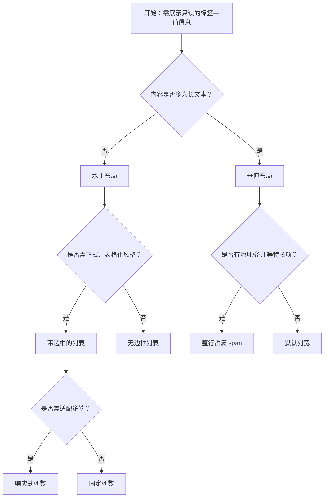

# 1. 简洁易读部份

## 1.0. 组件描述

描述列表用于以「标签—值」成对的形式展示多个只读字段，适用于详情页、配置概览等需要结构化呈现属性信息的场景。

## 1.1. 组件构成

描述列表由以下基础要素构成，可按需组合使用：

> <!-- 附图占位：建议附上一张示例图，展示描述列表的标签、冒号、内容值的构成关系，标注各要素名称与位置 -->

&emsp;&emsp;1. **标签** 描述字段含义，通常为灰色或次要色，用于区分「是什么」。

&emsp;&emsp;2. **冒号** 连接标签与内容，可选配置是否显示；保持标签与内容的视觉关联。

&emsp;&emsp;3. **内容值** 展示实际数据，为主要阅读对象，需保证可读性与对比度。

---

## 1.2. 组件包含哪些不同类型

### 1.2.1 水平布局（默认）

&emsp;**是什么**：标签与内容横向排列，一行可展示多组「标签—值」，是最常见的展示方式

> <!-- 附图占位：建议附上一张示例图，展示水平布局下标签在左、内容在右、一行多组的网格形态 -->

&emsp;**简单用法**：适用于字段数量适中、标签与内容均较短的信息展示；常见于详情页、表单只读预览

&emsp;**典型场景**：用户信息、订单详情、配置概览

> <!-- 附图占位：建议附上一张场景图，展示用户详情页中水平排列的姓名、电话、地址等字段，体现常规详情展示方式 -->

&emsp;**替代方案**：若标签或内容较长导致一行放不下，改用垂直布局

### 1.2.2 垂直布局

&emsp;**是什么**：标签在上、内容在下，每组垂直排列，更适合长文本或标签较多的场景

> <!-- 附图占位：建议附上一张示例图，展示垂直布局下每组「标签 / 内容」上下排列的形态 -->

&emsp;**简单用法**：必须用于内容值较长、或需要整行占满的字段；每行通常展示一组或少量组

&emsp;**典型场景**：长地址、多行备注、配置详情的大段说明

> <!-- 附图占位：建议附上一张场景图，展示配置详情中地址、备注等长文本字段采用垂直布局的排版方式 -->

&emsp;**替代方案**：若字段短且数量多，改用水平布局可提高空间利用率

### 1.2.3 带边框的列表

&emsp;**是什么**：每个「标签—值」单元带边框和背景，形成表格化外观，分组感更强

> <!-- 附图占位：建议附上一张示例图，展示带边框与背景的描述列表，与无边框版本对比体现表格化分组感 -->

&emsp;**简单用法**：适用于需要强调结构化、或与表格风格统一的详情页；边框与背景需与页面整体风格协调

&emsp;**典型场景**：订单明细、合同条款、正式文档式信息展示

> <!-- 附图占位：建议附上一张场景图，展示订单详情或合同信息采用带边框描述列表的正式感 -->

&emsp;**替代方案**：若追求轻量简洁，改用无边框列表

### 1.2.4 响应式列数

&emsp;**是什么**：根据不同屏幕宽度自动调整每行的列数，保证小屏可读性

> <!-- 附图占位：建议附上一张对比图，展示桌面端一行三列与移动端一行一列的响应式变化 -->

&emsp;**简单用法**：必须用于需要适配多端的产品；小屏下建议减少列数、避免标签与内容拥挤

&emsp;**典型场景**：需在手机、平板、PC 上查看的详情页

> <!-- 附图占位：建议附上一张场景图，展示同一详情页在桌面与移动端的列数变化，体现响应式适配 -->

&emsp;**替代方案**：若仅服务单一端，可使用固定列数

### 1.2.5 整行占满（span）

&emsp;**是什么**：某个项的内容跨多列或铺满整行，用于长文本或需独占一行的字段

> <!-- 附图占位：建议附上一张示例图，展示某项内容跨列铺满整行的布局形态 -->

&emsp;**简单用法**：必须用于地址、备注、配置说明等长文本字段；避免将长内容强制挤在单列

&emsp;**典型场景**：详情页中的「详细地址」「备注说明」「配置信息」

> <!-- 附图占位：建议附上一张场景图，展示地址或备注字段独占整行的布局，体现 span 的合理用法 -->

&emsp;**替代方案**：若内容较短，使用默认单列即可

### 1.2.6 不同尺寸

&emsp;**是什么**：可设置大、中、小三种尺寸，以适配不同容器或信息密度需求

> <!-- 附图占位：建议附上一张示例图，展示大、中、小三种尺寸下的内边距与字号差异 -->

&emsp;**简单用法**：大尺寸用于标题级详情区块；小尺寸用于紧凑列表或卡片内；中尺寸为默认通用选择

&emsp;**典型场景**：主详情区用大尺寸、侧边摘要用小尺寸

> <!-- 附图占位：建议附上一张场景图，展示主区与侧边栏采用不同尺寸的描述列表，体现尺寸与场景的匹配 -->

&emsp;**替代方案**：若无明确密度需求，使用默认中等尺寸

---

## 1.3. 各类型典型场景案例

### 1.3.1 水平与垂直布局

> <!-- 附图占位：建议附上一张对比图，左侧展示短字段用水平布局（符合规范），右侧展示长文本强用水平布局导致拥挤（不推荐） -->

✅ **推荐：** 短字段用水平布局，长文本用垂直布局

❌ **不推荐：** 长地址或备注强行挤在单列水平布局中

### 1.3.2 带边框与无边框

> <!-- 附图占位：建议附上一张对比图，左侧展示正式文档类场景用带边框（符合规范），右侧展示轻量辅助信息用带边框显得冗余（不推荐） -->

✅ **推荐：** 正式、结构化强的场景用带边框；轻量辅助信息用无边框

❌ **不推荐：** 在轻量场景中过度使用带边框列表

### 1.3.3 整行占满

> <!-- 附图占位：建议附上一张对比图，左侧展示长地址用整行占满（符合规范），右侧展示同样内容被挤在单列（不推荐） -->

✅ **推荐：** 地址、备注等长文本使用整行占满

❌ **不推荐：** 长文本被强制挤在单列导致换行混乱

---

# 2. 选型指南

## 2.1 选择流程

---

# 3. 细致专业部份（交互与排版规则）

## 3.1 标签与内容的层级

* **标签样式**：标签应采用次要色或较浅字重，与内容形成清晰层级；不可喧宾夺主。
* **内容突出**：内容值为主要阅读对象，需保证字号、对比度足够；关键数值可适当加粗或高亮。
* **冒号**：冒号连接标签与内容，可根据设计规范选择显示或隐藏；若显示，与标签、内容间距需统一。

> <!-- 附图占位：建议附上一张示例图，展示标签与内容的层级关系及冒号间距，传达清晰的视觉层级 -->

## 3.2 列数与对齐

* **列数选择**：桌面端常见 2～4 列，移动端建议 1～2 列；列数过多会导致单列过窄。
* **标签对齐**：同一列表中，所有标签应右对齐或左对齐统一，便于竖向扫描。
* **内容换行**：内容过长时可换行，需保证与下一行标签的视觉分隔，避免粘连。

> <!-- 附图占位：建议附上一张场景图，展示多列描述列表中标签对齐与内容换行的排版规则 -->

## 3.3 标题与操作区

* **标题**：若描述列表有整体标题，应置于顶部，与操作区（如「编辑」）配合时，操作区通常位于标题右侧。
* **操作区**：编辑、导出等操作宜放在描述列表的头部区域，而非散落于各项之间。

> <!-- 附图占位：建议附上一张场景图，展示描述列表标题与右上角「编辑」按钮的布局关系 -->

## 3.4 空值与占位

* **空值展示**：当某项无数据时，应统一展示占位文案（如「暂无」「-」），避免留白造成歧义。
* **敏感信息**：敏感字段可做脱敏或占位处理，需与业务规则一致。

> <!-- 附图占位：建议附上一张示例图，展示空值与脱敏字段的统一占位方式 -->

## 3.5 响应式与断点

* **断点配置**：可按 xs、sm、md、lg 等断点配置不同列数，确保小屏下单列或两列展示合理。
* **顺序**：小屏下垂直排列时，字段顺序应按重要性排列，关键信息优先展示。

> <!-- 附图占位：建议附上一张对比图，展示不同断点下列数变化与字段顺序的适配策略 -->

## 3.6 与表格、表单的配合

* **与表格**：描述列表适合详情视图；表格适合列表视图；二者可配合使用（如表格行点击进入描述列表详情）。
* **与表单**：描述列表为只读展示；若需编辑，应在同一视图中切换为表单，或通过「编辑」进入编辑态。

> <!-- 附图占位：建议附上一张场景图，展示列表—详情—编辑的流转中，描述列表作为只读详情的角色 -->

---

## 4.0. 常见问题

### 1. 描述列表和表格的区别是什么

- **描述列表**：以「标签—值」对的形式展示，适合详情页、属性概览，强调可读性与层级。
- **表格**：以行列形式展示多行同类数据，适合列表对比与排序筛选。

### 2. 水平布局和垂直布局如何选择

- **水平布局**：标签与内容均较短时使用，一行可放多组，空间利用率高。
- **垂直布局**：内容较长或需整行展示时使用，避免单列过于拥挤。

### 3. 何时使用带边框的列表

- **带边框**：需要正式、结构化强的展示，或与表格风格统一时使用。
- **无边框**：追求轻量、简洁，或作为辅助信息展示时使用。
