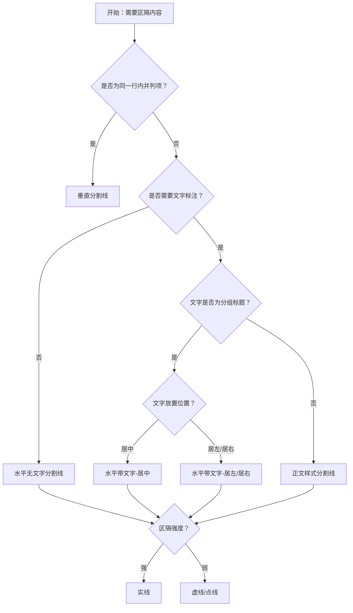

# 1. 简洁易读部份

## 1.0. 组件描述

分割线用于区隔内容，在视觉上建立信息块之间的边界感，帮助用户区分不同章节或逻辑单元。

## 1.1. 组件构成

分割线由以下基础要素构成，可按需组合使用：

> <!-- 附图占位：建议附上一张示例图，展示分割线的三个基础要素（线段、文本区域、连接条）的构成关系，标注各要素名称与位置 -->

&emsp;&emsp;1. **线段** 定义分割线的视觉形态，可为实线、虚线或点线，用于区隔前后内容。

&emsp;&emsp;2. **文本区域** 用于承载章节标题或说明文字，可居中、靠左或靠右放置，可为空。

&emsp;&emsp;3. **连接条** 线段在文本两侧的延伸部分，与文本共同组成完整分割线。

---

## 1.2. 组件包含哪些不同类型

### 1.2.1 水平无文字分割线

&emsp;**是什么**：一条横跨容器的水平线段，不含文字，用于纯视觉区隔

> <!-- 附图占位：建议附上一张示例图，展示水平无文字分割线的视觉形态，体现其在两段文本之间的纯线条区隔效果 -->

&emsp;**简单用法**：必须用于仅需视觉区隔、无须标题提示的场景；适合段落间、卡片组间、表单区块间的分隔

&emsp;**典型场景**：长文本段落分段、表单字段组划分、列表项之间的分隔

> <!-- 附图占位：建议附上一张场景图，展示多段文本之间用水平无文字分割线分隔的布局，体现章节间的清晰边界 -->

&emsp;**替代方案**：若需强调章节名称或引导阅读，改用带文字分割线

### 1.2.2 水平带文字分割线（居中）

&emsp;**是什么**：水平线段中间嵌入标题文字，文字默认居中

> <!-- 附图占位：建议附上一张示例图，展示文字居中的带文字分割线形态，体现线段与文字的融合关系 -->

&emsp;**简单用法**：必须用于需要明确标注章节名称或引导用户注意力的区隔；文字应为简短标题或说明语

&emsp;**典型场景**：表单内「基本信息」「联系方式」等分组标题、文章内大章节划分

> <!-- 附图占位：建议附上一张场景图，展示表单中「基本信息」「联系方式」分组使用居中文字分割线的布局，体现分组与标题的对应关系 -->

&emsp;**替代方案**：若文字需靠左或靠右以顺应阅读流向，改用标题位置可调的分割线

### 1.2.3 水平带文字分割线（居左/居右）

&emsp;**是什么**：水平线段中文字靠左或靠右放置，顺应不同阅读场景的视线流向

> <!-- 附图占位：建议附上一张示例图，展示文字靠左与靠右两种分割线形态的对比 -->

&emsp;**简单用法**：必须用于需要明确文字起点、与左侧或右侧内容建立关联的场景；居左常用于左对齐布局，居右常用于右对齐或结尾说明

&emsp;**典型场景**：左对齐表单的分组标题、右侧辅助说明的分隔

> <!-- 附图占位：建议附上一张场景图，展示左对齐表单中用居左文字分割线作为分组标题的布局 -->

&emsp;**替代方案**：若内容居中且无明确左右倾向，改用居中分割线

### 1.2.4 垂直分割线

&emsp;**是什么**：竖直线段，用于在行内元素之间建立区隔

> <!-- 附图占位：建议附上一张示例图，展示垂直分割线在行内文字或链接之间的竖线形态 -->

&emsp;**简单用法**：必须用于同一行内的多个并列项之间；不可用于跨多行的区块分隔；两侧需留出合理间距避免拥挤

&emsp;**典型场景**：表格操作列中的「编辑 | 删除 | 查看」、导航栏中的「登录 | 注册」、行内标签之间的分隔

> <!-- 附图占位：建议附上一张场景图，展示表格操作列中「编辑」「删除」「查看」之间用垂直分割线分隔的布局，体现行内分隔的典型用法 -->

&emsp;**替代方案**：若为多行区块分隔，改用水平分割线

### 1.2.5 实线分割线

&emsp;**是什么**：线段为连续实线，视觉最强烈，区隔感最明确

> <!-- 附图占位：建议附上一张示例图，展示实线分割线（solid）的视觉形态，与虚线和点线对比体现其最强区隔感 -->

&emsp;**简单用法**：必须用于需要强区隔、强调前后内容独立性的场景；为默认形态

&emsp;**典型场景**：主要章节划分、重要表单区块分隔、页脚与正文分隔

> <!-- 附图占位：建议附上一张场景图，展示正文与页脚之间用实线分割的布局，体现强区隔的典型用法 -->

&emsp;**替代方案**：若区隔不宜过强、希望弱化边界感，改用虚线或点线

### 1.2.6 虚线 / 点线分割线

&emsp;**是什么**：线段为虚线或点线，视觉弱于实线，区隔感较柔和

> <!-- 附图占位：建议附上一张示例图，展示虚线（dashed）和点线（dotted）分割线的视觉形态，与实线对比体现弱化效果 -->

&emsp;**简单用法**：必须用于次级区隔、不希望打断阅读连贯性的场景；虚线略强于点线，点线最弱

&emsp;**典型场景**：次要分组、可选填写区域的边界、轻量级分隔

> <!-- 附图占位：建议附上一张场景图，展示次要表单分组使用虚线分割线的布局，体现弱化区隔的用法 -->

&emsp;**替代方案**：若需要明确边界或主要章节划分，改用实线

### 1.2.7 正文样式分割线

&emsp;**是什么**：分割线中的文字采用正文样式，而非标题样式，视觉更轻量

> <!-- 附图占位：建议附上一张示例图，展示正文样式分割线（plain）与标题样式分割线的文字对比 -->

&emsp;**简单用法**：必须用于文字仅为辅助说明、不需要强调为标题的场景；可配合居左/居中/居右使用

&emsp;**典型场景**：简短说明性文字作为分隔、不强调层级的辅助标注

> <!-- 附图占位：建议附上一张场景图，展示使用正文样式分割线承载简短说明的布局，体现轻量标注的用法 -->

&emsp;**替代方案**：若文字需要作为分组标题被强调，改用默认标题样式

---

## 1.3. 各类型典型场景案例

### 1.3.1 水平无文字分割线

> <!-- 附图占位：建议附上一张对比图，左侧展示段落间用水平无文字分割线合理区隔（符合规范），右侧展示同一区域滥用多条分割线导致视觉割裂（违反规范） -->

✅ **推荐：** 用水平无文字分割线区隔逻辑独立的区块，保持适度间距

❌ **不推荐：** 在同一区域内堆叠过多分割线，造成视觉割裂、阅读负担

### 1.3.2 带文字分割线

> <!-- 附图占位：建议附上一张对比图，左侧展示带文字分割线用于表单分组标题（符合规范），右侧展示用分割线承载过长描述文字导致拥挤（违反规范） -->

✅ **推荐：** 带文字分割线的文字应简短、可作为分组标题独立理解

❌ **不推荐：** 用分割线文字承载长段描述，导致线条断裂感强、阅读困难

### 1.3.3 垂直分割线

> <!-- 附图占位：建议附上一张对比图，左侧展示行内操作项之间用垂直分割线分隔（符合规范），右侧展示在多行区块之间使用垂直分割线导致布局混乱（违反规范） -->

✅ **推荐：** 垂直分割线仅用于同一行内的并列项之间

❌ **不推荐：** 在多行区块或竖向堆叠内容之间使用垂直分割线

### 1.3.4 线型与层级

> <!-- 附图占位：建议附上一张对比图，左侧展示主要区分用实线、次要区分用虚线（符合规范），右侧展示所有分割线形态一致导致层级不清（违反规范） -->

✅ **推荐：** 主要章节用实线，次要分组用虚线或点线，形成清晰层级

❌ **不推荐：** 所有分割线形态一致，无法区分主次层级

---

# 2. 选型指南

## 2.1 选择流程

---

# 3. 细致专业部份（交互与排版规则）

## 3.1 多区块的展示与分隔策略

在同一页面或表单内存在多个逻辑区块时，需按以下逻辑决定分割线的使用：

* **主次层级**：主要章节或关键分组使用实线、带文字分割线；次要分组使用虚线或点线，或仅用间距代替。
* **数量控制**：同一可视区域内分割线不宜过多；若区块超过 4 个，可考虑用卡片、折叠等承载，减少分割线数量。
* **替代方案**：若仅需弱区隔，优先考虑用间距（如 Space 组件）代替分割线，保持界面简洁。

> <!-- 附图占位：建议附上一张场景图，展示表单中主要分组用实线带文字分割线、次要分组用虚线或无分割线仅用间距的层级策略 -->

## 3.2 不宜使用分割线的情形

以下情形不推荐使用分割线，否则会损害可用性或视觉一致性：

* **替代标题**：分割线不能替代明确的标题组件；若需强调章节名称，应使用标题 + 可选分割线的组合。
* **替代间距**：当仅需呼吸感时，用间距即可，不必强行使用分割线。
* **行内过多**：同一行内垂直分割线不宜超过 4 条，否则会造成视觉拥挤、难以扫读。

> <!-- 附图占位：建议附上一张对比图，展示用间距代替分割线的简洁效果 vs 滥用分割线的拥挤效果 -->

## 3.3 摆放位置（按页面场景划分）

* **段落与章节之间**：用于长文本、说明文档中不同章节的区隔，通常水平、可带章节标题。

* **表单分组**：用于表单内「基本信息」「联系方式」等逻辑分组的标题区隔，文字宜简短、居中或居左。

* **列表与卡片**：用于列表项之间、卡片组之间的分隔，通常为水平无文字；若项数很多，可考虑仅对关键分组使用分割线。

* **表格操作列**：用于行内操作按钮或链接之间的分隔，必须使用垂直分割线。

* **页脚与正文**：用于正文内容与页脚、版权信息的区隔，通常为水平实线、无文字。

> <!-- 附图占位：建议附上一张场景图，展示不同页面位置（表单分组、表格操作列、页脚）使用分割线的典型布局 -->

## 3.4 顺序与对齐逻辑

* **水平带文字**：文字与线段两侧应对齐于同一基线；居左时文字与左侧内容对齐，居中时文字与容器中心对齐，居右时与右侧内容对齐。
* **垂直分割线**：两侧内容应保持视觉平衡；分割线两侧的留白应一致，避免一侧过密。
* **间距一致**：同一页面内相同层级的区块，分割线上下间距应保持一致，形成视觉节奏。

> <!-- 附图占位：建议附上一张示意图，展示水平带文字分割线的居左/居中/居右对齐规则与垂直分割线两侧留白一致的原则 -->

## 3.5 状态与交互反馈

分割线为静态展示组件，通常无交互状态；在以下情形需注意：

* **响应式**：在小屏幕上，过长的水平分割线可能影响阅读；可考虑缩短或隐藏次要分割线。
* **深色/浅色主题**：分割线颜色需与背景形成足够对比，确保可见性。
* **无障碍**：分割线若仅作装饰，应从语义上标记为装饰性，避免被读屏软件误读为内容分隔。

## 3.6 视觉规范与形态选择

* **线型选择**：实线用于强区隔，虚线用于次级区隔，点线用于最弱区隔；同一层级内线型应一致。
* **颜色**：分割线颜色通常继承主题的边框色或分割线色，需与背景、文字形成清晰对比。
* **间距**：分割线上下间距建议采用 8 的倍数（如 16px、24px），与整体 spacing 体系一致。
* **文字样式**：带文字分割线中，标题样式用于强调分组名，正文样式用于辅助说明。

> <!-- 附图占位：建议附上一张示例图，展示实线、虚线、点线在相同上下间距下的视觉对比与层级关系 -->

---

## 4.0. 常见问题

### 1. 水平分割线和垂直分割线分别适合什么场景？

- **水平分割线**：适合段落之间、表单分组之间、区块与区块之间的区隔，阅读视线自上而下，水平线顺应这一流向。

- **垂直分割线**：适合同一行内的并列项之间（如操作按钮、导航链接），用竖线在横向排列中建立区隔，不打断纵向阅读。

### 2. 实线、虚线、点线如何选择？

- **实线**：区隔感最强，用于主要章节或重要分组。
- **虚线**：区隔感中等，用于次要分组或可选填写区域。
- **点线**：区隔感最弱，用于轻量级分隔或装饰性分隔。

### 3. 带文字分割线的文字应该多长？

- 文字应简短，通常为 2～8 个字符的分组标题或简短说明；过长文字会破坏分割线的视觉连贯性，建议改用独立标题组件。
