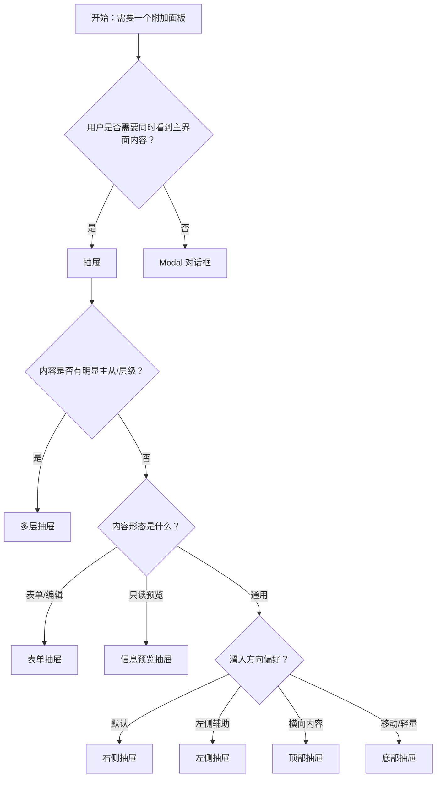

# 1. 简洁易读部份

## 1.0. 组件描述

抽屉（Drawer）组件是一种从屏幕边缘滑出的浮层面板，用于在不离开当前页面的前提下，承载附加内容、表单或详情，用户完成操作后可以平滑回到原任务流。

## 1.1. 组件构成

抽屉由以下基础要素构成，可按需组合使用：

> <!-- 附图占位：建议附上一张示例图，展示抽屉的遮罩层、面板容器、标题栏、内容区、页脚操作区与关闭按钮的构成关系，标注各要素名称与位置 -->

&emsp;&emsp;1. **遮罩层** 覆盖主内容区域，降低背景干扰并支持点击关闭，可选模糊或禁用关闭。

&emsp;&emsp;2. **面板容器** 定义抽屉的宽高与滑入方向，承载全部抽屉内容。

&emsp;&emsp;3. **标题栏** 展示抽屉主题或当前任务说明，可含关闭按钮与额外操作区。

&emsp;&emsp;4. **内容区** 承载表单、列表、详情等主要信息，支持滚动。

&emsp;&emsp;5. **页脚操作区** 放置「取消」「确定」等操作按钮，用于提交或关闭。

&emsp;&emsp;6. **关闭入口** 标题栏的关闭按钮或遮罩点击，用于退出抽屉。

---

## 1.2. 组件包含哪些不同类型

### 1.2.1 右侧抽屉（right）

&emsp;**是什么**：从屏幕右侧滑入的抽屉，为最常用的默认形式

> <!-- 附图占位：建议附上一张示例图，展示从右侧滑入的抽屉形态，体现其作为默认布局的通用性 -->

&emsp;**简单用法**：适用于无特殊布局偏好的多数场景；内容以纵向列表或表单为主；宽度通常为默认或大号预设值

&emsp;**典型场景**：编辑表单、详情预览、创建子对象

> <!-- 附图占位：建议附上一张场景图，展示列表行点击「编辑」后右侧滑出的表单抽屉，体现典型工作流 -->

&emsp;**替代方案**：若内容高度远大于宽度，考虑顶部或底部抽屉；若需从左侧展开，改用左侧抽屉

### 1.2.2 左侧抽屉（left）

&emsp;**是什么**：从屏幕左侧滑入的抽屉，常用于导航或辅助面板

> <!-- 附图占位：建议附上一张示例图，展示从左侧滑入的抽屉形态，体现其与右侧抽屉的对称关系 -->

&emsp;**简单用法**：适用于需要与主内容左右并列的场景；常用于筛选、导航或控制面板；注意与主导航方向区分

&emsp;**典型场景**：筛选条件、样式控制、附加导航

> <!-- 附图占位：建议附上一张场景图，展示「控制展示样式」时左侧滑出的配置面板，体现辅助控制用途 -->

&emsp;**替代方案**：若为简单设置，可考虑 Popover；若需强聚焦确认，改用 Modal

### 1.2.3 顶部抽屉（top）

&emsp;**是什么**：从屏幕顶部向下滑入的抽屉，适合横向或宽幅内容

> <!-- 附图占位：建议附上一张示例图，展示从顶部滑入的抽屉形态，体现其适合横向展示的布局特点 -->

&emsp;**简单用法**：适用于需要较大横向展示空间的内容；高度可配置；适合时间线、日历、宽表格等

&emsp;**典型场景**：时间线查看、日历选择、横向表单

> <!-- 附图占位：建议附上一张场景图，展示点击「选择日期」后顶部滑出的日历抽屉，体现横向空间的利用 -->

&emsp;**替代方案**：若内容需居中强聚焦，改用 Modal；若仅需简单选择，考虑下拉或 Popover

### 1.2.4 底部抽屉（bottom）

&emsp;**是什么**：从屏幕底部向上滑入的抽屉，常用于移动端或轻量操作

> <!-- 附图占位：建议附上一张示例图，展示从底部滑入的抽屉形态，体现其适合单手操作的移动端交互 -->

&emsp;**简单用法**：适用于移动端或需从底部触达的场景；内容不宜过高；适合选择、确认等轻量任务

&emsp;**典型场景**：移动端选择器、底部操作菜单、简短表单

> <!-- 附图占位：建议附上一张场景图，展示移动端底部滑出的「选择城市」抽屉，体现底部抽屉的典型用法 -->

&emsp;**替代方案**：若为复杂表单或需强聚焦，改用 Modal

### 1.2.5 表单抽屉

&emsp;**是什么**：以表单录入为主的抽屉，用于创建或编辑附加内容

> <!-- 附图占位：建议附上一张示例图，展示抽屉内表单的布局结构（标题、表单项、底部操作按钮），体现表单抽屉的典型形态 -->

&emsp;**简单用法**：必须在抽屉内完成录入后提交或取消；表单较长时内容区需可滚动；页脚放置「取消」「提交」等按钮

&emsp;**典型场景**：新建项目、编辑配置、添加成员

> <!-- 附图占位：建议附上一张场景图，展示「新建项目」抽屉内的表单与底部操作区，体现表单抽屉的完整流程 -->

&emsp;**替代方案**：若表单非常复杂或需全屏专注，考虑整页表单；若仅为单字段，可用 Popover

### 1.2.6 信息预览抽屉

&emsp;**是什么**：以只读展示为主的抽屉，用于快速预览对象概要

> <!-- 附图占位：建议附上一张示例图，展示信息预览抽屉的内容结构（头像、基本信息、描述列表），体现只读预览的形态 -->

&emsp;**简单用法**：内容以只读展示为主，可含少量跳转或操作；支持点击遮罩关闭；不宜承载过重编辑任务

&emsp;**典型场景**：用户信息预览、订单概要、文档摘要

> <!-- 附图占位：建议附上一张场景图，展示列表行点击后滑出的用户信息预览抽屉，体现快速预览的用途 -->

&emsp;**替代方案**：若需强聚焦或复杂操作，改用 Modal；若信息极简，可用 Popover 或 Tooltip

### 1.2.7 多层抽屉

&emsp;**是什么**：在抽屉内再次打开新抽屉，用于多层级、多分支的任务流

> <!-- 附图占位：建议附上一张示例图，展示多层抽屉的层级关系（主抽屉与内嵌子抽屉），体现推动与层级效果 -->

&emsp;**简单用法**：必须用于存在明显层级关系的流程；子抽屉打开时，父抽屉可适当后推以体现层级；层级不宜过深，建议不超过 2–3 层

&emsp;**典型场景**：主从表编辑、分步创建、嵌套配置

> <!-- 附图占位：建议附上一张场景图，展示在「编辑订单」抽屉内再打开「选择商品」子抽屉的流程，体现多层抽屉的使用场景 -->

&emsp;**替代方案**：若层级关系不清或层级过深，考虑拆分为独立页面或分步 Modal

---

## 1.3. 各类型典型场景案例

### 1.3.1 抽屉与 Modal 选择

> <!-- 附图占位：建议附上一张对比图，左侧展示需保持上下文时使用抽屉（符合规范），右侧展示需强聚焦确认时使用 Modal（符合规范） -->

✅ **推荐：** 需在保持主界面上下文的前提下做附加任务时使用抽屉；需强聚焦、明确确认或阻断式操作时使用 Modal

❌ **不推荐：** 简单确认用抽屉；复杂表单或强阻断场景误用抽屉替代 Modal

### 1.3.2 滑入方向选择

> <!-- 附图占位：建议附上一张对比图，展示不同方向抽屉适用的内容形态：右侧适合表单/列表，顶部适合横向内容，底部适合移动端选择 -->

✅ **推荐：** 按内容形态与设备类型选择滑入方向；无特殊需求时默认右侧

❌ **不推荐：** 仅因视觉效果随意更换方向，导致与用户预期不符

### 1.3.3 表单与预览区分

> <!-- 附图占位：建议附上一张对比图，左侧展示表单抽屉带提交/取消按钮（符合规范），右侧展示预览抽屉以只读信息为主（符合规范） -->

✅ **推荐：** 表单抽屉含明确提交与取消；预览抽屉以展示为主，操作轻量

❌ **不推荐：** 预览抽屉承载复杂编辑；表单抽屉缺少明确操作入口

---

# 2. 选型指南

## 2.1 选择流程

---

# 3. 细致专业部份（交互与排版规则）

为保持抽屉使用顺畅、不打断主任务流，请参考以下排版和交互规则：

## 3.1 遮罩与关闭行为

* **遮罩**：默认显示半透明遮罩，突出抽屉内容；可配置点击遮罩是否关闭；特殊场景可关闭遮罩或使用模糊效果。
* **关闭入口**：标题栏需提供明确的关闭按钮；支持键盘 Esc 关闭；若内容可丢失，点击遮罩关闭可提升效率。
* **关闭确认**：若抽屉内存在未保存内容，关闭前应提示用户确认，避免误操作丢失数据。

> <!-- 附图占位：建议附上一张场景图，展示抽屉的遮罩、关闭按钮与点击遮罩关闭的交互关系 -->

## 3.2 尺寸与布局

* **宽度/高度**：右侧与左侧抽屉使用宽度，默认约 378px，大号约 736px；顶部与底部抽屉使用高度，按内容量配置。
* **可调整**：若用户需自定义阅读或操作空间，可启用拖拽调整抽屉尺寸。
* **内容区**：内容超出时内容区可滚动，标题与页脚固定，避免整体滚动。

> <!-- 附图占位：建议附上一张示意图，展示默认宽度与大号宽度的对比，以及可拖拽调整的效果 -->

## 3.3 标题与操作区

* **标题**：必须清晰表达当前任务（如「新建项目」「编辑配置」），不可留空或过于笼统。
* **额外操作**：常用次要操作可放在标题右侧（如「更多」「帮助」），与关闭按钮区分。
* **页脚**：主操作（如「提交」）与取消按钮应明确区分；主操作靠右或作为视觉焦点。

> <!-- 附图占位：建议附上一张示例图，展示标题、额外操作区与页脚按钮的布局，体现 Ant Design 规范中的建议位置 -->

## 3.4 加载与状态反馈

* **加载状态**：内容异步加载时，应显示骨架屏或加载指示，避免空白闪烁。
* **提交反馈**：提交中可禁用按钮并显示加载态；成功后关闭抽屉并刷新主列表或给出 Message 提示。
* **错误处理**：提交失败时在抽屉内展示错误提示，不自动关闭抽屉，方便用户修正。

> <!-- 附图占位：建议附上一张场景图，展示抽屉内的加载状态与提交后的反馈流程 -->

## 3.5 焦点与可访问性

* **焦点管理**：抽屉打开时焦点应移入抽屉，关闭后焦点回到触发元素，避免焦点丢失。
* **键盘**：支持 Esc 关闭；表单内支持 Tab 导航。
* **可访问性**：标题、关闭按钮、操作按钮需具备合适的语义与可识别性，支持屏幕阅读器。

> <!-- 附图占位：建议附上一张示意图，展示抽屉打开与关闭时的焦点流转路径 -->

## 3.6 多层与渲染位置

* **多层抽屉**：子抽屉打开时，父抽屉可适当后推以表现层级；层级不宜过深。
* **渲染位置**：默认挂载在 body；若需在指定容器内展示（如避免被其他层遮挡），可配置挂载节点。
* **关闭顺序**：关闭时应从最内层依次关闭，保证动画与状态一致。

> <!-- 附图占位：建议附上一张场景图，展示多层抽屉的推动效果与关闭顺序 -->

---

## 4.0. 常见问题

### 1. 抽屉和 Modal 的区别是什么？

- **抽屉（Drawer）**：从屏幕边缘滑入，覆盖部分主内容，用户仍可感知主界面存在，适合附加任务、表单编辑、信息预览。
- **Modal（对话框）**：居中浮层，强聚焦，适合需要用户明确确认或中断当前流程的场景。

### 2. 何时用右侧、何时用左侧抽屉？

- **右侧抽屉**：默认选择，适用于大多数表单、详情、创建类场景。
- **左侧抽屉**：适用于与主内容左右并列的辅助面板，如筛选、样式控制、附加导航。

### 3. 多层抽屉何时使用？

- 当任务存在明显主从或层级关系（如主表与子表、多级配置）时，可使用多层抽屉。
- 层级不宜超过 2–3 层，过多层级会增加理解成本，可考虑拆分为独立流程或页面。
