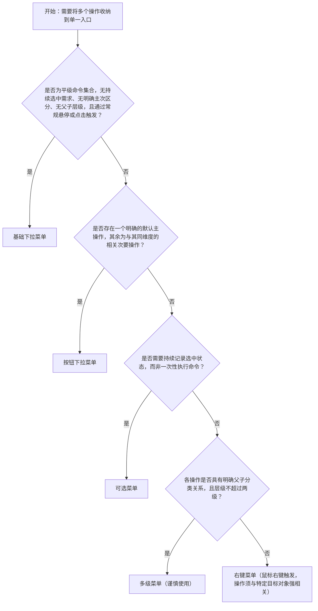

# 1. 简洁易读部份

## 1.0. 组件描述

下拉菜单组件以单一触发入口收纳一组相关操作命令，在用户主动触发后展开浮层列表，避免界面操作区过载，并确保用户始终在当前上下文中完成任务决策。

## 1.1. 组件构成

下拉菜单由以下基础要素构成，可按需组合使用：

> <!-- 附图占位：建议附上一张示例图，展示下拉菜单展开状态下五个基础要素（触发区域、展开箭头、菜单面板、菜单项、分割线）的构成关系，用引线标注各要素名称与位置，体现各要素在完整组件中的层级对应关系 -->

&emsp;&emsp;1. **触发区域** 用户交互以展开菜单的元素，可为文字链接、按钮或图标按钮；必须通过向下箭头图标明确传达「可展开」的语义，不可依赖用户探索来发现菜单入口。

&emsp;&emsp;2. **菜单面板** 触发后浮出的容器，承载全部操作项；默认向触发区域下方弹出，视口空间不足时自动调整弹出方向，确保面板始终完整可见。

&emsp;&emsp;3. **菜单项** 面板内每一行可执行的操作条目，是用户最终触发操作的交互单元；可包含文字、图标、快捷键标注，或三者任意组合。

&emsp;&emsp;4. **分割线** 在语义不同的操作类别之间插入视觉边界，将同类操作归组，辅助用户快速扫描和定位目标操作。

&emsp;&emsp;5. **子菜单箭头** 当菜单项含有下级子菜单时，右侧以箭头图标提示用户该项可继续展开，引导用户进入下一操作层级。

---

## 1.2. 组件包含哪些不同类型

### 1.2.1 基础下拉菜单

&emsp;**是什么**：最常见的下拉菜单形态，由文字链接、图标或轻量按钮触发，展开后呈现一组平级操作命令列表，用于在不占用界面固定空间的前提下收纳多个同类操作

> <!-- 附图占位：建议附上一张示例图，展示基础下拉菜单的完整形态：文字触发入口（含向下箭头）展开后的平级菜单列表（含分割线分组），标注触发区域与菜单面板的层级对应关系，体现最基础的展开收纳结构 -->

&emsp;**简单用法**：必须用于收纳同一业务维度下的多个平级操作命令；触发区域必须通过向下箭头图标传达「可展开」语义；单层菜单项数量建议控制在三至八个；语义差异较大的操作分组必须使用分割线隔开

&emsp;**典型场景**：表格行末的「更多」操作入口（含编辑、复制、归档、删除）、工具栏中优先级较低的辅助操作集合、页面头部的次要功能快捷入口

> <!-- 附图占位：建议附上一张场景图，展示数据表格行最右侧「更多」触发入口展开后，列出「编辑」「复制」「归档」与红色「删除」操作项、并以分割线将危险操作与常规操作隔开的完整菜单形态，体现基础下拉菜单减少界面噪音的收纳方式 -->

&emsp;**替代方案**：若操作只有一至两个且为高频操作，直接外露为独立按钮；若操作涉及从列表选取值而非执行命令，改用选择器

### 1.2.2 按钮下拉菜单

&emsp;**是什么**：左侧为可直接执行的主操作按钮，右侧通过竖线分隔出专门展开下拉的触发区域，两部分在视觉上形成整体，同时承载主操作的直接执行与次操作的收纳展开

> <!-- 附图占位：建议附上一张示例图，展示按钮下拉菜单的整体形态：左侧主操作文字区域 + 竖线分割 + 右侧下拉箭头区域，标注左侧「点击直接执行」与右侧「展开次要操作」的功能分工，体现主次操作整合在同一视觉单元的结构特征 -->

&emsp;**简单用法**：必须用于「一个明确默认主操作 + 若干相关次要操作」的场景；左侧承载最常用或推荐的操作；右侧收纳与主操作同维度的备选次要操作；左右两部分在语义上必须属于同一操作维度，不可将无关联操作强行整合

&emsp;**典型场景**：保存与另存为、发布与定时发布、提交与提交并继续创建

> <!-- 附图占位：建议附上一张场景图，展示「发布」主操作按钮（左侧直接触发）与右侧展开「定时发布」「存为草稿」次要操作的按钮下拉菜单形态，体现主次操作整合后左右功能分区的视觉布局与业务逻辑 -->

&emsp;**替代方案**：若各操作重要程度相当、无明确默认项，改用基础下拉菜单统一收纳；若主次操作语义无关联，改用独立按钮分别放置

### 1.2.3 可选菜单

&emsp;**是什么**：菜单项支持选中与取消选中两种状态，展开后通过勾号等视觉标记持续记录并呈现当前生效的选项，用于需要跨操作周期保留选中状态的筛选条件或模式切换

> <!-- 附图占位：建议附上一张示例图，展示可选菜单展开后部分菜单项左侧带勾号（已选中）、部分无勾号（未选中）的视觉状态差异，标注勾号与文字的位置关系，体现选中与未选中两种形态的明确视觉区分 -->

&emsp;**简单用法**：必须用于记录持续生效的选中状态，而非执行一次性命令；必须通过勾号等视觉标记清晰标识当前选中项；同一菜单内单选与多选模式不可混用

&emsp;**典型场景**：表格列的显示与隐藏控制、图表数据维度的筛选切换、视图模式切换（列表视图、卡片视图、甘特图）

> <!-- 附图占位：建议附上一张场景图，展示表格右上角「列设置」入口展开后，以勾号标识当前显示列与已隐藏列、用户可逐一勾选或取消以控制列可见性的交互形态，体现可选菜单在持续状态管理场景中的使用方式 -->

&emsp;**替代方案**：若选项为互斥单选且需直观对比，改用单选框组或分段控制器；若需要用户反复对比再决策，改用对话框内的多选框列表

### 1.2.4 多级菜单

&emsp;**是什么**：菜单项含有下级子菜单，用户悬停父级菜单项后向侧面展开细分操作列表，形成最多两级的层级结构，用于操作具有明确父子分类关系的场景

> <!-- 附图占位：建议附上一张示例图，展示一级菜单项右侧带向右箭头指示符、鼠标悬停后向右展开二级子菜单的视觉形态，标注一级与二级菜单面板的层叠位置关系与弹出方向，体现父子层级的视觉表达方式 -->

&emsp;**简单用法**：必须仅在操作具有明确父子分类关系时使用；层级深度不得超过两级；每个父级菜单项本身必须具有明确的类别含义，不得仅作为无实意的路径占位节点存在

&emsp;**典型场景**：「导出」下分「导出为表格」「导出为文档」「导出为图片」；「移动到」下分具体目标目录列表

> <!-- 附图占位：建议附上一张场景图，展示一级菜单「导出」父级项悬停后，向右展开「导出为表格」「导出为文档」「导出为图片」三个二级子操作项的完整形态，体现具有明确分类关系时使用多级菜单收纳的视觉结构 -->

&emsp;**替代方案**：若层级超过两级，改用独立操作页面、抽屉或树形控件承载；若子操作不足三个且分类关系不明显，改用平铺的基础下拉菜单

### 1.2.5 右键菜单

&emsp;**是什么**：通过鼠标右键触发，弹出位置跟随鼠标所在坐标，提供与当前选中目标对象直接相关的上下文操作集合；属于隐式触发方式，操作可发现性低于常规触发入口

> <!-- 附图占位：建议附上一张示例图，展示在某目标区域右键后菜单紧贴鼠标光标坐标弹出、列出「编辑」「复制」「重命名」「删除」等与当前对象直接相关操作项的形态，标注弹出位置与鼠标光标的相对关系，体现位置跟随坐标的视觉特征 -->

&emsp;**简单用法**：必须用于面向特定选中对象的上下文操作；菜单项必须全部与右键触发的目标对象直接相关，不可包含全局操作；凡是使用右键菜单的区域，必须确保对应操作同时存在其他可见的触达入口，不可将关键操作设为仅右键可触达

&emsp;**典型场景**：文件列表中右键某条记录触发「重命名」「复制」「移动」「删除」；设计画布中右键元素触发「复制」「置顶」「编组」

> <!-- 附图占位：建议附上一张场景图，展示用户在文件列表中右键某一文件名后，菜单出现在光标位置附近且未超出视口边界、提供与该文件直接相关操作项的完整形态，体现右键菜单与目标对象的强关联语义及弹出位置的自适应 -->

&emsp;**替代方案**：若操作需要更高可发现性，改用行内外露按钮或悬停显示的操作工具栏；若操作与页面整体相关而非特定对象，改用页面级全局操作入口

---

## 1.3. 各类型典型场景案例

### 1.3.1 基础下拉菜单

> <!-- 附图占位：建议附上一张对比图，左侧展示菜单内收纳语义同类、层级相当的操作命令并以分割线对危险操作合理分组（符合规范），右侧展示菜单中混入不同业务维度操作、无任何分组分割线导致操作语义混乱（违反规范），体现菜单内容的同质性与分组清晰度要求 -->

✅ **推荐：** 收纳语义同类、层级相当的操作命令，并通过分割线对不同操作类别合理分组

❌ **不推荐：** 将不同业务维度或重要程度差异悬殊的操作混入同一菜单，使用户无法预判菜单内容

### 1.3.2 按钮下拉菜单

> <!-- 附图占位：建议附上一张对比图，左侧展示「保存」与「另存为」左右分区、同属保存维度（符合规范），右侧展示「保存」主操作与「权限设置」「导出日志」等语义无关联操作整合到同一按钮下拉菜单中（违反规范），体现左右两侧必须属于同一操作维度的规范要求 -->

✅ **推荐：** 左侧主操作与右侧下拉操作必须属于同一操作维度，具有明确的业务关联

❌ **不推荐：** 将语义不相关的操作强行组合进按钮下拉菜单，导致用户无法建立操作预期

### 1.3.3 可选菜单

> <!-- 附图占位：建议附上一张对比图，左侧展示已选中项带持续勾号标记、再次打开菜单状态仍保留（符合规范），右侧展示菜单项无任何选中标记、用户关闭菜单后无法感知当前生效状态（违反规范），体现可选菜单必须持续展示选中状态的规范要求 -->

✅ **推荐：** 已选中状态必须通过持续的视觉标记（如勾号）展示，确保用户每次打开菜单时均能感知当前生效选项

❌ **不推荐：** 以普通操作命令的形式呈现可选菜单，缺少选中标记，导致用户无法判断当前生效状态

### 1.3.4 多级菜单

> <!-- 附图占位：建议附上一张对比图，左侧展示层级严格控制在两级以内、父级菜单项具有明确类别含义（符合规范），右侧展示三级或以上嵌套菜单、用户需多次悬停且精准控制鼠标路径才能到达目标操作（违反规范），体现层级深度限制的必要性 -->

✅ **推荐：** 仅在操作具有明确父子分类关系时使用多级菜单，且层级严格控制在两级以内

❌ **不推荐：** 创建超过两级的嵌套菜单，导致交互深度过高，用户难以准确到达目标操作

### 1.3.5 右键菜单

> <!-- 附图占位：建议附上一张对比图，左侧展示右键菜单内全部为与目标对象直接相关的操作（如「重命名」「复制」「删除」），且这些操作在界面上同时有其他可见入口（符合规范），右侧展示右键菜单中混入「新建页面」「系统设置」等全局操作（违反规范），体现右键菜单与目标对象强关联的规范要求 -->

✅ **推荐：** 右键菜单项必须全部与触发对象直接相关，且关键操作必须同时在界面上有其他可见的触达入口

❌ **不推荐：** 在右键菜单中混入与目标对象无关的全局操作，或将关键操作设为仅右键菜单可触达的隐藏入口

---

# 2. 选型指南

## 2.1 选择流程

---

# 3. 细致专业部份（交互与排版规则）

为了让下拉菜单在各类业务场景中保持清晰易用，设计与评审时请参考以下规则：

## 3.1 多操作的展示与折叠策略

在工具栏或操作区中，操作项过多时需按以下逻辑决定展示与收纳方式：

* **可见数量**：同一操作区域内，建议最多同时外露三个操作入口；单层下拉菜单的菜单项建议不超过八个，超出时须优先审视是否需要合并或重新分组。
* **优先展示**：与当前页面核心业务强相关的**高频操作**（如新建、保存、导出）必须直接外露在界面上，不可折叠进下拉菜单。
* **优先折叠**：使用频率极低的**边缘操作**（如导出日志、归档历史记录），以及需要防范误触的**危险操作**，建议收纳进下拉菜单末尾或独立的「更多」入口中。

> <!-- 附图占位：建议附上一张场景图，展示表格工具栏中「新建」「导出」两个直接外露按钮与「更多」下拉菜单触发入口并排的布局，「更多」展开后显示低频与危险操作，体现高频操作直接外露、低频与危险操作收纳折叠的策略 -->

## 3.2 危险操作（删除 / 停用 / 清空）

**如何界定下拉菜单中的「危险操作项」？**

* **属于危险**：会对已保存数据或线上运行状态造成不可逆影响的操作（如删除记录、停用服务、清空配置）。
* **不属于危险**：仅移除当前未提交的临时内容的操作（如取消刚创建的空白行）。

**危险操作项的处理规则：**

* **视觉标识**：菜单中的危险操作项文字必须使用警示色（红色）标识，与普通操作项形成明确的视觉区分。

> <!-- 附图占位：建议附上一张对比图，左侧展示「删除」菜单项以红色文字呈现、位于菜单末尾并通过分割线与上方操作隔开（符合规范），右侧展示「删除」菜单项与普通操作项颜色一致且位于菜单中间（违反规范），体现危险操作项视觉标识与位置规范 -->

* **位置靠后**：危险操作项必须排列在菜单的最末尾，并通过分割线与其他操作项隔开，通过物理距离降低误触概率。
* **二次确认**：用户触发危险操作后必须弹出确认弹窗拦截；弹窗内的最终执行按钮必须使用警示色（红色实心），明确传达风险等级。

> <!-- 附图占位：建议附上一张场景图，展示用户在菜单中触发「删除」后弹出的二次确认弹窗形态，弹窗内含红色实心「确认删除」与灰色「取消」按钮，体现危险操作的弹窗拦截机制与风险提示方式 -->

## 3.3 摆放位置（按页面场景划分）

下拉菜单的触发入口摆放位置须与其收纳操作的作用范围对应：

* **全局操作（页面顶部工具栏）**：收纳整页通用操作的下拉菜单，触发入口应放在页面标题右侧或表格工具栏内，作为直接外露操作按钮的补充入口。

> <!-- 附图占位：建议附上一张场景图，展示页面标题栏右侧「新建」主按钮与「更多」下拉菜单触发入口并列的布局，体现全局操作区域中下拉菜单触发入口的标准摆放位置 -->

* **行级操作（表格操作列）**：收纳某一条记录操作的下拉菜单，触发入口必须位于表格每行最右侧的操作列中，紧跟直接外露的高频操作之后。

> <!-- 附图占位：建议附上一张场景图，展示表格行内「编辑」直接外露、「更多」下拉菜单触发入口位于操作列最末位置的布局，体现行级操作收纳位置的标准规范 -->

* **区块级操作（卡片或面板标题右侧）**：收纳某一信息区块操作的下拉菜单，触发入口应放在该区块标题的右侧，确保操作范围与区块的对应关系清晰可感知。

> <!-- 附图占位：建议附上一张场景图，展示信息卡片标题右侧放置「更多操作」下拉菜单触发入口的布局，体现区块级操作入口与区块标题的明确对应关系 -->

* **右键上下文**：右键菜单的弹出位置由鼠标光标所在坐标决定，须位于目标对象附近；当菜单可能超出视口边缘时，必须自动调整弹出方向以保证菜单完整可见。

> <!-- 附图占位：建议附上一张场景图，展示右键菜单紧贴鼠标光标弹出的效果，以及在靠近视口底部时自动向上弹出的自适应调整示意，体现弹出位置跟随光标且不超出视口边缘的自适应规则 -->

## 3.4 顺序与对齐逻辑

菜单项的排列顺序须遵循用户的任务流程与操作风险层级：

* **频率优先**：使用频率高的操作排在菜单最前，使用频率低的操作依次靠后；用户在不滚动菜单的情况下应能直接触达最常用操作。

> <!-- 附图占位：建议附上一张场景图，展示「编辑」「重命名」（高频）排列在菜单上方、「归档」（低频）与「删除」（危险）排列在菜单下方并用分割线隔开的菜单结构，体现频率优先与危险操作靠后的顺序规则 -->

* **流程顺序**：操作项之间存在业务先后关系时，须按流程时间线从上到下排列（如先「重命名」后「移动」再「归档」）。
* **危险操作置底**：无论菜单整体采用何种排序逻辑，危险操作必须始终排在菜单最末尾，并以分割线与上方操作项隔开。

> <!-- 附图占位：建议附上一张对比图，左侧展示危险操作「删除」排列在菜单末尾并用分割线与上方隔开（符合规范），右侧展示「删除」出现在菜单中间位置（违反规范），体现危险操作置底原则 -->

## 3.5 状态与交互反馈

下拉菜单的各层级元素必须提供清晰可感知的状态反馈：

* **默认**：触发区域通过向下箭头图标明确传达「可展开」语义；菜单项文字可读性清晰，点击区域边界明确。
* **悬停**：菜单项悬停时必须有背景色高亮变化，使用户清晰感知当前焦点位置；含子菜单的菜单项悬停后必须立即展开下级菜单，不得有明显延迟。
* **禁用**：操作条件不满足时，菜单项必须置灰禁用，且须通过悬停提示说明禁用原因；禁用项不可直接隐藏，隐藏会导致用户无法知晓该功能的存在。
* **加载中**：菜单项触发后进入异步操作时，须在触发区域或菜单面板内显示加载状态并锁定入口，阻止用户重复触发；加载期间必须给予明确的视觉反馈。
* **选中（可选菜单）**：已选中项在每次打开菜单时必须持续显示勾号等选中标记，确保用户随时可感知当前生效状态。

## 3.6 视觉规范

**菜单宽度：**

* 菜单面板宽度以最长菜单项文字内容为基准自适应，确保文本完整显示不被截断；面板最小宽度不得小于触发区域宽度。
* 当菜单项超过八个、且内容高度超出视口可用区域时，须启用滚动，并在顶部或底部以阴影渐变提示用户可继续滚动。

**菜单项内容规范：**

* 菜单项文案必须为动词或动宾短语（如「重命名」「导出为表格」），不可使用纯名词作为操作描述。
* 菜单项可配合图标增强识别效率，但图标语义必须与文字完全一致，不可使用纯装饰性图标。
* 同一菜单内，有图标的菜单项与无图标的菜单项不可混用，须保持视觉统一。

> <!-- 附图占位：建议附上一张对比图，左侧展示同一菜单内所有菜单项统一使用「图标 + 文字」的形式（符合规范），右侧展示同一菜单内部分项有图标、部分项无图标的混用形态（违反规范），体现菜单内图标使用必须保持一致的视觉规范 -->

* 快捷键标注须右对齐排列在菜单项文字的最右侧，字号小于操作文字，颜色使用浅灰色弱化视觉权重，不干扰操作文字的可读性。

> <!-- 附图占位：建议附上一张示例图，展示菜单项「复制」文字左对齐、对应快捷键「⌘C」右对齐排列在同一行的视觉形态，以及快捷键文字与操作文字在字号和颜色上的层级差异，体现快捷键标注在菜单项内的标准排版规范 -->

---

## 4.0. 常见问题

### 1. 下拉菜单和选择器有什么区别

- **下拉菜单（Dropdown）**：用于收纳一组**操作命令**（如「编辑」「删除」「导出」），触发后立即**执行动作**，不记录「选中了哪个值」，语义是「做什么」。

- **选择器（Select）**：用于让用户从列表中**选取并写入一个值**（如「选择城市」「选择负责人」），选择后将结果写入表单字段，语义是「这里是什么状态」。

### 2. 悬停触发和点击触发分别适用于什么场景

- **悬停触发**：适用于导航类场景，用户快速浏览、无需明确意图即可展开，交互效率高；但不适用于包含危险操作项的场景，悬停触发的误触成本过高。

- **点击触发**：适用于操作命令类场景，用户需明确意图后才展开，误触率更低；凡是菜单中包含危险操作项的入口，必须使用点击触发。

### 3. 为什么多级菜单不能超过两级

超过两级的菜单会显著增加操作负担：用户须多次悬停、并在每次悬停时保持鼠标轨迹精准，才能到达目标操作，极易因鼠标偏移而丢失焦点。若信息架构需要三级，须优先重新梳理架构，改用独立页面、抽屉或树形控件承载深层级内容。

### 4. 为什么禁用的菜单项不可以直接隐藏

直接隐藏禁用项会导致用户无法发现该功能的存在，在某些条件下功能突然出现会打破用户对界面的心理模型。置灰禁用并配合悬停说明禁用原因，既能告知用户该功能存在，又能引导用户满足前置条件后再执行操作，减少困惑和客服咨询。
