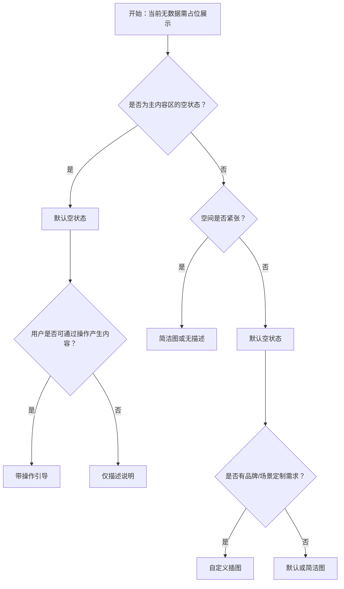

# 1. 简洁易读部份

## 1.0. 组件描述

空状态组件用于在暂无数据或尚未产生内容时，向用户显式提示当前状态，并可引导用户执行创建、刷新等操作，避免空白区域造成困惑。

## 1.1. 组件构成

空状态由以下基础要素构成，可按需组合使用：

> <!-- 附图占位：建议附上一张示例图，展示空状态的插图、描述文案、操作按钮的构成关系，标注各要素名称与位置 -->

&emsp;&emsp;1. **插图** 传达「无数据」或「空」的直观感受，可为默认图、简洁图或自定义图。

&emsp;&emsp;2. **描述文案** 说明当前状态的原因或建议，引导用户理解并采取行动。

&emsp;&emsp;3. **操作区** 提供创建、刷新、筛选等入口，将用户引导至有内容的状态。

---

## 1.2. 组件包含哪些不同类型

### 1.2.1 默认空状态

&emsp;**是什么**：使用标准插图与「暂无数据」等默认文案，适用于通用的无数据场景

> <!-- 附图占位：建议附上一张示例图，展示默认空状态的完整形态（插图 + 暂无数据 + 操作按钮） -->

&emsp;**简单用法**：适用于大多数「无数据」的通用场景；若业务有明确引导诉求，可叠加操作按钮

&emsp;**典型场景**：列表无数据、搜索结果为空、表格无记录

> <!-- 附图占位：建议附上一张场景图，展示列表页无数据时展示默认空状态及「新建」按钮的布局 -->

&emsp;**替代方案**：若需更轻量或更贴合业务，改用简洁图或自定义空状态

### 1.2.2 简洁图空状态

&emsp;**是什么**：使用更简洁、线条更少的插图，视觉更轻量

> <!-- 附图占位：建议附上一张示例图，展示简洁图与默认图的形态差异，体现轻量化风格 -->

&emsp;**简单用法**：适用于空间有限或作为次要空状态（如选择器、下拉列表内）的场景

&emsp;**典型场景**：选择器无选项、级联选择为空、穿梭框无数据

> <!-- 附图占位：建议附上一张场景图，展示选择器展开后无选项时使用简洁图空状态的布局 -->

&emsp;**替代方案**：若为主内容区的空状态，优先使用默认图以保持一致性

### 1.2.3 自定义插图

&emsp;**是什么**：使用业务定制的插图或图片，强化品牌或场景代入感

> <!-- 附图占位：建议附上一张示例图，展示自定义插图（如业务吉祥物、场景插画）的空状态形态 -->

&emsp;**简单用法**：适用于有明确品牌或业务氛围要求的场景；插图需与「空」的语义一致，避免误导

&emsp;**典型场景**：首次使用引导、活动页无数据、品牌化产品的空状态

> <!-- 附图占位：建议附上一张场景图，展示首次进入时使用品牌化自定义插图的空状态及引导文案 -->

&emsp;**替代方案**：若无需品牌强化，使用默认或简洁图即可

### 1.2.4 无描述空状态

&emsp;**是什么**：仅展示插图，不展示描述文案，适用于空间极小或语义极简的场景

> <!-- 附图占位：建议附上一张示例图，展示仅有插图、无描述文案的极简空状态形态 -->

&emsp;**简单用法**：必须用于空间紧张、或上下文已能说明「空」含义的场景；不宜在主内容区单独使用

&emsp;**典型场景**：表格内嵌空状态、卡片内小区域、弹窗内紧凑区域

> <!-- 附图占位：建议附上一张场景图，展示表格「Data Not Found」等内嵌场景使用无描述空状态 -->

&emsp;**替代方案**：若空间允许，建议添加简短描述以帮助用户理解

### 1.2.5 带操作引导的空状态

&emsp;**是什么**：在描述之外，明确提供「创建」「刷新」「去筛选」等操作按钮，引导用户产生内容

> <!-- 附图占位：建议附上一张示例图，展示空状态下方「立即创建」等操作按钮的布局 -->

&emsp;**简单用法**：适用于用户可通过操作从「空」变为「有数据」的场景；按钮文案需具体、可执行

&emsp;**典型场景**：列表无数据时引导新建、筛选结果为空时引导调整条件、无收藏时引导去添加

> <!-- 附图占位：建议附上一张场景图，展示列表空状态中「新建项目」按钮与描述文案的配合，体现引导创建 -->

&emsp;**替代方案**：若用户无法通过操作产生内容（如纯展示型空结果），可不提供操作按钮

---

## 1.3. 各类型典型场景案例

### 1.3.1 主区与内嵌空状态

> <!-- 附图占位：建议附上一张对比图，左侧展示主内容区使用默认空状态 + 操作（符合规范），右侧展示内嵌区域错误使用复杂空状态（不推荐） -->

✅ **推荐：** 主内容区用完整空状态，内嵌小区域用简洁或无描述

❌ **不推荐：** 在内嵌小区域使用过于复杂的空状态占用过多空间

### 1.3.2 描述与操作

> <!-- 附图占位：建议附上一张对比图，左侧展示可创建场景提供明确操作按钮（符合规范），右侧展示不可创建场景仍放「创建」按钮（不推荐） -->

✅ **推荐：** 用户可产生内容时提供明确操作；不可产生时仅说明原因

❌ **不推荐：** 在用户无法产生内容的场景中放置「创建」等无效操作

### 1.3.3 自定义插图

> <!-- 附图占位：建议附上一张对比图，左侧展示品牌/活动场景使用自定义插图（符合规范），右侧展示通用场景过度定制造成风格不统一（不推荐） -->

✅ **推荐：** 有品牌或场景需求时使用自定义插图

❌ **不推荐：** 在通用场景中过度定制，导致产品内空状态风格混乱

---

# 2. 选型指南

## 2.1 选择流程

---

# 3. 细致专业部份（交互与排版规则）

## 3.1 插图与视觉权重

* **插图大小**：主内容区空状态插图应足够醒目，但不喧宾夺主；内嵌区域可缩小。
* **风格统一**：同一产品内，默认、简洁、自定义等类型应保持风格一致；插图色系与页面协调。
* **语义一致**：插图需传达「空」「暂无」等含义，避免使用容易误解的图案。

> <!-- 附图占位：建议附上一张示例图，展示不同场景下插图大小与风格的统一原则 -->

## 3.2 描述文案

* **简洁明确**：描述应简短说明「为什么是空的」或「可以怎么做」，避免冗长或模糊。
* **场景化**：可根据具体场景定制文案，如「暂无搜索结果」与「暂无订单」的差异。
* **语气**：建议使用中性、友善的语气，避免让用户产生被责备的感觉。

> <!-- 附图占位：建议附上一张对比图，展示通用文案与场景化文案的差异，传达描述文案的设计原则 -->

## 3.3 操作按钮

* **主操作优先**：若有多个可能操作，将「创建」「去添加」等主操作放在最显眼位置。
* **按钮数量**：操作不宜过多，建议 1～2 个；过多会分散注意力。
* **禁用与权限**：当用户无权限执行操作时，不应展示该操作按钮，或展示为禁用态并说明原因。

> <!-- 附图占位：建议附上一张场景图，展示空状态下方 1～2 个主操作按钮的合理布局 -->

## 3.4 与其他组件的配合

* **表格/列表**：当表格或列表无数据时，空状态通常居中展示在内容区域；表头或筛选栏可保留。
* **选择器**：Select、TreeSelect、Cascader 等无选项时，可在下拉内展示简洁空状态。
* **全局配置**：可通过全局配置统一空状态的插图与描述，保证产品内一致性。

> <!-- 附图占位：建议附上一张场景图，展示表格、选择器等不同组件内空状态的展示位置与形态 -->

## 3.5 加载与空状态的切换

* **加载优先**：数据加载中应展示加载态（如 Spin），而非空状态；加载完成且无数据时才展示空状态。
* **筛选场景**：筛选后无结果与初始无数据可略有区分，描述可说明「未找到匹配结果，可尝试调整筛选条件」。

> <!-- 附图占位：建议附上一张流程说明图，展示加载态 → 有数据 / 空状态的切换逻辑 -->

## 3.6 首次使用与初始化引导

* **首次使用**：当用户首次进入且无历史数据时，空状态可承担引导角色，文案与操作可更强调「开始创建」。
* **初始化**：某些功能需用户完成初始化（如配置数据源），空状态可作为入口引导用户完成配置。

> <!-- 附图占位：建议附上一张场景图，展示首次使用时的空状态与初始化引导的配合 -->

---

## 4.0. 常见问题

### 1. 空状态和加载状态的区别是什么

- **加载状态**：数据正在获取中，应展示 Spin、骨架屏等，表示「即将有内容」。
- **空状态**：加载完成但确实无数据，应展示空状态占位，表示「当前为空，可引导操作」。

### 2. 何时使用简洁图与默认图

- **默认图**：主内容区、空间充足、需要清晰传达「无数据」时使用。
- **简洁图**：内嵌区域、空间紧张、或作为次要提示时使用。

### 3. 空状态是否需要操作按钮

- **需要**：用户可以通过「新建」「去添加」「调整筛选」等操作产生内容时，应提供操作按钮。
- **不需要**：纯展示型无数据（如某类数据本身就不存在）时，仅需描述说明即可。
