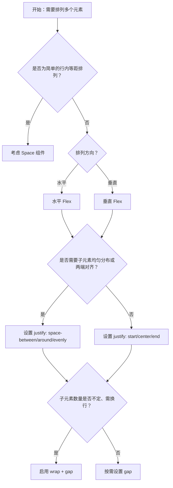

# 1. 简洁易读部份

## 1.0. 组件描述

弹性布局用于对齐与排列子元素，通过主轴与交叉轴方向的控制，实现元素之间的间距设置与对齐方式，适用于块级内容的灵活排布。

## 1.1. 组件构成

弹性布局由以下基础要素构成：

> <!-- 附图占位：建议附上一张示例图，展示弹性布局容器与子元素的构成关系，标注主轴、交叉轴、子项间距与对齐方向 -->

&emsp;&emsp;1. **容器** 作为弹性布局的父级，定义子元素的排列方向（水平或垂直）与对齐规则。

&emsp;&emsp;2. **子元素** 被容器包裹的内容块，按弹性规则参与对齐与间距分配。

&emsp;&emsp;3. **主轴与交叉轴** 主轴为排列方向（水平或垂直），交叉轴与之垂直；二者共同决定对齐与间距的视觉效果。

---

## 1.2. 组件包含哪些不同类型

### 1.2.1 水平布局

&emsp;**是什么**：子元素沿水平方向排列，主轴为横向，默认形态

> <!-- 附图占位：建议附上一张示例图，展示水平弹性布局中多个子元素从左到右排列的形态 -->

&emsp;**简单用法**：必须用于需要横向并排展示多个块级元素的场景；适用于工具栏、操作组、标签组等

&emsp;**典型场景**：按钮组水平排列、表单标签与输入框同行、卡片横向排列

> <!-- 附图占位：建议附上一张场景图，展示工具栏中多个按钮水平排列的布局，体现横向并排的典型用法 -->

&emsp;**替代方案**：若需纵向堆叠，改用垂直布局；若需精确栅格比例，改用 Grid 栅格

### 1.2.2 垂直布局

&emsp;**是什么**：子元素沿垂直方向排列，主轴为纵向

> <!-- 附图占位：建议附上一张示例图，展示垂直弹性布局中多个子元素自上而下排列的形态 -->

&emsp;**简单用法**：必须用于需要纵向堆叠、自上而下阅读的场景；适用于列表、表单字段、卡片堆叠

&emsp;**典型场景**：表单字段纵向排列、卡片列表、侧边栏菜单项

> <!-- 附图占位：建议附上一张场景图，展示表单中多个输入框自上而下排列的布局，体现垂直堆叠的典型用法 -->

&emsp;**替代方案**：若需横向排列，改用水平布局；若为简单等距排列，可考虑 Space 组件

### 1.2.3 居中对齐

&emsp;**是什么**：子元素在主轴或交叉轴上居中排列

> <!-- 附图占位：建议附上一张示例图，展示子元素在容器内居中（主轴居中、交叉轴居中）的形态 -->

&emsp;**简单用法**：必须用于需要视觉平衡、内容居中的场景；可单独设置主轴居中或交叉轴居中

&emsp;**典型场景**：弹窗内按钮组居中、卡片内容居中、空状态提示居中

> <!-- 附图占位：建议附上一张场景图，展示弹窗底部操作区按钮组居中的布局，体现居中对齐的典型用法 -->

&emsp;**替代方案**：若需靠左或靠右，改用 start 或 end 对齐

### 1.2.4 两端对齐 / 分散对齐

&emsp;**是什么**：子元素在主轴方向均匀分布，两端贴边或等距分散

> <!-- 附图占位：建议附上一张示例图，展示 space-between、space-around、space-evenly 三种分散对齐的视觉差异 -->

&emsp;**简单用法**：必须用于需要填满整行、子元素均匀分布的场景；space-between 两端贴边，space-around/space-evenly 两端有留白

&emsp;**典型场景**：导航栏左右分布（logo 左、菜单右）、表单单行内多个字段均匀分布、页脚链接分散排列

> <!-- 附图占位：建议附上一张场景图，展示导航栏左侧 logo、右侧菜单项两端对齐的布局，体现 space-between 的典型用法 -->

&emsp;**替代方案**：若不需填满整行，改用 start/center/end

### 1.2.5 间隙设置

&emsp;**是什么**：通过 gap 属性为子元素之间设置统一间距，支持预设尺寸或自定义

> <!-- 附图占位：建议附上一张示例图，展示 small、medium、large 三种预设间隙的视觉对比 -->

&emsp;**简单用法**：必须用于需要子元素之间保持统一间距的场景；推荐使用预设 small/medium/large 以保持设计系统一致

&emsp;**典型场景**：按钮组内按钮间距、卡片网格间距、表单字段之间的统一留白

> <!-- 附图占位：建议附上一张场景图，展示按钮组内各按钮通过 gap 保持统一间距的布局 -->

&emsp;**替代方案**：若为简单行内等距，可考虑 Space 组件；若需独立控制每个间距，需在子元素上单独设置 margin

### 1.2.6 自动换行

&emsp;**是什么**：子元素在主轴方向排满后自动换行，支持多行弹性布局

> <!-- 附图占位：建议附上一张示例图，展示子元素排满一行后自动换到下一行的换行效果 -->

&emsp;**简单用法**：必须用于子元素数量不确定、需要自适应换行的场景；与 gap 配合可形成网格状排列

&emsp;**典型场景**：标签组多行展示、筛选条件多行排列、卡片流式布局

> <!-- 附图占位：建议附上一张场景图，展示标签组在容器宽度内自动换行的布局，体现换行的典型用法 -->

&emsp;**替代方案**：若子元素固定且需精确比例，改用 Grid 栅格；若为单行且需等距，可用 Space

### 1.2.7 嵌套组合

&emsp;**是什么**：多个弹性布局嵌套使用，实现更复杂的二维排布

> <!-- 附图占位：建议附上一张示例图，展示外层垂直 Flex 内嵌多个水平 Flex 的嵌套结构 -->

&emsp;**简单用法**：必须用于需要行列组合、局部对齐与全局对齐结合的复杂场景；外层定义主方向，内层定义局部对齐

&emsp;**典型场景**：卡片内标题与操作按钮同行、内容与侧边栏左右分布、多行表单每行内左中右分区

> <!-- 附图占位：建议附上一张场景图，展示卡片头部「标题+操作按钮」同行、下方内容区垂直排列的嵌套布局 -->

&emsp;**替代方案**：若结构过于复杂，可考虑 Grid 或 Layout；若仅为简单行列，可简化嵌套层级

---

## 1.3. 各类型典型场景案例

### 1.3.1 水平与垂直布局

> <!-- 附图占位：建议附上一张对比图，左侧展示工具栏用水平 Flex 排列按钮（符合规范），右侧展示同一工具栏用垂直排列导致空间浪费（违反规范） -->

✅ **推荐：** 根据内容流向选择水平或垂直布局，工具栏、操作组等横向内容用水平布局

❌ **不推荐：** 横向内容用垂直布局堆叠，导致空间浪费、视觉割裂

### 1.3.2 对齐方式

> <!-- 附图占位：建议附上一张对比图，左侧展示导航栏用 space-between 实现左右分布（符合规范），右侧展示用多个 Flex 嵌套强行实现同一效果（违反规范） -->

✅ **推荐：** 根据业务语义选择对齐方式，两端分布用 space-between，居中用 center

❌ **不推荐：** 用复杂嵌套实现本可用 justify/align 直接表达的对齐效果

### 1.3.3 间隙与换行

> <!-- 附图占位：建议附上一张对比图，左侧展示标签组用 gap + wrap 实现统一间距与自动换行（符合规范），右侧展示用 margin 手动控制导致间距不一致（违反规范） -->

✅ **推荐：** 子元素间距统一用 gap 控制，数量不定时配合 wrap 实现换行

❌ **不推荐：** 在子元素上分别设置 margin 导致间距不统一、难以维护

### 1.3.4 Flex 与 Space 的选择

> <!-- 附图占位：建议附上一张对比图，左侧展示块级多元素用 Flex（符合规范），右侧展示简单行内等距排列用 Space 更简洁（符合规范） -->

✅ **推荐：** 块级布局、需主轴交叉轴对齐控制时用 Flex；简单行内等距排列用 Space

❌ **不推荐：** 简单等距排列强行用 Flex，或需要复杂对齐时用 Space 嵌套

---

# 2. 选型指南

## 2.1 选择流程

---

# 3. 细致专业部份（交互与排版规则）

## 3.1 多元素的排列与折叠策略

当同一区域内子元素较多时，需按以下逻辑决定排列与折叠：

* **优先展示**：与当前任务强相关、高频使用的元素应直接可见，置于 Flex 容器前列。
* **换行策略**：若子元素数量不定，启用 wrap 让超出部分自动换行；若为固定数量但较多，可考虑收纳进「更多」等折叠入口。
* **间隙一致**：同一 Flex 内子元素间距必须统一，使用 gap 而非在子元素上单独设置 margin。

> <!-- 附图占位：建议附上一张场景图，展示工具栏中高频操作直接展示、低频操作收纳至「更多」的布局，体现优先级与折叠策略 -->

## 3.2 不宜使用的布局选择

以下情形不推荐使用 Flex，或需谨慎使用：

* **精确栅格比例**：若需严格按 24 栅格或固定比例分配宽度，应使用 Grid 而非 Flex。
* **页面级整体结构**：若为页面级头部、侧边栏、内容区、页脚的整体划分，应使用 Layout 而非 Flex。
* **简单等距**：若仅为 2～3 个元素的等距排列，Space 组件更简洁，不必引入 Flex。

> <!-- 附图占位：建议附上一张对比图，展示需严格等分时用 Grid 与用 Flex 的差异 -->

## 3.3 摆放位置（按页面场景划分）

* **工具栏**：水平 Flex，常用 justify: space-between 或 end，gap 控制按钮间距。
* **表单区域**：垂直 Flex 用于字段堆叠，水平 Flex 用于单行内标签与输入框、或多个表单项并排。
* **卡片内容区**：垂直 Flex 用于标题、描述、操作区的纵向排列；水平 Flex 用于标题行内左右分布。
* **导航栏**：水平 Flex，logo 与一级导航在左，辅助菜单在右，justify: space-between。
* **空状态 / 结果页**：垂直 Flex + 居中对齐，用于图标、文字、按钮的纵向居中展示。

> <!-- 附图占位：建议附上一张场景图，展示工具栏、表单、卡片等不同位置使用 Flex 的典型布局 -->

## 3.4 顺序与对齐逻辑

* **主轴对齐**：start 靠左/靠上，center 居中，end 靠右/靠下，space-between 两端贴边，space-around/space-evenly 等距分散。
* **交叉轴对齐**：start 靠上/靠左，center 垂直/水平居中，end 靠下/靠右，stretch 拉伸填满。
* **默认行为**：水平模式下默认向上对齐（align: flex-start），垂直模式下默认拉伸（align: stretch）；可按需覆盖。
* **子元素顺序**：Flex 内子元素按 DOM 顺序排列；若需视觉顺序与 DOM 不一致，可使用 order 或调整 DOM 顺序。

> <!-- 附图占位：建议附上一张示意图，展示 justify 与 align 各取值的视觉效果及默认行为 -->

## 3.5 状态与交互反馈

* **响应式**：Flex 可配合媒体查询或响应式断点，在不同宽度下切换 vertical 与水平布局，或调整 gap 大小。
* **动态子元素**：子元素增删时，Flex 自动重新计算排列；启用 wrap 时，换行位置会随容器宽度变化。
* **无交互状态**：Flex 本身无点击、悬停等状态；子元素的交互状态由子组件自身负责。

## 3.6 视觉规范与形态选择

* **间隙体系**：gap 推荐使用预设 small、medium、large，或与设计系统 spacing 一致的自定义值（如 8 的倍数）。
* **对齐一致性**：同一页面内相同场景的 Flex 对齐方式应一致，如所有工具栏均采用 space-between 或 end。
* **嵌套层级**：嵌套不宜超过 3 层，否则可读性与维护成本上升；复杂布局可考虑拆分为 Grid 或 Layout。
* **与 Space 的边界**：Space 为内联元素提供等距排列，会为子元素添加包裹；Flex 为块级布局，不添加包裹，适合需要更多对齐控制的场景。

> <!-- 附图占位：建议附上一张示例图，展示 Flex 与 Space 在相同内容下的视觉差异与适用场景 -->

---

## 4.0. 常见问题

### 1. Flex 和 Space 有什么区别？

- **Space**：为内联元素提供等距排列，每个子元素会被包裹，适用于简单的行或列等距排列。
- **Flex**：为块级元素提供布局，不添加包裹，支持主轴/交叉轴对齐、gap、wrap 等更丰富的控制，适用于需要对齐与间距精细控制的场景。

### 2. 什么时候用 Flex，什么时候用 Grid？

- **Flex**：一维布局（行或列）、子元素对齐与间距控制、数量不定需换行、嵌套组合。
- **Grid**：二维布局、严格栅格比例（如 24 栅格）、等分或非等分列、响应式断点下的列数变化。

### 3. 水平布局下子元素默认是向上对齐的，如何改为垂直居中？

- 通过设置 align 为 center，子元素在交叉轴（垂直方向）上居中；若需底部对齐，设置为 end。
