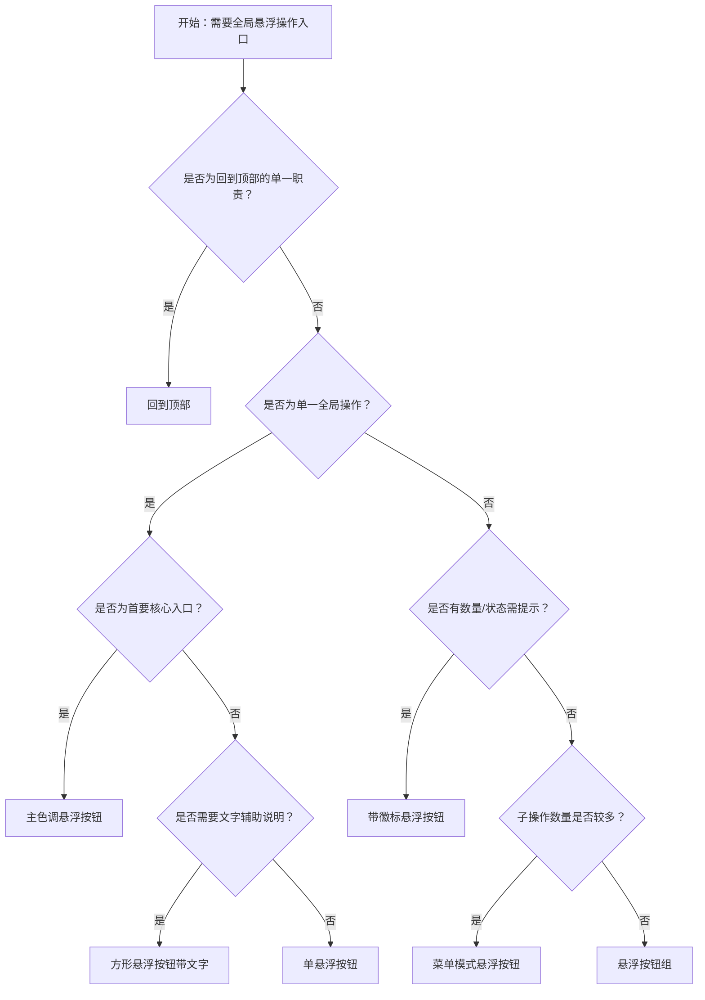

# 1. 简洁易读部份

## 1.0. 组件描述

悬浮按钮用于在页面上提供固定的全局操作入口，无论用户浏览到何处都可以看见并快速触达。

## 1.1. 组件构成

悬浮按钮由以下基础要素构成，可按需组合使用：

> <!-- 附图占位：建议附上一张示例图，展示悬浮按钮的基础要素（容器、图标、可选文字描述）的构成关系，标注各要素名称与位置 -->

&emsp;&emsp;1. **容器** 定义按钮的点击区域与整体形态，固定悬浮于视口某一位置，用于承载图标与可选文字。

&emsp;&emsp;2. **图标** 表达操作语义，为悬浮按钮的核心要素，必须清晰可识别。

&emsp;&emsp;3. **文字描述（可选）** 用于补充说明操作含义，仅在方形按钮中支持，需精简。

---

## 1.2. 组件包含哪些不同类型

### 1.2.1 单悬浮按钮（默认）

&emsp;**是什么**：单个悬浮于页面上方的圆形按钮，承载单一全局操作

> <!-- 附图占位：建议附上一张示例图，展示单悬浮按钮（圆形、右下角固定）的视觉形态，体现其作为全局入口的悬浮特性 -->

&emsp;**简单用法**：必须用于网站上的全局功能；无论用户滚动到何处都需可见；同一视口内同一区域不宜出现多个独立悬浮按钮

&emsp;**典型场景**：反馈入口、在线客服、快捷帮助、提交建议

> <!-- 附图占位：建议附上一张场景图，展示页面右下角悬浮的「帮助」或「反馈」按钮，体现全局可触达的使用方式 -->

&emsp;**替代方案**：若需收纳多个操作，改用悬浮按钮组或菜单模式

### 1.2.2 主色调悬浮按钮

&emsp;**是什么**：采用主色填充的悬浮按钮，用于强调当前页面的首要全局操作

> <!-- 附图占位：建议附上一张示例图，展示主色调悬浮按钮（实心填充、品牌色）与默认悬浮按钮的视觉对比，体现层级差异 -->

&emsp;**简单用法**：必须用于页面唯一的、最重要的全局入口；不可与多个同等强调的悬浮按钮并存；视觉上需明显区别于默认类型

&emsp;**典型场景**：主 CTA（如「立即咨询」）、核心业务入口、付费转化按钮

> <!-- 附图占位：建议附上一张场景图，展示主色调悬浮按钮作为页面核心转化入口的布局，体现其首要地位 -->

&emsp;**替代方案**：若操作非首要目标，改用默认悬浮按钮

### 1.2.3 方形悬浮按钮（带文字）

&emsp;**是什么**：采用方形形态的悬浮按钮，可携带精简文字描述以增强识别

> <!-- 附图占位：建议附上一张示例图，展示方形悬浮按钮（含图标与双字描述如「反馈」）的视觉形态，体现方形+文字的紧凑组合 -->

&emsp;**简单用法**：必须用于需要文字辅助说明语义的场景；文字必须精简，推荐双字；仅方形支持文字内容

&emsp;**典型场景**：反馈、客服、帮助、回到顶部

> <!-- 附图占位：建议附上一张场景图，展示方形悬浮按钮「反馈」「客服」等带文字描述的使用布局，体现语义清晰 -->

&emsp;**替代方案**：若语义通过图标已可识别，改用圆形悬浮按钮

### 1.2.4 悬浮按钮组

&emsp;**是什么**：将多个同类悬浮按钮组合在一起，自上而下或自侧展开，无需二次点击即可看到全部选项

> <!-- 附图占位：建议附上一张示例图，展示悬浮按钮组展开后的形态（触发按钮 + 多个子按钮垂直排列），体现一次性展示多个操作的布局 -->

&emsp;**简单用法**：必须用于多个同等重要或平级的全局操作；子按钮数量不宜超过 5 个；展开方向需与页面留白匹配

&emsp;**典型场景**：反馈 + 帮助 + 客服、多种快捷入口并列

> <!-- 附图占位：建议附上一张场景图，展示悬浮按钮组展开后「反馈」「帮助」「客服」等按钮的排列，体现多入口并列展示 -->

&emsp;**替代方案**：若子项过多或需收纳，改用菜单模式悬浮按钮

### 1.2.5 菜单模式悬浮按钮

&emsp;**是什么**：点击或悬停后展开菜单，将多个操作收纳到单一触发入口中

> <!-- 附图占位：建议附上一张示例图，展示菜单模式悬浮按钮展开后的形态（触发按钮 + 下拉/上拉菜单列表），体现收纳与展开的交互结构 -->

&emsp;**简单用法**：必须用于操作较多、需收纳以节省空间的场景；支持点击或悬停触发；主触发按钮必须明确表达「更多」或核心动作

&emsp;**典型场景**：多种反馈入口、多项快捷操作、导出/分享/收藏等动作集合

> <!-- 附图占位：建议附上一张场景图，展示菜单模式悬浮按钮点击后展开多项操作的布局，体现收纳策略 -->

&emsp;**替代方案**：若操作数量少且重要性相近，改用悬浮按钮组

### 1.2.6 回到顶部

&emsp;**是什么**：专用于长页面滚动后，一键返回页面顶部的悬浮按钮

> <!-- 附图占位：建议附上一张示例图，展示回到顶部按钮（通常为向上箭头图标）的视觉形态，体现其单一职责 -->

&emsp;**简单用法**：必须用于长内容页面的滚动场景；需在用户滚动一定高度后才出现；点击后平滑滚动至顶部

&emsp;**典型场景**：文章页、列表页、详情页、文档页

> <!-- 附图占位：建议附上一张场景图，展示长滚动页面右下角出现的回到顶部按钮，体现滚动后出现、点击返回顶部的使用流程 -->

&emsp;**替代方案**：若页面内容较短无需滚动，不必使用回到顶部

### 1.2.7 带徽标悬浮按钮

&emsp;**是什么**：在悬浮按钮右上角附带数字徽标，提示待处理数量或新消息

> <!-- 附图占位：建议附上一张示例图，展示带徽标悬浮按钮（右上角红色圆点或数字）的视觉形态，体现数量/状态提示 -->

&emsp;**简单用法**：必须用于有数量或状态提示需求的入口；徽标数字需与业务含义一致；不可滥用，以免干扰用户

&emsp;**典型场景**：消息通知、待处理数量、客服未读数

> <!-- 附图占位：建议附上一张场景图，展示带徽标悬浮按钮在消息/通知场景中的使用，体现数量提示的语义 -->

&emsp;**替代方案**：若无需数量提示，改用普通悬浮按钮

---

## 1.3. 各类型典型场景案例

### 1.3.1 单悬浮按钮

> <!-- 附图占位：建议附上一张对比图，左侧展示单一全局操作使用单悬浮按钮（符合规范），右侧展示同一视口内多个独立悬浮按钮并列（违反规范） -->

✅ **推荐：** 单一全局入口使用单悬浮按钮，保持界面简洁

❌ **不推荐：** 同一视口内出现多个独立悬浮按钮，造成视觉干扰

### 1.3.2 主色调与默认

> <!-- 附图占位：建议附上一张对比图，左侧展示首要操作用主色调、次要用默认（符合规范），右侧展示多个主色调悬浮按钮并列（违反规范） -->

✅ **推荐：** 首要全局操作使用主色调悬浮按钮，次要操作使用默认

❌ **不推荐：** 多个同等强调的主色调悬浮按钮并存

### 1.3.3 悬浮按钮组与菜单模式

> <!-- 附图占位：建议附上一张对比图，左侧展示 3–5 个平级操作用悬浮按钮组（符合规范），右侧展示 6 个以上操作平铺或收纳到菜单模式（符合规范） -->

✅ **推荐：** 操作数量少用悬浮按钮组直接展示，操作多用菜单模式收纳

❌ **不推荐：** 大量操作平铺在悬浮按钮组中，造成选择困难

### 1.3.4 回到顶部

> <!-- 附图占位：建议附上一张对比图，左侧展示长页面滚动后出现回到顶部（符合规范），右侧展示短页面也放置回到顶部（违反规范） -->

✅ **推荐：** 长内容页面、需滚动浏览时使用回到顶部

❌ **不推荐：** 内容不足以产生滚动的页面放置回到顶部

---

# 2. 选型指南

## 2.1 选择流程

---

# 3. 细致专业部份（交互与排版规则）

## 3.1 多操作的展示与折叠策略

当悬浮区域需要承载多个全局操作时，需按以下逻辑决定展示与收纳：

* **直接展示**：3–5 个同等重要、使用频率高的操作，使用悬浮按钮组自上而下或自侧展开。
* **收纳展示**：超过 5 个操作，或操作重要性差异明显、需要「更多」语义时，使用菜单模式悬浮按钮，通过点击或悬停展开。
* **单一优先**：若只有一个核心全局入口，使用单悬浮按钮；避免为凑齐多个而强行增加入口。

> <!-- 附图占位：建议附上一张场景图，展示悬浮按钮组与菜单模式的对比布局，体现多操作的展示与收纳策略 -->

## 3.2 危险操作（删除/清空/停用）

悬浮按钮通常不承载危险操作；若业务强需求在悬浮入口中提供删除、停用等操作：

* **收纳**：危险操作必须收纳在菜单模式或悬浮按钮组中，不可作为主触发按钮。
* **二次确认**：点击后必须通过弹窗进行二次确认，再执行。
* **视觉隔离**：在展开列表中，危险项需通过红色或弱化样式与常规项区分。

> <!-- 附图占位：建议附上一张场景图，展示悬浮按钮菜单中危险操作（如「清空」）收纳在列表末尾、配合二次确认的布局 -->

## 3.3 摆放位置（按页面场景划分）

悬浮按钮的固定位置需与用户视线及操作习惯匹配：

* **默认右下角**：适用于多数桌面端页面，符合「从右到左」的视线落点，不遮挡主体内容。
* **自定义方向**：若右下角已被占用（如聊天窗口、广告位），可调整至左下、左上或右上；需保证不与核心内容重叠。
* **移动端**：需考虑拇指可触达区域，通常仍为右下角或底部居中偏右。
* **与内容边距**：悬浮按钮与视口边缘需保持固定间距，避免贴边或遮挡滚动条。

> <!-- 附图占位：建议附上一张场景图，展示桌面端右下角、移动端底部等不同场景下的悬浮按钮摆放位置，体现位置规范 -->

## 3.4 顺序与对齐逻辑

悬浮按钮组或菜单模式中，子项顺序需符合业务优先级与用户预期：

* **自上而下**：主操作或高频操作排在顶部；危险操作排在底部。
* **逻辑分组**：同类操作（如反馈、帮助、客服）可相邻排列；不同类型间可适当留白或分隔。
* **回到顶部**：若与其它悬浮入口并存，回到顶部宜单独放置或放在最底部，避免与主业务入口竞争。

> <!-- 附图占位：建议附上一张场景图，展示悬浮按钮组子项自上而下的排列顺序，体现主操作在上、危险在下的逻辑 -->

## 3.5 状态与交互反馈

悬浮按钮需提供清晰的状态与反馈：

* **默认**：可点击性明确，与背景有足够对比。
* **悬停**：提供可点击暗示（如轻微放大、阴影或底色变化）。
* **按下**：提供明确的按压反馈。
* **展开中**：悬浮按钮组或菜单展开时，主按钮应有状态变化（如旋转、高亮），便于用户感知当前展开状态。
* **加载中**：若操作触发异步请求，需进入加载状态并锁定，防止重复点击。

## 3.6 视觉规范与形态选择

* **圆形与方形**：圆形为默认形态，适合纯图标；方形适用于需携带文字的场景，文字需精简。
* **尺寸**：悬浮按钮需足够大以方便点击，同时不可过大以免遮挡内容；与其它悬浮元素（如聊天气泡）保持协调。
* **层级**：在同一视口内，悬浮按钮的层级应高于普通内容，低于模态框、抽屉等全屏覆盖层。
* **图标选择**：图标语义必须与操作一致，优先使用行业共识强的图标（如客服、反馈、回到顶部）。

> <!-- 附图占位：建议附上一张示例图，展示圆形与方形悬浮按钮的尺寸与层级关系，体现视觉规范 -->

---

## 4.0. 常见问题

### 1. 悬浮按钮组和菜单模式悬浮按钮有什么区别？

- **悬浮按钮组**：点击主按钮后，子按钮直接展开在旁，所有选项一目了然，适合 3–5 个平级操作。
- **菜单模式悬浮按钮**：点击或悬停后展开的是菜单列表，适合更多操作或需要收纳的场景，主按钮通常表达「更多」或核心动作。

### 2. 回到顶部什么时候出现比较合适？

- 建议在用户滚动高度超过一屏（如 400px）后再显示回到顶部按钮，避免短页面也出现该按钮造成干扰。
