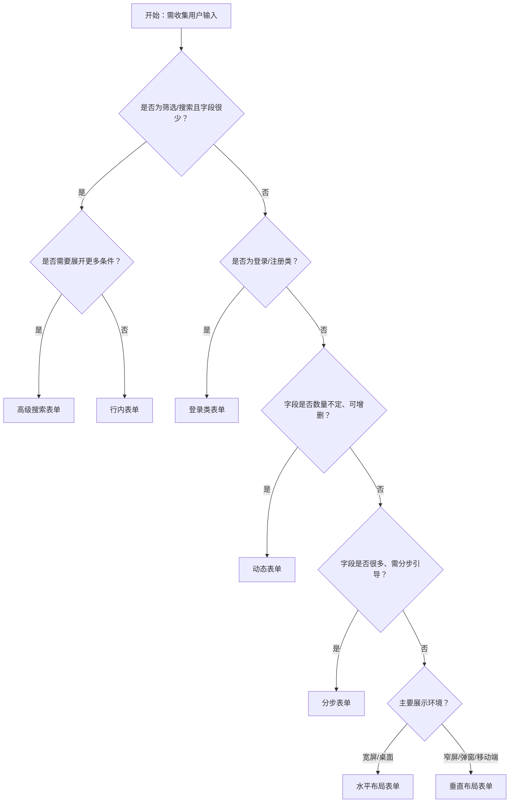

# 1. 简洁易读部份

## 1.0. 组件描述

表单用于收集、校验和管理用户输入的数据，是创建实体或采集信息的基础容器。表单包含数据域管理、校验规则以及对应的布局与样式，适用于需要结构化录入与校验的场景。

## 1.1. 组件构成

表单由以下基础要素构成，可按需组合使用：

> <!-- 附图占位：建议附上一张示例图，展示表单的基础要素（标签、输入控件、校验提示、提交区）的构成关系，标注各要素名称与位置 -->

&emsp;&emsp;1. **标签（Label）** 标识字段含义，与输入控件成对出现；水平布局时标签与控件分列，垂直布局时标签在控件上方。

&emsp;&emsp;2. **输入控件** 承载用户输入，包括 Input、Select、DatePicker 等；由 Form.Item 包装以完成数据绑定与校验。

&emsp;&emsp;3. **校验提示** 在字段校验失败时展示错误或警告信息，通常置于输入控件下方。

&emsp;&emsp;4. **提交区** 放置提交、取消、重置等操作按钮，通常位于表单底部。

---

## 1.2. 组件包含哪些不同类型

### 1.2.1 水平布局表单

&emsp;**是什么**：标签与输入控件横向并排，标签靠左或靠右对齐

> <!-- 附图占位：建议附上一张示例图，展示水平布局表单的视觉形态（标签在左、控件在右、成行排列） -->

&emsp;**简单用法**：适用于字段较多、需要紧凑排布的录入场景；标签与控件分列，通过 labelCol、wrapperCol 控制占比；适合桌面端宽屏。

&emsp;**典型场景**：用户信息编辑、配置页、详情编辑

> <!-- 附图占位：建议附上一张场景图，展示用户信息表单采用水平布局、多字段成行排列的布局 -->

&emsp;**替代方案**：若空间有限或移动端为主，改用垂直布局；若字段极少且需极简，改用行内表单

### 1.2.2 垂直布局表单

&emsp;**是什么**：标签在输入控件上方，纵向堆叠排列

> <!-- 附图占位：建议附上一张示例图，展示垂直布局表单的视觉形态（标签在上、控件在下、纵向排列） -->

&emsp;**简单用法**：适用于移动端或窄屏场景；每字段独占一行，视线自上而下；标签与控件间距需统一。

&emsp;**典型场景**：移动端注册、移动端登录、狭长容器内的表单（如抽屉、弹窗）

> <!-- 附图占位：建议附上一张场景图，展示弹窗或抽屉内垂直布局表单的纵向排列方式 -->

&emsp;**替代方案**：若桌面端宽屏且字段多，改用水平布局以节省纵向空间

### 1.2.3 行内表单

&emsp;**是什么**：标签与控件在同一行内紧凑排列，常用于筛选或快捷录入

> <!-- 附图占位：建议附上一张示例图，展示行内表单的视觉形态（标签与控件、按钮同一行横向排列） -->

&emsp;**简单用法**：必须用于字段少、需与操作按钮同行的场景；不强调每项占满整行；常见于筛选区、搜索栏。

&emsp;**典型场景**：顶部筛选栏、搜索框与按钮同行、简单查询条件

> <!-- 附图占位：建议附上一张场景图，展示列表页顶部「关键词 | 状态 | 日期范围 | 查询」的行内表单布局 -->

&emsp;**替代方案**：若字段较多或需清晰分区，改用水平或垂直布局

### 1.2.4 动态表单

&emsp;**是什么**：支持用户动态增减表单项（如多联系人、多地址）

> <!-- 附图占位：建议附上一张示例图，展示动态表单的视觉形态（可增删的列表块 + 添加/删除按钮） -->

&emsp;**简单用法**：必须用于「一对多」或数量不固定的录入场景；每项需有明确的添加入口与删除入口；删除需防误触（尤其已有数据时）。

&emsp;**典型场景**：添加多个联系人、多个收货地址、可变数量的子项配置

> <!-- 附图占位：建议附上一张场景图，展示「收货地址列表」中每一项带删除按钮、底部有「添加地址」按钮的动态表单结构 -->

&emsp;**替代方案**：若数量固定，使用静态表单项；若结构复杂，可考虑分步表单拆解

### 1.2.5 分步表单

&emsp;**是什么**：将长表单拆成多步，用户按步骤完成录入

> <!-- 附图占位：建议附上一张示例图，展示分步表单的视觉形态（步骤条 + 当前步骤内容区 + 上一步/下一步按钮） -->

&emsp;**简单用法**：必须用于字段多、需分阶段引导的场景；每步应有明确主题与字段边界；底部按钮一般为「上一步」「下一步」或「提交」；「下一步」与「提交」不同时出现。

&emsp;**典型场景**：注册流程、订单填写、复杂配置向导

> <!-- 附图占位：建议附上一张场景图，展示分步注册表单中第一步「基本信息」、第二步「详细资料」的结构与按钮排列 -->

&emsp;**替代方案**：若字段较少或用户可一次性完成，使用单页表单

### 1.2.6 登录类表单

&emsp;**是什么**：专为登录、注册等身份相关场景设计，字段极少、布局紧凑

> <!-- 附图占位：建议附上一张示例图，展示登录表单的视觉形态（账号、密码、可选验证码、登录按钮的紧凑布局） -->

&emsp;**简单用法**：字段通常为 2–4 个（账号、密码、验证码等）；可配合垂直布局或紧凑行内布局；提交按钮为主按钮且显著；可选「记住我」「忘记密码」等辅助链接。

&emsp;**典型场景**：登录页、注册页、找回密码

> <!-- 附图占位：建议附上一张场景图，展示居中卡片内的登录表单布局，主按钮突出 -->

&emsp;**替代方案**：若为通用数据录入，使用标准水平或垂直布局表单

### 1.2.7 高级搜索表单

&emsp;**是什么**：默认展示少量筛选项，展开后显示更多筛选条件

> <!-- 附图占位：建议附上一张示例图，展示高级搜索表单的视觉形态（基础筛选项 + 展开/收起入口 + 更多条件区域） -->

&emsp;**简单用法**：必须用于筛选条件较多、需兼顾简洁与完整的场景；默认展示高频条件，其余收纳于「展开」区域；展开/收起应有明确入口与状态反馈。

&emsp;**典型场景**：列表页复杂筛选、报表条件配置

> <!-- 附图占位：建议附上一张场景图，展示列表页「关键词 | 状态 | 日期 | 查询 | 展开」的布局，以及展开后更多筛选项的展示方式 -->

&emsp;**替代方案**：若筛选条件很少，使用行内表单即可

---

## 1.3. 各类型典型场景案例

### 1.3.1 水平布局表单

> <!-- 附图占位：建议附上一张对比图，左侧展示多字段编辑页使用水平布局（符合规范），右侧展示同一场景使用垂直布局导致纵向过长（违反规范） -->

✅ **推荐：** 桌面端多字段录入使用水平布局，节省纵向空间

❌ **不推荐：** 宽屏多字段场景全部垂直堆叠，导致过度纵向滚动

### 1.3.2 垂直布局表单

> <!-- 附图占位：建议附上一张对比图，左侧展示弹窗/移动端使用垂直布局（符合规范），右侧展示窄容器内使用水平布局导致挤压（违反规范） -->

✅ **推荐：** 弹窗、抽屉、移动端使用垂直布局，顺应窄屏视线流

❌ **不推荐：** 窄容器内使用水平布局，标签与控件被挤压难以阅读

### 1.3.3 行内表单

> <!-- 附图占位：建议附上一张对比图，左侧展示筛选区使用行内表单（符合规范），右侧展示筛选区使用完整水平表单占据过多空间（违反规范） -->

✅ **推荐：** 筛选、搜索等少字段场景使用行内表单，与操作按钮同行

❌ **不推荐：** 字段较多的正式录入场景使用行内表单，导致布局混乱

### 1.3.4 动态表单

> <!-- 附图占位：建议附上一张对比图，左侧展示多地址录入使用动态表单（符合规范），右侧展示用多个独立表单块手动拼装（违反规范） -->

✅ **推荐：** 数量不定的子项录入使用动态表单，有清晰的增删入口

❌ **不推荐：** 数量不定的场景用固定数量的表单项硬凑，无法灵活增减

### 1.3.5 分步表单

> <!-- 附图占位：建议附上一张对比图，左侧展示长流程使用分步表单（符合规范），右侧展示将所有字段堆在一页导致压力过大（违反规范） -->

✅ **推荐：** 字段多、流程长的场景拆成多步，每步有明确主题

❌ **不推荐：** 一次性展示过多字段，缺少步骤引导

---

# 2. 选型指南

## 2.1 选择流程

---

# 3. 细致专业部份（交互与排版规则）

## 3.1 多操作的展示与折叠策略

* **提交区按钮**：同一表单底部，建议最多直接展示 2–3 个按钮（如取消、重置、提交）；更多操作收纳至「更多」下拉或分开展示。
* **主操作唯一**：提交/保存为主按钮，同一视图仅一个主按钮；其他为默认或文本按钮。
* **高级搜索**：筛选条件多时，默认展示常用项，其余通过「展开」收纳；展开后需提供「收起」入口。

> <!-- 附图占位：建议附上一张场景图，展示表单底部「取消」「重置」「提交」的按钮组合，以及高级搜索展开/收起的布局 -->

## 3.2 危险操作（删除/清空/停用）

* **删除动态项**：动态表单中删除某一行时，若该行已有有效数据，建议二次确认；删除空行可直接删除。
* **重置**：重置表单为轻量操作，通常不需要二次确认；若表单数据关联重要业务，可考虑确认提示。
* **清空与禁用**：通过 disabled 禁用整个表单或部分控件时，需明确禁用态；危险操作的视觉层级不得高于主提交按钮。

> <!-- 附图占位：建议附上一张场景图，展示动态表单中点击删除时弹出确认框的交互 -->

## 3.3 摆放位置（按页面场景划分）

* **独立页面**：表单居中或靠左，与页面标题、说明区域上下排列；提交区置于表单内容底部。
* **弹窗/抽屉**：表单在弹窗或抽屉主体内，提交按钮可吸底或紧跟表单；与「取消」并排时，主操作靠右。
* **筛选区**：置于列表或表格上方，与列表内容有清晰分界；行内表单与查询按钮同行，主操作靠右。

> <!-- 附图占位：建议附上一张场景图，展示弹窗内表单与底部按钮的摆放关系 -->

## 3.4 顺序与对齐逻辑

* **水平布局**：标签与控件对齐，标签列宽一致；必填标记（如 *）与标签配合，不破坏对齐。
* **垂直布局**：标签与控件左对齐；多列控件时，各列左边缘对齐。
* **按钮顺序**：推荐从左到右为「取消」→「重置」→「提交」；分步表单为「取消」→「上一步」→「下一步/提交」。
* **校验信息**：错误提示置于对应控件下方，与控件左对齐；多条错误时，首个错误可滚动到视野内。

> <!-- 附图占位：建议附上一张场景图，展示水平布局表单的标签列与控件列的对齐关系，以及底部按钮从左到右的顺序 -->

## 3.5 状态与交互反馈

* **默认**：控件可编辑，标签与占位符清晰；必填项有明确标识。
* **输入中**：实时校验（若配置 onChange 触发）或失焦校验；输入过程不过早打断用户。
* **校验失败**：错误态边框、错误图标、错误文案；提交失败时滚动至第一个错误字段。
* **校验通过**：可选 success 态与图标反馈；不喧宾夺主。
* **提交中**：提交按钮进入 loading，防止重复提交；整体可配合 Spin 或局部禁用。
* **禁用**：整个表单或单个控件禁用时，需明确置灰，不可点击。

> <!-- 附图占位：建议附上一张状态示意图，展示表单字段的默认、错误、成功、禁用四种状态的视觉差异 -->

## 3.6 视觉规范与形态选择

* **标签冒号**：水平布局时，标签后冒号可根据规范统一显隐；垂直布局可省略。
* **必填标识**：必填项使用 * 或「必填」等标识，与可选样式区分；`requiredMark` 可控制必选/可选展示方式。
* **控件形态**：表单内控件（Input、Select 等）的 variant 应与表单统一配置；与页面整体风格一致。
* **间距**：表单项之间、标签与控件之间间距统一；分组时可用分割线或标题区分。

> <!-- 附图占位：建议附上一张示例图，展示表单中必填标识、冒号、控件形态的统一性 -->

---

## 4.0. 常见问题

### 1. 水平布局和垂直布局如何选择？

- **水平布局**：标签与控件横向并排，适合桌面端宽屏、字段较多的场景，可节省纵向空间。
- **垂直布局**：标签在控件上方，适合移动端、弹窗、抽屉等窄容器，视线自上而下更自然。

### 2. 行内表单和水平布局表单的区别？

- **行内表单**：标签与控件紧凑排列在同一行，常用于筛选、搜索等少字段场景，与操作按钮同行。
- **水平布局表单**：标签与控件分列，每行通常一对或多对，适合正式录入场景，结构更清晰。

### 3. 动态表单删除项是否需要确认？

- 若删除的项已包含用户输入的有效数据，建议二次确认，防止误删。
- 若删除的是空行或新建未保存的项，可直接删除，无需确认。
