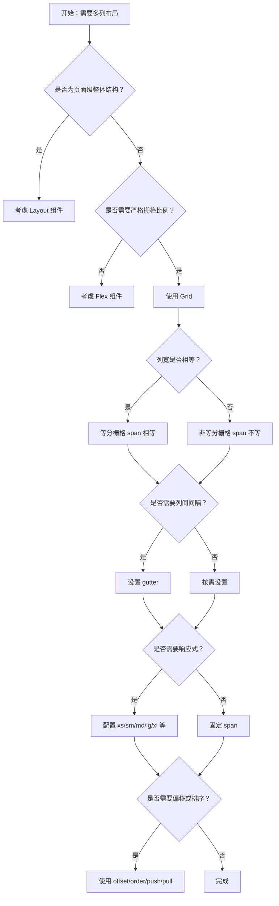

# 1. 简洁易读部份

## 1.0. 组件描述

栅格用于基于行与列的页面布局，通过 24 等分原则划分信息区块，保证各区域稳健排布，并支持响应式断点与对齐控制。

## 1.1. 组件构成

栅格由以下基础要素构成：

> <!-- 附图占位：建议附上一张示例图，展示 Row 与 Col 的构成关系，标注 24 栅格划分、行、列、间隔（gutter）的位置 -->

&emsp;&emsp;1. **Row（行）** 水平方向的容器，用于建立一组列（Col），可设置水平/垂直间隔与对齐方式。

&emsp;&emsp;2. **Col（列）** 放置在 Row 内的子元素，通过 span 占用栅格数，内容放置于 Col 内。

&emsp;&emsp;3. **栅格单位** 将水平方向 24 等分，每列可占用 1～24 个栅格单位，决定宽度比例。

---

## 1.2. 组件包含哪些不同类型

### 1.2.1 等分栅格

&emsp;**是什么**：多个 Col 的 span 相等，形成等宽的列排列

> <!-- 附图占位：建议附上一张示例图，展示 4 个 span=6 的 Col 等分一行的视觉形态 -->

&emsp;**简单用法**：必须用于需要多列等宽、信息权重相近的场景；span 之和应为 24 或自动换行

&emsp;**典型场景**：四宫格卡片、三栏等分展示、两栏对半分布

> <!-- 附图占位：建议附上一张场景图，展示四宫格卡片等分布的布局，体现等分栅格的典型用法 -->

&emsp;**替代方案**：若需非等分，改用不同 span；若仅需简单对齐，可考虑 Flex

### 1.2.2 非等分栅格

&emsp;**是什么**：各 Col 的 span 不同，形成主次分明的列宽比例

> <!-- 附图占位：建议附上一张示例图，展示 span=16 与 span=8 的 2:1 比例、或 span=8+8+4+4 的不等分形态 -->

&emsp;**简单用法**：必须用于主内容区与侧边栏、或主次信息权重不同的场景；span 之和不超过 24 可同行，超过则换行

&emsp;**典型场景**：主内容区 16、侧边栏 8；左侧 18、右侧 6；多列不均等分布

> <!-- 附图占位：建议附上一张场景图，展示主内容区宽、侧边栏窄的 16:8 布局，体现非等分栅格的典型用法 -->

&emsp;**替代方案**：若需更灵活的比例，可使用 Col 的 flex 属性

### 1.2.3 带间隔栅格

&emsp;**是什么**：通过 Row 的 gutter 属性为列之间设置水平、垂直或二者兼有的间隔

> <!-- 附图占位：建议附上一张示例图，展示 gutter=16 与 gutter=[16, 24] 时列间留白的视觉差异 -->

&emsp;**简单用法**：必须用于需要列与列之间留白的场景；推荐使用 (16+8n)px 作为间隔；支持响应式 gutter

&emsp;**典型场景**：卡片网格、表单多列、图文混排的列间留白

> <!-- 附图占位：建议附上一张场景图，展示卡片网格通过 gutter 保持列间与行间统一间距的布局 -->

&emsp;**替代方案**：若仅在子元素内需要间距，可在 Col 内使用 Space 或 padding

### 1.2.4 偏移栅格

&emsp;**是什么**：通过 Col 的 offset 使列向右侧偏移若干栅格单位

> <!-- 附图占位：建议附上一张示例图，展示 offset=6 时 Col 右侧留出 6 栅格宽度的视觉效果 -->

&emsp;**简单用法**：必须用于需要列前留白、实现居中或偏右排布的场景；offset 与 span 之和不超过 24

&emsp;**典型场景**：内容居中（如 span=12 + offset=6）、表单单列偏右、模块前留白

> <!-- 附图占位：建议附上一张场景图，展示内容区居中（span=12 offset=6）的布局，体现偏移栅格的典型用法 -->

&emsp;**替代方案**：若需更灵活定位，可使用 Col 的 push/pull 或 Flex 的 justify

### 1.2.5 排序栅格

&emsp;**是什么**：通过 Col 的 order、push、pull 改变列的视觉顺序，与 DOM 顺序不一致

> <!-- 附图占位：建议附上一张示例图，展示使用 order 或 push/pull 后列的顺序变化 -->

&emsp;**简单用法**：必须用于需要视觉顺序与 DOM 顺序不同的场景；如移动端将重要内容前置、左右栏换位

&emsp;**典型场景**：响应式下移动端侧边栏上移、桌面端左右栏在移动端交换顺序

> <!-- 附图占位：建议附上一张场景图，展示桌面端左侧导航、移动端通过 order 将内容置顶的响应式布局 -->

&emsp;**替代方案**：若可调整 DOM 顺序，优先通过结构调整；order 适用于响应式下的顺序切换

### 1.2.6 响应式栅格

&emsp;**是什么**：通过 xs、sm、md、lg、xl、xxl、xxxl 在不同断点下设置不同的 span、offset、order 等

> <!-- 附图占位：建议附上一张示例图，展示同一 Row 在 xs/sm/md/lg 下 Col 的 span 变化（如 xs 全宽、lg 四列） -->

&emsp;**简单用法**：必须用于需要适配多终端、列数与列宽随视口变化的场景；断点基于 Bootstrap 4 规则

&emsp;**典型场景**：移动端单列、平板两列、桌面端三列或四列；侧边栏在窄屏隐藏或换行

> <!-- 附图占位：建议附上一张场景图，展示从移动端到桌面端栅格列数从 1 列到 4 列的响应式变化 -->

&emsp;**替代方案**：若布局固定不随视口变化，可不使用响应式属性；若需更灵活比例，可配合 flex 属性

### 1.2.7 Flex 填充栅格

&emsp;**是什么**：通过 Col 的 flex 属性实现非整栅格的比例分配或填充剩余空间

> <!-- 附图占位：建议附上一张示例图，展示 flex="1 1 200px"、flex="auto" 等不同取值的列宽效果 -->

&emsp;**简单用法**：必须用于需要弹性比例、或一侧固定一侧自适应的场景；flex 优先级高于 span

&emsp;**典型场景**：左侧固定宽度、右侧填满；按比例分配（如 2:3）；响应式下的 flex 比例

> <!-- 附图占位：建议附上一张场景图，展示左侧 200px 固定、右侧 flex=1 填满的布局 -->

&emsp;**替代方案**：若为标准 24 栅格比例，用 span 即可；若为纯 Flex 布局，可改用 Flex 组件

---

## 1.3. 各类型典型场景案例

### 1.3.1 等分与非等分

> <!-- 附图占位：建议附上一张对比图，左侧展示四宫格用等分栅格（符合规范），右侧展示主次分明用非等分 16:8（符合规范） -->

✅ **推荐：** 信息权重相近用等分，主次分明用非等分，按业务选择 span 比例

❌ **不推荐：** 主次分明却用等分导致主内容区过窄，或权重相近却强行非等分

### 1.3.2 间隔与对齐

> <!-- 附图占位：建议附上一张对比图，左侧展示卡片网格用 gutter 统一列间行间间距（符合规范），右侧展示无 gutter 导致拥挤（违反规范） -->

✅ **推荐：** 多列布局使用 gutter 保持列间、行间统一间距，推荐 (16+8n)px

❌ **不推荐：** 多列紧密排列无间隔，或间隔与设计系统不一致

### 1.3.3 响应式布局

> <!-- 附图占位：建议附上一张对比图，左侧展示移动端单列、桌面端多列的响应式配置（符合规范），右侧展示所有终端同一列数导致移动端过窄（违反规范） -->

✅ **推荐：** 根据断点配置 span，移动端减少列数或全宽，桌面端适当增加列数

❌ **不推荐：** 小屏下仍保持多列，导致单列过窄、内容难以阅读

### 1.3.4 栅格与 Flex 的选择

> <!-- 附图占位：建议附上一张对比图，左侧展示需严格比例时用 Grid（符合规范），右侧展示仅需对齐与间距时用 Flex 更合适（符合规范） -->

✅ **推荐：** 需严格 24 栅格比例或响应式列数变化时用 Grid；一维对齐与间距控制用 Flex

❌ **不推荐：** 简单一维排列强行用 Grid，或需精确比例时用 Flex 近似实现

---

# 2. 选型指南

## 2.1 选择流程

---

# 3. 细致专业部份（交互与排版规则）

## 3.1 多列的展示与换行策略

* **列数建议**：横向排列的盒子数量建议最多四个、最少一个；单行 Col 的 span 之和超过 24 时，多余 Col 会另起一行。
* **间隔一致**：同一 Row 内使用 gutter 统一控制水平、垂直间隔；推荐 (16+8n)px，响应式可写为 { xs: 8, sm: 16, md: 24, lg: 32 }。
* **响应式列数**：窄屏下减少列数或单列全宽，避免单列过窄；宽屏下可适当增加列数。

> <!-- 附图占位：建议附上一张场景图，展示从移动端到桌面端列数从 1 到 4 的换行与间隔策略 -->

## 3.2 不宜使用的布局选择

以下情形不推荐使用 Grid 或需谨慎使用：

* **页面级结构**：Header、Sider、Content、Footer 等整体划分应使用 Layout，而非在 Grid 中拼装。
* **一维简单排列**：若仅为横向或纵向对齐与间距，Flex 更简洁；Grid 适用于需要明确列比例的场景。
* **过度嵌套**：Row 内只应直接放置 Col，Col 内再放置内容；不要在 Row 内嵌套 Row 形成复杂网格，应拆分为多行 Row。

> <!-- 附图占位：建议附上一张对比图，展示页面级结构用 Layout 与用 Grid 拼装的差异 -->

## 3.3 摆放位置（按页面场景划分）

* **内容区主体**：用于主内容区的多列信息展示，如卡片网格、图文列表、表单多列。
* **主内容 + 侧边栏**：用非等分栅格实现主区宽、侧边窄，如 16:8、18:6。
* **表单布局**：多列表单字段、标签与输入框的左右分布，可用 Grid 配合 span 与 offset。
* **列表与卡片**：等分或非等分的卡片网格、商品列表、图片墙。
* **页脚与辅助区**：多列链接、版权信息、多块辅助内容的分布。

> <!-- 附图占位：建议附上一张场景图，展示主内容区、表单、卡片网格等不同位置使用 Grid 的典型布局 -->

## 3.4 顺序与对齐逻辑

* **水平对齐**：Row 的 justify 控制 Col 在水平方向的对齐，可选 start、end、center、space-between、space-around、space-evenly。
* **垂直对齐**：Row 的 align 控制 Col 在垂直方向的对齐，可选 top、middle、bottom、stretch。
* **Col 内对齐**：Col 内子元素的对齐由 Col 或内部 Flex/Space 控制；stretch 时 Col 高度一致，内部可再设对齐。
* **order 与 push/pull**：order 改变 Col 的显示顺序；push 向右推、pull 向左拉，用于左右栏换位。

> <!-- 附图占位：建议附上一张示意图，展示 justify 与 align 各取值在 Row 中的效果 -->

## 3.5 状态与交互反馈

* **响应式断点**：Grid 基于 Bootstrap 4 断点（xs/sm/md/lg/xl/xxl/xxxl），视口宽度变化时 Col 的 span、offset、order 等可随之变化。
* **gutter 响应式**：gutter 可设置为对象 { xs: 8, sm: 16, md: 24 }，随断点变化。
* **无交互状态**：Grid 本身无点击、悬停等状态；交互由 Col 内组件负责。
* **服务端渲染**：若使用 Sider 等需 hasSider 的布局，需在服务端正确标记以避免样式闪动；Grid 通常无此问题。

## 3.6 视觉规范与形态选择

* **24 栅格原则**：水平方向按 24 等分，span 表示占用格数；建议横向盒子数量 1～4 个，单列可 span=24。
* **间隔体系**：gutter 推荐 (16+8n)px，与设计系统一致；垂直 gutter 可与水平不同，用数组 [水平, 垂直] 表示。
* **不拘泥于栅格**：虽然基于 24 栅格，但可通过 flex 实现非整栅格比例；复杂比例时优先 clarity 与可维护性。
* **与 Flex 的配合**：Row 基于 Flex 实现，Col 可设置 flex 属性；在需要弹性比例时，flex 优先级高于 span。

> <!-- 附图占位：建议附上一张示意图，展示 24 栅格划分及常见 span 比例（8:8:8、12:12、16:8 等）的视觉对应 -->

---

## 4.0. 常见问题

### 1. 栅格的 24 等分是什么意思？

- 将容器水平方向划分为 24 份，每份为一个栅格单位；Col 的 span 表示占用多少份。例如 span=8 表示占 1/3 宽，span=12 表示占 1/2 宽，span 之和为 24 则正好一行。

### 2. Col 的 span 之和超过 24 会怎样？

- 超出部分的 Col 会作为整体另起一行排列；建议同一行内 span 之和不超过 24，以保持布局可预测。

### 3. Grid 和 Flex 分别适合什么场景？

- **Grid**：需要严格列比例、响应式列数变化、多列网格化排布、基于行与列的二维布局。
- **Flex**：一维排列、对齐与间距控制、子元素数量不定需换行、不需要严格栅格比例的场景。
