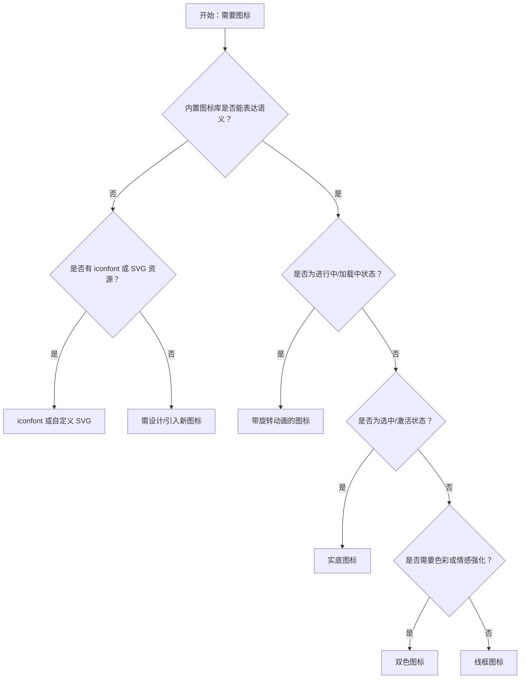

# 1. 简洁易读部份

## 1.0. 组件描述

图标组件用于通过语义化的矢量图形表达概念、操作或状态，提升界面的识别效率与视觉一致性。

## 1.1. 组件构成

图标由以下基础要素构成：

> <!-- 附图占位：建议附上一张示例图，展示图标的构成要素（图形轮廓、填充方式、可选双色）与在不同主题下的表现 -->

&emsp;&emsp;1. **图形轮廓** 定义图标的形状与语义，必须简洁可识别。

&emsp;&emsp;2. **填充方式** 决定图标的视觉风格（线框、实底、双色），影响层级与情感表达。

&emsp;&emsp;3. **尺寸与颜色** 通过样式控制，需与上下文（按钮、文字、表格等）协调一致。

---

## 1.2. 组件包含哪些不同类型

### 1.2.1 线框图标（Outlined）

&emsp;**是什么**：采用描边线条绘制的图标，轮廓清晰，视觉重量较轻

> <!-- 附图占位：建议附上一张示例图，展示线框图标（如 StarOutlined）的视觉形态，体现线条描边的轻盈感 -->

&emsp;**简单用法**：适用于常规状态、未选中、低强调场景；可作为默认图标风格；与实底图标对比时表示「未激活」

&emsp;**典型场景**：导航菜单项、表格操作列、表单标签、列表项前的指示

> <!-- 附图占位：建议附上一张场景图，展示线框图标在导航菜单、表格操作列中的使用，体现常规状态下的标准用法 -->

&emsp;**替代方案**：若需强调选中或高亮，改用实底图标；若需色彩区分，改用双色图标

### 1.2.2 实底图标（Filled）

&emsp;**是什么**：采用实心填充的图标，视觉重量较重，存在感强

> <!-- 附图占位：建议附上一张示例图，展示实底图标（如 StarFilled）的视觉形态，与线框图标对比体现填充后的强调感 -->

&emsp;**简单用法**：必须用于表示选中、激活、已完成等高强调状态；同一组内与线框图标形成「未选/已选」对比；不宜过度使用以免抢主内容

&emsp;**典型场景**：收藏已选、菜单当前项、评分已选、状态为真

> <!-- 附图占位：建议附上一张场景图，展示实底图标表示「已收藏」「当前页」等选中状态的用法 -->

&emsp;**替代方案**：若为常规未选状态，改用线框图标

### 1.2.3 双色图标（TwoTone）

&emsp;**是什么**：采用主色与辅色组合的图标，可传递情感或品牌色彩

> <!-- 附图占位：建议附上一张示例图，展示双色图标（如 StarTwoTone 配粉色主色）的视觉形态，体现双色搭配的层次感 -->

&emsp;**简单用法**：适用于需要色彩区分或情感强化的场景；主色可通过主题或业务色定制；不宜与过多其他色彩同屏竞争

&emsp;**典型场景**：特色功能标识、情感反馈（喜欢、关注）、品牌色强调

> <!-- 附图占位：建议附上一张场景图，展示双色图标在「喜欢」「关注」等情感化场景中的使用 -->

&emsp;**替代方案**：若需保持界面中性克制，改用线框或实底单色图标

### 1.2.4 自定义 SVG 图标

&emsp;**是什么**：通过传入自定义 SVG 组件渲染的图标，满足业务特有图形需求

> <!-- 附图占位：建议附上一张示例图，展示自定义 SVG 图标（如 Logo、业务专用符号）的形态，体现与内置图标的差异 -->

&emsp;**简单用法**：必须用于内置图标库无法覆盖的业务专属图形；需保证与 Ant Design 图标的尺寸、线条风格协调；建议统一管理避免风格混乱

&emsp;**典型场景**：品牌 Logo、业务特有符号、行业专用图标

> <!-- 附图占位：建议附上一张场景图，展示自定义图标在品牌区、业务专属入口中的使用 -->

&emsp;**替代方案**：若内置图标可表达语义，优先使用内置图标保持一致性

### 1.2.5 iconfont 图标

&emsp;**是什么**：通过 iconfont.cn 项目引入的外部字体图标，可扩展图标来源

> <!-- 附图占位：建议附上一张示例图，展示 iconfont 图标的引用与使用方式，体现与内置图标的接入差异 -->

&emsp;**简单用法**：必须用于团队已有 iconfont 项目中的图标；需确保与页面其他图标的视觉风格统一；注意加载与兼容性

&emsp;**典型场景**：企业自有图标库、多项目共享图标、特殊业务图形

> <!-- 附图占位：建议附上一张场景图，展示 iconfont 图标在项目中的使用场景 -->

&emsp;**替代方案**：若 Ant Design 内置或自定义 SVG 可满足，优先使用以简化依赖

### 1.2.6 带旋转动画的图标

&emsp;**是什么**：通过旋转动画表达进行中、加载中等过程态

> <!-- 附图占位：建议附上一张示例图，展示带 spin 的 LoadingOutlined 图标，体现加载中的旋转动画 -->

&emsp;**简单用法**：必须用于加载中、处理中等过程状态；同一视图内不宜出现多个旋转图标；动画需平滑不刺眼

&emsp;**典型场景**：页面加载、按钮提交中、数据刷新中

> <!-- 附图占位：建议附上一张场景图，展示加载图标在按钮、页脚等位置的用法 -->

&emsp;**替代方案**：若为静态状态提示，无需旋转动画

---

## 1.3. 各类型典型场景案例

### 1.3.1 线框与实底

> <!-- 附图占位：建议附上一张对比图，左侧展示导航菜单中未选项目用线框、当前项用实底（符合规范），右侧展示全部使用实底导致层级混乱（违反规范） -->

✅ **推荐：** 未选/常规用线框，选中/激活用实底，形成清晰对比

❌ **不推荐：** 所有状态均用实底或均用线框，导致层级不清

### 1.3.2 双色图标

> <!-- 附图占位：建议附上一张对比图，左侧展示情感化场景适度使用双色图标（符合规范），右侧展示大量双色图标同屏竞争（违反规范） -->

✅ **推荐：** 在少数需要情感强化的场景使用双色图标

❌ **不推荐：** 同一视图内大量使用不同主色的双色图标，造成视觉噪音

### 1.3.3 自定义与内置

> <!-- 附图占位：建议附上一张对比图，左侧展示品牌区用自定义、功能区用内置（符合规范），右侧展示随意混用风格不一的图标（违反规范） -->

✅ **推荐：** 品牌与业务专属用自定义，通用功能用内置，风格统一

❌ **不推荐：** 随意混用多种来源、风格不一致的图标

---

# 2. 选型指南

## 2.1 选择流程

---

# 3. 细致专业部份（交互与排版规则）

## 3.1 多操作的展示与折叠策略（图标密集区域）

在工具栏、表格操作列、菜单等图标密集区域，需注意：

* **数量控制**：同一行或同一组内，可见图标不宜超过 5–7 个；超出部分应收纳进「更多」菜单。
* **语义唯一**：同一区域内，相同图标必须表示相同操作，不同操作必须使用不同图标。
* **纯图标需 Tooltip**：纯图标按钮必须提供悬停提示（Tooltip），说明操作含义。
* **尺寸统一**：同一区域内的图标尺寸需一致，避免大小混乱。

> <!-- 附图占位：建议附上一张场景图，展示表格操作列中 3–4 个图标+「更多」收纳的布局，体现多操作时的图标策略 -->

## 3.2 危险操作（删除/清空/停用）

图标用于危险操作时的规范：

* **颜色区分**：危险操作图标应使用红色或危险色，与常规操作区分。
* **语义明确**：删除、清空、停用等必须使用用户普遍认知的图标（如删除、关闭）。
* **配合文字**：在关键操作中，图标宜与文字一起出现，避免纯图标引起误读。
* **二次确认**：危险操作必须配合二次确认，不可仅靠图标颜色提示。

> <!-- 附图占位：建议附上一张场景图，展示危险操作图标（红色删除）与常规操作图标的对比，体现颜色与语义区分 -->

## 3.3 摆放位置（按页面场景划分）

* **导航菜单**：图标在文字左侧，与文字垂直居中，间距统一。
* **表格操作列**：图标在行尾，可横向排列，间距适中，避免拥挤。
* **按钮内**：图标在文字左侧或右侧，与文字对齐，不挤压文字。
* **标题旁**：若用图标辅助说明，放在标题右侧或左上，尺寸略小于标题。
* **表单项标签**：图标在标签文字左侧，表达字段含义或必填提示。

> <!-- 附图占位：建议附上一张场景图，展示图标在导航、表格、按钮、标题等不同位置的标准摆放 -->

## 3.4 顺序与对齐逻辑

* **水平排列**：图标从左到右按操作频率或重要性排序，主操作在前。
* **垂直排列**：图标与文字基线对齐，多行时保持左对齐或居中对齐一致。
* **与文字间距**：图标与文字之间保留固定间距（如 8px），不宜贴紧或过远。
* **操作列**：危险操作图标排在常规操作之后，与主操作拉开距离。

## 3.5 状态与交互反馈

* **默认**：图标清晰可辨，与背景有足够对比。
* **悬停**：可点击的图标区域需有悬停反馈（如变色、放大），Tooltip 及时出现。
* **禁用**：禁用状态下图标需置灰，不可点击。
* **加载中**：使用带旋转动画的加载图标，明确表示进行中。
* **选中/激活**：通过实底、颜色或勾选标识与未选状态区分。

## 3.6 视觉规范与形态选择

* **线框 vs 实底**：常规用线框，选中用实底；二者可搭配使用形成状态对比。
* **双色使用**：双色图标主色需与品牌或主题色协调，同一页面主色不宜超过 1–2 种。
* **尺寸规范**：小图标 12–14px，常规 16px，大图标 20–24px，需与文字层级匹配。
* **风格统一**：同一产品内优先使用同一图标库（Ant Design / iconfont / 自定义），避免混搭导致风格割裂。

> <!-- 附图占位：建议附上一张示例图，展示不同尺寸、不同主题图标在界面中的层级与搭配关系 -->

---

## 4.0. 常见问题

### 1. 线框图标和实底图标什么时候用哪个？

- **线框图标**：用于常规、未选中、低强调状态，视觉较轻。
- **实底图标**：用于选中、激活、已完成等高强调状态，视觉较重。同一组内两者搭配可形成清晰的「未选/已选」对比。

### 2. 纯图标按钮必须配 Tooltip 吗？

- 是的。纯图标按钮必须提供悬停时的 Tooltip 说明，否则用户难以理解操作含义，尤其在多图标并排时。文字+图标组合可酌情简化 Tooltip。

### 3. 双色图标的主色怎么选？

- 优先使用品牌主色或页面主题色；若为情感化场景（如喜欢、关注），可使用约定俗成的色彩（如粉色、红色）。同一页面内双色图标的主色种类不宜过多，保持视觉统一。
