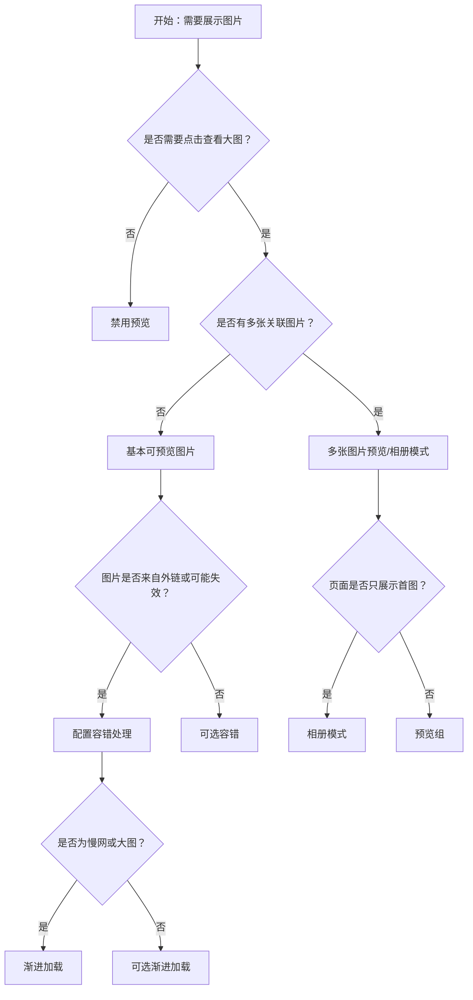

# 1. 简洁易读部份

## 1.0. 组件描述

图片组件用于在页面中展示图片，并提供预览、容错、渐进加载等能力，适用于需要查看大图或对图片展示有质量要求的场景。

## 1.1. 组件构成

图片组件由以下基础要素构成，可按需组合使用：

> <!-- 附图占位：建议附上一张示例图，展示图片的缩略图、预览遮罩、预览浮层的构成关系，标注各要素名称与位置 -->

&emsp;&emsp;1. **缩略图** 在页面中展示的图片本体，可设置尺寸与样式。

&emsp;&emsp;2. **预览遮罩** 悬停时覆盖在缩略图上，提示用户可点击预览，可配置显示与否。

&emsp;&emsp;3. **预览浮层** 点击后全屏或弹层展示大图，支持缩放、旋转、多图切换等操作。

---

## 1.2. 组件包含哪些不同类型

### 1.2.1 基本可预览图片

&emsp;**是什么**：默认形态，点击缩略图可打开全屏预览，支持缩放、旋转等基础操作

> <!-- 附图占位：建议附上一张示例图，展示缩略图与悬停时预览遮罩、点击后全屏预览的形态 -->

&emsp;**简单用法**：适用于需要展示图片且支持查看大图的常规场景；默认可预览，无需额外配置

&emsp;**典型场景**：商品图、头像大图、证件照、内容配图

> <!-- 附图占位：建议附上一张场景图，展示商品详情或列表中的图片点击预览的交互流程 -->

&emsp;**替代方案**：若不需要预览（如纯装饰图），可禁用预览功能

### 1.2.2 容错处理

&emsp;**是什么**：图片加载失败时展示占位图或 fallback 图，避免裂图影响体验

> <!-- 附图占位：建议附上一张示例图，展示加载失败时显示占位图或 fallback 的形态 -->

&emsp;**简单用法**：必须用于依赖外部图片地址的场景；fallback 图需与业务或品牌协调，避免突兀

&emsp;**典型场景**：用户上传图、外链图、CDN 图片可能失效的场景

> <!-- 附图占位：建议附上一张场景图，展示图片加载失败时 fallback 占位的展示效果 -->

&emsp;**替代方案**：若图片源绝对可靠，可不配置 fallback，但仍建议预留容错

### 1.2.3 渐进加载

&emsp;**是什么**：大图加载时先展示模糊占位或骨架，加载完成后再展示清晰图，减少空白等待感

> <!-- 附图占位：建议附上一张示例图，展示占位图与加载完成后的过渡效果 -->

&emsp;**简单用法**：适用于大图、慢网场景；占位可为模糊缩略图或统一占位图

&emsp;**典型场景**：高清大图、相册、图片列表首屏加载

> <!-- 附图占位：建议附上一张场景图，展示大图从模糊占位过渡到清晰图的加载过程 -->

&emsp;**替代方案**：若图片体积小、加载快，可不用渐进加载

### 1.2.4 多张图片预览（预览组）

&emsp;**是什么**：多张图片作为一组，预览时可左右切换浏览，适用于相册、图集场景

> <!-- 附图占位：建议附上一张示例图，展示预览组内多图切换、计数指示的形态 -->

&emsp;**简单用法**：必须用于同一上下文中的多张关联图片；需提供明确的切换指示（如左右箭头、计数）

&emsp;**典型场景**：商品多图、相册、工单附件、文档配图集

> <!-- 附图占位：建议附上一张场景图，展示商品多图点击后进入预览组、可左右切换的交互 -->

&emsp;**替代方案**：若图片彼此独立、无关联，使用单图预览即可

### 1.2.5 相册模式（从单图进入预览组）

&emsp;**是什么**：页面只展示一张缩略图，但点击后进入含多图的预览组，从单点进入相册

> <!-- 附图占位：建议附上一张示例图，展示单图缩略 + 点击后多图预览组的形态 -->

&emsp;**简单用法**：适用于首图作为入口、其余为辅的场景；需保证用户能感知「还有更多」

&emsp;**典型场景**：商品首图点开查看全部、动态封面点开查看大图组

> <!-- 附图占位：建议附上一张场景图，展示首图作为入口、点击后展开相册的交互流程 -->

&emsp;**替代方案**：若多图均需在页面展示，直接用预览组包裹多张图

### 1.2.6 禁用预览

&emsp;**是什么**：仅展示图片，不提供点击预览功能，适用于纯展示、无需放大的场景

> <!-- 附图占位：建议附上一张示例图，展示禁用预览时无遮罩、无点击放大的形态 -->

&emsp;**简单用法**：适用于小图、装饰图、或业务上不允许放大的场景

&emsp;**典型场景**：图标、小头像、固定尺寸的装饰图

> <!-- 附图占位：建议附上一张场景图，展示列表中无需预览的小图使用禁用预览的形态 -->

&emsp;**替代方案**：若用户可能需要查看大图，应保留预览

### 1.2.7 自定义预览遮罩

&emsp;**是什么**：可自定义缩略图悬停时的遮罩内容，如「查看大图」「下载」等文案或图标

> <!-- 附图占位：建议附上一张示例图，展示自定义遮罩文案或图标的形态 -->

&emsp;**简单用法**：用于需要强调预览或附加操作（如下载）的场景；遮罩内容需简洁

&emsp;**典型场景**：需要引导「查看原图」、或提供下载入口的图片展示

> <!-- 附图占位：建议附上一张场景图，展示自定义「查看原图」「下载」遮罩的布局 -->

&emsp;**替代方案**：若无需额外引导，使用默认遮罩即可

---

## 1.3. 各类型典型场景案例

### 1.3.1 单图与多图预览

> <!-- 附图占位：建议附上一张对比图，左侧展示单图使用基本预览（符合规范），右侧展示多图使用预览组可切换（符合规范） -->

✅ **推荐：** 单图用基本预览，关联多图用预览组

❌ **不推荐：** 多图分别独立预览，用户无法在预览中切换

### 1.3.2 容错与渐进加载

> <!-- 附图占位：建议附上一张对比图，左侧展示加载失败时 fallback（符合规范），右侧展示大图加载时占位（符合规范） -->

✅ **推荐：** 外链图配置容错，大图使用渐进加载占位

❌ **不推荐：** 加载失败留白或裂图，大图加载无任何反馈

### 1.3.3 是否需要预览

> <!-- 附图占位：建议附上一张对比图，左侧展示需查看细节的图保留预览（符合规范），右侧展示纯装饰小图禁用预览（符合规范） -->

✅ **推荐：** 需查看细节时保留预览，纯装饰时禁用预览

❌ **不推荐：** 所有图片一律可预览或一律不可预览，未按场景区分

---

# 2. 选型指南

## 2.1 选择流程

---

# 3. 细致专业部份（交互与排版规则）

## 3.1 缩略图尺寸与比例

* **尺寸约束**：缩略图应设置合理宽高，避免撑破布局或过小难以辨认；可结合容器使用 `object-fit` 保持比例。
* **比例一致**：同一列表或栅格中的图片建议统一比例，保证视觉整齐。
* **响应式**：不同断点下可调整图片尺寸，小屏可适当缩小以节省空间。

> <!-- 附图占位：建议附上一张场景图，展示列表或卡片中图片统一尺寸与比例的一致性 -->

## 3.2 预览浮层与操作

* **关闭方式**：预览需支持点击遮罩、关闭按钮、ESC 键等方式关闭，符合用户预期。
* **操作栏**：缩放、旋转、下载等操作需清晰可辨，图标语义明确。
* **多图切换**：预览组内需提供左右箭头或指示器，方便用户切换；可支持键盘左右键。

> <!-- 附图占位：建议附上一张示例图，展示预览浮层的操作栏与多图切换控件的布局 -->

## 3.3 遮罩与可发现性

* **遮罩提示**：悬停时遮罩应明确提示「可预览」，避免用户不知可点击。
* **遮罩位置**：遮罩可居中、顶部或底部，根据设计规范统一；自定义遮罩内容需简洁。
* **禁用预览**：禁用预览时不应展示「查看大图」等会误导的遮罩。

> <!-- 附图占位：建议附上一张对比图，展示可预览与禁用预览时遮罩的差异 -->

## 3.4 容错与占位

* **Fallback 图**：应使用中性、不易引起误读的占位图，与业务风格协调。
* **占位文案**：若需提示加载失败，可配合简短文案（如「加载失败」），避免仅留空白。
* **重试**：可根据业务决定是否提供「重新加载」入口。

> <!-- 附图占位：建议附上一张示例图，展示加载失败时的 fallback 与可选重试入口 -->

## 3.5 预览浮层与嵌套

* **弹窗/抽屉内**：图片嵌套在 Modal、Drawer 内时，需注意预览浮层的 `z-index` 与挂载位置，避免被遮挡。
* **全屏展示**：预览通常全屏或近全屏展示，确保大图有足够展示空间。

> <!-- 附图占位：建议附上一张场景图，展示弹窗内图片预览时浮层层级与挂载的正确处理 -->

## 3.6 无障碍与可访问性

* **alt 文案**：图片需设置有意义的 `alt` 描述，便于辅助技术读取。
* **键盘操作**：预览浮层需支持键盘关闭、切换等操作。
* **焦点管理**：打开预览时焦点应移入浮层，关闭后焦点应回到触发元素。

> <!-- 附图占位：建议附上一张说明图，展示 alt 与键盘焦点的可访问性要点 -->

---

## 4.0. 常见问题

### 1. 图片组件和普通 img 的区别是什么

- **图片组件**：内置预览、容错、渐进加载等能力，适合需要交互与容错的产品场景。
- **普通 img**：仅展示，无预览与容错，适合纯静态、无需放大的场景。

### 2. 何时使用预览组（多图预览）

- **使用场景**：同一上下文下有多张关联图片，用户需要连续浏览时，如商品多图、相册、附件列表。
- **单图场景**：仅一张图时使用基本预览即可，无需预览组。

### 3. 容错 fallback 如何设置

- **原则**：所有依赖外部地址的图片建议配置 fallback，避免裂图。
- **形态**：fallback 可为统一占位图、简洁图标或业务定制图，需与页面风格协调。
