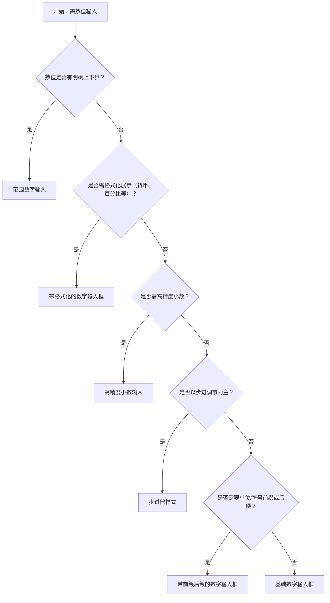

# 1. 简洁易读部份

## 1.0. 组件描述

数字输入框用于输入或调节标准数值，通过键盘输入或增减按钮改变数值，并支持范围限制、格式化展示等。适用于需要精确数值录入的表单场景，与自由文本输入框形成明确区分。

## 1.1. 组件构成

数字输入框由以下基础要素构成，可按需组合使用：

> <!-- 附图占位：建议附上一张示例图，展示数字输入框的三个基础要素（输入区、增减按钮、可选前后缀）的构成关系，标注各要素名称与位置 -->

&emsp;&emsp;1. **输入区** 展示与录入数值的主要区域；支持键盘输入与格式化展示；占位符可说明预期范围或单位。

&emsp;&emsp;2. **增减按钮** 通过点击或键盘、滚轮调节数值的步进入口；可隐藏（纯键盘输入）或采用步进器（拨轮）形态。

&emsp;&emsp;3. **前后缀** 可选的前缀图标或后缀单位，用于表达货币、单位、百分比等含义。

---

## 1.2. 组件包含哪些不同类型

### 1.2.1 基础数字输入框

&emsp;**是什么**：标准数值输入，带增减按钮，无格式或单位修饰

> <!-- 附图占位：建议附上一张示例图，展示基础数字输入框的视觉形态（输入区 + 右侧增减按钮） -->

&emsp;**简单用法**：用于最通用的数值录入；支持步进调节（步长可配置）；可配置 min、max 限制范围；占位符可说明范围或单位。

&emsp;**典型场景**：数量、年龄、数量级、简单评分

> <!-- 附图占位：建议附上一张场景图，展示表单中「购买数量」「年龄」等字段使用基础数字输入框的布局 -->

&emsp;**替代方案**：若需货币、百分比等格式，改用带格式化的数字输入框；若需高精度小数，改用高精度小数输入

### 1.2.2 带格式化的数字输入框

&emsp;**是什么**：输入值按指定格式展示（如千分位、货币符号、百分比），实际存储为纯数字

> <!-- 附图占位：建议附上一张示例图，展示带格式化数字输入框的视觉形态（如 ￥1,234.56 或 85%） -->

&emsp;**简单用法**：必须用于需要展示格式而非纯数字的场景；formatter 与 parser 需成对配置，保证输入输出一致；格式不得干扰输入与光标位置。

&emsp;**典型场景**：金额输入、百分比、带千分位的数量、汇率换算

> <!-- 附图占位：建议附上一张场景图，展示金额或价格输入框带货币符号与千分位格式的布局 -->

&emsp;**替代方案**：若无需格式化展示，使用基础数字输入框；若为纯展示，使用 Statistic 等展示组件

### 1.2.3 步进器样式

&emsp;**是什么**：以拨轮形态呈现，突出增减操作，输入区相对弱化

> <!-- 附图占位：建议附上一张示例图，展示步进器样式（spinner）的视觉形态（上下箭头突出、输入区紧凑） -->

&emsp;**简单用法**：适用于以步进调节为主、键盘输入为辅的场景；步长需与业务匹配（如 1、0.1、10）；不适合需要大数值直接输入的场合。

&emsp;**典型场景**：数量选择（如购物车数量）、简单配置参数、评分调节

> <!-- 附图占位：建议附上一张场景图，展示商品数量选择使用步进器样式的布局 -->

&emsp;**替代方案**：若用户常直接输入大数值，使用默认输入框形态；若需紧凑展示，可考虑小尺寸

### 1.2.4 范围数字输入

&emsp;**是什么**：通过 min、max 限制可输入范围，超限时给予提示或自动约束

> <!-- 附图占位：建议附上一张示例图，展示范围数字输入框在正常、接近边界、超出边界时的视觉反馈 -->

&emsp;**简单用法**：必须用于有明确上下界的业务；超出范围时可根据策略标红或提示；失焦时可自动修正到范围内；需在占位或帮助信息中说明范围。

&emsp;**典型场景**：年龄（0–150）、库存数量（0–9999）、折扣（0–100）、分数（0–100）

> <!-- 附图占位：建议附上一张场景图，展示「库存数量」限制 0–9999 时的范围输入与超限提示 -->

&emsp;**替代方案**：若无数值边界，使用基础数字输入框；若边界复杂，可配合 Slider 或自定义校验

### 1.2.5 带前缀后缀的数字输入框

&emsp;**是什么**：在输入区前后附加图标或单位文本，表达货币、单位等

> <!-- 附图占位：建议附上一张示例图，展示带「￥」前缀或「元」后缀的数字输入框形态 -->

&emsp;**简单用法**：前缀常用于货币、单位符号；后缀可表达单位（如元、个、％）；前后缀不得侵入输入区，需有清晰分隔。

&emsp;**典型场景**：金额（￥、$）、数量单位（个、件）、百分比（%）

> <!-- 附图占位：建议附上一张场景图，展示金额输入框带「￥」前缀与「元」后缀的布局 -->

&emsp;**替代方案**：若无需单位强调，使用基础数字输入框；若格式复杂，配合 formatter 使用

### 1.2.6 高精度小数输入

&emsp;**是什么**：支持超出常规浮点精度的数值，避免精度丢失；适用于金融、科学计算等场景

> <!-- 附图占位：建议附上一张示例图，展示高精度小数输入框（可配置 stringMode）的视觉形态 -->

&emsp;**简单用法**：必须用于对精度敏感的数值；需开启 stringMode 等能力；展示格式与精度需与业务约定一致；需注意老旧环境兼容。

&emsp;**典型场景**：金额计算、费率、科学数值、高精度统计

> <!-- 附图占位：建议附上一张场景图，展示金融或费率场景使用高精度数字输入框的布局 -->

&emsp;**替代方案**：若常规精度足够，使用基础数字输入框；若为展示用途，使用 Statistic 等组件

### 1.2.7 形态变体

&emsp;**是什么**：通过 variant 控制视觉形态，如 outlined、filled、borderless、underlined

> <!-- 附图占位：建议附上一张示例图，展示数字输入框的 outlined、filled、borderless、underlined 四种形态对比 -->

&emsp;**简单用法**：与页面整体输入控件风格统一；outlined 为默认，适合大多数场景；borderless、underlined 适合表格内嵌、紧凑布局；filled 适合强调输入区域。

&emsp;**典型场景**：表单内通常用 outlined；表格内可选用 borderless；简约布局可选用 underlined

> <!-- 附图占位：建议附上一张场景图，展示表格内数字列使用 borderless 形态、与表格风格融合的效果 -->

&emsp;**替代方案**：与同页其它输入控件保持一致即可，无固定规则

---

## 1.3. 各类型典型场景案例

### 1.3.1 基础数字输入框

> <!-- 附图占位：建议附上一张对比图，左侧展示通用数值使用数字输入框（符合规范），右侧展示应输入数值却使用文本输入框导致校验复杂（违反规范） -->

✅ **推荐：** 需要数值类型录入时使用数字输入框，保证类型与范围可控

❌ **不推荐：** 数值类字段使用文本输入框，依赖后期校验与转换

### 1.3.2 带格式化

> <!-- 附图占位：建议附上一张对比图，左侧展示金额使用带格式化的数字输入框（符合规范），右侧展示金额使用纯数字无格式（违反规范） -->

✅ **推荐：** 金额、百分比等需展示格式的场景使用 formatter 与 parser

❌ **不推荐：** 金额等业务上需千分位、符号的场景直接用纯数字展示

### 1.3.3 步进器样式

> <!-- 附图占位：建议附上一张对比图，左侧展示以调节为主的场景使用步进器（符合规范），右侧展示需大数值直接输入的场景使用步进器（违反规范） -->

✅ **推荐：** 以增减调节为主、步长固定的场景使用步进器样式

❌ **不推荐：** 用户需频繁直接输入大数值时使用步进器，操作效率低

### 1.3.4 范围数字输入

> <!-- 附图占位：建议附上一张对比图，左侧展示有边界的业务配置 min/max 并提示（符合规范），右侧展示有边界却不限制导致非法值（违反规范） -->

✅ **推荐：** 业务有明确上下界时配置 min、max，并给出超限反馈

❌ **不推荐：** 存在合理范围却不限制，依赖提交后校验

---

# 2. 选型指南

## 2.1 选择流程

---

# 3. 细致专业部份（交互与排版规则）

## 3.1 多操作的展示与折叠策略

* **增减按钮**：默认显示增减按钮时，位于输入区右侧；可配置为不显示，仅支持键盘输入；步进器样式下增减按钮更突出。
* **前后缀与按钮**：前缀、后缀、增减按钮同时存在时，顺序为：前缀 | 输入区 | 后缀/增减；需避免元素过多导致拥挤。
* **组合输入**：若与下拉、单位选择器组合，参考 Space.Compact 等方式保持视觉一体。

> <!-- 附图占位：建议附上一张场景图，展示数字输入框「前缀 | 输入区 | 增减按钮」的排列结构 -->

## 3.2 危险操作（删除/清空/停用）

* **清空**：数字输入框可配置 allowClear 等清除能力；清除后通常为空或默认值，属轻量操作，无需二次确认。
* **禁用**：通过 disabled 禁用时，输入区与增减按钮均不可操作；需明确置灰样式。
* **超出范围**：受控模式下值超出 min/max 时，可以错误或警告样式提示，而非静默截断；需在帮助信息中说明合法范围。

> <!-- 附图占位：建议附上一张示例图，展示数字输入框的禁用态与超出范围时的警告样式 -->

## 3.3 摆放位置（按页面场景划分）

* **表单内**：与其它表单项对齐，标签、占位符说明范围或单位；多字段时保持间距与尺寸一致。
* **表格内**：若表格单元格内嵌可编辑数字，选用 borderless 等紧凑形态；注意弹层不被遮挡。
* **配置面板**：与 Slider、Select 等控件配合时，保持视觉层级一致；数字输入框常用于精确值，Slider 常用于范围调节。

> <!-- 附图占位：建议附上一张场景图，展示表单中数字输入框与其它控件的对齐关系 -->

## 3.4 顺序与对齐逻辑

* **与单位**：单位作为后缀时置于输入框右侧；作为前缀时置于左侧；单位与数值之间需有分隔，避免混淆。
* **步长**：step 需与业务匹配（如 1、0.1、10）；小数位数较多时，需配合 precision 或 formatter 控制展示。
* **多控件**：同一行多个数字输入框时，宽度可统一或按内容分配；对齐方式与同区域其它控件一致。

> <!-- 附图占位：建议附上一张场景图，展示「单价」「数量」「小计」等数字输入框的横向排列与单位位置 -->

## 3.5 状态与交互反馈

* **默认**：可输入、可步进；占位符说明范围或单位。
* **聚焦**：聚焦时边框或背景高亮；键盘上下箭头可步进（若启用 keyboard）。
* **输入中**：输入非法字符时可根据策略忽略或提示；失焦时可尝试解析并修正。
* **禁用**：整体置灰，不可输入、不可步进。
* **只读**：可聚焦、可复制，但不可编辑；可隐藏增减按钮。
* **错误/警告**：校验失败或超出范围时，边框与提示为错误或警告色；需明确错误原因（如「不能小于 0」）。

> <!-- 附图占位：建议附上一张状态示意图，展示数字输入框的默认、聚焦、禁用、错误四种状态 -->

## 3.6 视觉规范与形态选择

* **形态变体**：outlined、filled、borderless、underlined 需与页面输入控件统一；表格内常用 borderless。
* **尺寸**：与同区域控件统一（large/medium/small）；表单内常用 medium。
* **增减按钮**：可配置为始终显示或悬浮时显示；与输入区高度协调，不挤压输入区域。
* **精度与格式**：小数位数、千分位、货币符号等需与业务和地域习惯一致；避免格式与语义冲突。

> <!-- 附图占位：建议附上一张示例图，展示数字输入框的三种尺寸与四种形态变体 -->

---

## 4.0. 常见问题

### 1. 数字输入框和文本输入框如何选择？

- **数字输入框**：输入内容为数值，支持步进、范围限制、格式化；适用于数量、金额、年龄等数值字段。
- **文本输入框**：输入内容为任意文本；适用于姓名、描述、编码等。若业务需要数值，应使用数字输入框以避免类型与校验问题。

### 2. 何时使用带格式化的数字输入框？

- 当用户需要看到千分位、货币符号、百分比等格式时，应使用 formatter 与 parser 实现格式化展示。
- 存储与提交仍为纯数字，展示层做格式转换；常见于金额、费率、百分比等场景。

### 3. 步进器样式和默认样式如何选？

- **步进器样式**：强调增减操作，适合数量、配置参数等以步进为主的场景。
- **默认样式**：输入与步进并重，适合用户常直接输入具体数值的场景。若需频繁输入大数值，推荐默认样式。
