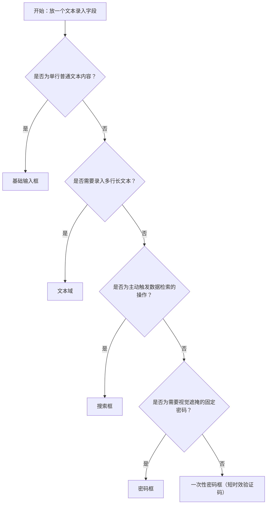

# 1. 简洁易读部份

## 1.0. 组件描述

输入框组件用于采集用户通过键盘录入的文本信息，是表单体系中最核心的单项数据录入入口，覆盖从单行文本、多行内容、搜索检索到密码验证的各类录入场景。

## 1.1. 组件构成

输入框由以下基础要素构成，可按需组合使用：

> <!-- 附图占位：建议附上一张示例图，展示输入框的五个基础要素（输入容器、内容区、前缀区、后缀区、占位文本）的位置关系，标注各要素名称，图类型为示例图，传达：各要素在输入框整体结构中的空间分工 -->

&emsp;&emsp;1. **输入容器** 定义输入框的边界范围与视觉形态，承载描边、填充、无边框、下划线四种变体样式，是用户感知可输入区域的首要视觉依据。

&emsp;&emsp;2. **内容区** 承载用户录入的文字，是组件最核心的交互区域，宽度决定可见字符量。

&emsp;&emsp;3. **前缀区** 位于内容区左侧，用于放置与字段语义强相关的图标或文字标识（如货币符号、网址协议前缀），不可放置可点击操作。

&emsp;&emsp;4. **后缀区** 位于内容区右侧，用于放置辅助操作（如清除按钮、密码显隐切换图标）或状态图标，可交互元素必须放置于此区域而非前缀区。

&emsp;&emsp;5. **占位文本** 在输入框为空时展示内容提示，引导用户理解预期录入内容；用户开始输入后自动消失，不可用于代替字段标签。

---

## 1.2. 组件包含哪些不同类型

### 1.2.1 基础输入框

&emsp;**是什么**：用于单行纯文本内容录入的标准输入形态，是输入框中特殊条件最少、适用范围最广的默认类型

> <!-- 附图占位：建议附上一张示例图，展示基础输入框（描边样式、单行、带占位文本）的视觉形态，标注前缀区、内容区、后缀区三个主要区域，体现其在五种输入框类型中最通用的外观特征 -->

&emsp;**简单用法**：用于单行纯文本内容录入；占位文本必须清晰说明字段的预期录入格式或示例值；同一表单内所有基础输入框的尺寸必须统一；可根据字段特征搭配前缀、后缀或字数计数

&emsp;**典型场景**：姓名、邮箱、手机号、标题、关键词等单行文本信息字段

> <!-- 附图占位：建议附上一张场景图，展示登录表单中用户名字段使用基础输入框的完整布局——上方有字段标签「用户名」，输入框前缀区有用户图标，后缀区有清除按钮，占位文本为「请输入用户名」，体现基础输入框在常规表单中的标准使用方式 -->

&emsp;**替代方案**：若需要录入多行内容，改用文本域；若字段语义为搜索检索，改用搜索框

### 1.2.2 文本域

&emsp;**是什么**：用于多行长文本录入的输入形态，支持高度随内容自适应或手动拖拽调整，提供比基础输入框更大的内容展示空间

> <!-- 附图占位：建议附上一张示例图，展示文本域（多行、右下角带高度拖拽手柄、底部显示字数计数「0/200」）的视觉形态，与单行基础输入框并排对比，体现高度差异与多行录入特征 -->

&emsp;**简单用法**：必须用于内容超过一行的录入场景；当字段有字数上限时必须配合字数计数提示；建议开启高度自适应并设置最小行数与最大行数，防止内容量极端时撑破布局；不可将文本域用于单行短文本录入，会使页面产生过多空白空间

&emsp;**典型场景**：备注、项目描述、评论、消息正文等多行内容字段

> <!-- 附图占位：建议附上一张场景图，展示表单中「项目描述」文本域开启高度自适应后随内容增长而向下撑高的形态，右下角同步显示字数计数「48/500」，体现高度自适应与字数提示的配合使用规则 -->

&emsp;**替代方案**：若用户只需录入单行内容，改用基础输入框；若需要富文本格式排版能力，改用富文本编辑器

### 1.2.3 搜索框

&emsp;**是什么**：内置搜索触发机制的输入形态，支持点击搜索按钮或按下回车键主动触发数据检索行为

> <!-- 附图占位：建议附上一张示例图，展示搜索框（右侧附有「搜索」按钮）的视觉形态，与基础输入框并排对比，体现搜索框在后缀区多出明确触发按钮的差异，传达：搜索框的触发机制是其区别于普通输入框的核心特征 -->

&emsp;**简单用法**：必须用于主动触发数据检索类操作；搜索触发后必须立即展示加载状态并锁定搜索入口，防止用户重复提交；搜索框应独立放置于列表或表格上方工具栏，不与普通表单字段混排

&emsp;**典型场景**：列表页顶部关键词检索、弹窗内数据筛选

> <!-- 附图占位：建议附上一张场景图，展示表格上方工具栏中搜索框的位置（靠右区域），以及用户触发搜索后搜索按钮内出现加载旋转图标的视觉状态，体现搜索框在工具栏中的标准位置与加载状态的必要性 -->

&emsp;**替代方案**：若只需随用户输入实时过滤本地数据，改用基础输入框配合变更回调；若筛选条件复杂（超过三个维度），改用独立筛选表单

### 1.2.4 密码框

&emsp;**是什么**：专用于密码类敏感信息录入的输入形态，内容默认以圆点遮掩，后缀区提供显隐切换操作

> <!-- 附图占位：建议附上一张示例图，展示密码框（内容以圆点遮掩、后缀区有眼睛图标切换按钮）的视觉形态，与基础输入框并排对比，体现密码框在安全性语义与交互结构上的差异 -->

&emsp;**简单用法**：必须用于密码、鉴权令牌等需要视觉遮掩的敏感字段；不可用于非敏感信息录入，避免使用户对字段的安全语义产生误解；显隐切换图标必须始终可见，确保用户可自主控制内容可见性

&emsp;**典型场景**：登录密码、注册密码确认、修改密码、访问令牌

> <!-- 附图占位：建议附上一张状态图，展示密码框在两种状态下的对比：左侧为遮掩状态（内容显示为圆点、眼睛图标为闭合态），右侧为明文状态（内容可读、眼睛图标为睁开态），体现密码框显隐切换的核心交互功能 -->

&emsp;**替代方案**：若字段内容为非敏感信息，改用基础输入框

### 1.2.5 一次性密码框

&emsp;**是什么**：由多个独立输入格子横排组成的验证码录入形态，专用于短时效、固定位数的一次性身份验证场景

> <!-- 附图占位：建议附上一张示例图，展示一次性密码框（六个独立方形格子横排、每格容纳一位字符、格间有等距间隔）的视觉形态，与基础输入框对比，体现其多格并排的结构与专属验证码的场景语义 -->

&emsp;**简单用法**：必须用于短信验证码、邮箱验证码等一次性验证场景；格子数量必须与实际验证码位数严格一致；不可用于普通密码或长期密码录入，该组件的语义专属于短时效一次性验证，用于其他场景会误导用户操作预期

&emsp;**典型场景**：登录二次验证、账号注册短信验证、找回密码邮箱验证码

> <!-- 附图占位：建议附上一张场景图，展示二次验证弹窗的完整布局——上方有「验证码已发送至 +86 138****0000」说明文字，中间为六格一次性密码框，下方有「重新发送（59s）」倒计时文字，体现一次性密码框在验证码录入场景中的标准使用方式 -->

&emsp;**替代方案**：若为需要长期记忆的固定密码，改用密码框

---

## 1.3. 各类型典型场景案例

### 1.3.1 基础输入框

> <!-- 附图占位：建议附上一张对比图，左侧展示表单中所有基础输入框尺寸统一、占位文本清晰描述格式要求（符合规范），右侧展示同一表单中大中小尺寸输入框混用、占位文本仅写「请输入」（违反规范），体现尺寸统一与占位文本有效性的规范要求 -->

✅ **推荐：** 同一表单内所有基础输入框尺寸保持统一，占位文本清晰说明字段的预期录入内容或格式

❌ **不推荐：** 同一表单中混用不同尺寸，或占位文本模糊仅写「请输入」，导致用户无法判断应填写何种内容格式

### 1.3.2 文本域

> <!-- 附图占位：建议附上一张对比图，左侧展示文本域开启高度自适应且右下显示字数计数「48/500」（符合规范），右侧展示文本域固定高度且内容溢出后被截断、无字数提示（违反规范），传达：文本域必须配合高度自适应与字数计数来保障用户感知录入边界 -->

✅ **推荐：** 文本域开启高度自适应并配有字数计数，用户始终可感知内容边界

❌ **不推荐：** 文本域固定高度且无字数限制提示，内容超出后用户无法得知已超边界

### 1.3.3 搜索框

> <!-- 附图占位：建议附上一张对比图，左侧展示搜索框独立置于列表工具栏且触发后出现加载状态（符合规范），右侧展示搜索框嵌入普通表单字段之间或触发后无任何加载反馈（违反规范），传达：搜索框的位置独立性与加载状态是防止误操作的关键 -->

✅ **推荐：** 搜索框独立放置于工具栏，触发搜索后立即展示加载状态

❌ **不推荐：** 将搜索框混入普通表单字段之间，或触发后无任何状态反馈，导致用户不确定是否已触发检索

### 1.3.4 密码框与一次性密码框

> <!-- 附图占位：建议附上一张对比图，左侧展示密码框用于登录密码字段、一次性密码框用于短信验证码（各自场景正确，符合规范），右侧展示一次性密码框被误用于登录密码录入（违反规范），传达：两种组件在场景语义上的本质差异，误用会破坏用户对验证码短时效特征的预期 -->

✅ **推荐：** 密码框用于需要长期记忆的固定密码，一次性密码框专属短时效验证码场景

❌ **不推荐：** 将一次性密码框误用于登录密码录入，使用户产生「正在输入验证码」的错误心理预期

---

# 2. 选型指南

## 2.1 选择流程

---

# 3. 细致专业部份（交互与排版规则）

为了保持表单清晰易用、降低用户录入错误率，当页面中出现多个输入字段或复合型录入场景时，请参考以下排版和交互规则：

## 3.1 多字段的组合与分组策略

在表单中存在多个输入字段时，需按以下逻辑组织字段布局：

* **语义分组**：语义相关的字段必须归入同一分组，并使用小标题或视觉区隔清晰标注分组含义；无关字段不可混排于同一分组，防止用户产生字段关联误解。
* **紧凑组合**：当多个字段语义紧密且需要联合使用时（如区号 + 手机号、协议前缀 + 网址），可使用紧凑组合将其合并为一个视觉单元；紧凑组合内的字段不可在语义上独立成为完整信息。
* **单列优先**：移动端或弹窗表单中，优先使用单列布局以确保输入宽度足够；桌面端宽表单可使用双列布局，但语义强相关的字段必须相邻排列。

> <!-- 附图占位：建议附上一张场景图，展示表单中「联系方式」分组包含手机号（带区号紧凑组合）与邮箱两个字段、「账号安全」分组包含密码与确认密码两个密码框的完整布局，体现语义相关字段归组、分组标题隔离与紧凑组合的使用规则 -->

## 3.2 清空与覆盖等不可逆录入操作

**如何界定「不可逆录入操作」？**

* **属于不可逆**：用户已填写并保存过的字段内容被整体清空、被系统静默覆盖，或批量导入操作会替换所有已填内容。
* **不属于不可逆**：用户主动通过清除图标删除仍未保存的临时输入内容（如刚刚输入的文字尚未提交）。

**针对不可逆录入操作的处理规范：**

* **二次确认**：若清空操作会影响已持久化的数据，必须在执行前弹出确认提示，明确列出将被清除的数据范围，不可静默执行。
* **导入覆盖提示**：若「导入」或「批量粘贴」操作会替换当前已填内容，必须提前告知用户现有内容将被替换，给用户撤回决策的机会。
* **视觉区分**：触发不可逆操作的入口（如「清空全部」）必须采用警示色，且不可作为输入框内部的后缀图标，避免在正常录入过程中被误触。

> <!-- 附图占位：建议附上一张场景图，展示用户点击「清空全部」后弹出的二次确认弹窗，弹窗明确列出将被清除的数据范围，并提供红色「确认清空」执行按钮与「取消」按钮，传达：对已保存内容的清空必须设置拦截机制 -->

## 3.3 摆放位置（按页面场景划分）

为确保用户在不同场景下都能直觉地定位输入字段：

* **长表单（滚动区域）**：输入字段随页面正常流排列，操作按钮（如「保存」「提交」）建议吸底固定；输入字段本身不应悬浮，必须保持在文档流中。
* **弹窗表单**：输入字段放置于弹窗主体区域，操作按钮置于弹窗底部固定栏；当弹窗内容超出视口高度时，字段区域可滚动，底部按钮区域保持固定。
* **行内编辑**：表格或列表中需要就地编辑的字段，输入框直接替换该单元格的展示内容，输入框宽度必须与所在列宽保持一致。
* **工具栏搜索**：搜索框置于列表或表格上方工具栏内，与筛选条件处于同一视觉带，不与正文数据区混排。

> <!-- 附图占位：建议附上一张场景图，展示表格行内编辑的两个状态对比：左侧为展示态（单元格显示文本值），右侧为编辑态（单元格替换为基础输入框，宽度与列宽对齐），传达：行内编辑场景下输入框必须与列宽对齐、不应超出单元格边界 -->

## 3.4 标签、占位文本与提示信息的排列规则

输入字段的辅助文字按语义分为三类，排列位置有明确规定：

* **字段标签（Label）**：标识字段名称，必须置于输入框上方（顶部对齐）或左侧（左对齐）；标签必须在用户输入后仍保持可见，**不可用占位文本代替标签**。
* **占位文本（Placeholder）**：置于输入框内部，用于说明输入格式或示例值；内容应为格式示例（如「如：138 0000 0000」），而非重复字段名称（如「请输入手机号」）。
* **辅助说明文字**：对字段的格式要求或注意事项进行补充，必须置于输入框正下方；字数控制在一行以内，超出时改用悬浮提示（Tooltip）图标触发展示。

> <!-- 附图占位：建议附上一张对比图，左侧展示「标签在上、占位文本在内、辅助说明在下」三层标准排列（符合规范），右侧展示用占位文本代替标签、导致用户输入后无法看到字段名称的错误做法（违反规范），传达：三类辅助文字的语义分工与位置规则 -->

## 3.5 状态与交互反馈

输入框必须提供清晰、可感知的状态与视觉反馈：

* **默认**：边界清晰，占位文本完整可读，明确标识可输入区域。
* **聚焦**：边框高亮为激活色（蓝色）并带有发光阴影，明确指示当前活动字段。
* **悬停**：边框颜色适度加深，提供可交互的视觉暗示。
* **错误（error）**：边框变为红色，必须同时在输入框下方展示具体错误原因，**严禁仅改变颜色而不说明错误原因**。
* **警告（warning）**：边框变为橙色，并在下方配合提示文字说明注意事项。
* **禁用**：整体置灰且不可点击；**严禁以「点击后弹出报错」代替禁用状态**，条件不满足时必须提前置灰。
* **加载中（搜索框）**：触发搜索后搜索按钮进入加载旋转状态并锁定，阻止重复提交，加载完成后自动恢复可操作状态。

## 3.6 视觉规范与形态选择

**四种形态变体的选用原则：**

* **描边形态（默认）**：带有明显边框，边界感最强，适用于绝大多数表单与数据录入场景，是优先选择的默认形态。

> <!-- 附图占位：建议附上一张示例图，并排展示输入框的四种形态变体（描边、填充、无边框、下划线），标注各自名称，传达：四种形态在边界视觉强度上的递减关系，以及各自适用的设计氛围 -->

* **填充形态**：无描边但有背景填充色，视觉较轻盈，适用于需要减弱边框存在感、与页面背景融合的场景（如卡片内嵌输入框）；聚焦时必须出现明显边框，不可全程无边框。
* **无边框形态**：无边框无背景，视觉最轻，适用于界面极简或背景已有足够层次区分的场景；必须确保输入区域边界仍可被用户感知（如通过下方分割线或明显背景色区分），不可在无任何视觉锚点的区域使用。
* **下划线形态**：仅保留底部一条下划线，适用于特定品牌风格或轻量化行内编辑场景。

**形态统一要求：**

* 同一表单内的所有输入框必须使用同一种形态，**不可在同一表单中混用多种形态**，否则会破坏视觉一致性并使用户误以为不同形态代表不同的字段类型或重要程度。

---

## 4.0. 常见问题

### 1. 搜索框与基础输入框配合过滤有什么区别

- **搜索框**：有明确的「触发搜索」行为，用户填入内容后需主动点击搜索按钮或按回车才发起检索，适用于需要发起网络请求、或需要防止过度请求的场景。
- **基础输入框配合变更回调**：用户每次击键即实时触发过滤，适用于本地数据量小、实时响应无性能压力的场景（如小型下拉列表的实时过滤）。

### 2. 何时必须展示字数计数

- 当字段有明确的字数上限，且用户输入内容有较高可能性逼近上限时（如评论、标题、简介等），必须展示字数计数。若字段上限极高（如超过 5000 字）且用户几乎不会触达，可不展示以减少视觉干扰。

### 3. 占位文本应该写什么

- 占位文本应说明输入格式或提供示例值，而非重复字段名称。例如：字段标签为「手机号」，占位文本应写「如：138 0000 0000」，而非「请输入手机号」。用户知道这里要填手机号（因为有标签），占位文本的价值在于告诉用户填写的格式与预期。
