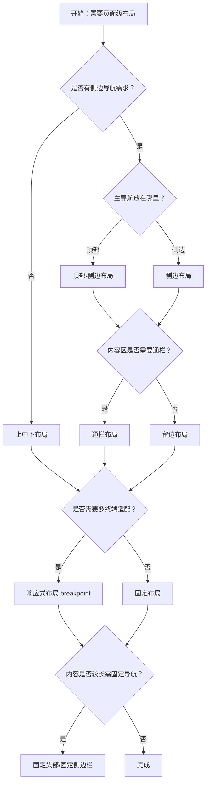

# 1. 简洁易读部份

## 1.0. 组件描述

布局组件用于协助进行页面级整体布局，通过 Header、Sider、Content、Footer 等区域划分，建立稳定的页面框架结构。

## 1.1. 组件构成

布局由以下基础要素构成：

> <!-- 附图占位：建议附上一张示例图，展示 Layout 的五个子区域（Header、Sider、Content、Footer）的构成关系与嵌套规则 -->

&emsp;&emsp;1. **Layout（容器）** 最外层布局容器，其下可嵌套 Header、Sider、Content、Footer 或 Layout 本身。

&emsp;&emsp;2. **Header** 顶部布局区域，用于放置主导航、Logo、辅助菜单等，自带默认样式。

&emsp;&emsp;3. **Sider** 侧边栏，用于放置层级导航、筛选条件等，可收起展开，支持响应式。

&emsp;&emsp;4. **Content** 主内容区域，承载页面核心内容，可嵌套任何组件。

&emsp;&emsp;5. **Footer** 底部布局区域，用于放置版权、链接等页脚信息。

---

## 1.2. 组件包含哪些不同类型

### 1.2.1 上中下布局

&emsp;**是什么**：最基本的 Header + Content + Footer 纵向三段式结构，无侧边栏

> <!-- 附图占位：建议附上一张示例图，展示上中下布局的三段式纵向结构，Header 在上、Content 居中、Footer 在下 -->

&emsp;**简单用法**：必须用于结构简单、仅需顶部导航与底部信息的场景；主导航水平放置于 Header，从左到右为 Logo、一级导航、辅助菜单

&emsp;**典型场景**：展示类网站、活动页、简单后台的顶部导航模式；导航项不多、层级较浅

> <!-- 附图占位：建议附上一张场景图，展示展示类网站的上中下布局，Header 含 Logo 与导航、Content 为正文、Footer 为版权信息 -->

&emsp;**替代方案**：若一级导航项很多或层级较深，改用顶部-侧边或侧边布局；若需侧边栏，改用带 Sider 的布局

### 1.2.2 顶部-侧边布局

&emsp;**是什么**：拥有顶部 Header 与侧边 Sider，Header 下方为 Sider + Content 的横向分区

> <!-- 附图占位：建议附上一张示例图，展示顶部-侧边布局的形态：顶部导航通栏、下方左侧 Sider、右侧 Content -->

&emsp;**简单用法**：必须用于需要顶部品牌/主导航与侧边二级导航结合的场景；通常 Header 放一级导航或品牌，Sider 放二级及以下导航

&emsp;**典型场景**：展示类网站的多级导航、后台管理系统、内容管理平台

> <!-- 附图占位：建议附上一张场景图，展示后台管理系统的顶部-侧边布局，Header 为品牌与一级导航、Sider 为二级菜单、Content 为工作区 -->

&emsp;**替代方案**：若为应用型网站且两边不需留边距，改用通栏布局；若仅需侧边导航，改用侧边布局

### 1.2.3 侧边布局

&emsp;**是什么**：无顶部 Header 或 Header 仅作辅助，主体为左侧 Sider + 右侧 Content 的左右分栏

> <!-- 附图占位：建议附上一张示例图，展示侧边布局的形态：左侧 Sider 固定、右侧 Content 占满剩余空间，可选顶部辅助栏 -->

&emsp;**简单用法**：必须用于主导航在左侧、层级可扩展的场景；Sider 可收起以释放横向空间；横向空间有限时侧边导航可折叠

&emsp;**典型场景**：后台管理系统、控制台、多级导航的信息架构

> <!-- 附图占位：建议附上一张场景图，展示后台控制台的侧边布局，左侧多级导航、右侧主工作区、顶部可有辅助操作栏 -->

&emsp;**替代方案**：若需强调顶部品牌与一级导航，改用顶部-侧边布局；若导航极简，可考虑上中下布局

### 1.2.4 通栏布局

&emsp;**是什么**：顶部-侧边布局的变体，Header 与 Content 两边不留边距，占满视口宽度

> <!-- 附图占位：建议附上一张示例图，展示通栏布局与留边布局的对比，通栏为两边无留白 -->

&emsp;**简单用法**：必须用于应用型网站、需要内容与屏幕边缘贴齐的场景；多用于 Dashboard、工作台等

&emsp;**典型场景**：应用型后台、Dashboard、全屏工作区

> <!-- 附图占位：建议附上一张场景图，展示应用型网站的通栏布局，Header 与 Content 占满宽度 -->

&emsp;**替代方案**：若为展示类网站、需内容区固定宽度居中，改用留边的顶部-侧边布局

### 1.2.5 响应式布局

&emsp;**是什么**：Sider 配置 breakpoint 后，在视口宽度小于断点时自动收起或切换形态

> <!-- 附图占位：建议附上一张示例图，展示宽屏下 Sider 展开、窄屏下 Sider 收起为图标或抽屉的响应式效果 -->

&emsp;**简单用法**：必须用于需要适配多终端的场景；breakpoint 触发后 Sider 缩小为 collapsedWidth，可设为 0 出现特殊触发器

&emsp;**典型场景**：后台在平板/手机上侧边栏收起、移动端导航变为抽屉或底部 Tab

> <!-- 附图占位：建议附上一张场景图，展示从桌面端到移动端 Sider 从展开到收起的响应式变化 -->

&emsp;**替代方案**：若仅桌面端使用，可不配置 breakpoint；若需完全不同的移动端布局，可配合路由或条件渲染切换布局结构

### 1.2.6 固定头部

&emsp;**是什么**：Header 固定于视口顶部，滚动时始终可见

> <!-- 附图占位：建议附上一张示例图，展示滚动时 Header 固定于顶部的吸顶效果 -->

&emsp;**简单用法**：必须用于需要顶部导航在滚动时始终可用的场景；便于用户随时切换页面或执行全局操作

&emsp;**典型场景**：多页面后台、长内容页的顶部导航、全局操作栏

> <!-- 附图占位：建议附上一张场景图，展示长内容页滚动时 Header 固定、用户可随时点击导航的效果 -->

&emsp;**替代方案**：若为单页或短内容，可不固定；若需同时固定侧边栏，配合固定侧边栏使用

### 1.2.7 固定侧边栏

&emsp;**是什么**：Sider 固定于视口侧边，内容区滚动时 Sider 不随动

> <!-- 附图占位：建议附上一张示例图，展示内容区滚动时 Sider 固定在左侧不动的效果 -->

&emsp;**简单用法**：必须用于内容较长、需要侧边导航始终可见的场景；提升操作效率，用户可快速定位与切换

&emsp;**典型场景**：长文档后台、多级导航系统、内容管理界面

> <!-- 附图占位：建议附上一张场景图，展示长内容区滚动时 Sider 固定在左侧、用户可随时选择侧边菜单的效果 -->

&emsp;**替代方案**：若内容较短，可不固定；移动端通常配合响应式将 Sider 收起，固定意义有限

---

## 1.3. 各类型典型场景案例

### 1.3.1 上中下与顶部-侧边

> <!-- 附图占位：建议附上一张对比图，左侧展示简单展示页用上中下布局（符合规范），右侧展示多级导航后台用顶部-侧边布局（符合规范） -->

✅ **推荐：** 结构简单、导航扁平时用上中下；导航层级深、需侧边扩展时用顶部-侧边或侧边

❌ **不推荐：** 一级导航项很多仍用上中下导致顶部拥挤，或简单页强行使用侧边布局

### 1.3.2 侧边与顶部-侧边

> <!-- 附图占位：建议附上一张对比图，左侧展示后台控制台用侧边布局强调左侧导航（符合规范），右侧展示展示类网站用顶部-侧边（符合规范） -->

✅ **推荐：** 主导航在侧边、层级扩展性强用侧边布局；需顶部品牌与一级导航时用顶部-侧边

❌ **不推荐：** 需要顶部品牌却只有侧边布局，或层级简单却强行使用顶部-侧边双区域

### 1.3.3 固定与响应式

> <!-- 附图占位：建议附上一张对比图，左侧展示长内容页固定头部与侧边（符合规范），右侧展示移动端未收起侧边导致空间浪费（违反规范） -->

✅ **推荐：** 长内容页固定头部或侧边以提升可用性；多终端时配置响应式断点

❌ **不推荐：** 移动端仍展示固定宽侧边栏，或长内容页导航随滚动消失

### 1.3.4 通栏与留边

> <!-- 附图占位：建议附上一张对比图，左侧展示应用型 Dashboard 用通栏（符合规范），右侧展示展示类网站内容区固定宽度留边（符合规范） -->

✅ **推荐：** 应用型、全屏工作区用通栏；展示类、需稳定排版用固定宽度留边

❌ **不推荐：** 展示类网站强行通栏导致大屏下内容过宽，或应用型留边导致空间浪费

---

# 2. 选型指南

## 2.1 选择流程

---

# 3. 细致专业部份（交互与排版规则）

## 3.1 多区域的展示与折叠策略

* **区域划分**：Header、Sider、Content、Footer 各有明确职责；Sider 可收起以释放 Content 空间，收起时可为图标模式或抽屉。
* **导航层级**：一级导航偏左靠近 Logo，辅助菜单偏右；当前项需在视觉上被强调；导航收起时当前项样式可赋予上一层级。
* **侧边展开方式**：Sider 支持手风琴（同级仅展开一项）或全展开，根据业务选择；收放交互通过触发器触发，可自定义 trigger。

> <!-- 附图占位：建议附上一张场景图，展示 Sider 展开与收起两种状态的布局差异，以及触发器位置 -->

## 3.2 不宜使用的布局选择

以下情形不推荐或需谨慎使用 Layout：

* **非页面级结构**：若仅为卡片内、弹窗内、局部区块的排布，应使用 Flex 或 Grid，而非 Layout。
* **过度嵌套**：Layout 内可嵌套 Layout 实现多级结构，但嵌套不宜过深；复杂结构可考虑拆分为多个页面或路由。
* **混用职责**：Header 应放导航与品牌，Content 应放主内容；不要在 Header 内放置主内容，或在 Content 内放置全局导航。

> <!-- 附图占位：建议附上一张对比图，展示页面级结构用 Layout 与局部区块用 Flex/Grid 的职责划分 -->

## 3.3 摆放位置（按页面场景划分）

* **展示类网站**：上中下或顶部-侧边，Header 高度可用 80px（一级）与 56px（二级），内容区固定宽度如 1200px 居中。
* **后台管理系统**：侧边布局或顶部-侧边，Sider 宽度建议 200+8n，Header 高度 64px（常规）或 48+8n。
* **应用型网站**：通栏布局，Header 与 Content 占满视口，无左右留白。
* **长内容页**：固定头部或固定侧边栏，确保导航在滚动时始终可用。
* **多终端**：配置 Sider 的 breakpoint，窄屏下 Sider 收起，可配合抽屉或底部 Tab 切换导航形态。

> <!-- 附图占位：建议附上一张场景图，展示展示类、后台类、应用类三种典型场景的布局差异 -->

## 3.4 顺序与对齐逻辑

* **Header 内**：Logo 与一级导航靠左，辅助菜单（用户、设置、通知等）靠右；一级导航项偏左靠近 Logo。
* **Sider 内**：导航项自上而下排列，二级、三级可缩进；当前项高亮，父级在收起时可继承当前态。
* **Content 与 Footer**：Content 占据剩余空间，Footer 紧随其后；有 Sider 时 Content 与 Sider 横向并排，Sider 在左或右由结构决定。

> <!-- 附图占位：建议附上一张示意图，展示 Header 内左右分区、Sider 内层级缩进与当前项高亮的对齐逻辑 -->

## 3.5 状态与交互反馈

* **Sider 收起与展开**：通过 trigger 或 breakpoint 触发；收起时可显示图标或隐藏，collapsedWidth 为 0 时出现特殊 trigger。
* **响应式断点**：breakpoint 触发时 Sider 收起，可配合 onBreakpoint、onCollapse 做状态同步或路由处理。
* **固定与滚动**：固定头部/侧边时，Content 单独滚动；需确保 Content 有独立滚动区域，避免整页滚动与固定区域冲突。
* **主题**：Sider 支持 light/dark 主题，需与整体页面风格一致；Header、Footer 默认有背景色，可按需覆盖。

## 3.6 视觉规范与形态选择

* **尺寸规范**：顶部导航高度 48+8n，常用 64px（系统）、80px（展示类）；侧边导航宽度 200+8n。
* **导航样式**：根据信息层级选择大色块强调、高亮火柴棍、字体高亮或字体放大；深色底用大色块，浅色底用火柴棍或字体高亮。
* **折叠触发器**：默认在 Sider 底部或边缘，可自定义；Sider 在右侧时可用 reverseArrow 翻转箭头方向。
* **与 Grid/Flex 的配合**：Layout 负责页面级框架，Content 内部用 Grid 或 Flex 做多列、卡片等排布；不要用 Grid 拼装 Header+Sider+Content+Footer。

> <!-- 附图占位：建议附上一张示意图，展示 Header 与 Sider 的尺寸规范及导航样式的层级选择 -->

---

## 4.0. 常见问题

### 1. 上中下布局和顶部-侧边布局分别适合什么场景？

- **上中下布局**：结构简单、主导航项不多、层级较浅；适合展示类网站、活动页、简单后台。导航水平放置于顶端，上下级结构符合用户上下浏览习惯。

- **顶部-侧边布局**：需要一级导航在顶部、二级及以下在侧边；适合多级导航、后台管理系统、内容管理平台。顶部品牌与一级导航，侧边扩展层级。

### 2. 侧边布局和顶部-侧边布局如何选择？

- **侧边布局**：主导航全部在左侧，层级扩展性强，适合后台控制台、多级导航的信息架构；横向空间有限时可收起侧边。

- **顶部-侧边布局**：顶部有一级导航或品牌，侧边为二级导航；适合需强调顶部品牌、一级入口明确的场景。

### 3. 固定头部和固定侧边栏什么时候用？

- **固定头部**：内容较长、需在滚动时随时访问顶部导航或全局操作时使用；多页面后台、长内容页常用。

- **固定侧边栏**：内容较长、需侧边导航始终可见以快速定位与切换时使用；长文档、多级导航系统常用。移动端通常配合响应式收起 Sider，固定意义较小。
