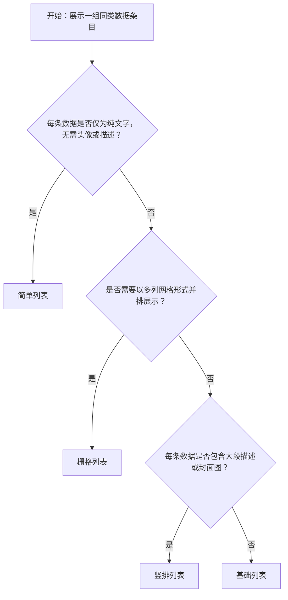

# 1. 简洁易读部份

## 1.0. 组件描述

列表组件用于以统一结构呈现一组同类数据条目，支持文字、图片、操作等多种内容形式，是后台系统中展示结构化数据集合的基础容器。

> **注：** 该组件已在 Ant Design v6 阶段进入废弃流程，计划于下一个主版本正式移除。新项目建议关注官方即将推出的继任组件 Listy，现有使用可继续维护。

## 1.1. 组件构成

列表由以下基础要素构成，可按需组合使用：

> <!-- 附图占位：建议附上一张示例图，展示列表组件的五个基础要素（头部、条目、元数据区、操作区、底部）的层次关系与各区域名称标注，图类型为示例图，传达：各要素在列表整体结构中的空间分工 -->

&emsp;&emsp;1. **头部（Header）** 可选区域，位于条目列表上方，用于展示列表标题、筛选操作或全局提示信息。

&emsp;&emsp;2. **条目（List.Item）** 列表的核心重复单元，每个条目承载一条数据记录，布局方向可为横排或竖排。

&emsp;&emsp;3. **元数据区（List.Item.Meta）** 条目内的结构化信息区，包含头像/缩略图、标题、描述三个子要素，用于呈现条目的核心标识信息。

&emsp;&emsp;4. **操作区（actions）** 位于条目右侧（横排）或底部（竖排），承载针对该条目的快捷操作链接，如编辑、删除、查看详情。

&emsp;&emsp;5. **底部（Footer）** 可选区域，位于条目列表下方，用于展示汇总信息、分页控件或加载更多入口。

---

## 1.2. 组件包含哪些不同类型

### 1.2.1 简单列表

&emsp;**是什么**：以纯文字条目进行内容呈现的最基础列表形态，无头像、无描述、无操作，是列表中特殊条件最少的默认类型

> <!-- 附图占位：建议附上一张示例图，展示简单列表（纯文字条目、左侧有条目标识符、条目间有分割线）的视觉形态，体现其在四种列表类型中最轻量的视觉表达 -->

&emsp;**简单用法**：用于内容本身已足够简明、无需额外结构化信息辅助理解的场景；条目文字应保持单行，避免内容过长导致横向阅读困难；可配置头部与底部，增加标题与辅助信息

&emsp;**典型场景**：公告列表、提示信息列表、简短条目索引

> <!-- 附图占位：建议附上一张场景图，展示系统公告页中使用简单列表展示五条公告标题的布局，每条条目仅显示一行文本，条目间有分割线，顶部配有「系统公告」标题头部，体现简单列表在纯文字信息展示场景中的标准使用方式 -->

&emsp;**替代方案**：若每条数据需要头像、描述或操作，改用基础列表；若数据条目数量大且需要快速定位，改用表格

### 1.2.2 基础列表

&emsp;**是什么**：采用横排布局、内置结构化元数据的列表形态，每个条目由头像、标题、描述三要素构成，右侧可附带操作链接

> <!-- 附图占位：建议附上一张示例图，展示基础列表（横排布局、左侧头像+中间标题与描述文字+右侧操作链接）的单条条目视觉结构，标注头像、标题、描述、操作四个区域，体现横排布局中信息层级的从左至右排列关系 -->

&emsp;**简单用法**：用于需要同时展示标识（头像/图标）、主标题与辅助说明的数据集合；描述文字必须控制在两行以内，超出时进行截断或折叠；操作链接数量不宜超过三个，否则改用「更多」下拉菜单收纳

&emsp;**典型场景**：用户列表、成员管理列表、消息通知列表、权限条目列表

> <!-- 附图占位：建议附上一张场景图，展示用户管理页面中基础列表的完整布局——每条条目左侧为用户头像，中间上方为用户名（标题），下方为用户邮箱（描述），右侧为「编辑」「删除」两个操作链接，体现基础列表在人员信息展示场景中的标准使用方式 -->

&emsp;**替代方案**：若每条数据需要展示封面图与大段内容，改用竖排列表；若数据需要支持排序、筛选等复杂操作，改用表格

### 1.2.3 竖排列表

&emsp;**是什么**：将条目内容改为纵向堆叠排列的列表形态，支持在条目右侧展示封面图或预览图，适合内容量较大、需要垂直展开呈现的数据

> <!-- 附图占位：建议附上一张示例图，展示竖排列表单条条目的视觉结构——左侧为标题与正文描述文字竖向排列，右侧为内容封面图，底部为操作按钮组，与横排基础列表并排对比，体现竖排布局中内容量更大、信息密度更高的特征 -->

&emsp;**简单用法**：必须用于内容量超过两行描述、或需要配合预览图/封面图展示的场景；竖排列表每条条目占用屏幕空间较大，单页条目数量应适当控制，建议配合分页使用；操作按钮置于条目底部，与内容区保持足够间距

&emsp;**典型场景**：文章列表、内容资讯列表、知识库条目列表

> <!-- 附图占位：建议附上一张场景图，展示文章列表页面中竖排列表的完整布局——每条条目包含文章标题（粗体大字）、正文摘要（两行描述）、发布时间与作者信息（小字），以及右侧文章封面缩略图，体现竖排列表在图文内容展示场景中的标准使用方式 -->

&emsp;**替代方案**：若内容较简短且无需封面图，改用基础列表；若需要多列网格展示，改用栅格列表

### 1.2.4 栅格列表

&emsp;**是什么**：以多列网格形式并排展示条目的列表形态，每个条目以独立卡片呈现，适合强调视觉一致性与空间利用效率的数据集合

> <!-- 附图占位：建议附上一张示例图，展示栅格列表（三列卡片网格布局，每个卡片含标题与简要内容）的整体视觉形态，与单列基础列表对比，体现栅格布局在空间利用和视觉均衡性上的差异 -->

&emsp;**简单用法**：用于同类数据的横向并排对比展示；列数必须与内容卡片的信息量匹配，内容越丰富列数越少（通常不超过四列）；必须确保不同屏幕尺寸下列数自适应，避免卡片过窄导致内容被截断

&emsp;**典型场景**：产品卡片列表、应用市场展示、图片资源管理、仪表盘卡片组

> <!-- 附图占位：建议附上一张场景图，展示应用市场页面使用四列栅格列表展示应用卡片的布局——每个卡片包含应用图标、应用名称、简介与安装按钮，体现栅格列表在均等视觉权重内容展示场景中的标准使用方式 -->

&emsp;**替代方案**：若数据需要单列纵向浏览或含有大量描述文字，改用竖排列表或基础列表；若数据需要列间对比与排序，改用表格

---

## 1.3. 各类型典型场景案例

### 1.3.1 简单列表

> <!-- 附图占位：建议附上一张对比图，左侧展示简单列表每条条目保持单行文本、条目间分割线清晰（符合规范），右侧展示条目文字过长、折行后与分割线叠压导致阅读困难（违反规范），传达：简单列表适用于内容足够简短的场景，超出一行时应升级为基础列表或竖排列表 -->

✅ **推荐：** 简单列表条目保持单行显示，分割线节奏均匀，阅读流畅

❌ **不推荐：** 将超过一行的长文本放入简单列表，折行后破坏列表节奏，应升级使用基础列表

### 1.3.2 基础列表

> <!-- 附图占位：建议附上一张对比图，左侧展示基础列表条目右侧仅有「编辑」「删除」两个操作链接（符合规范），右侧展示条目操作区平铺五个操作链接导致操作区宽度超过内容区（违反规范），传达：基础列表操作链接需遵循「最多三个，超出收纳到更多菜单」的原则 -->

✅ **推荐：** 每条条目的操作链接不超过三个，超出部分收纳至「更多」下拉菜单

❌ **不推荐：** 将五个以上操作链接平铺在条目右侧，操作区视觉权重超过主要内容，干扰阅读

### 1.3.3 竖排列表

> <!-- 附图占位：建议附上一张对比图，左侧展示竖排列表搭配分页、每页展示合理数量条目（符合规范），右侧展示竖排列表不分页且将大量条目一次性全量渲染、页面极长（违反规范），传达：竖排列表条目占屏幕空间大，必须配合分页或加载更多策略控制单页条目数 -->

✅ **推荐：** 竖排列表必须配合分页或加载更多策略，控制单页展示条目数量

❌ **不推荐：** 竖排列表不设分页，将所有条目一次性全量展示，导致页面过长影响浏览效率

### 1.3.4 栅格列表

> <!-- 附图占位：建议附上一张对比图，左侧展示栅格列表在不同屏幕尺寸下列数自适应响应（宽屏四列、窄屏两列，符合规范），右侧展示栅格列表列数固定不自适应导致窄屏下卡片内容被严重截断（违反规范），传达：栅格列表必须配置响应式断点列数，保障不同屏幕下卡片内容完整可读 -->

✅ **推荐：** 栅格列表配置响应式断点，不同屏幕尺寸下列数自动调整

❌ **不推荐：** 栅格列表使用固定列数，在窄屏设备上卡片宽度过小导致内容截断或溢出

---

# 2. 选型指南

## 2.1 选择流程

---

# 3. 细致专业部份（交互与排版规则）

为了保持列表页面清晰易读、降低用户在大量数据中的认知负担，当列表条目数量较多或涉及复杂操作时，请参考以下排版和交互规则：

## 3.1 条目数量与分页、加载更多策略

在数据量超出单屏可见范围时，需按以下策略控制条目展示量：

* **可见数量上限**：单页列表建议展示条目数量不超过 20 条（竖排列表建议更少）；超出时必须通过分页或加载更多分批展示，不可全量渲染。
* **分页适用场景**：当用户需要在不同页之间跳转对比，或数据量极大时，使用分页；分页控件必须置于列表底部，且分页信息（当前页/总页数）必须清晰可见。
* **加载更多适用场景**：当用户以顺序浏览为主、不需要跳页时，使用加载更多；加载中必须展示占位骨架屏或旋转加载图标，防止用户误以为已加载完毕。

> <!-- 附图占位：建议附上一张场景图，展示基础列表底部「加载更多」入口的布局——列表展示当前批次条目后，底部居中显示「加载更多」按钮，点击后按钮变为加载旋转图标，体现加载更多策略中的加载状态反馈规则 -->

## 3.2 列表条目中的危险操作（删除/停用/清除）

**如何界定列表中的「危险操作」？**

* **属于危险**：删除已保存的数据记录、停用线上运行中的资源、清除他人可见的共享数据。
* **不属于危险**：从列表中临时移除一条尚未保存的新增草稿条目。

**针对列表危险操作的处理规范：**

* **视觉降级**：危险操作链接（如「删除」）必须在视觉上弱于主要操作（如「编辑」），推荐采用红色文字链接形式，且必须排列在所有操作链接的最末位置。
* **二次确认**：执行危险操作前必须弹出确认提示，明确告知将被删除或停用的具体数据，不可静默执行。
* **物理间距隔离**：危险操作链接与普通操作链接之间必须有足够的视觉间距，防止误触。

> <!-- 附图占位：建议附上一张场景图，展示基础列表条目操作区「编辑」（普通蓝色文字链接）与「删除」（红色文字链接，排列在末位）的排列方式，以及点击「删除」后弹出确认弹窗的状态，传达：危险操作的视觉降级与末位排列规则 -->

## 3.3 摆放位置（按页面场景划分）

为确保列表在不同页面布局中清晰定位：

* **独立列表页**：列表组件占据内容区主体，顶部工具栏（搜索、筛选、操作按钮）与列表组件之间必须有足够的间距区分。
* **卡片内嵌列表**：当列表嵌入卡片容器时，列表的头部、底部与卡片边框之间必须保持内边距，防止内容贴边。
* **弹窗内列表**：弹窗内的列表高度必须受限于弹窗高度，超出时内部可滚动；分页控件必须固定在弹窗底部操作区上方，不随列表滚动。
* **侧边抽屉列表**：在抽屉（Drawer）中展示关联数据列表时，使用简单列表或基础列表，避免在空间受限的侧边区域使用竖排列表或栅格列表。

> <!-- 附图占位：建议附上一张场景图，展示弹窗内嵌基础列表的布局——列表区域固定高度且内部可滚动，弹窗底部操作按钮栏固定不随列表滚动，体现弹窗内列表的高度受限与底部固定的规则 -->

## 3.4 条目内容层级与对齐规则

列表条目内的信息层级必须清晰，视觉对齐必须严格：

* **信息层级**：每条条目的信息优先级从高到低依次为：标题 > 描述 > 辅助信息（时间、标签等）；字号与颜色对比度必须体现此层级顺序，标题字号最大且颜色最深。
* **纵向对齐**：多条条目中，同一语义的要素（如所有头像、所有标题起始位置、所有操作链接）必须形成严格的纵向对齐列，不可因内容长短不一而错位。
* **图文对齐**：当条目包含头像或图标时，头像与标题文字必须垂直居中对齐；头像尺寸在同一列表内必须统一。

> <!-- 附图占位：建议附上一张对比图，左侧展示基础列表所有条目的头像、标题、操作链接严格纵向对齐（符合规范），右侧展示条目因描述文字长短不一导致操作链接纵向错位（违反规范），传达：无论内容长短如何变化，各语义要素的纵向对齐列必须保持一致 -->

## 3.5 状态与交互反馈

列表必须提供清晰、可感知的状态反馈：

* **加载中**：列表数据请求期间必须展示骨架屏（Skeleton）占位，骨架屏的结构应与实际条目结构一致（横排对应横排骨架、竖排对应竖排骨架），不可仅用全局旋转图标代替。
* **空状态**：当列表无数据时，必须展示明确的空状态提示（如「暂无数据」），并视场景提供引导操作（如「立即新建」按钮）；空状态区域必须与列表容器等高，防止页面塌陷。
* **条目悬停**：鼠标悬停于条目时，条目应展示轻量背景高亮，同时操作链接从隐藏/弱化状态变为完全可见；操作链接不可在默认状态下占据固定空间而显示为空，应通过悬停触发显示以保持视觉整洁。
* **加载更多时**：「加载更多」按钮点击后立即变为加载状态并锁定，新条目加载完成后追加至列表末尾，加载按钮恢复可点击状态。

## 3.6 视觉规范与尺寸选择

**三种尺寸的选用原则：**

* **默认尺寸（default）**：条目内边距适中，适用于绝大多数后台管理页面，是优先选择的默认尺寸。

> <!-- 附图占位：建议附上一张示例图，并排展示列表的三种尺寸（大、中、小）的条目高度对比，标注各尺寸名称，传达：尺寸差异主要体现在条目内边距的变化，内容结构保持一致 -->

* **大尺寸（large）**：条目内边距最大，内容呼吸感强，适用于首屏展示量少、需要强调每条内容阅读体验的场景（如竖排文章列表）。
* **小尺寸（small）**：条目内边距最小，信息密度高，适用于空间紧凑的内嵌场景（如卡片内的关联数据列表、侧边抽屉内的简短列表）。

**分割线与边框规则：**

* **分割线（split）**：默认开启，用于区分相邻条目，当视觉背景已足够区分条目时可关闭；关闭分割线后，必须确保条目间的间距仍足够让用户感知边界。
* **边框（bordered）**：默认关闭；当列表嵌入没有明显容器背景的页面区域时，可开启边框以提供容器感；开启边框后不应再对列表容器额外添加阴影或圆角，避免双重框架感。

---

## 4.0. 常见问题

### 1. 列表和表格的区别是什么，应该用哪个

- **列表**：适合每条数据的内容格式自由、信息量不均等、或强调视觉个性化呈现（如有头像、图片）的场景，优点是视觉灵活、阅读自然。
- **表格**：适合每条数据的结构完全一致、需要按列对比不同记录的值、或需要排序与筛选列的场景，优点是信息密度高、列间对齐便于横向比对。
- 若数据需要多维度排序与筛选，优先选表格；若数据需要个性化图文展示，优先选列表。

### 2. 列表为什么已被废弃，现在还能用吗

- 该组件在 Ant Design 主线版本已进入废弃阶段，现有页面中已使用的列表组件可以继续维护，功能不受影响。新项目建议等待官方 Listy 组件正式发布后直接使用新组件，Listy 将内置虚拟滚动与更灵活的布局控制能力。

### 3. 栅格列表和卡片组合的区别是什么

- **栅格列表（List + grid）**：适合展示结构一致的同类数据集合，每张卡片对应一条完整数据记录，适合需要统一布局、统一加载状态与统一空状态处理的场景。
- **独立卡片组合（Card 手动排列）**：适合每张卡片内容差异较大、需要独立控制每张卡片行为的场景，灵活性更高但维护成本也更高。
