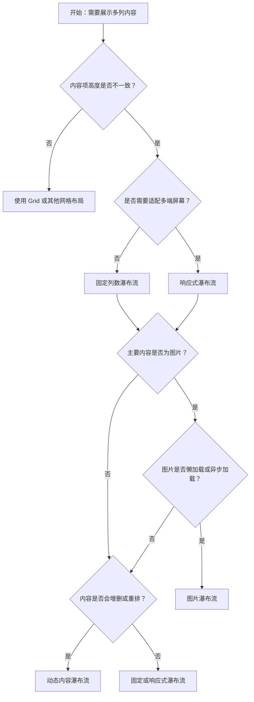

# 1. 简洁易读部份

## 1.0. 组件描述

瀑布流组件用于展示不同高度的内容，将不规则高度的项按列均匀分布，避免传统网格布局产生的留白浪费，提升内容浏览效率。

## 1.1. 组件构成

瀑布流由以下基础要素构成，可按需组合使用：

> <!-- 附图占位：建议附上一张示例图，展示瀑布流的三个基础要素（容器、列、项）的构成关系，标注各列中的项如何自上而下堆叠 -->

&emsp;&emsp;1. **容器** 定义瀑布流的整体布局区域，负责列数与间距的统筹。

&emsp;&emsp;2. **列** 将内容按列数垂直分布，每列内项按顺序依次堆叠，形成「瀑布」形态。

&emsp;&emsp;3. **项** 承载实际内容（如图片、卡片），高度可各不相同，自动填充至当前列的最短列尾。

---

## 1.2. 组件包含哪些不同类型

### 1.2.1 固定列数瀑布流

&emsp;**是什么**：使用固定列数展示不规则高度内容，布局稳定可预期

> <!-- 附图占位：建议附上一张示例图，展示三列固定瀑布流中不同高度卡片的堆叠形态，体现均匀分布的视觉效果 -->

&emsp;**简单用法**：适用于列数不随屏幕变化的场景；必须根据内容密度与容器宽度合理设定列数；列数过少易产生单列过长，过多则项过窄

&emsp;**典型场景**：桌面端内容展示、固定宽度容器内的图片墙、卡片列表

> <!-- 附图占位：建议附上一张场景图，展示固定三列瀑布流中图片或卡片的均匀分布，体现适用于桌面端稳定布局的典型用法 -->

&emsp;**替代方案**：若需适配多端屏幕，改用响应式瀑布流

### 1.2.2 响应式瀑布流

&emsp;**是什么**：根据屏幕断点自动调整列数与间距，适配不同设备

> <!-- 附图占位：建议附上一张示例图，展示同一瀑布流在大屏（多列）、中屏、小屏（少列）下的列数变化，体现断点适配效果 -->

&emsp;**简单用法**：必须用于需要跨端展示的场景；列数按 xs/sm/md 等断点配置；间距也可按断点差异化设置，保持视觉节奏统一

&emsp;**典型场景**：移动端、平板、桌面一体化的内容流，响应式产品页

> <!-- 附图占位：建议附上一张场景图，展示同一页面在手机端单列、平板端双列、桌面端三列的瀑布流呈现，体现响应式适配 -->

&emsp;**替代方案**：若仅面向单端，使用固定列数即可

### 1.2.3 图片瀑布流

&emsp;**是什么**：以图片为主要内容的瀑布流，随加载动态调整位置

> <!-- 附图占位：建议附上一张示例图，展示图片瀑布流中不同宽高比图片的自适应布局，以及占位与加载完成后的位置变化 -->

&emsp;**简单用法**：适用于图片库、相册、素材展示；图片高度未知时需监听加载完成并更新布局；可配置持续监听子项尺寸变化以应对懒加载

&emsp;**典型场景**：图片画廊、作品集、电商商品图墙

> <!-- 附图占位：建议附上一张场景图，展示图片瀑布流在图片陆续加载过程中布局的平滑重排，体现动态调整能力 -->

&emsp;**替代方案**：若图片高度统一，可用普通网格布局

### 1.2.4 动态内容瀑布流

&emsp;**是什么**：支持增删项、顺序变化，配合项固化列或自动重排

> <!-- 附图占位：建议附上一张示例图，展示动态添加或删除项后瀑布流的重排效果，以及「固化列」与「自动分配」的差异 -->

&emsp;**简单用法**：适用于内容可增删、顺序可变的场景；需固化位置时可指定项的 column；增删频繁时建议开启尺寸监听以正确重算布局

&emsp;**典型场景**：可编辑的看板、动态加载更多、用户可拖拽排序的内容流

> <!-- 附图占位：建议附上一张场景图，展示「添加项」操作后瀑布流即时重排，体现动态更新能力 -->

&emsp;**替代方案**：若内容完全静态，用固定列数或响应式即可

---

## 1.3. 各类型典型场景案例

### 1.3.1 固定列数瀑布流

> <!-- 附图占位：建议附上一张对比图，左侧展示根据容器宽度合理设置三列的瀑布流（符合规范），右侧展示同一宽度下设置六列导致每项过窄、阅读困难（违反规范） -->

✅ **推荐：** 根据容器宽度与内容密度合理设定列数，保证每项有足够可读空间

❌ **不推荐：** 盲目增加列数导致单列过窄，影响内容可读性与点击区域

### 1.3.2 响应式瀑布流

> <!-- 附图占位：建议附上一张对比图，左侧展示移动端单列、平板双列、桌面三列的合理断点配置（符合规范），右侧展示移动端仍用三列导致拥挤（违反规范） -->

✅ **推荐：** 跨端场景必须按断点调整列数，小屏减少列数以保障单列宽度

❌ **不推荐：** 移动端与桌面端使用相同列数，忽视小屏可用空间

### 1.3.3 图片瀑布流

> <!-- 附图占位：建议附上一张对比图，左侧展示图片加载完成后布局正确重排（符合规范），右侧展示未监听加载导致布局错乱或大片空白（违反规范） -->

✅ **推荐：** 图片高度未知时监听加载完成并触发布局更新，保持无错位、无大片空白

❌ **不推荐：** 忽略图片异步加载，导致初始布局错误或长期不更新

### 1.3.4 动态内容瀑布流

> <!-- 附图占位：建议附上一张对比图，左侧展示增删项后布局即时、平滑更新（符合规范），右侧展示增删后布局不更新或闪烁（违反规范） -->

✅ **推荐：** 动态场景下确保增删或重排后布局能正确重算并平滑过渡

❌ **不推荐：** 动态更新后不触发重排，导致错位或重叠

---

# 2. 选型指南

## 2.1 选择流程

---

# 3. 细致专业部份（交互与排版规则）

## 3.1 多操作的展示与折叠策略

瀑布流本身不承载操作按钮，但当与工具栏、筛选区配合时，需遵循：

* **操作区域独立**：新建、筛选、排序等操作应置于瀑布流上方或侧边的独立区域，不嵌入单个项内造成布局异常。
* **批量操作**：若存在批量选择、批量删除等，建议使用悬浮工具栏或顶部全选栏，避免在每项内堆叠过多操作导致视觉混乱。
* **项内操作精简**：单个项内的操作应控制在 1–3 个，超出可收纳至「更多」或悬停展开。

> <!-- 附图占位：建议附上一张场景图，展示瀑布流上方独立的筛选与排序区域，以及单卡片内精简的操作按钮布局 -->

## 3.2 危险操作（删除/清空/停用）

* **界定范围**：删除单个卡片、清空整列、批量移除等均属危险操作。
* **视觉与位置**：危险操作按钮应弱化层级（如文本按钮 + 红色），且不与主操作（如「发布」「保存」）争夺视觉焦点；位置建议靠后或放入「更多」。
* **二次确认**：执行前必须弹窗确认，明确后果；批量操作需明确影响范围。

> <!-- 附图占位：建议附上一张场景图，展示瀑布流卡片内「删除」以文本形式弱化，点击后弹出二次确认对话框 -->

## 3.3 摆放位置（按页面场景划分）

* **内容主区**：瀑布流通常占据页面主体内容区，上方为页面标题、筛选、搜索等。
* **侧栏配合**：可与侧边栏筛选、分类导航配合，主区展示瀑布流，侧栏控制筛选条件。
* **全屏展示**：图片/视频类场景可配合全屏预览，瀑布流作为缩略入口。

> <!-- 附图占位：建议附上一张场景图，展示瀑布流在页面主内容区的典型位置，上方为标题与筛选，侧边为分类导航 -->

## 3.4 顺序与对齐逻辑

* **列内顺序**：同一列内项按数据顺序自上而下排列，不可随意打乱。
* **列间平衡**：算法应尽量使各列高度接近，避免某一列过长导致滚动体验失衡。
* **间距统一**：列间距与行间距应保持一致或按断点成比例，形成清晰网格感。

> <!-- 附图占位：建议附上一张示例图，展示各列高度大致平衡、间距统一的瀑布流布局，标注列内顺序与列间关系 -->

## 3.5 状态与交互反馈

* **加载中**：初始加载或动态追加时，可为待加载项预留占位高度或骨架屏，避免布局跳动。
* **空状态**：无内容时展示空状态提示，而非空白瀑布流。
* **滚动加载**：触底加载更多时，新项应平滑插入，伴随适度动画，避免突兀。

> <!-- 附图占位：建议附上一张场景图，展示瀑布流加载中的骨架占位与加载完成后的平滑过渡 -->

## 3.6 视觉规范与形态选择

* **列数选择**：桌面端常用 3–4 列，平板 2–3 列，手机 1–2 列；视内容密度与阅读习惯而定。
* **间距规范**：列间距与行间距建议使用设计系统的标准间距（如 8px、16px、24px），保持与其他组件一致。
* **项内排版**：卡片内标题、描述、操作等应有清晰层级，避免因高度差异导致项内拥挤或松散。

> <!-- 附图占位：建议附上一张示例图，展示不同列数下的视觉节奏差异，以及项内排版层级清晰的正反例 -->

---

## 4.0. 常见问题

### 1. 瀑布流和普通网格有什么区别？

- **瀑布流**：每列内的项自上而下堆叠，下一项自动填到当前最短列，适合高度不一的图片、卡片；可减少留白，提升空间利用。
- **普通网格**：每行高度一致，所有项按行对齐；适合高度统一的内容，布局更规整但留白可能较多。

### 2. 什么时候该用响应式瀑布流？

- 当页面需要在手机、平板、桌面等多种设备上展示，且希望列数随屏幕变化时，应使用响应式配置；若仅面向单一设备，固定列数即可。

### 3. 图片加载慢会导致布局错乱吗？

- 会。若图片高度未知且未监听加载完成，初始布局可能基于错误高度，加载完成后出现错位。应开启尺寸监听或在高宽已知后再参与布局计算。
