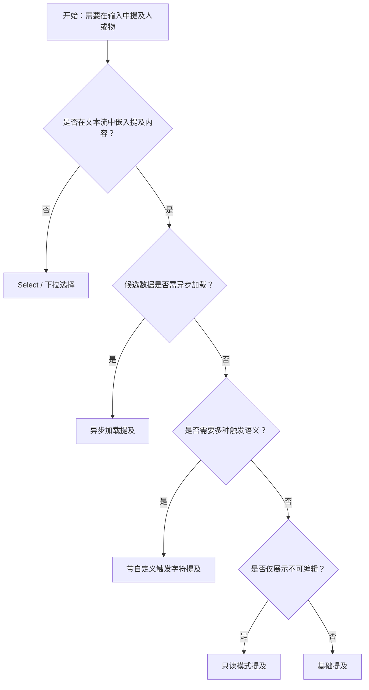

# 1. 简洁易读部份

## 1.0. 组件描述

提及（Mentions）组件用于在输入框中嵌入对某人或某事的引用，通过预设触发字符（如 `@`）唤起候选列表供用户选择，常用于发布、聊天或评论等需要 @ 提及他人的场景。

## 1.1. 组件构成

提及由以下基础要素构成，可按需组合使用：

> <!-- 附图占位：建议附上一张示例图，展示提及组件的三个基础要素（输入框、触发字符、下拉候选列表）的构成关系，标注各要素名称与位置 -->

&emsp;&emsp;1. **输入框** 承载用户输入的文本，支持单行或多行，与触发字符配合识别提及意图。

&emsp;&emsp;2. **触发字符** 唤起候选列表的关键符（默认 `@`），用户输入该字符后出现下拉建议。

&emsp;&emsp;3. **候选列表** 展示可提及的人或物，用户选择后以特定格式插入文本中。

---

## 1.2. 组件包含哪些不同类型

### 1.2.1 基础提及

&emsp;**是什么**：以默认 `@` 为触发字符，在输入中提及预设选项

> <!-- 附图占位：建议附上一张示例图，展示基础提及（输入框、输入 @ 后展开的候选列表）的视觉形态，体现最简单的提及交互流程 -->

&emsp;**简单用法**：选项数量不宜过多；触发后展示的列表应能快速定位；选中后插入的格式应与上下文区分

&emsp;**典型场景**：评论中 @ 好友、发布内容中提及话题或成员

> <!-- 附图占位：建议附上一张场景图，展示评论框输入 @ 后出现用户列表、选中后插入带高亮的提及标签，体现典型评论提及场景 -->

&emsp;**替代方案**：若无需在文本流中插入，改用 Select 或下拉选择

### 1.2.2 带自定义触发字符

&emsp;**是什么**：将触发字符从 `@` 改为 `#`、`/` 等，以承载不同语义

> <!-- 附图占位：建议附上一张示例图，展示 `#` 触发话题、`/` 触发命令等不同前缀的提及形态 -->

&emsp;**简单用法**：不同触发字符应有明确语义；同一输入框可支持多种前缀；候选内容需与前缀语义匹配

&emsp;**典型场景**：话题标签（`#话题`）、斜杠命令（`/mention`）、频道提及

> <!-- 附图占位：建议附上一张场景图，展示输入 `#` 后出现话题列表、输入 `/` 后出现命令列表，体现多前缀区分语义的使用方式 -->

&emsp;**替代方案**：若仅有一种提及类型，使用默认 `@` 即可

### 1.2.3 形态变体

&emsp;**是什么**：通过 `outlined`、`filled`、`borderless`、`underlined` 等形态适配不同页面风格

> <!-- 附图占位：建议附上一张示例图，展示四种形态（描边、填充、无边框、下划线）的提及输入框对比 -->

&emsp;**简单用法**：与页面整体输入控件风格保持一致；表格内嵌或紧凑布局可选用 borderless

&emsp;**典型场景**：表单内与其它输入框统一、表格行内编辑、简约风格页面

> <!-- 附图占位：建议附上一张场景图，展示表单中提及输入框与 Input、Select 等组件的形态一致性 -->

&emsp;**替代方案**：默认 outlined 可满足大部分场景

### 1.2.4 只读与禁用模式

&emsp;**是什么**：仅展示已插入的提及内容，不可编辑或选择新提及

> <!-- 附图占位：建议附上一张示例图，展示只读模式下灰色背景、不可聚焦的提及内容，与禁用状态的视觉差异 -->

&emsp;**简单用法**：只读用于展示历史内容；禁用用于权限不足或流程未到该步；需明确告知用户不可操作原因

&emsp;**典型场景**：消息详情展示、已提交表单回顾、无权限的回复框

> <!-- 附图占位：建议附上一张场景图，展示聊天记录中只读展示「@张三 你好」的提及内容 -->

&emsp;**替代方案**：若仅需展示纯文本，可使用 Typography 或自定义渲染

### 1.2.5 受控模式（配合 Form）

&emsp;**是什么**：值由外部（如 Form）管理，用于表单校验与提交

> <!-- 附图占位：建议附上一张示例图，展示与 Form 绑定的提及输入框及校验反馈（错误、警告状态） -->

&emsp;**简单用法**：必须与 Form.Item 正确绑定；校验规则需考虑提及格式；提交前需将提及转换为后端所需结构

&emsp;**典型场景**：发帖表单、工单指派、反馈表单中的提及字段

> <!-- 附图占位：建议附上一张场景图，展示表单中「@相关人」字段的必填校验、提交时包含提及信息 -->

&emsp;**替代方案**：非表单场景可使用非受控模式

### 1.2.6 异步加载

&emsp;**是什么**：候选列表由接口异步返回，输入触发字符后展示加载状态再展示结果

> <!-- 附图占位：建议附上一张示例图，展示输入 @ 后出现加载中状态，随后展示异步返回的候选列表 -->

&emsp;**简单用法**：必须提供加载中反馈；接口需支持防抖与取消；无结果时明确提示

&emsp;**典型场景**：组织架构中的成员搜索、大型社区的 @ 用户、跨系统的成员引用

> <!-- 附图占位：建议附上一张场景图，展示输入 @ 后请求成员列表、加载完成后展示可选项的完整流程 -->

&emsp;**替代方案**：选项较少且可预加载时，使用静态 options

### 1.2.7 带清除图标

&emsp;**是什么**：输入框右侧提供清除按钮，一键清空所有内容

> <!-- 附图占位：建议附上一张示例图，展示带清除图标的提及输入框，悬停或输入后显示清除按钮 -->

&emsp;**简单用法**：适合需要快速清空的重填场景；清除后焦点保持；与「提交前确认」配合使用

&emsp;**典型场景**：草稿重写、快速切换收件人、表单重置

> <!-- 附图占位：建议附上一张场景图，展示已输入提及内容的输入框，右侧清除按钮可一键清空 -->

&emsp;**替代方案**：若内容不可轻易清空，可不提供清除

---

## 1.3. 各类型典型场景案例

### 1.3.1 基础提及

> <!-- 附图占位：建议附上一张对比图，左侧展示评论框正确使用 @ 提及（输入 @ 后展示用户列表、选中后插入），右侧展示未提供候选列表或触发不明确（违反规范） -->

✅ **推荐：** 在评论、聊天等需要 @ 他人的场景使用提及组件，触发字符明确、候选列表清晰

❌ **不推荐：** 用普通输入框模拟 @，无法提供候选选择或插入格式不统一

### 1.3.2 触发字符与语义

> <!-- 附图占位：建议附上一张对比图，左侧展示 # 用于话题、@ 用于用户、/ 用于命令的合理区分（符合规范），右侧展示多种前缀混用导致语义混乱（违反规范） -->

✅ **推荐：** 不同触发字符承载不同语义，如 @ 用户、# 话题、/ 命令

❌ **不推荐：** 同一前缀承载多种不相关类型，或触发字符与业务语义不符

### 1.3.3 候选列表与加载

> <!-- 附图占位：建议附上一张对比图，左侧展示异步加载时显示加载中、无结果时明确提示（符合规范），右侧展示无反馈或长时间空白（违反规范） -->

✅ **推荐：** 异步加载时显示加载态，无结果时给出明确提示

❌ **不推荐：** 无加载反馈或长时间空白，用户无法判断是加载中还是无结果

### 1.3.4 只读与禁用

> <!-- 附图占位：建议附上一张对比图，左侧展示只读/禁用时提及内容仍可读、状态明确（符合规范），右侧展示可点击或样式与可编辑混淆（违反规范） -->

✅ **推荐：** 只读/禁用时提及内容完整展示，视觉与可编辑状态明显区分

❌ **不推荐：** 只读时仍可唤起下拉或样式与可编辑难以区分

---

# 2. 选型指南

## 2.1 选择流程

---

# 3. 细致专业部份（交互与排版规则）

为保证提及组件的可用性与一致性，请参考以下设计规则：

## 3.1 触发与候选展示

* **触发时机**：用户输入预设触发字符（默认 `@`）后，应在合理延迟内展示候选列表。
* **候选数量**：单次展示的候选不宜过多，建议配合搜索或分页；若数据量极小（如 5 条以内）可全部展示。
* **列表位置**：默认向下展开；当输入框靠近底部时，可向上展开以避免被遮挡。

> <!-- 附图占位：建议附上一张场景图，展示输入 @ 后候选列表向下展开、靠近视口底部时向上展开的布局策略 -->

## 3.2 选中与插入格式

* **插入格式**：选中后插入的提及内容应与普通文本有视觉区分（如背景色、标签形态），便于识别与后续解析。
* **分隔符**：选中项前后可选分隔符，需与后端解析规则一致。
* **可删除性**：用户应能通过退格或选区删除已插入的提及，行为需符合输入习惯。

## 3.3 与表单的结合

* **校验时机**：提及字段的校验应在失焦或提交时触发，不宜在每次输入时过度打断。
* **错误提示**：校验失败时，错误信息应靠近提及输入框，不遮挡候选列表。
* **提交格式**：提交前需将提及内容转换为后端所需结构（如 ID 列表或结构化对象）。

> <!-- 附图占位：建议附上一张场景图，展示提及字段校验错误时的提示位置与视觉样式 -->

## 3.4 多行与自适应高度

* **多行场景**：评论、长文本录入等场景可开启自适应高度（autoSize），避免内容被截断。
* **高度限制**：自适应时建议设置最大行数或最大高度，防止输入过长影响布局。
* **滚动行为**：候选列表与输入框同时存在时，需确保列表不被裁剪且滚动不冲突。

## 3.5 无障碍与键盘

* **焦点管理**：触发候选列表后，焦点应在列表第一项或搜索框，支持方向键与 Enter 选择。
* **关闭列表**：Esc 或点击外部应关闭候选列表；选择后自动关闭。
* **读屏支持**：列表与选项应具备合理的无障碍属性，便于读屏器识别。

## 3.6 形态与上下文一致性

* **形态选择**：提及的形态（outlined、filled、borderless、underlined）应与同页面的 Input、Select 等组件保持一致。
* **尺寸**：与表单其它控件尺寸一致，避免视觉跳变。
* **状态反馈**：成功选中、加载中、错误、警告等状态应有清晰的视觉区分。

> <!-- 附图占位：建议附上一张场景图，展示表单中提及与 Input、Select 在形态、尺寸、状态上的统一性 -->

---

## 4.0. 常见问题

### 1. 提及和 Select 有什么区别？

- **提及（Mentions）**：在**多行或单行输入框的文本流中**插入对某人或某物的引用，用户一边输入一边通过触发字符唤起候选并插入，内容与上下文融为一体。
- **Select**：从下拉列表中**选择一个选项填入**，结果是单独的字段值，不嵌入在自由文本中。若只是选人、选标签等，不涉及在文本中嵌入，用 Select 更合适。

### 2. 多个触发字符如何区分使用？

- **@ 用户**：用于提及人员，如评论 @ 好友、工单指派 @ 负责人。
- **# 话题**：用于关联话题或标签，如 #产品需求、#Bug。
- **/ 命令**：用于斜杠命令，如 /mention、/at，常见于文档或聊天机器人。

不同前缀的候选数据来源和插入格式可不同，需在设计与实现上保持一致。

### 3. 异步加载时如何减少无效请求？

- 对用户输入做**防抖**，避免每次按键都发起请求。
- 支持**取消上一次请求**，保证最终展示的是最近一次搜索对应的结果。
- 设置**最小字符数**，如输入超过 2 个字符后再请求，减少无意义的查询。
