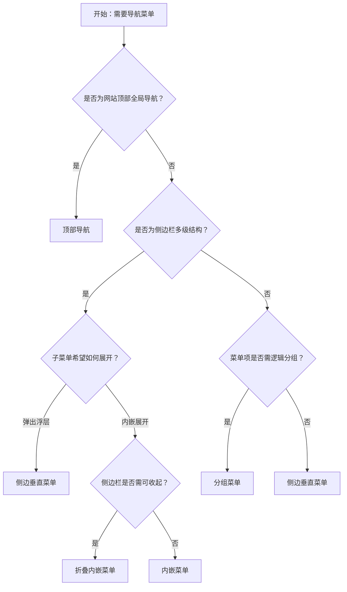

# 1. 简洁易读部份

## 1.0. 组件描述

导航菜单为页面和功能提供导航入口，帮助用户在网站各层级结构中快速定位与跳转，是网站信息架构的可视化载体。

## 1.1. 组件构成

导航菜单由以下基础要素构成，可按需组合使用：

> <!-- 附图占位：建议附上一张示例图，展示菜单的基础要素（菜单项、子菜单展开区域、图标、分组标题）的构成关系，标注各要素名称与位置 -->

&emsp;&emsp;1. **菜单项** 承载单个导航目标，可含图标与文本，定义可点击区域。

&emsp;&emsp;2. **子菜单** 收纳多级结构，可内嵌展开或弹出展示，用于收纳相关子项。

&emsp;&emsp;3. **图标** 用于增强识别效率，可置于菜单项左侧，用于区分功能类型。

&emsp;&emsp;4. **分组标题** 将同级菜单项按逻辑分组，仅作分组标注，不可点击。

---

## 1.2. 组件包含哪些不同类型

### 1.2.1 侧边垂直菜单

&emsp;**是什么**：子菜单以弹出形式展示的垂直菜单，适用于侧边栏多级导航结构

> <!-- 附图占位：建议附上一张示例图，展示侧边垂直菜单的形态（左侧垂直列表、子菜单点击后右侧弹出），体现多级结构的收纳方式 -->

&emsp;**简单用法**：用于侧边栏场景；子菜单点击后以浮层形式展开；必须用于收纳多级类目与功能

&emsp;**典型场景**：后台管理系统侧边栏、多模块应用的模块切换

> <!-- 附图占位：建议附上一张场景图，展示后台布局中左侧侧边栏垂直菜单与右侧内容区的配合，体现子菜单弹出、多级结构收纳的典型布局 -->

&emsp;**替代方案**：若需子菜单内嵌展开、节省空间，改用内嵌菜单

### 1.2.2 顶部导航

&emsp;**是什么**：水平排列的导航菜单，提供全局性类目与功能入口

> <!-- 附图占位：建议附上一张示例图，展示顶部导航的形态（水平排列、子菜单悬停或点击展开），体现全局导航的视觉层级 -->

&emsp;**简单用法**：必须用于网站顶部一级导航；空间不足时可折叠为省略图标；子菜单通常以悬停或点击展开

&emsp;**典型场景**：官网主导航、产品一级类目、营销活动入口

> <!-- 附图占位：建议附上一张场景图，展示网站顶部水平导航栏与 Logo、用户入口的配合，体现全局导航的摆放位置与视觉权重 -->

&emsp;**替代方案**：若为多级深度结构，改用侧边垂直菜单

### 1.2.3 内嵌菜单

&emsp;**是什么**：子菜单内嵌在菜单区域内展开，不采用浮层弹出形式

> <!-- 附图占位：建议附上一张示例图，展示内嵌菜单的形态（垂直列表、子菜单在父项下方内嵌展开），体现内嵌展开的视觉结构 -->

&emsp;**简单用法**：子菜单在父项下方直接展开；适合需要完整展示层级结构的场景；展开时占用垂直空间

&emsp;**典型场景**：设置中心、功能分组较多的侧边栏、文档目录

> <!-- 附图占位：建议附上一张场景图，展示设置页面侧边栏内嵌菜单展开后的多级结构，体现层级清晰、无需浮层的特点 -->

&emsp;**替代方案**：若空间紧张需节省宽度，改用折叠内嵌菜单

### 1.2.4 折叠内嵌菜单

&emsp;**是什么**：内嵌菜单的收起态，仅展示图标或简要标识，展开后恢复完整菜单

> <!-- 附图占位：建议附上一张示例图，展示折叠内嵌菜单的形态（窄条仅含图标、悬停或点击后展开为完整菜单），体现节省空间的折叠态与展开态对比 -->

&emsp;**简单用法**：必须用于空间紧张的场景；折叠态下需提供 Tooltip 提示菜单项语义；常与 Layout 侧边栏配合

&emsp;**典型场景**：后台侧边栏可收起、窄屏下的导航、仪表盘侧边栏

> <!-- 附图占位：建议附上一张场景图，展示 Layout 中折叠态侧边栏仅显示图标、鼠标悬停显示 Tooltip 的效果，体现空间节省与可发现性平衡 -->

&emsp;**替代方案**：若空间充足，改用内嵌菜单或侧边垂直菜单

### 1.2.5 分组菜单

&emsp;**是什么**：将同级菜单项按逻辑分组，以分组标题划分不同功能区块

> <!-- 附图占位：建议附上一张示例图，展示分组菜单的形态（分组标题灰色小字、其下为若干菜单项），体现分组标题与菜单项的层级关系 -->

&emsp;**简单用法**：分组标题仅作标注，不可点击；同一分组内菜单项语义相关；适用于菜单项较多需归类展示的场景

&emsp;**典型场景**：后台「系统设置」与「个人中心」分组、多业务模块的功能归类

> <!-- 附图占位：建议附上一张场景图，展示侧边栏中「工作台」「项目管理」「系统设置」等分组标题及其下属菜单项，体现分组逻辑与视觉分隔 -->

&emsp;**替代方案**：若项数少且无分组必要，使用平铺菜单项即可

### 1.2.6 主题变体

&emsp;**是什么**：菜单提供浅色与深色两套主题，适配不同背景与品牌风格

> <!-- 附图占位：建议附上一张示例图，展示菜单的浅色主题与深色主题的视觉对比，体现两种主题下的背景色与文字对比度差异 -->

&emsp;**简单用法**：浅色主题用于白底或浅灰背景；深色主题用于深色侧边栏或品牌深色风格；子菜单可单独设置主题与父级不同

&emsp;**典型场景**：后台深色侧边栏、品牌定制主题、夜间模式

> <!-- 附图占位：建议附上一张场景图，展示深色侧边栏搭配浅色主内容区的布局，体现主题与整体页面风格的协调 -->

&emsp;**替代方案**：若与整体风格一致，使用默认浅色主题即可

---

## 1.3. 各类型典型场景案例

### 1.3.1 侧边垂直菜单

> <!-- 附图占位：建议附上一张对比图，左侧展示侧边栏使用垂直菜单且子菜单合理弹出（符合规范），右侧展示同一侧边栏在窄空间使用顶部导航导致层级混乱（违反规范） -->

✅ **推荐：** 侧边栏多级结构使用垂直菜单，子菜单以弹出形式展示

❌ **不推荐：** 在侧边栏狭窄空间内强行使用水平导航，导致层级与可读性下降

### 1.3.2 顶部导航

> <!-- 附图占位：建议附上一张对比图，左侧展示顶部水平导航用于一级类目、空间不足时折叠为省略图标（符合规范），右侧展示顶部导航承载过多层级导致浮层嵌套过深（违反规范） -->

✅ **推荐：** 顶部导航承载一级类目，层级不宜过深，空间不足时折叠

❌ **不推荐：** 顶部导航承载过深的多级结构，导致浮层嵌套复杂、用户迷失

### 1.3.3 内嵌菜单与折叠

> <!-- 附图占位：建议附上一张对比图，左侧展示内嵌菜单在空间充足时完整展开、折叠态提供 Tooltip（符合规范），右侧展示折叠态无 Tooltip 导致菜单项语义不可见（违反规范） -->

✅ **推荐：** 内嵌菜单按空间选择展开或折叠；折叠态必须提供 Tooltip

❌ **不推荐：** 折叠态下不提供 Tooltip，用户无法获知图标对应功能

---

# 2. 选型指南

## 2.1 选择流程

---

# 3. 细致专业部份（交互与排版规则）

为了保持导航清晰并符合用户预期，当使用菜单组件时，请参考以下交互与排版规则：

## 3.1 多操作的展示与折叠策略

当菜单项或子菜单数量较多时，需按以下逻辑决定展示与折叠：

* **顶部导航空间不足**：水平空间不足以展示全部菜单项时，必须将超出部分收纳至「更多」省略图标，点击后以浮层展示。
* **优先展示**：与当前页面或模块强相关的**高频入口**（如首页、当前模块），必须直接展示在可见区域。
* **折叠原则**：低频入口、边缘功能可收纳进子菜单；子菜单层级不宜超过 2 层，避免浮层嵌套过深。

> <!-- 附图占位：建议附上一张场景图，展示顶部导航中「首页」「产品」「方案」等直接可见，其余收纳至「更多」省略图标的布局，体现空间不足时的折叠策略 -->

## 3.2 危险操作（删除/清空/停用）

* **菜单中的危险项**：若菜单内含「删除」「清空」「停用」等危险操作，必须使用危险样式（红色文字或红色高亮）明确区分。
* **位置隔离**：危险菜单项应尽量放在分组末尾或子菜单底部，与常规导航项拉开物理距离。
* **二次确认**：点击危险项后必须触发二次确认弹窗，禁止直接执行。

> <!-- 附图占位：建议附上一张场景图，展示「更多」下拉菜单中「删除项目」以红色危险样式展示、位于列表末尾，体现危险操作的视觉与位置隔离 -->

## 3.3 摆放位置（按页面场景划分）

* **顶部导航**：置于页面顶部，与 Logo、全局操作（如登录、搜索）同一水平线，通常占据整行或主要内容区上方。
* **侧边导航**：置于页面左侧（或右侧），与主内容区相邻，宽度需满足菜单项文字完整展示；折叠态下可收缩为图标条。
* **容器内菜单**：若菜单作为局部导航（如设置页左侧、弹窗内），需明确其作用范围，与容器边界对齐。

> <!-- 附图占位：建议附上一张场景图，展示顶部导航、侧边导航、容器内菜单三种摆放位置的整体布局示意，体现不同场景下的标准位置 -->

## 3.4 顺序与对齐逻辑

* **一级菜单顺序**：按业务重要性或用户使用频率从左到右（顶部）或从上到下（侧边）排列；当前所在模块应高亮且置于易发现位置。
* **子菜单顺序**：子菜单项按逻辑分组或时间顺序排列；相关项相邻；危险操作置底。
* **分组顺序**：分组标题之间应有清晰分隔；核心业务分组靠前，系统类、设置类分组靠后。

> <!-- 附图占位：建议附上一张场景图，展示侧边菜单「工作台」「项目」「设置」等分组的排列顺序与高亮当前项的效果，体现顺序与对齐逻辑 -->

## 3.5 状态与交互反馈

* **默认**：菜单项边界清晰，可点击性明确。
* **悬停**：提供背景色或文字色变化，暗示可交互；子菜单可配置悬停展开或点击展开。
* **选中**：当前页对应的菜单项必须高亮（背景色或指示条），与未选中项明确区分。
* **禁用**：不可用项必须置灰并禁用点击，严禁以点击后报错代替。
* **展开/收起**：子菜单展开与收起需有明确动画或视觉过渡，避免突兀跳变。

## 3.6 视觉规范与形态选择

* **图标与文字**：菜单项可仅文字、仅图标（折叠态）或图标+文字；图标应置于左侧，与文字保持标准间距；同一菜单内图标风格统一。
* **主题选择**：浅色侧边栏配浅色主题；深色侧边栏配深色主题；子菜单可与父级主题不同以实现层级区分。
* **指示条**：选中项可使用左侧竖条或底部横条作为指示，宽度与颜色需与整体风格一致。

> <!-- 附图占位：建议附上一张示例图，展示菜单项图标+文字的组合、选中态指示条、浅色与深色主题的视觉差异 -->

---

## 4.0. 常见问题

### 1. 顶部导航和侧边导航如何选择？

- **顶部导航**：适合一级类目少、结构扁平、需要强调品牌与全局入口的场景（如官网、营销页）。
- **侧边导航**：适合多级结构、后台管理、功能模块多的场景，侧边栏可完整展示层级，用户可快速定位。

### 2. 内嵌菜单和弹出子菜单有什么区别？

- **内嵌菜单**：子菜单在父项下方直接展开，占用垂直空间，适合需要完整展示层级、空间充足的侧边栏。
- **弹出子菜单**：子菜单以浮层形式展示，不占用布局空间，适合空间紧张或需保持侧边栏简洁的场景。

### 3. 折叠态下如何保证菜单项可发现？

- 折叠态下必须为每个菜单项提供 **Tooltip**，鼠标悬停时显示完整文案；可选配置为悬停展开或点击展开，确保用户能理解图标语义。
