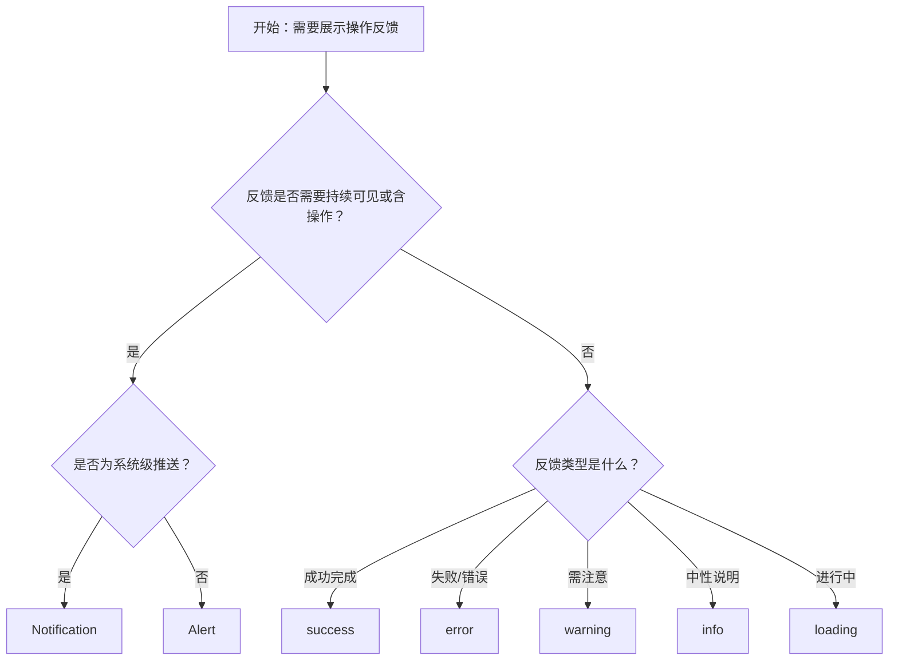

# 1. 简洁易读部份

## 1.0. 组件描述

全局提示（Message）组件用于在页面顶部居中展示操作反馈信息，采用轻量浮层形式，自动消失且不打断用户操作，适合成功、警告、错误等简短反馈。

## 1.1. 组件构成

全局提示由以下基础要素构成，可按需组合使用：

> <!-- 附图占位：建议附上一张示例图，展示 Message 的容器、图标与文本内容的构成关系，标注各要素名称与位置 -->

&emsp;&emsp;1. **容器** 定义提示框的视觉边界，通常为小卡片形态，承载图标与文本。

&emsp;&emsp;2. **图标** 传达反馈类型（成功、失败、警告、信息、加载中），用于快速识别反馈性质。

&emsp;&emsp;3. **文本内容** 表达操作结果或反馈说明，宜简短直接，通常一行以内。

---

## 1.2. 组件包含哪些不同类型

### 1.2.1 成功提示（success）

&emsp;**是什么**：传达操作已成功完成的正面反馈

> <!-- 附图占位：建议附上一张示例图，展示成功 Message（绿色系、成功图标）的视觉形态，体现正向反馈的语义 -->

&emsp;**简单用法**：必须用于已成功完成的操作；文案简洁（如「保存成功」「删除成功」）；默认自动消失

&emsp;**典型场景**：表单提交成功、保存成功、删除成功、复制成功

> <!-- 附图占位：建议附上一张场景图，展示用户点击保存后顶部出现的成功提示，体现轻量反馈的典型用法 -->

&emsp;**替代方案**：若需用户持续关注或含操作按钮，改用 Alert 或 Notification

### 1.2.2 错误提示（error）

&emsp;**是什么**：传达操作失败或异常的负面反馈

> <!-- 附图占位：建议附上一张示例图，展示错误 Message（红色系、错误图标）的视觉形态，体现失败反馈的语义 -->

&emsp;**简单用法**：必须用于已发生的错误；文案应说明失败原因或后续建议；可适当延长显示时间便于阅读

&emsp;**典型场景**：提交失败、网络异常、权限不足

> <!-- 附图占位：建议附上一张场景图，展示提交失败后顶部出现的错误提示，体现失败反馈的典型用法 -->

&emsp;**替代方案**：若错误复杂需详细说明或含操作入口，改用 Alert 或 Modal

### 1.2.3 警告提示（warning）

&emsp;**是什么**：传达需用户注意但未造成严重后果的提醒

> <!-- 附图占位：建议附上一张示例图，展示警告 Message（橙色/黄色系、警告图标）的视觉形态，体现需关注的语义 -->

&emsp;**简单用法**：必须用于潜在风险或需注意的情况；不可用于已发生的错误；文案简洁

&emsp;**典型场景**：操作受限、数据即将过期、配额提醒

> <!-- 附图占位：建议附上一张场景图，展示某操作受限时顶部出现的警告提示，体现警告类反馈的用法 -->

&emsp;**替代方案**：若需用户明确确认，改用 Modal

### 1.2.4 信息提示（info）

&emsp;**是什么**：传达中性、辅助性的说明或提示

> <!-- 附图占位：建议附上一张示例图，展示信息 Message（蓝色系、信息图标）的视觉形态，体现中性说明的语义 -->

&emsp;**简单用法**：必须用于非成功/失败的辅助说明；不可用于错误或严重警告；适合操作说明、状态提示

&emsp;**典型场景**：操作提示、状态说明、简要说明

> <!-- 附图占位：建议附上一张场景图，展示用户执行某操作后顶部出现的信息提示，体现中性反馈的用法 -->

&emsp;**替代方案**：若信息需持续可见，改用 Alert

### 1.2.5 加载提示（loading）

&emsp;**是什么**：传达操作正在进行中，需等待完成的反馈

> <!-- 附图占位：建议附上一张示例图，展示加载 Message（加载图标、简洁文案）的视觉形态，体现进行中的语义 -->

&emsp;**简单用法**：必须用于异步操作进行中；通常需手动关闭或操作完成后自动替换为成功/失败提示；不宜长时间悬挂

&emsp;**典型场景**：提交中、导出中、处理中

> <!-- 附图占位：建议附上一张场景图，展示提交过程中顶部显示的加载提示，以及完成后切换为成功提示的流程 -->

&emsp;**替代方案**：若为局部加载，改用 Spin；若为强阻断操作，改用 Modal 的 loading 状态

---

## 1.3. 各类型典型场景案例

### 1.3.1 成功与错误反馈

> <!-- 附图占位：建议附上一张对比图，左侧展示操作成功后使用 success、失败后使用 error（符合规范），右侧展示类型与结果不符（违反规范） -->

✅ **推荐：** 按实际操作结果选择 success 或 error，文案与结果一致

❌ **不推荐：** 失败时使用成功样式，或成功时使用错误样式

### 1.3.2 简短与自动消失

> <!-- 附图占位：建议附上一张对比图，左侧展示简短文案、合理时长的 Message（符合规范），右侧展示长文案或过长停留（违反规范） -->

✅ **推荐：** 文案控制在简短一句，默认自动消失，时长适中（如 3 秒）

❌ **不推荐：** 长段落文案或过短/过长显示时间，影响阅读或干扰操作

### 1.3.3 与 Alert、Notification 区分

> <!-- 附图占位：建议附上一张对比图，展示 Message 适合轻量短时反馈、Alert 适合持久展示、Notification 适合系统级推送的差异 -->

✅ **推荐：** 操作结果短时反馈用 Message；需持续可见用 Alert；系统级或带操作用 Notification

❌ **不推荐：** 需持久可见或含操作时仍用 Message，导致信息被自动关闭而无法响应

---

# 2. 选型指南

## 2.1 选择流程

---

# 3. 细致专业部份（交互与排版规则）

为保持 Message 轻量、不打断用户，请参考以下规则：

## 3.1 展示位置与堆叠

* **位置**：固定于页面顶部居中，不随滚动移动。
* **堆叠数量**：同一时刻可见的 Message 不宜过多，超出时可限制最大数量，优先关闭最早的一条。
* **顺序**：新提示在上方或按时间顺序排列，避免相互遮挡。

> <!-- 附图占位：建议附上一张场景图，展示多条 Message 的堆叠与数量限制效果 -->

## 3.2 时长与关闭

* **默认时长**：成功、信息类约 3 秒；错误、警告可稍长（如 4–5 秒）便于阅读。
* **不自动关闭**：可配置为 0 秒，需用户手动关闭，慎用于常规反馈。
* **悬停暂停**：悬停时暂停计时，移开后继续，便于用户阅读。

> <!-- 附图占位：建议附上一张示意图，展示不同时长与悬停暂停的交互逻辑 -->

## 3.3 文案规范

* **简短**：以一句话为主，避免长段落。
* **动词导向**：优先使用「保存成功」「删除成功」等动宾结构。
* **错误说明**：失败时尽量说明原因或建议（如「网络异常，请稍后重试」）。

> <!-- 附图占位：建议附上一张对比图，展示简洁动宾文案与冗长模糊文案的差异 -->

## 3.4 类型与语义

* **类型一致**：图标与颜色必须与反馈类型一致（成功绿、错误红、警告橙、信息蓝）。
* **不滥用**：不宜用 Message 承载重要、需用户决策的信息；此类场景用 Modal 或 Alert。

> <!-- 附图占位：建议附上一张示意图，展示四种类型的视觉区分与语义对应 -->

## 3.5 加载状态

* **使用场景**：仅用于全局、短时异步操作（如提交、导出）。
* **关闭方式**：操作完成后需显式关闭或替换为成功/失败提示，避免长期悬挂。
* **与 Spin 区分**：局部加载用 Spin；全局、阻断性加载可考虑 Modal loading。

> <!-- 附图占位：建议附上一张流程图，展示 loading → success/error 的完整反馈流程 -->

## 3.6 可访问性与上下文

* **可访问性**：提示内容需对屏幕阅读器友好；自动消失时需注意无障碍体验。
* **上下文**：静态方法可能无法获取 ConfigProvider、主题等上下文；需上下文时优先使用 hooks 方式。

> <!-- 附图占位：建议附上一张说明图，展示在需要主题或国际化时的推荐使用方式 -->

---

## 4.0. 常见问题

### 1. Message 和 Alert 的区别是什么？

- **Message**：顶部居中浮层、短时展示、自动消失，适合操作结果的轻量反馈，如「保存成功」「删除成功」。
- **Alert**：页面内嵌、静态、不自动消失，用户可手动关闭，适合需持续可见的提示，如错误说明、公告。

### 2. Message 和 Notification 的区别是什么？

- **Message**：顶部居中、单行为主、无标题与操作区，适合简单操作反馈。
- **Notification**：四角弹出、可含标题与描述、支持操作按钮，适合较复杂或系统级通知。

### 3. loading 类型的 Message 何时关闭？

- 异步操作完成（成功或失败）后，应关闭 loading 并替换为对应的 success 或 error 提示。
- 若操作失败，可显示 error 提示并说明原因，避免 loading 长时间悬挂。
