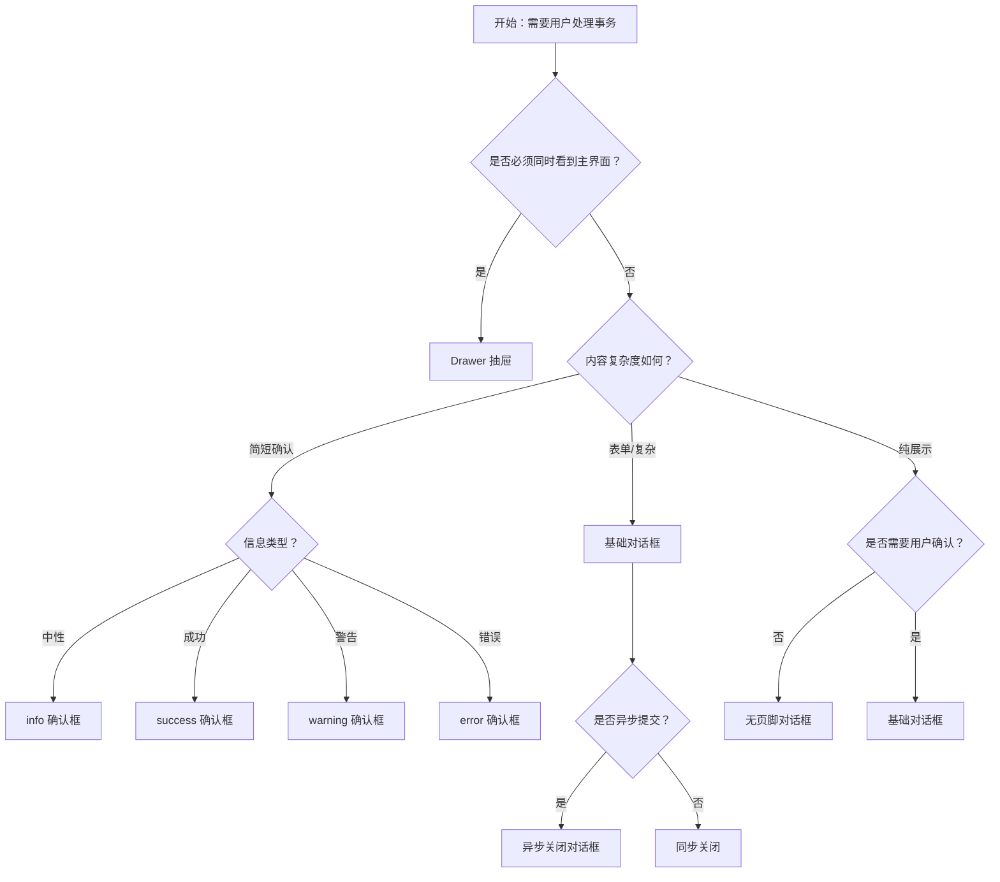

# 1. 简洁易读部份

## 1.0. 组件描述

对话框（Modal）组件用于在页面正中打开一个浮层，承载需要用户处理的事务，在不跳转页面的前提下完成确认、录入或展示，适合需强聚焦、明确响应的场景。

## 1.1. 组件构成

对话框由以下基础要素构成，可按需组合使用：

> <!-- 附图占位：建议附上一张示例图，展示对话框的遮罩层、容器、标题栏、内容区、页脚操作区与关闭按钮的构成关系，标注各要素名称与位置 -->

&emsp;&emsp;1. **遮罩层** 覆盖主内容区域，突出对话框并支持点击关闭，可配置是否模糊或是否可点击关闭。

&emsp;&emsp;2. **容器** 定义对话框的尺寸与位置，承载标题、内容与页脚。

&emsp;&emsp;3. **标题栏** 表达当前任务或主题，可含关闭按钮。

&emsp;&emsp;4. **内容区** 承载说明文字、表单或自定义内容。

&emsp;&emsp;5. **页脚操作区** 放置「取消」「确定」等按钮，用于用户响应。

&emsp;&emsp;6. **关闭入口** 标题栏关闭按钮或遮罩点击，用于退出对话框。

---

## 1.2. 组件包含哪些不同类型

### 1.2.1 基础对话框

&emsp;**是什么**：标准形态的对话框，含标题、内容区与默认或自定义页脚

> <!-- 附图占位：建议附上一张示例图，展示基础对话框的完整结构（标题、内容、取消/确定按钮），体现标准形态 -->

&emsp;**简单用法**：适用于需用户明确处理的事务；必须提供清晰的取消与确定入口；内容可为文字、表单或自定义组件

&emsp;**典型场景**：表单提交、配置编辑、信息确认

> <!-- 附图占位：建议附上一张场景图，展示点击「编辑」后打开的编辑对话框，体现基础对话框的典型用法 -->

&emsp;**替代方案**：若仅为简短确认，可用确认对话框；若需保持主界面上下文，考虑抽屉

### 1.2.2 确认对话框（confirm）

&emsp;**是什么**：以确认或取消为核心的简易对话框，用于阻断式选择

> <!-- 附图占位：建议附上一张示例图，展示确认对话框的简洁形态（图标+标题+取消/确定），体现快捷确认的用途 -->

&emsp;**简单用法**：必须用于需用户明确选择「是/否」的场景；内容宜简短；默认不提供标题栏关闭，强依赖用户点击按钮

&emsp;**典型场景**：删除确认、覆盖确认、离开页面确认

> <!-- 附图占位：建议附上一张场景图，展示删除前弹出的「确定删除？」确认框，体现阻断式确认的典型用法 -->

&emsp;**替代方案**：若需详细说明或复杂表单，改用基础对话框；若为低风险操作，可用 Popconfirm

### 1.2.3 信息/成功/警告/错误对话框

&emsp;**是什么**：按反馈类型区分的确认对话框变体，通过图标与样式传达信息性质

> <!-- 附图占位：建议附上一张示例图，展示 info、success、warning、error 四种类型的图标与样式差异，体现语义区分 -->

&emsp;**简单用法**：info 用于中性说明；success 用于成功结果确认；warning 用于需注意的提醒；error 用于错误说明；选择与内容语义一致的类型

&emsp;**典型场景**：操作结果告知、系统提示、错误说明

> <!-- 附图占位：建议附上一张场景图，展示提交成功后弹出的成功对话框与提交失败后弹出的错误对话框，体现类型与场景的对应 -->

&emsp;**替代方案**：若仅需轻量反馈且不需用户确认，改用 Message

### 1.2.4 异步关闭对话框

&emsp;**是什么**：确定按钮触发异步操作，在操作完成前保持打开并显示加载状态

> <!-- 附图占位：建议附上一张示例图，展示确定按钮处于 loading 状态时的对话框形态，体现异步关闭的流程 -->

&emsp;**简单用法**：必须用于提交、保存等异步操作；确定按钮在请求进行中应显示加载态并禁用；成功或失败后再关闭或给出反馈

&emsp;**典型场景**：表单提交、数据保存、远程操作确认

> <!-- 附图占位：建议附上一张场景图，展示点击确定后按钮 loading、请求完成后关闭的完整流程 -->

&emsp;**替代方案**：若为同步操作，直接关闭即可

### 1.2.5 自定义页脚对话框

&emsp;**是什么**：页脚不采用默认「取消」「确定」，而是自定义按钮组合或文案

> <!-- 附图占位：建议附上一张示例图，展示自定义页脚（如多个按钮、自定义文案）的对话框形态 -->

&emsp;**简单用法**：适用于业务需要特殊操作组合的场景；主操作应视觉突出；按钮顺序符合从左到右、从轻到重的逻辑

&emsp;**典型场景**：多步骤确认、自定义操作组合、国际化按钮文案

> <!-- 附图占位：建议附上一张场景图，展示页脚为「上一步」「下一步」「提交」等多按钮的对话框 -->

&emsp;**替代方案**：若默认按钮即可满足，不必自定义

### 1.2.6 无页脚对话框

&emsp;**是什么**：不提供默认页脚按钮，仅含内容与关闭入口

> <!-- 附图占位：建议附上一张示例图，展示无页脚、仅靠标题栏关闭的对话框形态 -->

&emsp;**简单用法**：适用于纯展示或内容自含操作的情况；必须提供关闭入口（标题栏关闭或遮罩点击）；不宜用于需明确确认的场景

&emsp;**典型场景**：协议展示、说明文档、图片预览

> <!-- 附图占位：建议附上一张场景图，展示用户协议阅读对话框，无确定按钮，仅关闭即可 -->

&emsp;**替代方案**：若需用户明确确认，必须提供确定或关闭按钮

### 1.2.7 加载中对话框

&emsp;**是什么**：内容区显示骨架屏或加载指示，用于内容异步加载的场景

> <!-- 附图占位：建议附上一张示例图，展示内容区为骨架屏的对话框形态，体现加载中的视觉反馈 -->

&emsp;**简单用法**：必须用于打开时内容尚未就绪的场景；加载完成后替换为实际内容；避免长时间无反馈

&emsp;**典型场景**：详情加载、表单数据拉取、复杂内容初始化

> <!-- 附图占位：建议附上一张场景图，展示对话框打开时先显示 loading、数据加载完成后展示内容的流程 -->

&emsp;**替代方案**：若为整体页面加载，考虑整页 Spin 或进度条

---

## 1.3. 各类型典型场景案例

### 1.3.1 确认与基础对话框

> <!-- 附图占位：建议附上一张对比图，左侧展示简短确认用确认对话框（符合规范），右侧展示复杂表单用基础对话框（符合规范） -->

✅ **推荐：** 简短「是/否」用确认对话框；需表单或复杂内容用基础对话框

❌ **不推荐：** 简单确认用复杂基础对话框；复杂表单强行用简易确认框

### 1.3.2 类型与语义

> <!-- 附图占位：建议附上一张对比图，左侧展示 success/error 与内容语义一致（符合规范），右侧展示类型与内容不符（违反规范） -->

✅ **推荐：** info/success/warning/error 与内容语义严格对应

❌ **不推荐：** 成功内容用 error 样式，或错误内容用 success 样式

### 1.3.3 异步操作反馈

> <!-- 附图占位：建议附上一张对比图，左侧展示确定后进入 loading、完成后关闭（符合规范），右侧展示无 loading 或过早关闭（违反规范） -->

✅ **推荐：** 异步确定时按钮 loading，完成后再关闭或提示

❌ **不推荐：** 异步操作无加载反馈，或未完成就关闭

---

# 2. 选型指南

## 2.1 选择流程

---

# 3. 细致专业部份（交互与排版规则）

为确保对话框清晰、易用且符合用户预期，请参考以下规则：

## 3.1 遮罩与关闭

* **遮罩**：默认显示半透明遮罩，突出对话框；可配置点击遮罩是否关闭。
* **确认类**：确认对话框通常不推荐点击遮罩关闭，避免误关；基础对话框可根据业务决定。
* **键盘**：支持 Esc 关闭；关闭时焦点应回到触发元素。

> <!-- 附图占位：建议附上一张示意图，展示遮罩、关闭按钮与 Esc 的关闭行为关系 -->

## 3.2 标题与内容

* **标题**：必须清晰表达当前任务（如「确认删除」「编辑配置」），不可留空。
* **内容**：说明类内容宜简洁；表单类需结构清晰；避免过长段落。
* **宽度**：按内容量选择合适的宽度，可响应式或固定值。

> <!-- 附图占位：建议附上一张示例图，展示标题与内容区的排版与宽度适配 -->

## 3.3 页脚与按钮

* **顺序**：从左到右为「取消/次要」→「确定/主要」，主操作靠右。
* **主按钮**：确定/提交类为主按钮，视觉最突出。
* **危险操作**：删除、清空等危险操作的主按钮可使用危险样式，并建议二次确认。

> <!-- 附图占位：建议附上一张示例图，展示页脚按钮顺序与主次关系的布局 -->

## 3.4 异步与加载

* **加载态**：确定按钮触发异步时，应进入 loading 并禁用，避免重复提交。
* **关闭时机**：请求成功后可关闭对话框并刷新列表或提示；失败时保持打开并展示错误信息。
* **内容加载**：若打开时内容未就绪，内容区显示骨架屏或 Spin。

> <!-- 附图占位：建议附上一张流程图，展示异步确定与内容加载的完整反馈流程 -->

## 3.5  focus 与可访问性

* **焦点管理**：打开时焦点移入对话框，关闭时焦点回到触发元素。
* **Tab 导航**：表单内支持 Tab 顺序；关闭按钮可被 Tab 聚焦。
* **可访问性**：标题、按钮具备合适语义，支持屏幕阅读器。

> <!-- 附图占位：建议附上一张示意图，展示焦点进入与离开对话框的路径 -->

## 3.6 与其他反馈组件的关系

* **Modal**：需用户明确处理、强聚焦、可含表单或复杂内容。
* **Drawer**：需保持主界面上下文时的附加任务，从边缘滑出。
* **Message**：轻量、短时、自动消失的操作反馈。
* **Popconfirm**：简单的二次确认，无复杂内容。

按「是否需要强聚焦」「是否需保持主界面可见」「内容复杂度」选择合适组件。

> <!-- 附图占位：建议附上一张对比图，展示 Modal、Drawer、Message、Popconfirm 的适用场景差异 -->

---

## 4.0. 常见问题

### 1. Modal 和 Drawer 的区别是什么？

- **Modal**：居中浮层、强聚焦，适合需用户明确确认或完成事务的场景。
- **Drawer**：从边缘滑入、可保持主界面部分可见，适合附加任务、表单编辑、信息预览。

### 2. 确认对话框和 Popconfirm 如何选择？

- **确认对话框**：内容可较长、可含图标与多行说明，适合删除、覆盖等需明确确认的操作。
- **Popconfirm**：气泡形态、紧贴触发元素、内容简短，适合低风险或轻量二次确认。

### 3. 何时使用 info/success/warning/error 类型？

- 按反馈性质选择：info 为中性说明，success 为成功，warning 为需注意，error 为错误。
- 类型需与内容一致，避免误导用户对结果的理解。
