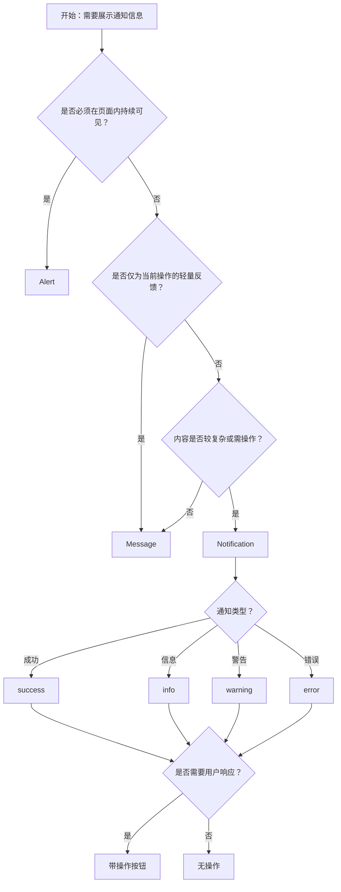

# 1. 简洁易读部份

## 1.0. 组件描述

通知提醒框（Notification）组件用于在系统四角全局展示通知信息，支持标题、描述与操作按钮，适合较复杂的系统推送、带交互的提醒以及需用户下一步行动点的场景。

## 1.1. 组件构成

通知提醒框由以下基础要素构成，可按需组合使用：

> <!-- 附图占位：建议附上一张示例图，展示 Notification 的容器、图标、标题、描述、操作区与关闭按钮的构成关系，标注各要素名称与位置 -->

&emsp;&emsp;1. **容器** 定义提醒框的视觉边界与尺寸，承载图标、标题、描述与操作。

&emsp;&emsp;2. **图标** 传达通知类型（成功、信息、警告、错误），可自定义或隐藏。

&emsp;&emsp;3. **标题** 表达通知主题，为主信息层级。

&emsp;&emsp;4. **描述** 提供详细说明或补充信息，可多行。

&emsp;&emsp;5. **操作区** 可放置「查看」「撤销」等按钮，引导用户下一步操作。

&emsp;&emsp;6. **关闭按钮** 允许用户主动关闭单条通知。

---

## 1.2. 组件包含哪些不同类型

### 1.2.1 成功通知（success）

&emsp;**是什么**：传达操作成功或目标达成的正向通知

> <!-- 附图占位：建议附上一张示例图，展示成功 Notification（绿色系、成功图标、标题+描述）的视觉形态 -->

&emsp;**简单用法**：必须用于已成功完成的操作；可含「查看详情」等操作；适合系统级或跨模块的成功反馈

&emsp;**典型场景**：任务完成、文件上传成功、批量操作完成

> <!-- 附图占位：建议附上一张场景图，展示后台任务完成后右上角弹出的成功通知，含「查看」按钮 -->

&emsp;**替代方案**：若为当前页面内的轻量反馈，改用 Message

### 1.2.2 信息通知（info）

&emsp;**是什么**：传达中性、辅助性的系统说明或提示

> <!-- 附图占位：建议附上一张示例图，展示信息 Notification（蓝色系、信息图标）的视觉形态 -->

&emsp;**简单用法**：必须用于非成功/失败的说明；不可用于错误或严重警告；适合系统公告、功能说明

&emsp;**典型场景**：系统更新说明、新功能提示、待办提醒

> <!-- 附图占位：建议附上一张场景图，展示系统推送的「新功能上线」信息通知，含说明与操作入口 -->

&emsp;**替代方案**：若信息极简且仅需短时展示，改用 Message

### 1.2.3 警告通知（warning）

&emsp;**是什么**：传达需用户注意但尚未造成严重后果的提醒

> <!-- 附图占位：建议附上一张示例图，展示警告 Notification（橙色/黄色系、警告图标）的视觉形态 -->

&emsp;**简单用法**：必须用于潜在风险或需注意的情况；可含操作按钮引导用户处理；适合配额、过期等预警

&emsp;**典型场景**：存储即将用尽、会话即将过期、权限变更提醒

> <!-- 附图占位：建议附上一张场景图，展示「存储空间不足」的警告通知，含「扩容」操作按钮 -->

&emsp;**替代方案**：若需用户立即确认或存在不可逆风险，改用 Modal

### 1.2.4 错误通知（error）

&emsp;**是什么**：传达操作失败、系统异常或错误的负面通知

> <!-- 附图占位：建议附上一张示例图，展示错误 Notification（红色系、错误图标）的视觉形态 -->

&emsp;**简单用法**：必须用于已发生的错误；描述应说明原因或建议；可含「重试」「查看日志」等操作

&emsp;**典型场景**：任务失败、同步异常、服务不可用

> <!-- 附图占位：建议附上一张场景图，展示「同步失败」的错误通知，含原因说明与「重试」按钮 -->

&emsp;**替代方案**：若错误需强确认才能继续，改用 Modal

### 1.2.5 带操作按钮通知

&emsp;**是什么**：在描述下方提供操作按钮，引导用户对通知做出响应

> <!-- 附图占位：建议附上一张示例图，展示带「查看」「撤销」「忽略」等操作按钮的 Notification 形态 -->

&emsp;**简单用法**：必须用于需要用户选择的通知；按钮语义明确；不宜超过 2–3 个

&emsp;**典型场景**：审批待处理、评论回复、撤销刚执行的操作

> <!-- 附图占位：建议附上一张场景图，展示「您有一条新消息」通知，含「查看」与「忽略」按钮 -->

&emsp;**替代方案**：若操作为强确认或复杂流程，改用 Modal

### 1.2.6 堆叠通知

&emsp;**是什么**：多条通知同时存在时，超出阈值的通知被收起为堆叠状态

> <!-- 附图占位：建议附上一张示例图，展示多条通知堆叠时的展示与收起效果 -->

&emsp;**简单用法**：适用于可能同时产生多条通知的场景；可配置堆叠阈值；避免单屏被大量通知占满

&emsp;**典型场景**：批量任务完成、多人在线协作、多模块同时推送

> <!-- 附图占位：建议附上一张场景图，展示超过 3 条时较早通知被收起、显示「还有 N 条」的堆叠效果 -->

&emsp;**替代方案**：若通知频率低，可不启用堆叠；若需统一管理，考虑消息中心

### 1.2.7 带进度条通知

&emsp;**是什么**：在自动关闭的通知中显示关闭倒计时进度条

> <!-- 附图占位：建议附上一张示例图，展示 Notification 底部的进度条，体现自动关闭的剩余时间 -->

&emsp;**简单用法**：适用于需自动关闭但又希望用户感知剩余时间的通知；进度条视觉不宜过强

&emsp;**典型场景**：上传完成倒计时、会话即将过期倒计时

> <!-- 附图占位：建议附上一张场景图，展示带进度条的通知在自动关闭前的视觉反馈 -->

&emsp;**替代方案**：若通知需用户明确阅读后关闭，不启用自动关闭与进度条

---

## 1.3. 各类型典型场景案例

### 1.3.1 与 Message 的区分

> <!-- 附图占位：建议附上一张对比图，左侧展示简单操作反馈用 Message（符合规范），右侧展示系统推送、带操作用 Notification（符合规范） -->

✅ **推荐：** 当前页面的轻量操作反馈用 Message；系统级推送、带标题描述或操作用 Notification

❌ **不推荐：** 简单「保存成功」用 Notification；复杂通知误用 Message

### 1.3.2 与 Alert 的区分

> <!-- 附图占位：建议附上一张对比图，左侧展示需持续可见的页面内提示用 Alert（符合规范），右侧展示可自动消失的系统推送用 Notification（符合规范） -->

✅ **推荐：** 页面内需持续可见的提示用 Alert；系统推送、可自动消失用 Notification

❌ **不推荐：** 需用户持续关注的内容用会自动消失的 Notification；一次性推送误用页面内 Alert

### 1.3.3 操作按钮使用

> <!-- 附图占位：建议附上一张对比图，左侧展示带 1–2 个明确操作按钮的通知（符合规范），右侧展示无操作或操作过多（违反规范） -->

✅ **推荐：** 需用户响应时提供 1–2 个语义明确的操作按钮

❌ **不推荐：** 需操作但无按钮；或操作过多导致选择负担

---

# 2. 选型指南

## 2.1 选择流程

---

# 3. 细致专业部份（交互与排版规则）

为确保通知清晰、不干扰过度且易于响应，请参考以下规则：

## 3.1 位置与堆叠

* **默认位置**：右上角为常见默认，符合多数用户的阅读习惯；可配置为四角之一。
* **堆叠**：超过阈值时较早的通知可收起，显示「还有 N 条」；避免单屏被大量通知占满。
* **最大数量**：可配置同时显示的最大条数，超出时自动关闭最早的一条。

> <!-- 附图占位：建议附上一张示意图，展示四角位置选项与堆叠时的布局 -->

## 3.2 时长与关闭

* **自动关闭**：默认约 4.5 秒后自动关闭；可配置为不自动关闭（0 或 false）。
* **悬停暂停**：悬停时暂停计时，便于用户阅读；可配置是否启用。
* **进度条**：启用自动关闭时，可显示进度条提示剩余时间。

> <!-- 附图占位：建议附上一张示意图，展示自动关闭、悬停暂停与进度条的交互逻辑 -->

## 3.3 标题与描述

* **标题**：简洁表达主题，控制在一行内。
* **描述**：可多行，用于补充说明或操作引导；不宜过长。
* **层级**：标题为主，描述为辅，视觉上应有清晰区分。

> <!-- 附图占位：建议附上一张示例图，展示标题与描述的排版与层级关系 -->

## 3.4 操作区

* **数量**：操作按钮不宜超过 2–3 个。
* **主次**：主操作（如「查看」「接受」）视觉突出；次要操作可弱化。
* **位置**：操作区通常放在描述下方，与内容区保持清晰区隔。

> <!-- 附图占位：建议附上一张示例图，展示带操作按钮的通知布局与主次关系 -->

## 3.5 类型与语义

* **类型一致**：success/info/warning/error 的图标与颜色必须与内容语义一致。
* **可访问性**：默认以 alert 角色供屏幕阅读器识别，必要时可调整为 status。

> <!-- 附图占位：建议附上一张示意图，展示四种类型的视觉区分与语义对应 -->

## 3.6 与 Message、Alert 的边界

* **Notification**：四角、可含标题与描述、支持操作、系统级推送。
* **Message**：顶部居中、单行、自动消失、轻量操作反馈。
* **Alert**：页面内嵌、静态、不自动消失、需用户关注或手动关闭。

按「是否系统级」「是否需要操作」「是否需持续可见」选择合适组件。

> <!-- 附图占位：建议附上一张对比图，展示 Notification、Message、Alert 在位置、内容、时长上的差异 -->

---

## 4.0. 常见问题

### 1. Notification 和 Message 的区别是什么？

- **Notification**：四角弹出、可含标题与描述、支持操作按钮、适合较复杂或系统级通知。
- **Message**：顶部居中、单行为主、无操作区、适合简单操作反馈，如「保存成功」。

### 2. Notification 和 Alert 的区别是什么？

- **Notification**：浮层、通常自动消失、适合系统推送、可含操作。
- **Alert**：页面内嵌、静态、不自动消失、适合需持续可见的页面内提示。

### 3. 何时使用带操作按钮的 Notification？

- 当通知需要用户做出选择或执行下一步操作时，如「查看详情」「撤销」「忽略」。
- 操作按钮不宜过多，1–2 个为宜；若需复杂操作，考虑引导至 Modal 或新页面。
