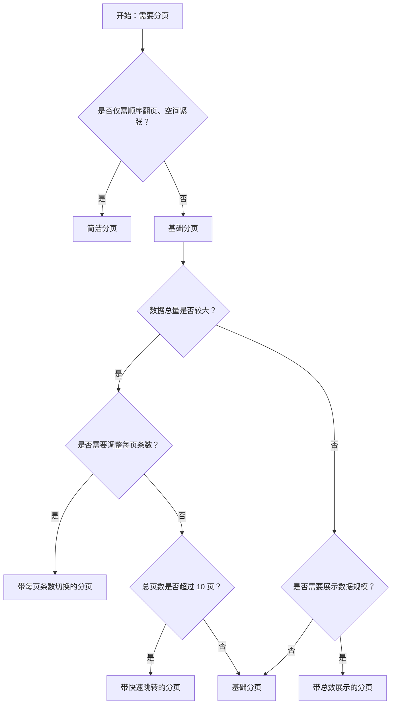

# 1. 简洁易读部份

## 1.0. 组件描述

分页组件用于分隔长列表，每次只加载一个页面的数据，在数据量较大时避免一次性加载带来的性能与体验问题，同时提供页码切换与跳转能力。

## 1.1. 组件构成

分页由以下基础要素构成，可按需组合使用：

> <!-- 附图占位：建议附上一张示例图，展示分页的基础要素（上一页/下一页、页码按钮、省略号、每页条数选择器、快速跳转、总数展示）的构成关系，标注各要素名称与位置 -->

&emsp;&emsp;1. **页码按钮** 标识可跳转的页码，当前页高亮显示，定义点击区域。

&emsp;&emsp;2. **上一页/下一页** 用于顺序翻页，位于页码区域两侧。

&emsp;&emsp;3. **每页条数选择器** 允许用户调整单页展示数量，常为下拉形式。

&emsp;&emsp;4. **快速跳转** 输入页码后直接跳转至指定页，适用于总页数较多的场景。

&emsp;&emsp;5. **总数展示** 显示数据总量及当前范围，帮助用户了解数据规模。

---

## 1.2. 组件包含哪些不同类型

### 1.2.1 基础分页

&emsp;**是什么**：包含页码、上一页/下一页、省略号的基础分页形态

> <!-- 附图占位：建议附上一张示例图，展示基础分页的形态（上一页、1 2 3 4 5、···、下一页），体现最简形态的页码结构 -->

&emsp;**简单用法**：用于常规列表分页；总页数较多时自动展示省略号；必须配合数据加载逻辑切换页码

&emsp;**典型场景**：表格底部、列表底部、搜索结果的翻页

> <!-- 附图占位：建议附上一张场景图，展示表格下方基础分页与表格内容的配合，体现页码切换与数据刷新的对应关系 -->

&emsp;**替代方案**：若需调整每页条数或快速跳转，选用带扩展功能的分页

### 1.2.2 简洁分页

&emsp;**是什么**：仅展示上一页/下一页及当前页/总页数的简形态，无独立页码按钮

> <!-- 附图占位：建议附上一张示例图，展示简洁分页的形态（上一页、当前页/总页数、下一页），体现极简的翻页结构 -->

&emsp;**简单用法**：必须用于空间紧张或总页数较少的场景；用户只需顺序翻页，无需跳转至特定页

&emsp;**典型场景**：弹窗内列表、移动端、抽屉内的简单列表

> <!-- 附图占位：建议附上一张场景图，展示弹窗或窄屏内简洁分页的摆放位置，体现空间节省与轻量翻页的用途 -->

&emsp;**替代方案**：若需跳转至任意页或调整每页条数，改用基础分页或全功能分页

### 1.2.3 带每页条数切换的分页

&emsp;**是什么**：在基础分页上增加每页展示条数选择器，允许用户调整单页数据量

> <!-- 附图占位：建议附上一张示例图，展示带每页条数切换的分页形态（页码 + 「10 条/页」下拉选择器），体现条数选择的交互入口 -->

&emsp;**简单用法**：数据总量较大时默认展示；常用选项如 10、20、50、100；切换后从第一页重新计算

&emsp;**典型场景**：后台表格、数据管理列表、导出或筛选场景

> <!-- 附图占位：建议附上一张场景图，展示表格底部「10 条/页」下拉与页码的配合，体现用户可灵活调整单页数据量 -->

&emsp;**替代方案**：若数据量固定且较少，使用基础分页即可

### 1.2.4 带快速跳转的分页

&emsp;**是什么**：在分页区域增加输入框，用户输入页码后可直接跳转至该页

> <!-- 附图占位：建议附上一张示例图，展示带快速跳转的分页形态（页码 + 「跳至 [输入框] 页」），体现快速跳转的交互入口 -->

&emsp;**简单用法**：总页数较多（如超过 10 页）时建议提供；输入框需校验页码范围；跳转后更新当前页状态

&emsp;**典型场景**：大量数据的表格、长列表、报表分页

> <!-- 附图占位：建议附上一张场景图，展示 50 页以上的列表分页中「跳至 25 页」的典型使用，体现快速定位能力 -->

&emsp;**替代方案**：若总页数很少，使用基础分页即可

### 1.2.5 带总数展示的分页

&emsp;**是什么**：在分页前展示数据总量及当前页的数据范围

> <!-- 附图占位：建议附上一张示例图，展示带总数展示的分页形态（「共 85 条」或「第 1-20 条，共 85 条」+ 页码），体现总数与范围的呈现方式 -->

&emsp;**简单用法**：用于需要用户了解数据规模的场景；格式可为「共 X 条」或「第 X-Y 条，共 Z 条」

&emsp;**典型场景**：数据管理、报表、需导出或统计的场景

> <!-- 附图占位：建议附上一张场景图，展示表格底部「共 85 条」与分页的配合，体现用户对数据总量的感知 -->

&emsp;**替代方案**：若数据规模不重要，使用基础分页即可

### 1.2.6 尺寸变体

&emsp;**是什么**：分页提供大、中、小三种尺寸，适配不同页面密度与视觉权重

> <!-- 附图占位：建议附上一张示例图，展示大、中、小三种尺寸分页的视觉对比，体现尺寸差异与适用场景 -->

&emsp;**简单用法**：大尺寸用于页面级主分页；中尺寸为默认；小尺寸用于紧凑区域（如弹窗、卡片内列表）

&emsp;**典型场景**：主列表用大号、弹窗内用小号、移动端适配小号

> <!-- 附图占位：建议附上一张场景图，展示主列表大号分页与弹窗内小号分页的对比，体现尺寸与场景的对应关系 -->

&emsp;**替代方案**：默认中尺寸可满足大多数场景

### 1.2.7 上一步/下一步为文字链接

&emsp;**是什么**：将上一页/下一页的图标按钮替换为「上一页」「下一页」文字链接

> <!-- 附图占位：建议附上一张示例图，展示文字链接形式的上一页/下一页，与图标按钮形式对比，体现语义更明确的表达 -->

&emsp;**简单用法**：适用于需要更强语义表达的场合；无障碍或国际化场景更友好

&emsp;**典型场景**：国际化产品、无障碍优先的页面、强调可读性的场景

> <!-- 附图占位：建议附上一张场景图，展示「上一页」「下一页」文字链接在分页中的摆放，体现语义化表达的用途 -->

&emsp;**替代方案**：常规场景使用默认图标即可

---

## 1.3. 各类型典型场景案例

### 1.3.1 基础分页

> <!-- 附图占位：建议附上一张对比图，左侧展示表格底部合理使用基础分页（符合规范），右侧展示单页数据却仍显示分页造成冗余（违反规范） -->

✅ **推荐：** 多页数据时在列表/表格底部使用基础分页

❌ **不推荐：** 仅一页数据时仍展示分页控件，造成视觉冗余

### 1.3.2 简洁分页与全功能分页

> <!-- 附图占位：建议附上一张对比图，左侧展示弹窗内使用简洁分页节省空间（符合规范），右侧展示主列表使用简洁分页导致无法跳转（违反规范） -->

✅ **推荐：** 空间紧张或简单列表使用简洁分页；主列表使用全功能分页

❌ **不推荐：** 主列表大量数据仅提供简洁分页，用户无法快速跳转

### 1.3.3 快速跳转与总数展示

> <!-- 附图占位：建议附上一张对比图，左侧展示 50 页以上时提供快速跳转与总数（符合规范），右侧展示大量数据无快速跳转导致翻页效率低（违反规范） -->

✅ **推荐：** 总页数较多时提供快速跳转；需要感知数据规模时展示总数

❌ **不推荐：** 大量数据无快速跳转，用户需多次点击才能到达目标页

---

# 2. 选型指南

## 2.1 选择流程

---

# 3. 细致专业部份（交互与排版规则）

为了保持分页清晰并符合用户操作习惯，当使用分页组件时，请参考以下交互与排版规则：

## 3.1 多操作的展示与折叠策略

* **默认展示**：页码、上一页、下一页为必备要素；省略号在总页数较多时自动出现。
* **扩展功能收纳**：每页条数选择、快速跳转、总数展示可根据场景选择性展示；弹窗或窄屏内建议仅保留核心翻页，避免拥挤。
* **单页隐藏**：当总数据仅一页时，建议隐藏分页控件，避免无意义的交互入口。

> <!-- 附图占位：建议附上一张场景图，展示表格底部分页的完整布局（总数 + 页码 + 每页条数 + 快速跳转），体现各扩展功能的组合与摆放 -->

## 3.2 危险操作（删除/清空/停用）

* 分页本身不承载危险操作；若分页所在页面含批量删除等危险操作，需确保分页切换后选中态与操作反馈清晰，避免误操作跨页数据。
* 危险操作确认弹窗内不应出现分页控件，避免用户在确认流程中切换页导致上下文混乱。

## 3.3 摆放位置（按页面场景划分）

* **表格/列表底部**：分页必须置于表格或列表内容正下方，与内容左对齐或居中，用户浏览到底部即可操作。
* **卡片内列表**：若列表嵌入卡片，分页置于卡片内部列表下方，与卡片边界保持合理间距。
* **弹窗/抽屉内**：分页置于弹窗或抽屉内容底部，优先使用简洁分页或小尺寸，避免占用过多空间。

> <!-- 附图占位：建议附上一张场景图，展示主列表底部、卡片内列表底部、弹窗底部分页的摆放位置，体现不同场景下的标准位置 -->

## 3.4 顺序与对齐逻辑

* **从左到右顺序**：总数展示（如有）➔ 上一页 ➔ 页码区域 ➔ 下一页 ➔ 每页条数选择（如有）➔ 快速跳转（如有）。
* **对齐方式**：分页可左对齐、居中或右对齐；表格列表通常与表格左边缘或右边缘对齐；居中适用于独立内容块。
* **响应式**：窄屏下可考虑仅保留上一页/下一页，或折叠为简洁分页。

> <!-- 附图占位：建议附上一张场景图，展示分页从左到右各元素的排列顺序与整体对齐方式 -->

## 3.5 状态与交互反馈

* **默认**：当前页高亮，其余页码可点击，边界清晰。
* **悬停**：页码悬停时提供背景或颜色变化，暗示可点击。
* **禁用**：在第一页时「上一页」禁用；在最后一页时「下一页」禁用；禁用态必须视觉置灰。
* **加载中**：切换页码后若需请求新数据，分页区域可配合加载态（如页码置灰、禁用点击），待数据加载完成恢复。
* **无数据**：总数为 0 时不应展示分页。

## 3.6 视觉规范与形态选择

* **尺寸**：主列表使用默认或大尺寸；弹窗、卡片内使用小尺寸；与页面密度保持一致。
* **省略号**：总页数较多时，首尾页码与当前页附近页码保留，中间以省略号代替，避免页码过多拥挤。
* **总数与范围**：总数展示文案简洁，如「共 85 条」或「第 1-20 条，共 85 条」，避免冗长描述。

> <!-- 附图占位：建议附上一张示例图，展示大中小尺寸分页、省略号展示规则、总数文案格式的视觉规范 -->

---

## 4.0. 常见问题

### 1. 什么时候需要隐藏分页？

- 当总数据量不超过一页（即总数 ≤ 每页条数）时，建议隐藏分页控件，避免展示无意义的翻页入口。可通过 `hideOnSinglePage` 实现。

### 2. 简洁分页和基础分页如何选择？

- **简洁分页**：仅提供上一页/下一页及当前页信息，适用于空间紧张、总页数少、用户只需顺序浏览的场景（如弹窗、移动端）。
- **基础分页**：提供完整页码与省略号，适用于主列表、总页数较多、用户可能需要跳转至特定页的场景。

### 3. 快速跳转什么时候需要提供？

- 当总页数超过 10 页时，建议提供快速跳转；用户可直接输入目标页码，无需多次点击上一页/下一页，提升效率。
