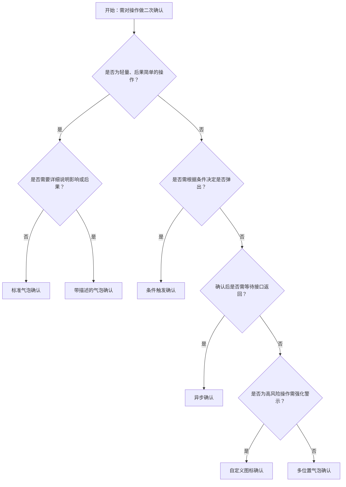

# 1. 简洁易读部份

## 1.0. 组件描述

气泡确认框用于在用户触发操作前进行轻量级二次确认，以目标元素附近弹出气泡浮层的形式询问用户，相比全屏居中模态对话框更加轻量、不打断主流程。

## 1.1. 组件构成

气泡确认框由以下基础要素构成，可按需组合使用：

> <!-- 附图占位：建议附上一张示例图，展示气泡确认框的触发元素、气泡容器、标题、描述、确认与取消按钮的构成关系，标注各要素名称与位置 -->

&emsp;&emsp;1. **触发元素** 用户点击或悬停的目标，如按钮、链接或图标，用于唤起气泡。

&emsp;&emsp;2. **气泡容器** 承载确认内容的浮层，包含标题、描述与操作按钮，通过箭头指向触发元素。

&emsp;&emsp;3. **标题** 简要说明待确认操作或后果，必须清晰可读。

&emsp;&emsp;4. **描述** 可选，用于补充说明或提供上下文，帮助用户理解风险或影响。

&emsp;&emsp;5. **确认与取消按钮** 用户做出决定的入口，确认按钮承载主操作，取消按钮用于放弃。

---

## 1.2. 组件包含哪些不同类型

### 1.2.1 标准气泡确认

&emsp;**是什么**：仅包含标题与确认、取消按钮的基础形态，适合语义简单、无需补充说明的操作。

> <!-- 附图占位：建议附上一张示例图，展示标准气泡确认框（标题 + 确认/取消按钮）的视觉形态 -->

&emsp;**简单用法**：标题必须简洁明确；必须用于用户理解成本低、后果可预期的操作；不适合需详细解释的高风险场景

&emsp;**典型场景**：删除单条记录、取消订阅、退出编辑

> <!-- 附图占位：建议附上一张场景图，展示表格行内「删除」按钮触发标准气泡确认的布局，体现轻量确认方式 -->

&emsp;**替代方案**：若操作后果复杂或风险较高，改用带描述的气泡确认或模态对话框

### 1.2.2 带描述的气泡确认

&emsp;**是什么**：在标题下方增加描述区域，用于补充说明操作影响或提供可选项说明。

> <!-- 附图占位：建议附上一张示例图，展示带描述的气泡确认框（标题 + 描述 + 确认/取消按钮）的视觉形态 -->

&emsp;**简单用法**：描述必须与标题形成互补，不重复；必须用于需要用户理解影响范围或可恢复性的操作；描述篇幅不宜过长

&emsp;**典型场景**：批量删除前的范围说明、不可逆操作前的后果提示

> <!-- 附图占位：建议附上一张场景图，展示「删除项目」气泡确认中描述「将同时删除其下 3 个子任务」的补充说明，体现描述增强理解的作用 -->

&emsp;**替代方案**：若信息量过大或需多步操作，改用模态对话框

### 1.2.3 自定义图标确认

&emsp;**是什么**：通过更换气泡内图标，强化操作类型或风险等级的视觉暗示。

> <!-- 附图占位：建议附上一张示例图，展示不同图标（如警告、问号、危险）的气泡确认框对比，体现图标对语义的强化 -->

&emsp;**简单用法**：图标必须与操作语义一致；危险操作建议使用警示类图标；不可为追求美观而弱化语义

&emsp;**典型场景**：删除用警示图标、停用用问号图标、批量操作用信息图标

> <!-- 附图占位：建议附上一张场景图，展示危险删除操作使用红色警示图标的气泡确认，体现图标与语义的对应关系 -->

&emsp;**替代方案**：若语义已足够清晰，可沿用默认图标

### 1.2.4 多位置气泡确认

&emsp;**是什么**：根据触发元素在页面中的位置，选择气泡在目标的上、下、左、右或角落出现，以避免遮挡内容。

> <!-- 附图占位：建议附上一张示例图，展示气泡在触发元素上方、下方、左侧、右侧等不同位置出现的效果 -->

&emsp;**简单用法**：必须根据触发元素与页面边缘的相对位置选择合适方向；贴边时组件会自动调整或偏移；避免气泡遮挡关键信息

&emsp;**典型场景**：表格顶部操作、卡片右下角操作、侧边栏操作

> <!-- 附图占位：建议附上一张场景图，展示表格顶部「批量删除」按钮触发时气泡在下方出现，避免遮挡表头的布局 -->

&emsp;**替代方案**：空间受限时，可考虑改为模态对话框

### 1.2.5 条件触发确认

&emsp;**是什么**：根据业务逻辑判断是否需要弹出确认框，仅在满足条件时显示，否则直接执行。

> <!-- 附图占位：建议附上一张示例图，展示条件触发逻辑（如满足条件直接执行、不满足则弹出确认）的示意 -->

&emsp;**简单用法**：条件必须与业务规则一致；直接执行路径必须对用户透明；不可让用户困惑为何有时弹有时不弹

&emsp;**典型场景**：首次执行需确认、后续可跳过；无数据时直接执行、有数据时需确认

> <!-- 附图占位：建议附上一张场景图，展示「清空」在无数据时直接执行、有数据时弹出确认的差异化流程 -->

&emsp;**替代方案**：若逻辑过复杂，建议统一弹出确认

### 1.2.6 异步确认

&emsp;**是什么**：用户点击确认后，需等待接口返回或异步任务完成才关闭气泡，期间按钮进入加载状态。

> <!-- 附图占位：建议附上一张示例图，展示确认后气泡内按钮加载状态、等待接口返回再关闭的交互流程 -->

&emsp;**简单用法**：必须提供明确的加载反馈；失败时需保留气泡并提示错误原因；成功后可关闭并配合全局提示

&emsp;**典型场景**：提交表单前的确认、调用接口的删除确认

> <!-- 附图占位：建议附上一张场景图，展示确认后按钮变为加载状态、接口成功后气泡关闭并出现「操作成功」提示的完整流程 -->

&emsp;**替代方案**：若操作耗时极短，可直接关闭再提示

---

## 1.3. 各类型典型场景案例

### 1.3.1 轻量操作确认

> <!-- 附图占位：建议附上一张对比图，左侧展示删除单条记录使用气泡确认（符合规范），右侧展示同一操作使用全屏模态对话框（过度打断） -->

✅ **推荐：** 单条删除、取消订阅等轻量操作使用气泡确认，减少打断感

❌ **不推荐：** 简单操作使用全屏模态对话框，造成不必要的视觉负担

### 1.3.2 高风险操作确认

> <!-- 附图占位：建议附上一张对比图，左侧展示带描述与警示图标的气泡确认（符合规范），右侧展示仅标题无描述的危险操作确认（信息不足） -->

✅ **推荐：** 删除、停用等操作必须配合清晰描述与适当图标

❌ **不推荐：** 高风险操作仅用简短标题，缺少影响范围说明

### 1.3.3 气泡位置选择

> <!-- 附图占位：建议附上一张对比图，左侧展示根据触发位置合理选择气泡方向（符合规范），右侧展示气泡遮挡关键内容（违反规范） -->

✅ **推荐：** 根据触发元素位置选择气泡方向，避免遮挡重要信息

❌ **不推荐：** 气泡固定方向，导致遮挡表头、表单等重要内容

---

# 2. 选型指南

## 2.1 选择流程

---

# 3. 细致专业部份（交互与排版规则）

## 3.1 与模态对话框的选型策略

在需要二次确认时，应优先选用气泡确认而非模态对话框：

* **适用气泡确认**：单条删除、取消订阅、退出编辑、批量操作前的轻量确认等，操作后果明确、用户理解成本低。
* **适用模态对话框**：需填写额外信息（如输入「删除」以确认）、多步骤说明、需要阻断式焦点的关键确认。

> <!-- 附图占位：建议附上一张对比图，展示「删除单条」用气泡确认、「删除全部并清空备份」用模态对话框的选型差异 -->

## 3.2 标题与描述的撰写规范

* **标题**：必须为完整句式或动宾短语，如「确定删除该条记录？」「确定要取消订阅？」。禁止使用模糊表述如「请确认」。
* **描述**：用于补充影响范围、可恢复性、关联数据等，避免与标题重复。若描述超过两行，考虑改用模态对话框。
* **按钮文案**：确认按钮使用具体动作，如「删除」「取消订阅」；取消按钮统一为「取消」，不建议改为「我再想想」等。

> <!-- 附图占位：建议附上一张示例图，展示标题、描述、按钮文案的规范写法与反面示例 -->

## 3.3 气泡位置与贴边处理

* **默认位置**：根据触发元素在视口中的位置，优先选择能完整展示气泡且不遮挡重要内容的方位。
* **贴边偏移**：当气泡贴近视口边缘时，应自动偏移并调整箭头指向，保持与触发元素的可视关联。
* **超出处理**：当空间严重不足时，可允许气泡部分超出视口并配合滚动，或改用模态对话框。

> <!-- 附图占位：建议附上一张场景图，展示气泡贴边时的自动偏移与箭头调整效果 -->

## 3.4 触发方式与无障碍

* **默认触发**：一般为点击触发，用户需要主动点击才弹出，避免误触。
* **悬停触发**：不推荐用于确认框，因悬停易误触且不利于键盘与辅助设备用户。
* **键盘访问**：若需支持键盘操作，应配置 focus 触发或通过焦点管理让用户能通过 Tab 聚焦并操作。

> <!-- 附图占位：建议附上一张示例图，展示点击触发与焦点管理的正确实现方式 -->

## 3.5 异步确认的反馈规范

* **加载状态**：点击确认后，确认按钮应立即进入加载状态，禁止重复点击。
* **成功处理**：接口成功后关闭气泡，并配合 Message 或 Notification 告知结果。
* **失败处理**：接口失败时保留气泡，在气泡内或通过 Message 明确提示失败原因与建议操作。

> <!-- 附图占位：建议附上一张场景图，展示异步确认的加载、成功、失败三种状态的反馈方式 -->

## 3.6 禁用与条件显示

* **禁用状态**：当触发元素处于禁用状态时，点击不应弹出气泡；需通过视觉明确告知用户当前不可用。
* **条件触发**：当根据业务逻辑仅在部分情况下需要确认时，应保证「直接执行」与「弹出确认」两种路径对用户都可预期、可理解。

> <!-- 附图占位：建议附上一张场景图，展示禁用状态下不弹出气泡与条件触发的合理逻辑 -->

---

## 4.0. 常见问题

### 1. 气泡确认框和模态对话框什么时候用哪个？

- **气泡确认框**：适合轻量、后果简单的操作（如删除单条记录、取消订阅）。交互轻量，不抢占焦点，用户可在气泡与页面之间快速切换视线。
- **模态对话框**：适合需要填写额外信息、多步骤说明或必须阻断式聚焦的关键确认。当确认内容复杂或需用户输入才能继续时，应选用模态对话框。

### 2. 气泡位置如何选择？

根据触发元素在页面中的位置选择：元素靠上则气泡在下，元素靠下则气泡在上，元素靠左则气泡在右，元素靠右则气泡在左。同时避免气泡遮挡表头、表单、重要按钮等关键内容。组件会根据视口空间自动调整，贴边时会进行偏移。

### 3. 确认后需要调接口时，气泡应该何时关闭？

应在接口返回成功后再关闭气泡，并在关闭后通过 Message 或 Notification 告知用户操作结果。若接口失败，应保留气泡并提示失败原因，允许用户重试或取消。
