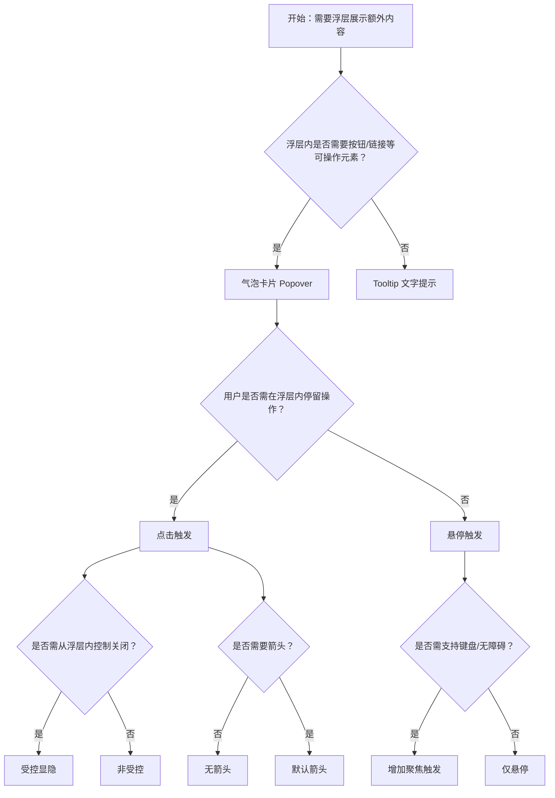

# 1. 简洁易读部份

## 1.0. 组件描述

气泡卡片用于在用户对目标元素进行操作（点击、悬停、聚焦）时，弹出气泡式的卡片浮层，承载进一步的描述或操作入口，适用于需要轻量浮层且内容可交互的场景。

## 1.1. 组件构成

气泡卡片由以下基础要素构成，可按需组合使用：

> <!-- 附图占位：建议附上一张示例图，展示气泡卡片的触发元素、浮层容器、标题、内容区、箭头的构成关系，标注各要素名称与位置 -->

&emsp;&emsp;1. **触发元素** 用户与之交互的控件（按钮、文字、图标等），触发浮层显示。

&emsp;&emsp;2. **浮层容器** 气泡状的卡片容器，承载标题与内容，可带箭头指向触发元素。

&emsp;&emsp;3. **标题与内容** 标题用于概括，内容区可放置链接、按钮等可交互元素，与 Tooltip 的纯文案不同。

---

## 1.2. 组件包含哪些不同类型

### 1.2.1 悬停触发（默认）

&emsp;**是什么**：鼠标移入触发元素时显示浮层，移出后隐藏，无需点击

> <!-- 附图占位：建议附上一张示例图，展示悬停时气泡卡片出现的形态及箭头指向触发元素 -->

&emsp;**简单用法**：适用于辅助说明、快捷信息展示；移入移出需有适当延时，避免闪烁

&emsp;**典型场景**：图标说明、字段解释、快捷操作提示

> <!-- 附图占位：建议附上一张场景图，展示悬停图标时显示说明气泡的交互效果 -->

&emsp;**替代方案**：若内容需用户长时间操作，改用点击触发以保持浮层稳定

### 1.2.2 点击触发

&emsp;**是什么**：用户点击触发元素时显示或关闭浮层，浮层可持续存在直到用户再次点击或点击外部

> <!-- 附图占位：建议附上一张示例图，展示点击后气泡卡片保持展开、可操作内容区的形态 -->

&emsp;**简单用法**：适用于浮层内包含按钮、链接等需点击的操作；需提供明显的关闭方式

&emsp;**典型场景**：更多操作菜单、快捷设置、富内容说明

> <!-- 附图占位：建议附上一张场景图，展示点击「更多」后弹出含操作按钮的气泡卡片布局 -->

&emsp;**替代方案**：若仅需短暂提示、无需在浮层内操作，改用悬停或 Tooltip

### 1.2.3 聚焦触发

&emsp;**是什么**：通过键盘聚焦触发元素时显示浮层，支持键盘用户的访问

> <!-- 附图占位：建议附上一张示例图，展示聚焦态与浮层显示的对应关系 -->

&emsp;**简单用法**：必须用于需要无障碍支持的场景；可配合悬停、点击组合使用

&emsp;**典型场景**：表单字段说明、需键盘操作的表单控件辅助信息

> <!-- 附图占位：建议附上一张场景图，展示输入框聚焦时显示说明气泡的无障碍用法 -->

&emsp;**替代方案**：若仅面向鼠标用户且无需键盘支持，可仅使用悬停或点击

### 1.2.4 多触发方式组合

&emsp;**是什么**：同时支持悬停与点击等多种触发方式，满足不同用户习惯

> <!-- 附图占位：建议附上一张示例图，展示同一气泡支持悬停与点击两种触发的配置说明 -->

&emsp;**简单用法**：适用于既需快速预览又需在浮层内操作的场景；需处理好悬停与点击的时序，避免冲突

&emsp;**典型场景**：悬停预览 + 点击展开操作、同时支持鼠标与键盘

> <!-- 附图占位：建议附上一张场景图，展示悬停显示简要信息、点击展开完整操作的气泡组合用法 -->

&emsp;**替代方案**：若交互简单，使用单一触发方式即可

### 1.2.5 受控显隐

&emsp;**是什么**：通过外部状态控制浮层的显示与隐藏，适用于需从浮层内关闭或与其它逻辑联动的场景

> <!-- 附图占位：建议附上一张示例图，展示从浮层内点击按钮关闭气泡的受控流程 -->

&emsp;**简单用法**：当浮层内操作会改变显隐状态时使用；需保证关闭逻辑清晰

&emsp;**典型场景**：浮层内「确认」后关闭、与步骤引导联动

> <!-- 附图占位：建议附上一张场景图，展示浮层内操作触发关闭的受控显隐流程 -->

&emsp;**替代方案**：若仅需点击外部关闭，使用非受控即可

### 1.2.6 无箭头

&emsp;**是什么**：隐藏浮层与触发元素之间的箭头，使气泡更简洁

> <!-- 附图占位：建议附上一张示例图，展示无箭头气泡与有箭头气泡的形态对比 -->

&emsp;**简单用法**：适用于箭头会造成视觉干扰、或浮层与触发元素关系已足够明确的场景

&emsp;**典型场景**：全宽浮层、贴边展示、风格极简的界面

> <!-- 附图占位：建议附上一张场景图，展示贴边或全宽气泡使用无箭头的简洁效果 -->

&emsp;**替代方案**：若需强调浮层与触发元素的关联，保留箭头

### 1.2.7 不同位置（placement）

&emsp;**是什么**：浮层可出现在触发元素的上、下、左、右及四角等十二个方向

> <!-- 附图占位：建议附上一张示例图，展示十二个方向的 placement 示意图 -->

&emsp;**简单用法**：根据页面空间与内容长度选择位置；空间不足时会自动翻转；贴边时支持偏移以避免裁切

&emsp;**典型场景**：顶部操作栏下方、侧边栏左侧、根据可用空间自适应

> <!-- 附图占位：建议附上一张场景图，展示不同位置气泡与页面空间的适配关系 -->

&emsp;**替代方案**：若无空间限制，使用默认 `top` 即可

---

## 1.3. 各类型典型场景案例

### 1.3.1 气泡卡片与 Tooltip

> <!-- 附图占位：建议附上一张对比图，左侧展示需在浮层内操作使用 Popover（符合规范），右侧展示仅需纯文案提示使用 Tooltip（符合规范） -->

✅ **推荐：** 浮层内需操作（按钮、链接）时用 Popover；仅文案提示时用 Tooltip

❌ **不推荐：** 纯文案提示使用 Popover 造成组件过重；需操作的浮层使用 Tooltip 导致无法点击

### 1.3.2 触发方式选择

> <!-- 附图占位：建议附上一张对比图，左侧展示短暂说明用悬停（符合规范），右侧展示需操作内容用点击（符合规范） -->

✅ **推荐：** 短暂说明用悬停，需在浮层内操作用点击

❌ **不推荐：** 浮层内含按钮却仅用悬停，用户难以在浮层内点击

### 1.3.3 位置与空间

> <!-- 附图占位：建议附上一张对比图，左侧展示根据空间自动调整位置（符合规范），右侧展示固定位置导致浮层被裁切（不推荐） -->

✅ **推荐：** 根据可用空间选择 placement，或依赖自动翻转与偏移

❌ **不推荐：** 固定 placement 导致浮层超出视口被裁切

---

# 2. 选型指南

## 2.1 选择流程

---

# 3. 细致专业部份（交互与排版规则）

## 3.1 触发区域与反馈

* **触发元素**：触发元素需能接受 `onMouseEnter`、`onMouseLeave`、`onFocus`、`onClick` 等事件；自定义子组件需透传 `ref` 与事件。
* **延时配置**：悬停触发的 `mouseEnterDelay`、`mouseLeaveDelay` 需合理设置，避免浮层闪烁或迟迟不出现。
* **视觉反馈**：触发元素悬停或聚焦时应有明确反馈，让用户感知可交互。

> <!-- 附图占位：建议附上一张示例图，展示触发元素的悬停、聚焦反馈与浮层延时出现的时序 -->

## 3.2 浮层内容与容量

* **内容长度**：气泡内容不宜过长，建议控制在可快速扫读的范围内；过长时考虑改用 Drawer 或 Modal。
* **标题与内容**：有标题时，标题应简洁概括；内容区可包含链接、按钮，需保证可点击区域足够大。
* **操作按钮**：若含操作，主操作应突出，危险操作需谨慎放置。

> <!-- 附图占位：建议附上一张场景图，展示气泡内标题、内容、操作按钮的合理排版与长度控制 -->

## 3.3 位置与自动调整

* **placement 逻辑**：空间不足时浮层会翻转至反向位置（如 `top` 改为 `bottom`）；单一方向可做贴边偏移。
* **边缘对齐**：`topLeft`、`bottomRight` 等边缘对齐方向仅做翻转，不做位移；`top`、`bottom` 等中心方向贴边时可做位移。
* **遮挡处理**：开启 `autoAdjustOverflow` 可在被遮挡时自动调整位置。

> <!-- 附图占位：建议附上一张说明图，展示 placement 与空间不足时的翻转、贴边偏移逻辑 -->

## 3.4 箭头与指向

* **箭头显示**：默认箭头指向触发元素中心，可配置隐藏或调整指向逻辑。
* **箭头样式**：箭头颜色需与浮层背景协调，确保边界清晰。

> <!-- 附图占位：建议附上一张示例图，展示箭头指向触发元素中心及与浮层背景的协调 -->

## 3.5 关闭与焦点

* **关闭方式**：点击外部、ESC 键、浮层内关闭按钮等需统一支持；受控模式下由业务逻辑决定关闭时机。
* **焦点管理**：打开时焦点可移入浮层（若含可聚焦元素）；关闭后焦点应回到触发元素，便于键盘连续操作。

> <!-- 附图占位：建议附上一张流程图，展示点击外部、ESC、浮层内关闭等多种关闭方式的处理逻辑 -->

## 3.6 无障碍与可访问性

* **键盘支持**：若需键盘访问，应将 `trigger` 设置为包含 `focus`，如 `['hover','focus']` 或 `'focus'`。
* **子组件要求**：自定义子组件需透传 `ref` 及 `onMouseEnter`、`onMouseLeave`、`onFocus`、`onClick` 等事件，否则可能导致无法正常工作或出现 `findDOMNode` 相关警告。

> <!-- 附图占位：建议附上一张说明图，展示 trigger 含 focus 时的键盘焦点流程与子组件透传要求 -->

---

## 4.0. 常见问题

### 1. 气泡卡片和 Tooltip 的区别是什么

- **Tooltip**：仅展示纯文案提示，用户不能与浮层内容交互，适合简短说明。
- **Popover**：浮层内可包含链接、按钮等可操作元素，适合需要用户进一步操作的场景。

### 2. 何时用悬停、何时用点击

- **悬停**：短暂说明、快速预览，用户无需在浮层内操作时使用。
- **点击**：浮层内含按钮、链接等需用户点击时使用，点击可保持浮层稳定以便操作。

### 3. 为何自定义子组件无法正常工作

- 气泡卡片依赖子元素能接收 `onMouseEnter`、`onMouseLeave`、`onFocus`、`onClick` 等事件，且需透传 `ref`。若子组件为自定义组件，需使用 `React.forwardRef` 将 `ref` 和事件透传至原生 DOM，否则会出现无法触发或 `findDOMNode` 相关警告。
