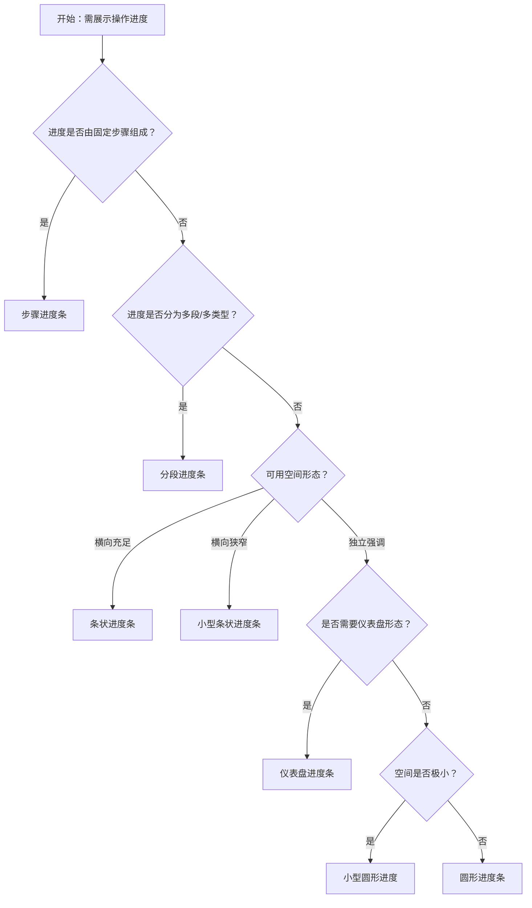

# 1. 简洁易读部份

## 1.0. 组件描述

进度条用于展示操作的当前进度或完成百分比，在操作耗时较长时为用户提供明确的状态反馈，缓解等待焦虑。

## 1.1. 组件构成

进度条由以下基础要素构成，可按需组合使用：

> <!-- 附图占位：建议附上一张示例图，展示进度条的导轨、轨迹（已完成部分）、进度数值/图标的构成关系，标注各要素名称与位置 -->

&emsp;&emsp;1. **导轨** 表示整体进度范围的背景轨道，体现「总量」的视觉边界。

&emsp;&emsp;2. **轨迹** 表示已完成部分的填充区域，颜色与导轨区分，体现「已完成」的进度。

&emsp;&emsp;3. **进度数值或图标** 以数字百分比或状态图标的方式呈现当前进度，可置于条内、条外或圈心。

&emsp;&emsp;4. **状态** 可选，如正常、成功、异常、活跃等，通过颜色与图标传达进度结果或进行中状态。

---

## 1.2. 组件包含哪些不同类型

### 1.2.1 条状进度条

&emsp;**是什么**：水平方向的条状进度，是默认且最常用的形态，适合展示明确的百分比进度。

> <!-- 附图占位：建议附上一张示例图，展示标准条状进度条（导轨 + 轨迹 + 百分比数值）的视觉形态 -->

&emsp;**简单用法**：必须用于有明确进度的场景；数值可置于条内或条外；适合列表、表格、卡片等横向空间充足的布局

&emsp;**典型场景**：文件上传、任务完成度、数据同步进度

> <!-- 附图占位：建议附上一张场景图，展示列表或卡片中的条状进度条，体现其在内容流中的自然嵌入 -->

&emsp;**替代方案**：若空间狭窄，改用小型条状或圆形进度

### 1.2.2 小型条状进度条

&emsp;**是什么**：高度更小的条状进度，适合放在狭窄区域或与文本、图标并排使用。

> <!-- 附图占位：建议附上一张示例图，展示小型条状进度条的紧凑形态 -->

&emsp;**简单用法**：必须用于横向空间有限、需与其它元素并排的场景；数值可简化或省略以节省空间

&emsp;**典型场景**：表格行内进度、工具栏进度、紧凑卡片内的进度展示

> <!-- 附图占位：建议附上一张场景图，展示表格行内小型进度条与其它列并排的布局 -->

&emsp;**替代方案**：若空间充足，使用标准条状以提升可读性

### 1.2.3 圆形进度条

&emsp;**是什么**：环形的进度展示，中心可显示百分比或状态图标，适合作为独立视觉焦点。

> <!-- 附图占位：建议附上一张示例图，展示圆形进度条（环形轨迹 + 中心数值）的视觉形态 -->

&emsp;**简单用法**：必须用于需要独立强调进度的场景；中心区域可展示百分比或完成/异常图标；适合居中或卡片内展示

&emsp;**典型场景**：仪表盘、任务完成度、存储空间占用

> <!-- 附图占位：建议附上一张场景图，展示仪表盘或概览页中圆形进度条的独立展示方式 -->

&emsp;**替代方案**：若需与正文流混合，改用条状进度

### 1.2.4 小型圆形进度

&emsp;**是什么**：尺寸更小的圆形进度，当尺寸极小时可将数值移至 Tooltip 显示，避免拥挤。

> <!-- 附图占位：建议附上一张示例图，展示小型圆形进度及悬停显示数值的交互 -->

&emsp;**简单用法**：必须用于空间极其有限、仅需示意进度的场景；数值可通过 Tooltip 补充；不可用于需精确读取百分比的场景

&emsp;**典型场景**：列表项状态、头像旁进度、紧凑工具栏

> <!-- 附图占位：建议附上一张场景图，展示列表项旁小型圆形进度的使用方式 -->

&emsp;**替代方案**：若需直接读取数值，使用标准圆形或条状

### 1.2.5 仪表盘进度条

&emsp;**是什么**：带缺口的环形进度，形似仪表盘，缺口位置可配置，适合作为数据可视化的组成元素。

> <!-- 附图占位：建议附上一张示例图，展示仪表盘形态的环形进度条，缺口位于底部或侧边 -->

&emsp;**简单用法**：必须用于需要突出视觉差异、区别于普通圆环的场景；缺口角度与位置可根据布局调整

&emsp;**典型场景**：数据大屏、KPI 展示、资源使用率

> <!-- 附图占位：建议附上一张场景图，展示数据大屏中仪表盘进度条与其它图表的组合 -->

&emsp;**替代方案**：若无需特殊形态，使用标准圆形即可

### 1.2.6 分段进度条

&emsp;**是什么**：将进度拆分为多段，每段可赋予不同颜色或语义，用于细化进度含义。

> <!-- 附图占位：建议附上一张示例图，展示分段进度条（如已完成绿、进行中蓝、待处理灰）的视觉形态 -->

&emsp;**简单用法**：必须用于进度具有多个阶段或类型的场景；各段含义需清晰可辨；颜色或样式需与业务语义一致

&emsp;**典型场景**：多阶段任务进度、存储空间分类、审核流程阶段

> <!-- 附图占位：建议附上一张场景图，展示多阶段任务中各段进度的分段展示 -->

&emsp;**替代方案**：若进度无细分阶段，使用单一轨迹即可

### 1.2.7 步骤进度条

&emsp;**是什么**：以离散步骤呈现进度，每一步完成时显示为填充状态，适用于阶段明确的流程。

> <!-- 附图占位：建议附上一张示例图，展示步骤进度条（若干等分块，部分已填充）的视觉形态 -->

&emsp;**简单用法**：必须用于进度由固定步骤组成的场景；步骤数不宜过多；适合与步骤条（Steps）组件配合使用

&emsp;**典型场景**：表单分步提交、审批流程、安装向导

> <!-- 附图占位：建议附上一张场景图，展示分步表单中的步骤进度条与当前步骤的对应关系 -->

&emsp;**替代方案**：若进度连续无明确步骤，使用条状或圆形

---

## 1.3. 各类型典型场景案例

### 1.3.1 有明确进度 vs 无明确进度

> <!-- 附图占位：建议附上一张对比图，左侧展示上传文件时显示精确百分比（符合规范），右侧展示无法预估时间时使用动态/无限进度（符合规范） -->

✅ **推荐：** 有明确进度时展示百分比；无法预估时使用动态动画或「进行中」状态

❌ **不推荐：** 无法获取真实进度时显示虚假百分比，误导用户

### 1.3.2 空间与形态选择

> <!-- 附图占位：建议附上一张对比图，左侧展示横向空间充足时使用条状进度（符合规范），右侧展示空间狭窄时强行使用大号圆形（违反规范） -->

✅ **推荐：** 根据可用空间选择合适的进度条形态与尺寸

❌ **不推荐：** 在狭窄区域使用过大的进度组件，造成布局拥挤

### 1.3.3 状态与颜色语义

> <!-- 附图占位：建议附上一张对比图，左侧展示成功/异常等状态使用对应颜色（符合规范），右侧展示状态与颜色不一致（违反规范） -->

✅ **推荐：** 成功、异常、进行中等状态使用规范的颜色与图标

❌ **不推荐：** 成功状态用红色、异常状态用绿色等违反用户预期的配色

---

# 2. 选型指南

## 2.1 选择流程

---

# 3. 细致专业部份（交互与排版规则）

## 3.1 何时使用进度条

* **适用场景**：操作耗时可能超过约 2 秒；操作在后台进行且会打断当前界面；需要明确展示完成百分比或阶段。
* **不适用场景**：操作在 1 秒内完成，无需展示进度；进度无法获取或不可靠时，应改用 Spin 或 Skeleton，而非虚假进度。

> <!-- 附图占位：建议附上一张对比图，展示「适合用进度条」与「适合用加载动画」的场景差异 -->

## 3.2 数值展示与格式

* **百分比**：默认展示为整数百分比，如 60%。可根据业务需要自定义格式（如小数、带单位）。
* **位置**：条状进度条数值可置于条内或条外，需确保与进度条有足够对比度，保证可读性。
* **完成与异常**：达到 100% 时可显示完成图标；异常状态下可显示错误图标，数值仍可保留以便排查。

> <!-- 附图占位：建议附上一张示例图，展示进度数值在条内、条外以及完成/异常状态下的展示方式 -->

## 3.3 状态与颜色规范

* **正常**：默认主题色，表示进行中。
* **成功**：绿色系，表示已完成且无误。
* **异常**：红色系，表示失败或错误。
* **活跃**：可选动画效果，强调正在进行，适用于条状进度。

颜色与语义需与 Ant Design 规范及用户认知一致，避免自定义语义冲突的颜色。

> <!-- 附图占位：建议附上一张示例图，展示正常、成功、异常、活跃四种状态的视觉区分 -->

## 3.4 动态进度与动画

* **进度变化**：当百分比更新时，应有平滑过渡，避免突兀跳变。
* **无限进度**：无法获取真实进度时，可使用动态的「活跃」状态或无限动画，明确告知用户「进行中」而非「卡住」。
* **步骤进度**：每一步的填充应有清晰的状态切换，避免步骤边界模糊。

> <!-- 附图占位：建议附上一张场景图，展示进度从 30% 到 60% 的过渡动画以及无限进度时的动态效果 -->

## 3.5 布局与尺寸

* **条状**：标准高度用于主要内容区；小型高度用于表格行、工具栏等紧凑场景。
* **圆形**：大尺寸用于独立强调；小尺寸用于列表、头像旁等；极小尺寸时数值可移至 Tooltip。
* **响应式**：在窄屏或小容器内，圆形进度可根据宽度自动切换为不显示中心数值、改为 Tooltip 展示。

> <!-- 附图占位：建议附上一张场景图，展示不同尺寸进度条在页面中的适用位置 -->

## 3.6 多进度组合与层级

* **同页多进度**：当同一视图内有多个进度时，主进度应更突出（如更大、更醒目），次要进度可弱化。
* **与 Spin、Skeleton 的配合**：页面整体加载用 Spin；内容结构已知、等待数据填充用 Skeleton；明确有进度值的操作用 Progress。

> <!-- 附图占位：建议附上一张场景图，展示多进度并存时的视觉层级与主次区分 -->

---

## 4.0. 常见问题

### 1. 进度条和 Spin 有什么区别？

- **进度条**：用于有明确进度值的场景，如文件上传百分比、任务完成度，让用户知道「完成了多少」。
- **Spin**：用于无明确进度或无法预估时间的等待，仅表示「正在加载」，不传达具体进度。

### 2. 无法获取真实进度时该怎么办？

不要显示虚假百分比。可以：使用 Spin 表示加载中；或使用 Progress 的「活跃」状态配合动态动画，表示进行中；或在文案中明确说明「正在处理，请稍候」。

### 3. 条状和圆形进度条如何选择？

条状进度条适合与内容流混合，如列表、表格、卡片内；圆形进度条适合作为独立视觉焦点，如仪表盘、概览页的中心指标。空间狭窄时优先考虑小型条状或小型圆形。
