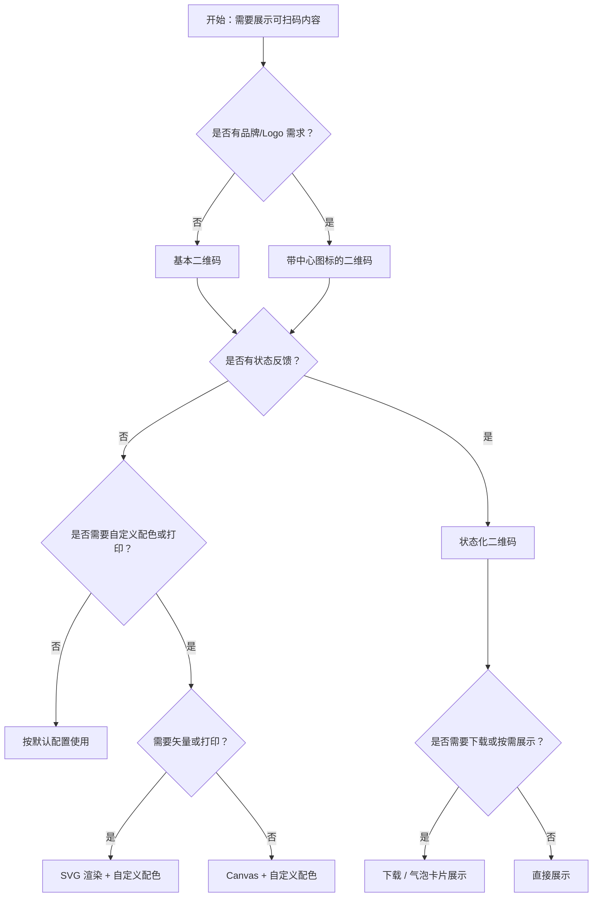

# 1. 简洁易读部份

## 1.0. 组件描述

二维码组件用于将文本信息转换为可被扫码设备识别的图形编码，便于用户通过移动设备快速访问链接、信息或完成验证等操作。

## 1.1. 组件构成

二维码由以下基础要素构成，可按需组合使用：

> <!-- 附图占位：建议附上一张示例图，展示二维码的四个基础要素（根容器、图案区域、留白安静区、可选边框）的构成关系，标注各要素名称与位置 -->

&emsp;&emsp;1. **根容器** 定义二维码的整体尺寸与边框样式，用于承载不同状态与视觉形态。

&emsp;&emsp;2. **图案区域** 承载编码信息，由黑白模块组成，扫描后可解析为文本或链接。

&emsp;&emsp;3. **留白安静区** 环绕图案边缘的空白区域，确保扫码设备能准确识别，不宜过小。

&emsp;&emsp;4. **可选中心图标** 用于品牌或业务标识，置于图案中央，需保证纠错等级足以覆盖图标占用的区域。

---

## 1.2. 组件包含哪些不同类型

### 1.2.1 基本二维码

&emsp;**是什么**：仅包含图案与可选边框的默认形态，无额外装饰

> <!-- 附图占位：建议附上一张示例图，展示基本二维码（黑色图案、白色背景、可选边框）的视觉形态，体现其简洁可扫描的形态 -->

&emsp;**简单用法**：必须用于纯展示与扫码场景；当链接较长时需适当放大尺寸以确保可扫；默认纠错等级 M 适合多数场景

&emsp;**典型场景**：分享链接、支付码、身份验证、设备配对

> <!-- 附图占位：建议附上一张场景图，展示支付或分享页面中基本二维码的放置位置，体现扫码即用的使用方式 -->

&emsp;**替代方案**：若需品牌强化，改用带中心图标的二维码

### 1.2.2 带中心图标的二维码

&emsp;**是什么**：在图案中央嵌入 Logo 或图标，用于品牌识别或业务区分

> <!-- 附图占位：建议附上一张示例图，展示带中心 Logo 的二维码，图标居中、四周图案仍清晰可辨 -->

&emsp;**简单用法**：中心图标不宜过大，以免影响扫码成功率；需配合较高纠错等级（如 H）；仅支持图片地址作为图标来源

&emsp;**典型场景**：品牌推广、活动页入口、会员码、电子票券

> <!-- 附图占位：建议附上一张场景图，展示带品牌 Logo 的会员码或活动二维码，体现品牌与扫码并重的使用场景 -->

&emsp;**替代方案**：若品牌要求不高，改用基本二维码以提升扫码稳定性

### 1.2.3 状态化二维码（加载 / 过期 / 已扫描）

&emsp;**是什么**：通过遮罩与状态文案提示用户当前扫码状态或结果

> <!-- 附图占位：建议附上一张示例图，展示加载中、过期、已扫描三种状态的遮罩与提示文案，体现状态切换的视觉差异 -->

&emsp;**简单用法**：加载中用于生成或刷新过程；过期用于时效性码的失效提示；已扫描用于一次性使用后的结果反馈；可配合自定义状态渲染器扩展文案与交互

&emsp;**典型场景**：登录确认、支付确认、签到码、限时兑换码

> <!-- 附图占位：建议附上一张场景图，展示登录确认页面中扫码后由「加载」变为「已扫描」的状态流转，体现状态反馈的及时性 -->

&emsp;**替代方案**：若无需状态提示，使用基本二维码即可

### 1.2.4 自定义渲染类型（Canvas / SVG）

&emsp;**是什么**：选择 Canvas 或 SVG 作为底层渲染方式，影响输出质量与适用场景

> <!-- 附图占位：建议附上一张对比图，展示同一内容在 Canvas 与 SVG 两种渲染下的视觉一致性，并标注各自适用场景 -->

&emsp;**简单用法**：Canvas 适用于常规网页展示与截图；SVG 适用于需要缩放不失真、打印或导出矢量场景

&emsp;**典型场景**：高清打印、响应式布局、无障碍、导出下载

> <!-- 附图占位：建议附上一张场景图，展示打印预览或导出场景下 SVG 渲染的清晰度优势 -->

&emsp;**替代方案**：无特殊需求时使用默认 Canvas 即可

### 1.2.5 自定义配色二维码

&emsp;**是什么**：通过自定义前景色与背景色适配品牌或主题

> <!-- 附图占位：建议附上一张示例图，展示不同配色（如蓝底白纹、品牌色）的二维码，体现与品牌一致性 -->

&emsp;**简单用法**：前景色与背景色需保持足够对比度，确保扫码设备可识别；避免使用渐变或过于复杂图案

&emsp;**典型场景**：品牌活动页、主题皮肤、深色模式

> <!-- 附图占位：建议附上一张场景图，展示与页面主题一致的配色二维码，体现视觉统一性 -->

&emsp;**替代方案**：若品牌无特殊要求，使用默认黑白色以最大化兼容性

### 1.2.6 不同纠错等级

&emsp;**是什么**：通过纠错等级（L / M / Q / H）控制可容忍的遮挡或损坏比例

> <!-- 附图占位：建议附上一张示意表，展示 L/M/Q/H 四级纠错等级与可纠正错误比例的关系 -->

&emsp;**简单用法**：L 约 7%、M 约 15%、Q 约 25%、H 约 30%；无中心图标或遮挡时 M 足够；有中心图标或可能部分遮挡时建议 Q 或 H

&emsp;**典型场景**：带 Logo 二维码、小尺寸展示、易磨损物料

> <!-- 附图占位：建议附上一张场景图，展示带 Logo 时使用 H 级纠错与普通场景使用 M 级纠错的对比 -->

&emsp;**替代方案**：内容编码短时，不同纠错等级生成的图案可能相同，可按实际需求选择

### 1.2.7 下载与高级展示（气泡卡片）

&emsp;**是什么**：支持将二维码保存为图片下载，或与 Popover 等组件配合，按需展示

> <!-- 附图占位：建议附上一张示例图，展示「下载」按钮与二维码的组合，或悬停后通过气泡卡片展示二维码的布局 -->

&emsp;**简单用法**：下载需在客户端完成图片生成；悬停展示适用于节省空间、减少干扰的场景

&emsp;**典型场景**：资料下载页、分享弹窗、表格行内二维码、移动端长按保存

> <!-- 附图占位：建议附上一张场景图，展示用户悬停「查看二维码」后弹出气泡卡片展示二维码的交互流程 -->

&emsp;**替代方案**：若始终需要可见，直接使用基本二维码即可

---

## 1.3. 各类型典型场景案例

### 1.3.1 基本与带图标

> <!-- 附图占位：建议附上一张对比图，左侧展示纯展示场景使用基本二维码（符合规范），右侧展示品牌活动使用带 Logo 二维码（符合规范） -->

✅ **推荐：** 纯链接分享使用基本二维码；品牌场景使用带中心图标的二维码并提高纠错等级

❌ **不推荐：** 带 Logo 时纠错等级过低导致扫码失败；图标过大遮挡关键定位图案

### 1.3.2 状态与尺寸

> <!-- 附图占位：建议附上一张对比图，左侧展示限时码使用过期状态提示（符合规范），右侧展示链接过长但尺寸过小导致无法扫描（违反规范） -->

✅ **推荐：** 时效性码使用过期、已扫描等状态明确反馈；长链接通过增大尺寸或短链保证可扫

❌ **不推荐：** 链接过长且尺寸过小，导致用户设备无法识别

---

# 2. 选型指南

## 2.1 选择流程

---

# 3. 细致专业部份（交互与排版规则）

## 3.1 尺寸与可扫性

* **最小尺寸**：确保在目标设备（尤其手机）上能清晰识别，建议不小于 120px × 120px，移动端优先 160px 及以上。
* **长链接处理**：内容越长，图案越密集，需相应增大尺寸；可通过短链服务压缩内容，或提高纠错等级以增加冗余。
* **留白安静区**：不宜为 0，保持适当留白以提升扫码成功率。

> <!-- 附图占位：建议附上一张对比图，展示相同长链接在小尺寸与大尺寸下的可扫性差异 -->

## 3.2 纠错等级与图标

* **L 级**：约 7%，无 Logo、无遮挡时可用。
* **M 级**：约 15%，默认推荐，兼顾容量与容错。
* **Q 级**：约 25%，适合有小 Logo 或轻微遮挡。
* **H 级**：约 30%，适合大 Logo、易磨损或部分遮挡场景。注意：内容短时，提高纠错等级未必改变图案外观。

> <!-- 附图占位：建议附上一张示意图，展示不同纠错等级下中心 Logo 可接受的最大占比 -->

## 3.3 摆放位置与层级

* **显眼且不抢主内容**：二维码通常为辅助操作入口，应放在用户视线可达处，但不压倒主要内容。
* **配合说明文案**：在二维码旁提供「扫码查看」「长按保存」等引导，降低理解成本。
* **弹窗或抽屉内**：适用于次要入口，点击后展示二维码，减少主界面干扰。

> <!-- 附图占位：建议附上一张场景图，展示页面右下角或弹窗内二维码的典型摆放方式 -->

## 3.4 状态反馈与刷新

* **加载中**：生成或刷新时展示加载遮罩，避免用户误以为已完成。
* **过期**：明确提示「已过期」，可提供「点击刷新」等操作。
* **已扫描**：一次性码扫码后切换为「已扫描」，避免重复使用。
* **自定义渲染器**：可扩展状态文案、图标和交互，保持与业务语言一致。

> <!-- 附图占位：建议附上一张流程图，展示从生成到过期/已扫描的状态流转与用户可操作点 -->

## 3.5 配色与无障碍

* **对比度**：前景色与背景色须满足可读性与设备识别要求，避免低对比。
* **品牌适配**：自定义配色时优先保证可扫性，其次考虑品牌一致。
* **深色模式**：若在深色背景下展示，需调整背景色或边框以保持识别率。

> <!-- 附图占位：建议附上一张示例图，展示深色背景下浅色二维码的适配方式 -->

## 3.6 下载与导出

* **下载格式**：按渲染类型导出为 PNG 等位图，或 SVG 矢量格式。
* **命名与尺寸**：下载文件名建议包含业务含义；尺寸应与页面展示一致或更高，以满足打印需求。
* **气泡卡片**：悬停展示时，确保气泡内二维码尺寸足够大、加载及时。

> <!-- 附图占位：建议附上一张场景图，展示用户完成下载或打印后的使用流程 -->

---

## 4.0. 常见问题

### 1. 二维码无法扫描怎么办？

若无法扫码，常见原因包括：链接过长导致图案过密、尺寸过小、留白不足、对比度过低。可通过增大尺寸、使用短链、提高纠错等级、增加留白、调整配色等方式改善。

### 2. 带 Logo 的二维码扫码失败怎么办？

中心 Logo 占用面积越大，对纠错等级要求越高。建议使用 Q 或 H 级纠错，并控制 Logo 尺寸在合理范围内，避免覆盖定位图案（如三个角上的方框）。

### 3. Canvas 和 SVG 如何选择？

Canvas 适合常规网页展示与截图；SVG 适合需要缩放不失真、打印或导出矢量场景。无特殊需求时使用默认 Canvas 即可。
