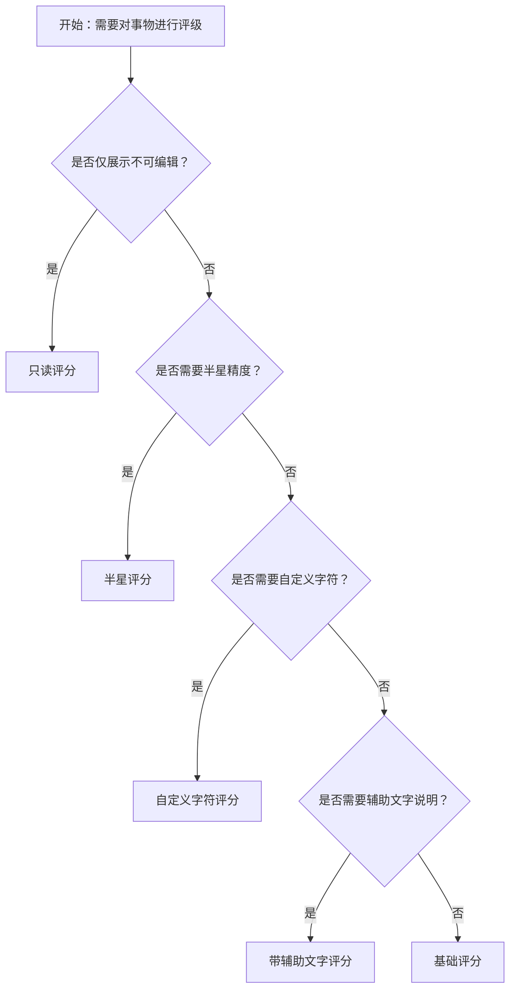

# 1. 简洁易读部份

## 1.0. 组件描述

评分（Rate）组件用于对事物进行快速评级操作，通过点击星星或其它字符表达等级，既可用于评价展示，也可用于收集用户评分。其交互直观、占用空间小，适用于商品评价、服务反馈、内容质量等场景。

## 1.1. 组件构成

评分由以下基础要素构成，可按需组合使用：

> <!-- 附图占位：建议附上一张示例图，展示评分组件的三个基础要素（星级指示器、填充/半填充状态、可选辅助文字）的构成关系，标注各要素名称与位置 -->

&emsp;&emsp;1. **星级指示器** 以星星或自定义字符表示等级，通常为 5 档，可配置总数。

&emsp;&emsp;2. **填充状态** 已选中的部分以高亮（如金色）展示，未选中的部分以灰色或浅色展示，半星时支持半边高亮。

&emsp;&emsp;3. **辅助文字** 可选，用于说明各档含义或展示当前选中值，增强可理解性。

---

## 1.2. 组件包含哪些不同类型

### 1.2.1 基础评分

&emsp;**是什么**：默认 5 星、整星选择，点击即选中，用于最简的评分录入

> <!-- 附图占位：建议附上一张示例图，展示基础评分（5 颗星、整星选择、默认金色填充）的视觉形态 -->

&emsp;**简单用法**：适用于对事物进行整体评价；默认 5 星可满足大部分场景；点击后即确定分值

&emsp;**典型场景**：商品评分、电影评价、服务满意度

> <!-- 附图占位：建议附上一张场景图，展示商品详情页「给个好评吧」下方的 5 星评分组件 -->

&emsp;**替代方案**：若需更精细的档位，启用半星

### 1.2.2 半星评分

&emsp;**是什么**：支持选中半星，如 3.5 分，适用于需要更细粒度评价的场景

> <!-- 附图占位：建议附上一张示例图，展示半星评分（部分星星显示半边高亮）的视觉形态 -->

&emsp;**简单用法**：适用于对精度有要求的评价场景；半星交互需明确（如点击左半选整星、右半选半星）；默认整星即可满足时不必启用

&emsp;**典型场景**：专业测评、细分维度评价（如口味、环境、服务各占一栏）

> <!-- 附图占位：建议附上一张场景图，展示多维度评价表单中「口味 3.5 星」「环境 4 星」的半星使用方式 -->

&emsp;**替代方案**：若整星足够，使用基础评分更简洁

### 1.2.3 只读评分

&emsp;**是什么**：仅展示已有评分，不可点击修改，用于展示聚合结果或历史评价

> <!-- 附图占位：建议附上一张示例图，展示只读评分（灰色、无悬停反馈、不可点击）的视觉形态 -->

&emsp;**简单用法**：用于评价汇总、评论列表中的星级展示；需与可编辑评分在视觉上明确区分；可配合数字显示（如 4.2 分）

&emsp;**典型场景**：商品列表中的平均评分、评论卡片中的用户评分展示

> <!-- 附图占位：建议附上一张场景图，展示商品卡片上「4.2 分」与只读五星并排的展示方式 -->

&emsp;**替代方案**：若仅展示数字，可直接用 Typography 或 Statistic

### 1.2.4 带辅助文字评分

&emsp;**是什么**：在星级下方或右侧展示文字说明，如「一般」「满意」「非常满意」，帮助用户理解各档含义

> <!-- 附图占位：建议附上一张示例图，展示带 tooltips 或辅助文字的评分，每档对应不同文案 -->

&emsp;**简单用法**：辅助文字应与星级档位一一对应；文案需简洁一致；可悬停展示或常驻展示

&emsp;**典型场景**：满意度调查（非常不满意 ~ 非常满意）、反馈表单中的语义化评分

> <!-- 附图占位：建议附上一张场景图，展示满意度调查中 1–5 星对应「非常不满意」到「非常满意」的文案配置 -->

&emsp;**替代方案**：若语义已通过上下文明确，可省略辅助文字

### 1.2.5 自定义字符评分

&emsp;**是什么**：将星星替换为其它字符，如字母、数字、emoji 或自定义图标，以适配业务语义

> <!-- 附图占位：建议附上一张示例图，展示用 A/B/C/D/E、心形、拇指等字符替代星星的评分形态 -->

&emsp;**简单用法**：自定义字符需与业务场景匹配；选中与未选中的视觉区分需明显；不宜过于花哨影响识别

&emsp;**典型场景**：等级评定（A–E）、喜好程度（心形）、点赞类反馈

> <!-- 附图占位：建议附上一张场景图，展示用心形表示「喜欢程度」、用字母表示「等级」的自定义评分 -->

&emsp;**替代方案**：无特殊语义需求时，使用默认星星即可

### 1.2.6 尺寸变体

&emsp;**是什么**：通过 small、medium、large 等尺寸适配不同展示场景

> <!-- 附图占位：建议附上一张示例图，展示大、中、小三种尺寸评分的对比 -->

&emsp;**简单用法**：列表或卡片内使用小尺寸；表单或重点评价区使用中或大尺寸；与同模块其它控件尺寸协调

&emsp;**典型场景**：列表项内紧凑展示用小尺寸、弹窗评价表单用中等尺寸、落地页重点评价用大尺寸

> <!-- 附图占位：建议附上一张场景图，展示不同页面位置下评分的尺寸选择策略 -->

&emsp;**替代方案**：默认中等尺寸可满足大部分场景

### 1.2.7 清除开关

&emsp;**是什么**：允许用户再次点击当前选中值以清除评分，恢复为 0 或未选状态

> <!-- 附图占位：建议附上一张示例图，展示 allowClear 为 true 时，点击已选星级可清除的交互 -->

&emsp;**简单用法**：适用于「可选」的评分场景；清除后需有明确反馈；若评分为必填，可不提供清除或慎用

&emsp;**典型场景**：非必填的评价表单、允许修改的草稿评价

> <!-- 附图占位：建议附上一张场景图，展示用户误选后通过再次点击清除并重新选择的流程 -->

&emsp;**替代方案**：必填或不允许撤销时，关闭清除

---

## 1.3. 各类型典型场景案例

### 1.3.1 评分与展示

> <!-- 附图占位：建议附上一张对比图，左侧展示可编辑评分用于录入、只读评分用于展示聚合结果（符合规范），右侧展示可编辑与只读混用导致误触（违反规范） -->

✅ **推荐：** 录入场景用可编辑评分，展示聚合或历史评价用只读评分

❌ **不推荐：** 在展示场景保留可点击，导致用户误以为是可编辑

### 1.3.2 半星与整星

> <!-- 附图占位：建议附上一张对比图，左侧展示需要细粒度时使用半星（符合规范），右侧展示简单满意度调查却用半星增加复杂度（违反规范） -->

✅ **推荐：** 需要细粒度（如 3.5 分）时启用半星；简单满意/不满意用整星即可

❌ **不推荐：** 在简单场景强行使用半星，增加选择负担

### 1.3.3 自定义字符

> <!-- 附图占位：建议附上一张对比图，左侧展示自定义字符与业务语义一致（如心形表示喜欢程度）（符合规范），右侧展示字符与含义脱节或难以识别（违反规范） -->

✅ **推荐：** 自定义字符与业务语义一致，选中与未选中状态清晰可辨

❌ **不推荐：** 使用与评分无关或难以理解的字符，或选中态不明确

### 1.3.4 辅助文字

> <!-- 附图占位：建议附上一张对比图，左侧展示 1–5 星对应清晰的文案说明（符合规范），右侧展示文案缺失或与档位错位（违反规范） -->

✅ **推荐：** 需要语义解释时，为每档配备一致的辅助文字

❌ **不推荐：** 文案与档位不对应，或表述含糊不清

---

# 2. 选型指南

## 2.1 选择流程

---

# 3. 细致专业部份（交互与排版规则）

为保证评分组件的可用性与一致性，请参考以下设计规则：

## 3.1 档位与总数

* **默认档位**：通常为 5 档，符合「非常好–非常差」的认知习惯；特殊业务可调整为 3 档或 10 档。
* **半星使用**：半星适用于需要 0.5 步进精度的场景；整星更简洁，适合大多数满意度调查。
* **档位一致性**：同一页面的多个评分维度（如口味、环境、服务）应使用相同档位与展示方式。

> <!-- 附图占位：建议附上一张场景图，展示多维度评价表单中各项评分档位与样式的一致性 -->

## 3.2 与表单的结合

* **必填与默认值**：评分为必填时，需在提交前校验；可选时可不设默认值。
* **清除行为**：允许清除时，再次点击当前值可清空；必填场景慎用清除，或在清除后提示用户重新选择。
* **提交格式**：提交时通常为数字（如 1–5 或 0.5–5），需与后端约定一致。

## 3.3 展示与录入的区分

* **只读展示**：用于评价列表、聚合分数展示，需明确不可点击，可通过灰色、较小尺寸等方式与可编辑区分。
* **可编辑录入**：用于评价表单、反馈收集，需有清晰的悬停与点击反馈。
* **混合场景**：如「平均 4.2 分」旁有「我来评」入口，需在视觉和交互上明确区分展示与录入。

> <!-- 附图占位：建议附上一张场景图，展示聚合评分（只读）与「评价」入口（可编辑）的布局与区分 -->

## 3.4 自定义字符的语义

* **可选字符**：星星（默认）、心形、拇指、字母、数字等，需与业务语义匹配。
* **选中态**：自定义字符的选中与未选中态必须有明显区分（如颜色、填充）。
* **可理解性**：字符含义应能被多数用户快速理解，避免晦涩符号。

## 3.5 状态与交互反馈

* **默认**：未选中的部分以灰色或浅色展示，可点击区域明确。
* **悬停**：悬停时预览即将选中的档位，提供即时反馈。
* **点击**：点击后确认选中，可选是否支持清除。
* **禁用/只读**：无悬停高亮，无点击反馈，视觉上明确为不可操作。

## 3.6 辅助文字与 Tooltip

* **Tooltip**：可为每档配置悬停提示，适用于需要说明但不想占用常驻空间的场景。
* **常驻文案**：若评价维度需要明确说明（如「非常不满意」~「非常满意」），可将文案常驻展示在星级下方或右侧。
* **一致性**：文案顺序与星级顺序一致，避免 1 星对应「满意」等错位。

> <!-- 附图占位：建议附上一张示例图，展示 Tooltip 与常驻文案两种辅助文字展示方式的对比 -->

---

## 4.0. 常见问题

### 1. 评分和 Slider 有什么区别？

- **评分（Rate）**：离散档位（如 1–5 星），交互为点击选择，适合**评价、满意度**等需要明确等级的场景，视觉上更轻量。
- **Slider**：连续或离散滑块，适合**范围选择、程度调节**，如音量、价格区间。若仅需 1–5 档评价，Rate 更直观。

### 2. 何时使用半星？

- 需要**更细粒度**的评价时，如 3.5 分、4.5 分。
- 专业测评、多维度细分评价等对精度有要求的场景。
- 若整星（1–5）已足够表达，不必启用半星，以降低交互复杂度。

### 3. 只读评分和展示数字可以同时用吗？

- 可以。常见做法是**星级 + 数字**并排展示，如「★★★★☆ 4.2 分」，既保留星级直观性，又提供精确数值。只读评分不响应点击，数字仅作展示。
