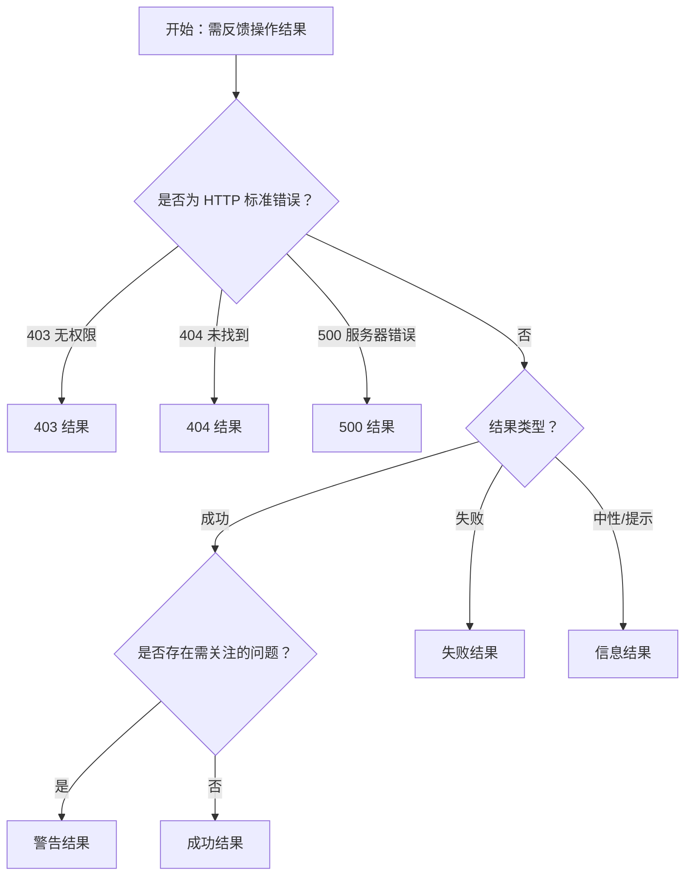

# 1. 简洁易读部份

## 1.0. 组件描述

结果组件用于反馈一系列操作任务的处理结果，通过图标、标题、副标题与操作区，向用户明确传达操作成功、失败、警告或特定错误类型，并引导后续行动。

## 1.1. 组件构成

结果组件由以下基础要素构成，可按需组合使用：

> <!-- 附图占位：建议附上一张示例图，展示结果组件的图标、标题、副标题、操作区的构成关系，标注各要素名称与位置 -->

&emsp;&emsp;1. **图标** 传达结果类型的视觉符号，如成功、失败、警告、信息或特定错误码（403、404、500），通过颜色与图形建立第一印象。

&emsp;&emsp;2. **标题** 结果的核心概括，如「提交成功」「页面未找到」，必须简洁明了。

&emsp;&emsp;3. **副标题** 补充说明或详细描述，如订单号、错误原因、操作建议，帮助用户理解结果与下一步。

&emsp;&emsp;4. **操作区** 提供后续操作入口，如返回首页、重试、查看订单等，引导用户完成流程闭环。

&emsp;&emsp;5. **内容区** 可选，用于放置额外说明、错误详情或自定义内容。

---

## 1.2. 组件包含哪些不同类型

### 1.2.1 成功结果

&emsp;**是什么**：使用成功图标与绿色系，表示操作已完成且无误，用户目标已达成。

> <!-- 附图占位：建议附上一张示例图，展示成功结果的图标、标题、副标题与操作区形态 -->

&emsp;**简单用法**：必须用于操作已成功完成的场景；副标题可补充订单号、单号等关键信息；操作区提供「返回」「继续」等入口

&emsp;**典型场景**：表单提交成功、支付完成、订单创建成功

> <!-- 附图占位：建议附上一张场景图，展示表单提交成功后的结果页，含订单号与「返回列表」「继续购买」等操作 -->

&emsp;**替代方案**：若仅需轻量提示，可用 Message 代替全页 Result

### 1.2.2 失败结果

&emsp;**是什么**：使用失败图标与红色系，表示操作未成功，需用户注意或重试。

> <!-- 附图占位：建议附上一张示例图，展示失败结果的图标与视觉形态 -->

&emsp;**简单用法**：必须明确说明失败原因或错误类型；副标题可列出具体错误点；操作区必须提供「重试」「返回」等可执行操作

&emsp;**典型场景**：提交失败、支付失败、数据保存失败

> <!-- 附图占位：建议附上一张场景图，展示提交失败后的结果页，含错误说明与「重新提交」「返回修改」按钮 -->

&emsp;**替代方案**：若错误可内联展示，可用 Form 校验或 Alert 代替全页 Result

### 1.2.3 警告结果

&emsp;**是什么**：使用警告图标与橙色系，表示操作已完成但存在需关注的问题或限制。

> <!-- 附图占位：建议附上一张示例图，展示警告结果的图标与视觉形态 -->

&emsp;**简单用法**：必须用于「部分成功」或「有条件成功」的场景；副标题需说明具体限制或风险；操作区引导用户处理后续事项

&emsp;**典型场景**：批量操作部分失败、账户受限、额度不足提醒

> <!-- 附图占位：建议附上一张场景图，展示批量删除中部分失败时的警告结果，说明成功与失败数量 -->

&emsp;**替代方案**：若仅为轻量提醒，可用 Alert 或 Notification

### 1.2.4 信息结果

&emsp;**是什么**：使用信息图标与蓝色系，表示中性或提示性结果，无成功失败之分。

> <!-- 附图占位：建议附上一张示例图，展示信息结果的图标与视觉形态 -->

&emsp;**简单用法**：必须用于需要明确反馈但无褒贬属性的场景；标题与副标题需清晰说明当前状态；操作区按业务提供下一步入口

&emsp;**典型场景**：流程说明、状态说明、引导性结果页

> <!-- 附图占位：建议附上一张场景图，展示信息类结果用于「操作已执行」等中性反馈的场景 -->

&emsp;**替代方案**：若仅为简单说明，可用 Empty 或纯文案

### 1.2.5 403 无权限结果

&emsp;**是什么**：专用的 403 错误形态，表示用户无权限访问当前页面或资源。

> <!-- 附图占位：建议附上一张示例图，展示 403 结果的图标、标题「你没有此页面的访问权限」与操作区 -->

&emsp;**简单用法**：必须用于权限不足场景；标题应直接说明「无权限」；操作区提供「返回首页」「申请权限」等合理出口

&emsp;**典型场景**：未登录访问需登录页、权限不足访问受保护资源

> <!-- 附图占位：建议附上一张场景图，展示无权限访问时的 403 结果页布局 -->

&emsp;**替代方案**：若为整站拦截，可用登录页或权限申请页代替

### 1.2.6 404 页面未找到结果

&emsp;**是什么**：专用的 404 错误形态，表示请求的页面或资源不存在。

> <!-- 附图占位：建议附上一张示例图，展示 404 结果的图标、标题「此页面未找到」与操作区 -->

&emsp;**简单用法**：必须用于页面不存在或链接失效场景；标题应说明「未找到」；操作区提供「返回首页」「返回上页」等导航入口

&emsp;**典型场景**：错误链接、已删除页面、路由配置错误

> <!-- 附图占位：建议附上一张场景图，展示 404 结果页与「返回首页」按钮的布局 -->

&emsp;**替代方案**：若为站内缺失内容，可配合搜索或推荐入口

### 1.2.7 500 服务器错误结果

&emsp;**是什么**：专用的 500 错误形态，表示服务器端发生错误，非用户操作所致。

> <!-- 附图占位：建议附上一张示例图，展示 500 结果的图标、标题「服务器发生了错误」与操作区 -->

&emsp;**简单用法**：必须用于服务端异常场景；标题应说明「服务器错误」；操作区提供「重试」「返回首页」等恢复入口

&emsp;**典型场景**：接口异常、服务不可用、超时

> <!-- 附图占位：建议附上一张场景图，展示 500 错误时的结果页布局 -->

&emsp;**替代方案**：若为局部接口失败，可在原页用 Alert 或 Message 提示

---

## 1.3. 各类型典型场景案例

### 1.3.1 成功与轻量提示

> <!-- 附图占位：建议附上一张对比图，左侧展示重要操作完成后用全页 Result（符合规范），右侧展示简单操作成功用 Message 轻量提示（符合规范） -->

✅ **推荐：** 重要流程节点用 Result 做完整反馈；简单操作用 Message 即可

❌ **不推荐：** 所有成功都用全页 Result，造成不必要的页面跳转感

### 1.3.2 失败结果的信息量

> <!-- 附图占位：建议附上一张对比图，左侧展示失败结果含具体原因与操作建议（符合规范），右侧展示仅「操作失败」无说明（违反规范） -->

✅ **推荐：** 失败时必须说明原因并给出可行操作

❌ **不推荐：** 失败结果无具体说明、无下一步操作指引

### 1.3.3 错误类型与形态匹配

> <!-- 附图占位：建议附上一张对比图，左侧展示 404 用 404 形态、403 用 403 形态（符合规范），右侧展示 404 场景用通用 error（语义不足） -->

✅ **推荐：** 403、404、500 等标准错误使用对应专用形态

❌ **不推荐：** 所有错误统一用通用失败形态，丢失错误类型信息

---

# 2. 选型指南

## 2.1 选择流程

---

# 3. 细致专业部份（交互与排版规则）

## 3.1 与 Message、Modal 的选型策略

* **Result**：适合作为独立结果页或大区块内的完整反馈，承载图标、标题、副标题、操作区及可选内容区，信息量较大。
* **Message**：适合轻量、临时性的成功或失败提示，无需用户停留或操作，自动消失。
* **Modal**：适合需要用户阅读并明确点击确认的反馈，可承载更多内容，但不适合作为整页替代。

当反馈内容较复杂、需引导用户执行后续操作时，优先使用 Result。

> <!-- 附图占位：建议附上一张对比图，展示 Result、Message、Modal 的适用场景差异 -->

## 3.2 标题与副标题撰写规范

* **标题**：简洁概括结果，如「提交成功」「页面未找到」「你没有访问权限」。避免模糊表述如「提示」「通知」。
* **副标题**：补充关键信息，如订单号、错误原因、操作建议。与标题形成「结论 + 说明」的结构，避免重复。
* **错误场景**：副标题应尽量给出可理解的原因，便于用户判断问题与后续动作。

> <!-- 附图占位：建议附上一张示例图，展示标题与副标题的规范写法与反面示例 -->

## 3.3 操作区设计规范

* **主操作**：与当前结果最相关的操作，如「返回首页」「重试」「查看订单」，应使用主按钮或高优先级样式。
* **次要操作**：补充入口，如「联系客服」「返回上页」，使用默认或文本按钮。
* **数量**：操作不宜过多，通常 1～2 个主操作、1～2 个次要操作即可，避免选择困难。
* **顺序**：按用户预期从左到右排列，主操作靠右或居中作为视线落点。

> <!-- 附图占位：建议附上一张示例图，展示操作区按钮的主次排列与数量控制 -->

## 3.4 图标与状态的语义一致性

* **成功**：绿色系 + 成功图标，不可与失败、警告混用。
* **失败**：红色系 + 失败图标，用于明确失败场景。
* **警告**：橙色系 + 警告图标，用于「部分成功」或「需注意」的场景。
* **信息**：蓝色系 + 信息图标，用于中性、说明类结果。
* **403/404/500**：使用专用图标与文案，与通用成功/失败区分。

图标与颜色必须与用户对状态的认知一致，避免自定义冲突。

> <!-- 附图占位：建议附上一张示例图，展示各状态的图标与颜色对应关系 -->

## 3.5 内容区与扩展信息

* **内容区**：可放置错误详情列表、订单信息、操作指引等，支持自定义结构。
* **展示原则**：内容区信息应有助于用户理解结果与下一步，避免堆砌无关信息。
* **复杂错误**：当错误原因较多时，可在内容区列出条目，配合操作区的「重试」「联系客服」等入口。

> <!-- 附图占位：建议附上一张场景图，展示失败结果的内容区含多条错误说明与操作按钮的布局 -->

## 3.6 布局与视觉重心

* **居中对齐**：Result 通常居中展示，图标、标题、副标题、操作区自上而下排列，形成清晰层级。
* **留白**：组件周围应有足够留白，避免与其它元素拥挤。
* **与 Empty 的区别**：Empty 表示「无数据」；Result 表示「有操作结果需反馈」。二者语义不同，不可混用。

> <!-- 附图占位：建议附上一张示例图，展示 Result 的居中布局与留白规范 -->

---

## 4.0. 常见问题

### 1. Result 和 Message 有什么区别？

- **Result**：用于重要操作的完整结果反馈，占据页面或大块区域，包含图标、标题、副标题、操作区，引导用户执行后续操作。
- **Message**：用于轻量、临时性的提示，在页面顶部或中部短暂出现后自动消失，不需要用户停留或点击。

### 2. 403、404、500 为什么要用专用形态？

这三种是常见的 HTTP 错误类型，用户对它们有固定认知。使用专用形态可以快速传达「无权限」「未找到」「服务器错误」等语义，减少理解成本，并与通用成功/失败结果区分开来。

### 3. 成功结果页之后用户应该去哪？

操作区应提供明确的后续入口，如「返回列表」「继续购买」「查看订单」。主操作应与用户完成当前流程后的最常见目标一致，避免用户不知下一步该做什么。
