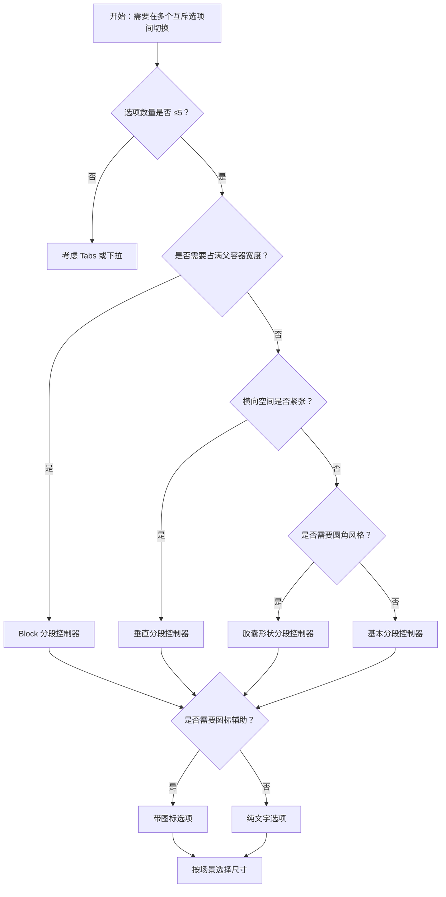

# 1. 简洁易读部份

## 1.0. 组件描述

分段控制器用于在一组互斥选项之间进行单选切换，切换选中项时关联区域内容随之变化，是 Tabs 的轻量替代，适合选项较少、视觉更紧凑的场景。

## 1.1. 组件构成

分段控制器由以下基础要素构成，可按需组合使用：

> <!-- 附图占位：建议附上一张示例图，展示分段控制器的三个基础要素（容器轨道、选项项、选中指示）的构成关系，标注各要素名称与位置 -->

&emsp;&emsp;1. **容器轨道** 承载所有选项的统一背景，定义整体宽度与形状（矩形或胶囊）。

&emsp;&emsp;2. **选项项** 单个可点击的选项，可包含文本、图标或自定义内容，同一时刻仅一项为选中态。

&emsp;&emsp;3. **选中指示** 通过背景色或边框区分当前选中项，与未选中项形成清晰对比。

---

## 1.2. 组件包含哪些不同类型

### 1.2.1 基本分段控制器

&emsp;**是什么**：水平排列、等宽选项、默认尺寸的常规形态

> <!-- 附图占位：建议附上一张示例图，展示基本分段控制器（如 List / Kanban 两项）的视觉形态，选中项有背景高亮 -->

&emsp;**简单用法**：选项数量以 2–5 个为宜；选项文案需简短可区分；选中项与内容区需联动更新

&emsp;**典型场景**：列表 / 看板视图切换、日 / 周 / 月筛选、地图图层切换

> <!-- 附图占位：建议附上一张场景图，展示分段控制器与下方内容区联动的布局，体现切换即更新内容 -->

&emsp;**替代方案**：若选项超过 5 个或层级复杂，改用 Tabs 或下拉选择

### 1.2.2 Block 分段控制器

&emsp;**是什么**：选项宽度随父容器拉伸，占满可用空间

> <!-- 附图占位：建议附上一张示例图，展示 Block 模式下三个选项等分父容器宽度的形态 -->

&emsp;**简单用法**：适用于需要视觉上填满某一区域的场景；选项数量不宜过多，以免单格过窄

&emsp;**典型场景**：全宽筛选栏、工具栏视图切换、表单内筛选

> <!-- 附图占位：建议附上一张场景图，展示全宽工具栏中 Block 分段控制器占满可用宽度的布局 -->

&emsp;**替代方案**：若希望紧凑或随内容自适应，使用非 Block 形态

### 1.2.3 垂直分段控制器

&emsp;**是什么**：选项沿垂直方向排列，适用于横向空间有限的布局

> <!-- 附图占位：建议附上一张示例图，展示垂直方向排列的选项，选中项在垂直轨道中高亮 -->

&emsp;**简单用法**：适合侧边栏、窄屏或竖屏场景；选项数量不宜过多以免过长

&emsp;**典型场景**：侧边筛选、移动端竖屏、窄栏内切换

> <!-- 附图占位：建议附上一张场景图，展示侧边栏内垂直分段控制器的摆放位置 -->

&emsp;**替代方案**：横向空间充足时使用水平形态，信息密度更高

### 1.2.4 胶囊形状分段控制器

&emsp;**是什么**：整体呈现胶囊形（圆角较大），视觉更柔和

> <!-- 附图占位：建议附上一张示例图，展示胶囊形状分段控制器与默认矩形的视觉对比 -->

&emsp;**简单用法**：适用于偏轻量、偏 C 端的界面风格；与圆角设计语言统一时效果更好

&emsp;**典型场景**：移动端筛选、轻量工具、卡片内切换

> <!-- 附图占位：建议附上一张场景图，展示胶囊形态在移动端或卡片内的使用方式 -->

&emsp;**替代方案**：偏 B 端或严肃场景可选用默认矩形

### 1.2.5 带图标的选项

&emsp;**是什么**：选项内可包含图标与文字，或仅图标

> <!-- 附图占位：建议附上一张示例图，展示图标+文字与纯图标两种选项形态 -->

&emsp;**简单用法**：图标需与选项语义一致；纯图标时建议配合 Tooltip 说明；同一组内保持风格统一（全带图标或全不带）

&emsp;**典型场景**：地图 / 卫星 / 公交视图、列表 / 网格 / 日历视图、日 / 周 / 月 / 年

> <!-- 附图占位：建议附上一张场景图，展示带图标的视图切换分段控制器，体现图标辅助识别的价值 -->

&emsp;**替代方案**：若选项语义清晰、空间紧张，可仅用文字

### 1.2.6 不同尺寸

&emsp;**是什么**：提供大、中、小三种尺寸，适配不同信息密度与容器

> <!-- 附图占位：建议附上一张对比图，展示大 / 中 / 小三种尺寸的视觉差异 -->

&emsp;**简单用法**：大尺寸用于主操作区或稀疏布局；中为默认；小尺寸用于紧凑工具栏或表格内

&emsp;**典型场景**：页面主筛选用大尺寸、表格内筛选用小尺寸、卡片内用中尺寸

> <!-- 附图占位：建议附上一张场景图，展示同一页面中主区域与表格内不同尺寸分段控制器的使用 -->

&emsp;**替代方案**：无特殊密度需求时使用默认中尺寸

### 1.2.7 禁用与受控

&emsp;**是什么**：支持整体禁用或单项禁用，以及受控模式下的外部控制选中值

> <!-- 附图占位：建议附上一张示例图，展示整体禁用与单项禁用的视觉区分 -->

&emsp;**简单用法**：禁用时需给出原因（如权限、条件不满足）；受控模式用于与路由、外部状态同步

&emsp;**典型场景**：权限不足时禁用、多步骤流程中按步骤控制、与 URL 参数联动

> <!-- 附图占位：建议附上一张场景图，展示受控分段控制器与页面状态或路由联动的逻辑 -->

&emsp;**替代方案**：若仅需默认选中且无外部依赖，使用非受控即可

---

## 1.3. 各类型典型场景案例

### 1.3.1 选项数量与内容联动

> <!-- 附图占位：建议附上一张对比图，左侧展示 2–4 个选项且切换后内容区联动（符合规范），右侧展示 8 个以上选项挤在一行（违反规范） -->

✅ **推荐：** 选项 2–5 个，切换后下方内容区同步更新

❌ **不推荐：** 选项过多挤在一行，或切换后内容无变化，用户无法建立正确预期

### 1.3.2 尺寸与布局

> <!-- 附图占位：建议附上一张对比图，左侧展示主区域用大尺寸、表格内用小尺寸（符合规范），右侧展示同一页面内尺寸混用无规律（违反规范） -->

✅ **推荐：** 主操作区用大尺寸，紧凑区域用小尺寸，整体层级清晰

❌ **不推荐：** 同一层级内尺寸不统一，或在小空间使用过大尺寸

---

# 2. 选型指南

## 2.1 选择流程

---

# 3. 细致专业部份（交互与排版规则）

## 3.1 选项数量与层级

* **建议范围**：2–5 个选项为佳，超过 5 个建议改用 Tabs 或下拉选择。
* **文案长度**：选项文案宜简短，过长可考虑 Tooltip 或缩写。
* **层级扁平**：分段控制器不支撑多级嵌套，有层级需求时考虑其他组件。

> <!-- 附图占位：建议附上一张场景图，展示 3 个选项的分段控制器与下方内容区的对应关系 -->

## 3.2 与内容区的联动

* **即时反馈**：切换选中项后，关联内容区应同步更新，无明显延迟。
* **语义一致**：选中项名称与展示内容一一对应，避免歧义。
* **无冗余切换**：若仅一个有效选项，不宜使用分段控制器，应直接展示内容。

> <!-- 附图占位：建议附上一张流程图，展示用户切换选项到内容更新的闭环 -->

## 3.3 尺寸与密度

* **大**：主筛选区、稀疏布局，高度约 40px。
* **中**：默认，通用场景，高度约 32px。
* **小**：表格内、工具栏、紧凑卡片，高度约 24px。
* **一致原则**：同一操作层级内保持同一尺寸。

> <!-- 附图占位：建议附上一张对比图，展示大 / 中 / 小三种尺寸在不同容器中的适用性 -->

## 3.4 状态与交互反馈

* **默认**：未选中项可点击，有悬停反馈。
* **选中**：当前项有明确背景或边框区分。
* **禁用**：整体或单项禁用时，视觉与交互均不可点击。
* **键盘**：可为选项配置相同 name，支持方向键在同一组内切换。

> <!-- 附图占位：建议附上一张状态示意图，展示默认、悬停、选中、禁用的视觉差异 -->

## 3.5 摆放位置

* **内容区上方**：分段控制器置于其控制的内容区正上方，形成「切换 → 内容」的阅读顺序。
* **工具栏内**：与其它筛选、操作按钮对齐，分段控制器作为视图切换入口。
* **卡片或区块标题旁**：用于切换卡片内展示模式，不抢占主标题。

> <!-- 附图占位：建议附上一张布局图，展示分段控制器在页面、工具栏、卡片内的典型位置 -->

## 3.6 与 Tabs 的区分

* **分段控制器**：选项少、视觉紧凑、同屏内切换、无分页感，适合视图模式、筛选维度。
* **Tabs**：选项可多、可带图标和徽标、可配合分页感，适合导航、模块划分。
* **选择原则**：选项少且强调「同一内容的不同展示」时用分段控制器；选项多或强调「不同模块/页面」时用 Tabs。

> <!-- 附图占位：建议附上一张对比图，展示分段控制器与 Tabs 在视觉和语义上的差异 -->

---

## 4.0. 常见问题

### 1. 分段控制器和 Tabs 有什么区别？

分段控制器更轻量、选项少（2–5 个）、视觉紧凑，适合同一内容的不同展示模式（如列表/看板、日/周/月）。Tabs 适合更多选项、模块划分或带徽标的导航场景。

### 2. 选项太多怎么办？

若超过 5 个选项，建议改用 Tabs 或下拉选择，避免分段控制器过长、可读性下降。

### 3. 如何保证切换后内容正确联动？

使用受控模式，将选中值与内容区数据源绑定，确保 value 变化时内容随之更新，并在切换时提供清晰的视觉反馈。
