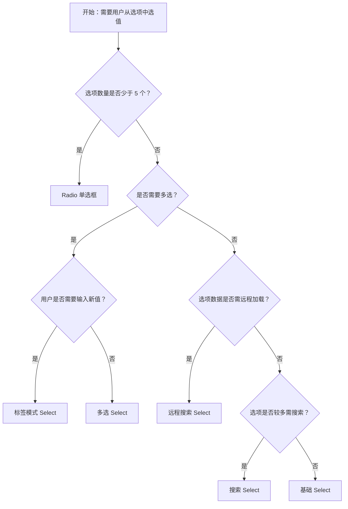

# 1. 简洁易读部份

## 1.0. 组件描述

选择器（Select）用于从下拉菜单中选取一个或多个选项，可代替原生选择框，或提供更易用的多选、搜索等能力。当选项较少（如少于 5 项）时，建议直接用 Radio 平铺展示；若需要可输可选的输入框，可考虑 AutoComplete。

## 1.1. 组件构成

选择器由以下基础要素构成，可按需组合使用：

> <!-- 附图占位：建议附上一张示例图，展示选择器的三个基础要素（触发器/输入框、下拉箭头、下拉列表）的构成关系，标注各要素名称与位置 -->

&emsp;&emsp;1. **触发器** 点击后展开下拉的输入框或框体，展示当前选中项或占位文案。

&emsp;&emsp;2. **下拉箭头** 指示可展开，点击或聚焦时展示下拉列表。

&emsp;&emsp;3. **下拉列表** 承载可选项，支持单选、多选、搜索、分组等，选中后回填到触发器。

---

## 1.2. 组件包含哪些不同类型

### 1.2.1 基础选择器

&emsp;**是什么**：从下拉列表中单选一项，点击触发器展开，选择后关闭，适用于选项较多的单选场景

> <!-- 附图占位：建议附上一张示例图，展示基础选择器（触发器 + 展开的下拉列表）的视觉形态 -->

&emsp;**简单用法**：选项建议 5 个以上时使用；占位文案需明确（如「请选择」）；选中后触发器展示选中项文案

&emsp;**典型场景**：城市选择、分类选择、人员选择、状态筛选

> <!-- 附图占位：建议附上一张场景图，展示表单中「请选择省份」的下拉选择器展开后的布局 -->

&emsp;**替代方案**：选项少于 5 个时，优先考虑 Radio 平铺

### 1.2.2 多选选择器

&emsp;**是什么**：可从下拉列表中选取多项，选中项以标签形式展示在触发器内，可逐个移除

> <!-- 附图占位：建议附上一张示例图，展示多选选择器（已选标签、可继续选择）的视觉形态 -->

&emsp;**简单用法**：适用于需要选择多个值的场景；标签不宜过多，可配合 maxTagCount 折叠展示；需提供清除全部入口

&emsp;**典型场景**：标签选择、多选筛选、权限配置、兴趣多选

> <!-- 附图占位：建议附上一张场景图，展示多选选择器中已选标签的展示方式及「+N」折叠 -->

&emsp;**替代方案**：若选项可穷举且数量少，可考虑 Checkbox 组

### 1.2.3 搜索选择器

&emsp;**是什么**：展开后可输入关键字过滤选项，适用于选项较多、需快速定位的场景

> <!-- 附图占位：建议附上一张示例图，展示搜索选择器（展开后顶部有搜索框、下方为过滤后的选项列表）的视觉形态 -->

&emsp;**简单用法**：选项较多（如 20 个以上）时建议开启搜索；搜索逻辑需符合用户预期（如按名称、拼音）；无结果时明确提示

&emsp;**典型场景**：大型列表选择、城市/学校/部门选择、带搜索的筛选

> <!-- 附图占位：建议附上一张场景图，展示输入「北」后过滤出「北京」「北海」等选项的搜索交互 -->

&emsp;**替代方案**：选项少时可不开放搜索；若需自由输入新值，考虑 tags 模式

### 1.2.4 分组选择器

&emsp;**是什么**：选项按组展示，每组有标题，便于在大量选项中快速定位

> <!-- 附图占位：建议附上一张示例图，展示分组选择器（组标题 + 组内选项）的视觉形态 -->

&emsp;**简单用法**：选项可按类型、地域等分组；组标题与选项需视觉区分；组内选项仍为平级选择

&emsp;**典型场景**：省市分组、部门-人员分组、按分类展示的选项列表

> <!-- 附图占位：建议附上一张场景图，展示「华东」「华南」等分组下各省市的选项布局 -->

&emsp;**替代方案**：若层级关系复杂，考虑 Cascader 级联选择

### 1.2.5 标签模式选择器（tags）

&emsp;**是什么**：多选时可自由输入新值并加入选项，适用于标签、关键词等可扩展场景

> <!-- 附图占位：建议附上一张示例图，展示 tags 模式选择器（已选标签 + 可输入新标签）的视觉形态 -->

&emsp;**简单用法**：适用于用户需要自定义新增的场景；需与后端约定新值的创建与去重；可与 tokenSeparators 配合支持粘贴分词

&emsp;**典型场景**：标签输入、关键词多选、可扩展的分类选择

> <!-- 附图占位：建议附上一张场景图，展示用户输入「新标签」后回车添加为选项的流程 -->

&emsp;**替代方案**：若仅从固定列表选择，使用普通多选即可

### 1.2.6 远程搜索选择器

&emsp;**是什么**：选项由接口根据搜索词异步返回，适用于数据量大或需跨系统查询的场景

> <!-- 附图占位：建议附上一张示例图，展示远程搜索选择器（输入后显示加载、结果返回后展示列表）的视觉形态 -->

&emsp;**简单用法**：需处理加载态、空结果、请求取消与防抖；搜索词需传递给后端；选中后需能正确回填展示

&emsp;**典型场景**：用户搜索、组织架构成员选择、跨系统数据选择

> <!-- 附图占位：建议附上一张场景图，展示输入「张」后请求接口、展示「张三」「张伟」等结果的流程 -->

&emsp;**替代方案**：数据可一次性加载时，使用本地搜索即可

### 1.2.7 形态变体

&emsp;**是什么**：通过 outlined、filled、borderless、underlined 等形态适配不同页面风格

> <!-- 附图占位：建议附上一张示例图，展示四种形态（描边、填充、无边框、下划线）的选择器对比 -->

&emsp;**简单用法**：与同页面其它输入控件形态保持一致；表格内或紧凑布局可选用 borderless

&emsp;**典型场景**：表单内与 Input、Mentions 等统一；表格内筛选；简约风格页面

> <!-- 附图占位：建议附上一张场景图，展示表单中选择器与其它控件的形态一致性 -->

&emsp;**替代方案**：默认 outlined 可满足大部分场景

---

## 1.3. 各类型典型场景案例

### 1.3.1 单选与多选

> <!-- 附图占位：建议附上一张对比图，左侧展示只需选一项时用单选、需选多项时用多选（符合规范），右侧展示多选场景误用单选或反之（违反规范） -->

✅ **推荐：** 按业务需求选择单选或多选，多选时提供清晰的已选展示与移除方式

❌ **不推荐：** 需多选却用单选逼用户多次操作，或只需单选却用多选增加认知负担

### 1.3.2 选项数量与组件选择

> <!-- 附图占位：建议附上一张对比图，左侧展示 5 项以内用 Radio、5 项以上用 Select（符合规范），右侧展示 3 项用 Select 或 50 项用 Radio（违反规范） -->

✅ **推荐：** 选项少（5 项以内）且需并排比较用 Radio；选项多用 Select 并视情况开启搜索

❌ **不推荐：** 仅 2–3 项用 Select 增加点击步骤；或大量选项平铺造成界面拥挤

### 1.3.3 搜索与远程数据

> <!-- 附图占位：建议附上一张对比图，左侧展示选项多时开启搜索、数据在远端时用远程搜索（符合规范），右侧展示大量本地选项无搜索或远程数据却全量加载（违反规范） -->

✅ **推荐：** 选项多时开启搜索；数据量大或需实时查询时使用远程搜索并做好加载与空态

❌ **不推荐：** 大量选项无搜索，或远程数据一次性全量加载影响性能

### 1.3.4 分组与级联

> <!-- 附图占位：建议附上一张对比图，左侧展示平级分组用 OptGroup、层级联动用 Cascader（符合规范），右侧展示复杂层级用 Select 分组造成理解困难（违反规范） -->

✅ **推荐：** 平级分组用 OptGroup；省市区等层级选择用 Cascader

❌ **不推荐：** 强层级关系用多个 Select 联动，导致步骤繁琐且易出错

---

# 2. 选型指南

## 2.1 选择流程

---

# 3. 细致专业部份（交互与排版规则）

为保证选择器的可用性与一致性，请参考以下设计规则：

## 3.1 选项展示与搜索

* **选项数量**：选项 5 个以下可考虑 Radio；5–20 个可仅用下拉；20 个以上建议开启搜索。
* **搜索逻辑**：默认按 value 或 label 过滤；可配置多字段搜索；无结果时展示明确提示。
* **默认高亮**：展开后首个可选项应高亮，支持方向键与 Enter 快速选择。
* **虚拟滚动**：选项极多时，Select 默认开启虚拟滚动以优化性能，自定义 Option 高度时需注意滚动异常问题。

> <!-- 附图占位：建议附上一张场景图，展示大量选项时搜索过滤与虚拟滚动的配合使用 -->

## 3.2 多选与标签展示

* **标签折叠**：已选项过多时，通过 maxTagCount 折叠为「+N」等形式，避免触发器过高。
* **移除方式**：每个标签需有明确的移除入口（如关闭图标）；需提供清除全部的快捷方式。
* **maxCount**：可限制最多选中的数量，超出时未选项置灰或禁用。
* **tokenSeparators**：tags 模式下可配置分隔符（如逗号），支持粘贴「A,B,C」自动拆分为多个标签。

> <!-- 附图占位：建议附上一张场景图，展示多选时标签展示、折叠与移除的布局 -->

## 3.3 下拉位置与滚动

* **弹出位置**：默认向下展开；靠近视口底部时可向上展开，可通过 placement 控制。
* **同宽策略**：下拉列表默认与触发器同宽（min-width），避免选项过短难以阅读。
* **滚动容器**：下拉列表高度受限时需支持滚动；在弹层或滚动容器内使用时，可通过 getPopupContainer 将下拉挂载到合适父节点，避免定位错乱。

> <!-- 附图占位：建议附上一张场景图，展示下拉靠近底部时向上展开、以及 getPopupContainer 的典型用法 -->

## 3.4 校验与状态

* **必填**：必选时占位文案可提示「请选择」，提交前需校验。
* **错误与警告**：通过 status 设置 error 或 warning，需在触发器附近展示提示文案。
* **禁用**：禁用时不可展开，视觉上明确区分为不可操作。
* **加载态**：远程搜索时需展示 loading，避免用户误以为无结果。

## 3.5 与表单的配合

* **受控与回填**：value 与 Form 绑定后，需保证选项数据存在时能正确回填展示；若 value 对应选项已被删除，可配合 labelRender 自定义回填展示。
* **联动**：如省市联动，需在省变化时清空市的选择并更新市的选项列表；复杂层级建议用 Cascader。
* **提交格式**：多选时提交数组；labelInValue 时提交对象结构，需与后端约定一致。

## 3.6 无障碍与键盘

* **焦点与展开**：点击或 Tab 聚焦后，可通过 Enter 或空格展开；展开后可方向键导航、Enter 选中。
* **关闭**：Esc 或点击外部可关闭下拉；选中后（单选）自动关闭。
* **读屏**：触发器与下拉需具备合理的 aria 属性；虚拟滚动下读屏可能受限，可按需关闭虚拟滚动以提升无障碍。

> <!-- 附图占位：建议附上一张示例图，展示 Select 的键盘操作流程（Tab 聚焦、Enter 展开、方向键选择、Enter 确认） -->

---

## 4.0. 常见问题

### 1. Select 和 Radio 怎么选？

- **Select**：选项**多于 5 个**或空间有限需要收起时使用，通过点击展开下拉选择。
- **Radio**：选项**少（5 个以内）**且希望全部可见、便于比较时使用，选项平铺展示。Ant Design 文档建议：选项少时用 Radio 是更好的选择。

### 2. Select 和 AutoComplete 有什么区别？

- **Select**：从**预设列表**中选择，用户不能输入列表以外的值（tags 模式除外）。
- **AutoComplete**：**可输可选**，用户可自由输入，同时根据输入给出建议列表。若需要「输入 + 建议」的体验，用 AutoComplete；若仅从固定列表选择，用 Select。

### 3. 多选时已选标签过多怎么展示？

- 使用 **maxTagCount** 控制可见标签数量，超出部分以「+N」等形式折叠。
- 可配置 **maxTagPlaceholder** 自定义折叠时的展示文案。
- 若常需选择大量项，可考虑 **Transfer 穿梭框** 等专门的多选组件，便于批量操作。
