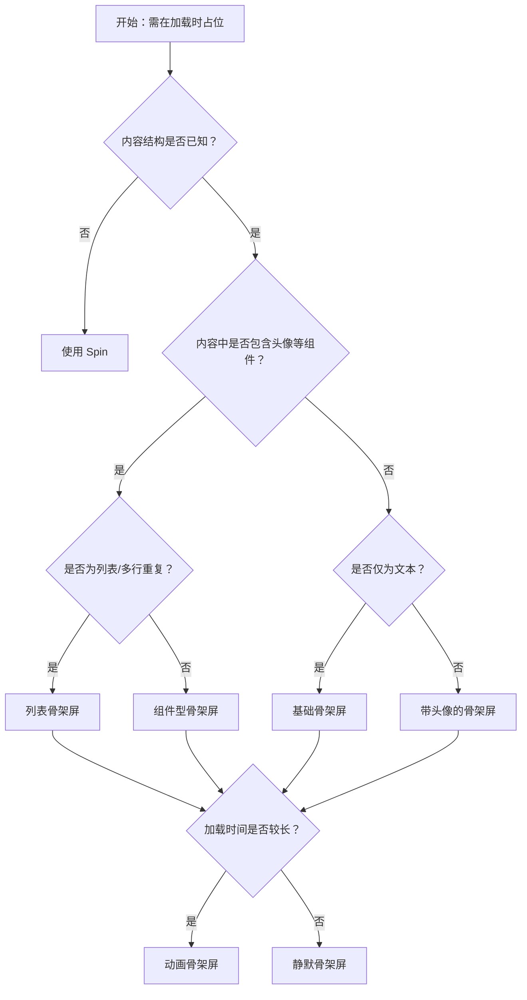

# 1. 简洁易读部份

## 1.0. 组件描述

骨架屏在需要等待加载内容的位置提供占位图形组合，通过模拟真实内容的结构与布局，在数据尚未加载完成时保持页面结构稳定，降低用户等待过程中的 layout shift 与焦虑感。

## 1.1. 组件构成

骨架屏由以下基础要素构成，可按需组合使用：

> <!-- 附图占位：建议附上一张示例图，展示骨架屏的标题占位、段落占位、头像占位等基础要素的构成关系，标注各要素名称与位置 -->

&emsp;&emsp;1. **标题占位** 模拟标题的条形占位块，通常较段落更宽或更高，体现层级差异。

&emsp;&emsp;2. **段落占位** 模拟正文段落的多行条形占位，行数与宽度可配置，模拟真实文本布局。

&emsp;&emsp;3. **头像占位** 可选，模拟头像的圆形或方形占位，与标题、段落组合形成卡片或列表项结构。

&emsp;&emsp;4. **组件占位** 可选，如按钮、输入框、图片的占位块，用于匹配真实组件的形状与尺寸。

&emsp;&emsp;5. **动画效果** 可选，通过渐变或闪烁动画表示「加载中」，增强可感知的等待反馈。

---

## 1.2. 组件包含哪些不同类型

### 1.2.1 基础骨架屏

&emsp;**是什么**：仅包含标题与段落占位的最简形态，适合文本内容为主的加载场景。

> <!-- 附图占位：建议附上一张示例图，展示基础骨架屏（标题 + 多行段落）的视觉形态 -->

&emsp;**简单用法**：必须用于以文本为主的区块；段落行数可根据实际内容预估；适合详情页、卡片描述等

&emsp;**典型场景**：文章详情加载、卡片描述加载、列表项文本加载

> <!-- 附图占位：建议附上一张场景图，展示文章详情页加载时基础骨架屏的占位效果 -->

&emsp;**替代方案**：若含头像或其它元素，改用组合骨架屏

### 1.2.2 带头像的骨架屏

&emsp;**是什么**：在标题与段落基础上增加头像占位，模拟用户卡片、评论、列表项等结构。

> <!-- 附图占位：建议附上一张示例图，展示带头像的骨架屏（头像 + 标题 + 段落）的布局形态 -->

&emsp;**简单用法**：必须用于最终内容会包含头像的场景；头像可为圆形或方形；布局需与真实内容一致

&emsp;**典型场景**：用户列表、评论列表、社交动态、团队成员卡片

> <!-- 附图占位：建议附上一张场景图，展示用户列表加载时带头像骨架屏的占位效果 -->

&emsp;**替代方案**：若无头像元素，使用基础骨架屏即可

### 1.2.3 动画骨架屏

&emsp;**是什么**：在占位块上增加渐变或闪烁动画，明确传达「正在加载」而非「无内容」。

> <!-- 附图占位：建议附上一张示例图，展示动画骨架屏的渐变/闪烁效果 -->

&emsp;**简单用法**：适用于加载时间可能较长的场景；动画不宜过于强烈以免干扰阅读；可与静默骨架屏按场景切换

&emsp;**典型场景**：首屏加载、网络较慢时的列表与卡片

> <!-- 附图占位：建议附上一张场景图，展示首屏加载时动画骨架屏与静态骨架屏的适用差异 -->

&emsp;**替代方案**：若加载极快，可使用静默骨架屏减少视觉干扰

### 1.2.4 组件型骨架屏

&emsp;**是什么**：使用与真实组件形状一致的占位块，如按钮、输入框、头像、图片，用于表单、工具栏、列表等复杂结构。

> <!-- 附图占位：建议附上一张示例图，展示按钮、输入框、头像、图片等多种组件型骨架占位 -->

&emsp;**简单用法**：占位形状必须与真实组件一致；尺寸与排列需匹配实际布局；适合结构已知、仅等数据填充的场景

&emsp;**典型场景**：表单加载、工具栏加载、图库加载、表格行加载

> <!-- 附图占位：建议附上一张场景图，展示表单区域加载时按钮、输入框骨架占位的组合效果 -->

&emsp;**替代方案**：若结构简单，使用标题+段落即可

### 1.2.5 列表骨架屏

&emsp;**是什么**：多个骨架项重复排列，模拟列表或卡片列表的加载状态。

> <!-- 附图占位：建议附上一张示例图，展示多行列表骨架屏的重复排列形态 -->

&emsp;**简单用法**：每项结构需与真实列表项一致；项数可略多于首屏实际数量；适合列表、表格、卡片流等

&emsp;**典型场景**：文章列表、商品列表、搜索结果、表格数据加载

> <!-- 附图占位：建议附上一张场景图，展示列表页加载时多行骨架项的占位效果 -->

&emsp;**替代方案**：若列表项结构差异大，可按类型分别设计骨架

### 1.2.6 包含子组件的骨架屏

&emsp;**是什么**：骨架屏作为容器，加载完成后切换为真实子组件展示，实现从占位到内容的平滑过渡。

> <!-- 附图占位：建议附上一张示例图，展示骨架屏与子组件切换的 loading 状态控制 -->

&emsp;**简单用法**：必须通过 loading 状态控制显示骨架还是内容；骨架结构需与子组件布局高度一致；切换时避免明显跳动

&emsp;**典型场景**：详情页、卡片、表格等有明确内容结构的区块

> <!-- 附图占位：建议附上一张场景图，展示卡片从骨架屏切换到真实内容的过渡效果 -->

&emsp;**替代方案**：若内容结构多变，可仅对稳定部分使用骨架

---

## 1.3. 各类型典型场景案例

### 1.3.1 骨架屏与 Spin 的选择

> <!-- 附图占位：建议附上一张对比图，左侧展示结构已知的列表用骨架屏（符合规范），右侧展示结构未知或全页加载用 Spin（符合规范） -->

✅ **推荐：** 内容结构已知、布局稳定时用骨架屏；结构未知或全页阻塞时用 Spin

❌ **不推荐：** 结构已知却用 Spin 遮挡，导致加载完成后布局突变

### 1.3.2 骨架与真实内容的结构一致性

> <!-- 附图占位：建议附上一张对比图，左侧展示骨架与真实内容结构一致（符合规范），右侧展示骨架与内容布局差异大导致切换时跳动（违反规范） -->

✅ **推荐：** 骨架占位在形状、尺寸、位置上尽量贴合真实内容

❌ **不推荐：** 骨架与真实内容布局差异大，切换时产生明显 layout shift

### 1.3.3 仅首次加载使用

> <!-- 附图占位：建议附上一张对比图，左侧展示首次进入用骨架屏（符合规范），右侧展示刷新、切换 Tab 等场景按需使用（符合规范） -->

✅ **推荐：** 骨架屏主要在首次加载时使用，刷新、切换等可据场景选择 Spin 或骨架

❌ **不推荐：** 在内容已展示过的快速刷新中重复使用骨架屏，造成不必要的闪烁

---

# 2. 选型指南

## 2.1 选择流程

---

# 3. 细致专业部份（交互与排版规则）

## 3.1 何时使用骨架屏

* **适用场景**：网络较慢需长时间等待；图文信息较多的列表或卡片；首次加载数据时。
* **优势**：相比 Spin，骨架屏能保持布局稳定、减少 layout shift，并让用户预知内容结构，体验更优。
* **可替代 Spin**：在结构已知的场景下，骨架屏可完全替代 Spin，提供更好的视觉效果与等待体验。

> <!-- 附图占位：建议附上一张对比图，展示同一列表加载时 Spin 与骨架屏的体验差异 -->

## 3.2 骨架与真实内容的结构匹配

* **形状一致**：标题、段落、头像、按钮等占位块的形状与真实组件一致，避免切换时出现形态突变。
* **尺寸一致**：占位块的宽高、间距与真实内容相近，减少 layout shift。
* **层级一致**：多行段落、多列布局的层级关系与真实内容对应，使用户能预判最终布局。

> <!-- 附图占位：建议附上一张示例图，展示骨架与真实内容在形状、尺寸、层级上的对应关系 -->

## 3.3 动画与静默的取舍

* **动画**：适用于加载时间较长、需明确传达「加载中」的场景。动画不宜过强，避免干扰。
* **静默**：适用于加载较快、或用户已明确知道在加载的场景，减少视觉噪音。
* **统一性**：同一页面或同一区块内的骨架屏，动画策略应一致，避免部分动、部分静造成混乱。

> <!-- 附图占位：建议附上一张示例图，展示动画骨架与静默骨架的适用场景 -->

## 3.4 列表骨架的项数与布局

* **项数**：可略多于首屏可见数量，避免用户滚动到底才看到 loading，造成「到底了吗」的困惑。
* **结构**：每项内部结构（如头像、标题、段落）需与真实列表项一致。
* **间距**：项与项之间的间距与真实列表一致，保证切换时布局稳定。

> <!-- 附图占位：建议附上一张场景图，展示列表骨架的项数设置与结构一致性 -->

## 3.5 与 Spin、Progress 的配合

* **Spin**：全页或区块级加载、结构未知时使用 Spin。
* **Skeleton**：结构已知、等待数据填充时使用 Skeleton。
* **Progress**：有明确进度值的操作使用 Progress，与骨架屏场景不同。

三者可根据具体场景组合使用，如页面整体 Spin + 局部已确定结构的区块用 Skeleton。

> <!-- 附图占位：建议附上一张场景图，展示页面中 Spin、Skeleton 的可能组合方式 -->

## 3.6 加载完成后的切换

* **平滑过渡**：从骨架到真实内容的切换应尽量平滑，避免突兀闪烁。
* **一次性展示**：骨架屏主要在首次加载时使用，刷新、切换 Tab 等场景可按业务决定是否再次使用。
* **避免重复闪烁**：在内容已缓存、可快速展示的场景，可不使用骨架屏，直接展示内容或短暂 Spin。

> <!-- 附图占位：建议附上一张场景图，展示骨架到内容切换的平滑过渡与时机控制 -->

---

## 4.0. 常见问题

### 1. 骨架屏和 Spin 有什么区别？

- **骨架屏**：在结构已知的区块内模拟真实内容的布局，用占位块保持页面结构稳定，用户能预知内容形态，体验更自然。
- **Spin**：用旋转图标表示加载中，不展示内容结构，适合全页或结构未知的加载。骨架屏可替代 Spin，在可用场景下通常能提供更好体验。

### 2. 骨架屏应该和真实内容完全一致吗？

应尽量一致。骨架的形状、尺寸、层级关系越接近真实内容，切换时的 layout shift 越小，用户感知越流畅。若差异过大，切换会出现明显跳动，影响体验。

### 3. 骨架屏什么时候开动画、什么时候不开？

加载时间较长（如超过 1 秒）时，可开启动画明确传达「加载中」；加载很快时用静默骨架即可。同一页面内策略应统一，避免部分动、部分静造成视觉混乱。
