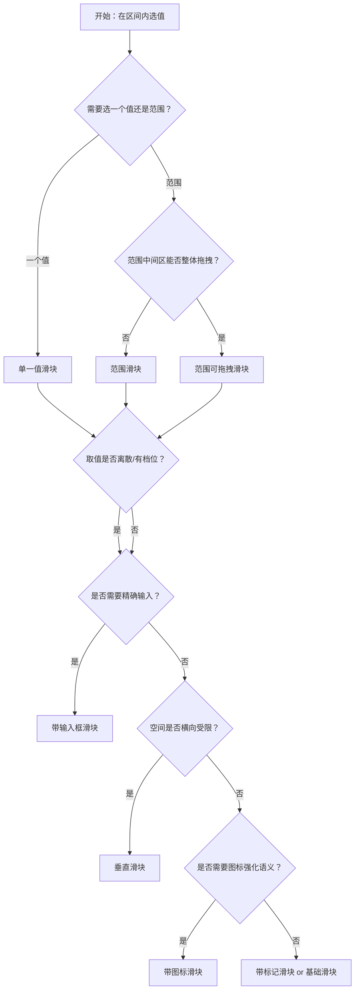

# 1. 简洁易读部份

## 1.0. 组件描述

滑动输入条（Slider）是一种滑动型输入器，用于在数值区间或自定义区间内进行选择，支持连续值或离散值，展示当前值与可选范围。

## 1.1. 组件构成

滑动输入条由以下基础要素构成，可按需组合使用：

> <!-- 附图占位：建议附上一张示例图，展示滑动输入条的三个基础要素（轨道、滑块、刻度标记）的构成关系，标注各要素名称与位置 -->

&emsp;&emsp;1. **轨道** 定义滑块的滑动范围与整体形态，用于承载已选区间与可选区间的视觉区分。

&emsp;&emsp;2. **滑块** 为用户可拖拽或点击定位的控制点，用于调整当前选中的数值。

&emsp;&emsp;3. **刻度标记** 用于标注关键取值点或离散选项，可按需显示或隐藏。

---

## 1.2. 组件包含哪些不同类型

### 1.2.1 单一值滑块

&emsp;**是什么**：仅有一个滑块，用于在区间内选择一个数值

> <!-- 附图占位：建议附上一张示例图，展示单一值滑块（单滑块、水平轨道）的视觉形态，体现其最基础的用法 -->

&emsp;**简单用法**：必须用于只需要选择一个数值的场景；适用于连续或离散值；必须明确展示当前选中值（如通过 Tooltip 或输入框）

&emsp;**典型场景**：音量调节、亮度设置、单一边界值选择（如最低价、最高分）

> <!-- 附图占位：建议附上一张场景图，展示音量调节或亮度设置中单一滑块的典型布局，体现用户拖拽即可即时生效的交互方式 -->

&emsp;**替代方案**：若需同时选择两个边界值，改用范围滑块

### 1.2.2 范围滑块

&emsp;**是什么**：具有两个滑块，用于在区间内选择一个范围的起止值

> <!-- 附图占位：建议附上一张示例图，展示范围滑块（双滑块、中间高亮区间）的视觉形态，体现起止两个控制点的结构 -->

&emsp;**简单用法**：必须用于需要同时确定上下界的场景；两个滑块之间的区域应视觉高亮；两个滑块不可交叉或重叠

&emsp;**典型场景**：价格区间筛选、时间段选择、年龄范围、评分区间

> <!-- 附图占位：建议附上一张场景图，展示筛选条件中「价格区间 100–500」范围滑块的布局，体现起止值同时可调的交互 -->

&emsp;**替代方案**：若只需一个边界，改用单一值滑块；若需多个离散点，考虑多点滑块

### 1.2.3 垂直滑块

&emsp;**是什么**：轨道为垂直方向排列的滑块，适合空间受限或上下语义更强的场景

> <!-- 附图占位：建议附上一张示例图，展示垂直方向滑块的视觉形态，体现轨道自下而上或自上而下的布局 -->

&emsp;**简单用法**：适用于页面横向空间有限、或数值与「高度」「层级」等垂直概念强相关的场景；必须确保拖拽区域足够大、易于操作

&emsp;**典型场景**：侧边栏参数调节、图表参数面板、音量条

> <!-- 附图占位：建议附上一张场景图，展示侧边栏或参数面板中垂直滑块与其它控件的配合布局，体现节省横向空间的使用方式 -->

&emsp;**替代方案**：若空间充足且无垂直语义，改用水平滑块

### 1.2.4 带标记滑块

&emsp;**是什么**：在轨道上标注关键刻度点，用于离散值选择或帮助用户理解取值含义

> <!-- 附图占位：建议附上一张示例图，展示带刻度标记的滑块（如 0°C、26°C、37°C、100°C），体现标记与滑块的对应关系 -->

&emsp;**简单用法**：刻度必须与业务语义一致；当 `step=null` 时，仅能停在刻度位置；可为包含关系或并列关系，需根据业务选择

&emsp;**典型场景**：温度档位、难度等级、频率档位、预设档位选择

> <!-- 附图占位：建议附上一张场景图，展示带「低」「中」「高」刻度的难度滑块，体现离散档位选择的直观性 -->

&emsp;**替代方案**：若为连续值且无关键档位，可省略刻度

### 1.2.5 带输入框滑块

&emsp;**是什么**：滑块与数字输入框联动，既可拖拽也可直接输入精确数值

> <!-- 附图占位：建议附上一张示例图，展示滑块右侧带数字输入框的组合形态，体现拖拽与输入两种交互方式的配合 -->

&emsp;**简单用法**：必须用于需要精确输入或校验范围的场景；输入框与滑块值必须实时同步；必须限制输入框数值在滑块区间内

&emsp;**典型场景**：表单中的数值输入、需精确到整数的配置、带单位的参数设置

> <!-- 附图占位：建议附上一张场景图，展示表单中「数量 1–100」滑块与输入框组合，体现用户既可拖拽也可输入精确值的双重入口 -->

&emsp;**替代方案**：若不需要精确输入，仅用滑块即可

### 1.2.6 带图标滑块

&emsp;**是什么**：在轨道两端或滑块旁增加图标，用于强化业务语义或取值方向

> <!-- 附图占位：建议附上一张示例图，展示滑块左右分别有「小声」「大声」图标的形态，体现业务语义的视觉强化 -->

&emsp;**简单用法**：图标必须与取值语义一致；左右或上下图标应代表取值的两极；图标不得干扰滑块的可点击与拖拽区域

&emsp;**典型场景**：音量（静音/大声）、亮度（暗/亮）、温度（冷/热）

> <!-- 附图占位：建议附上一张场景图，展示设置面板中带音量图标的滑块，体现图标增强语义识别的效果 -->

&emsp;**替代方案**：若语义已足够清晰，可省略图标

### 1.2.7 范围可拖拽滑块

&emsp;**是什么**：在范围滑块基础上，支持整体拖拽两个滑块之间的已选区间，保持区间宽度不变整体平移

> <!-- 附图占位：建议附上一张示例图，展示范围滑块高亮区间可整体拖拽的交互示意，体现范围整体平移的能力 -->

&emsp;**简单用法**：适用于用户希望保持区间宽度、只调整整体位置的场景；必须明确提示用户中间区域可拖拽

&emsp;**典型场景**：时间段微调、价格区间整体平移、可视范围选择

> <!-- 附图占位：建议附上一张场景图，展示时间轴选择器中范围可整体拖拽的用法，体现保持时长不变、只改起止点的场景 -->

&emsp;**替代方案**：若用户更常单独调节起止值，用普通范围滑块即可

---

## 1.3. 各类型典型场景案例

### 1.3.1 单一值与范围滑块

> <!-- 附图占位：建议附上一张对比图，左侧展示单一值滑块用于音量调节（符合规范），右侧展示同一场景误用范围滑块（不符合语义） -->

✅ **推荐：** 单一目标数值用单一值滑块，区间目标用范围滑块

❌ **不推荐：** 只需一个数值时使用范围滑块，造成多余交互与理解成本

### 1.3.2 刻度与连续性

> <!-- 附图占位：建议附上一张对比图，左侧展示离散档位使用带标记滑块（符合规范），右侧展示连续值却强加无关刻度（干扰认知） -->

✅ **推荐：** 离散档位用带标记滑块，连续值可无刻度或只标关键点

❌ **不推荐：** 连续值上堆砌过多无关刻度，或离散档位无任何标记

### 1.3.3 精确输入与纯拖拽

> <!-- 附图占位：建议附上一张对比图，左侧展示需精确数值时配合输入框（符合规范），右侧展示仅滑块却要求用户输入精确值（体验差） -->

✅ **推荐：** 需精确输入时提供带输入框滑块，纯调节时用单一滑块

❌ **不推荐：** 要求精确到具体数字却只提供纯滑块、无输入入口

---

# 2. 选型指南

## 2.1 选择流程

---

# 3. 细致专业部份（交互与排版规则）

## 3.1 轨道的展示与反馈

* **视觉区分**：已选区间与未选区间必须在颜色或明度上有明显区分，已选部分（轨道已覆盖部分）应更突出。
* **悬停反馈**：轨道和滑块在悬停时应提供视觉反馈（如颜色加深、滑块略放大），明确可交互。
* **禁用状态**：禁用时滑块与轨道均需置灰，且不可拖拽或点击。

> <!-- 附图占位：建议附上一张场景图，展示滑块在不同状态（默认、悬停、禁用）下的视觉区分，体现反馈与禁用规范 -->

## 3.2 取值的可见性与确认

* **实时展示**：拖拽过程中，当前值必须通过 Tooltip 或输入框可见；不得让用户「盲拖」。
* **确认时机**：若业务要求「选择完毕再生效」，应在 `mouseup` 或 `keyup` 时提交；若为即时生效（如音量），可随拖随变。
* **单位与格式**：数值若有单位（如 °C、%、元），应在 Tooltip 或输入框中展示，与刻度标记一致。

> <!-- 附图占位：建议附上一张场景图，展示拖拽时 Tooltip 显示「26°C」的即时反馈，体现取值可见性原则 -->

## 3.3 摆放位置与布局

* **水平优先**：无特殊理由时，优先使用水平滑块，符合从左到右的数值递增习惯。
* **与输入框配合**：带输入框时，输入框通常置于滑块右侧（或下方），与滑块对齐；单位放在输入框内或旁。
* **表单内使用**：在表单中，滑块需与标签、校验提示、必填标识等保持一致的排版节奏。

> <!-- 附图占位：建议附上一张场景图，展示表单内滑块与标签、输入框、单位的一致性排版 -->

## 3.4 范围滑块的交互约束

* **顺序约束**：两个滑块的值必须满足左 ≤ 右（或下 ≤ 上），不得交叉。
* **最小间隔**：若业务有最小间隔要求（如最短时长），需在交互中约束，防止两滑块贴得过近无法操作。
* **全选与清空**：若支持「全选区间」或「清空」，需有明确入口，且符合用户预期。

## 3.5 键盘与无障碍

* **键盘操作**：滑块应支持键盘聚焦与方向键调节，步长与 `step` 一致。
* **焦点可见**：聚焦时需有明显焦点环，便于键盘用户识别。
* **语义与读屏**：轨道与滑块需具备合适的 ARIA 属性，使读屏软件能准确描述当前值与范围。

## 3.6 刻度与步长

* **刻度数量**：刻度不宜过多，一般不超过 10 个，避免视觉拥挤。
* **步长一致性**：`step` 与 `marks` 若同时存在，步长应能被 (max - min) 整除，且与刻度对齐。
* **包含与并列**：`included` 为 true 时，值为包含关系；为 false 时，不同刻度间为并列关系，需根据业务选择。

---

## 4.0. 常见问题

### 1. 滑块和 InputNumber 如何选择

- **滑块**：适合在区间内「调节」一个大致值或范围，用户更关注相对位置而非精确数字；适合连续或少量离散档位。
- **InputNumber**：适合需要精确输入、校验、或超出滑块区间范围的情形；当两者结合时，用带输入框滑块。

### 2. 范围滑块和两个单一滑块的区别

- **范围滑块**：两个端点同属一个逻辑区间，中间高亮表示已选范围，可整体理解为一「段」值。
- **两个单一滑块**：适用于两个独立维度的值（如最低价、最高价），若语义上属于同一区间的起止，应用范围滑块更符合认知。
