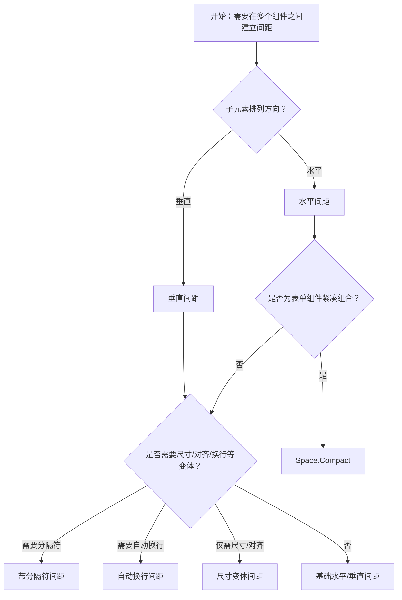

# 1. 简洁易读部份

## 1.0. 组件描述

间距组件用于在多个子元素之间建立统一、可配置的间距，避免组件紧贴在一起，提升布局的节奏感与可读性。

## 1.1. 组件构成

间距由以下基础要素构成，可按需组合使用：

> <!-- 附图占位：建议附上一张示例图，展示间距组件的三个基础要素（容器、子项、间距）的构成关系，标注水平或垂直方向上的等距分布 -->

&emsp;&emsp;1. **容器** 定义间距方向、尺寸和对齐方式，包裹所有子元素。

&emsp;&emsp;2. **子项** 被包裹的组件（如按钮、输入框、卡片），每个子项之间会插入间距。

&emsp;&emsp;3. **间距** 子项之间的间隔，可水平或垂直，支持预设尺寸或自定义数值。

---

## 1.2. 组件包含哪些不同类型

### 1.2.1 水平间距

&emsp;**是什么**：在水平方向上为相邻组件建立等距间隔，最常用的默认形态

> <!-- 附图占位：建议附上一张示例图，展示水平方向排列的多个按钮或卡片，子项之间等距分布，体现水平间距的典型形态 -->

&emsp;**简单用法**：适用于行内元素的水平排列；不设置时默认为水平；可与不同尺寸（small/medium/large）配合

&emsp;**典型场景**：工具栏按钮组、表单行内控件、筛选条件并列

> <!-- 附图占位：建议附上一张场景图，展示表单中「取消」「确定」等按钮水平排列、中间等距，体现水平间距的典型用法 -->

&emsp;**替代方案**：若需垂直排列，改用垂直间距

### 1.2.2 垂直间距

&emsp;**是什么**：在垂直方向上为相邻组件建立等距间隔，适用于纵向堆叠

> <!-- 附图占位：建议附上一张示例图，展示垂直方向堆叠的多个卡片或表单项，子项之间垂直等距，体现垂直间距的典型形态 -->

&emsp;**简单用法**：必须显式设置方向为垂直；适用于表单字段、列表项、卡片堆叠等纵向布局

&emsp;**典型场景**：表单字段间、列表项间、垂直卡片流

> <!-- 附图占位：建议附上一张场景图，展示多个表单项自上而下排列、字段之间垂直等距，体现垂直间距的典型用法 -->

&emsp;**替代方案**：若为行内排列，改用水平间距

### 1.2.3 尺寸变体（small/medium/large）

&emsp;**是什么**：通过预设尺寸控制间距大小，保持与设计系统一致

> <!-- 附图占位：建议附上一张示例图，并排展示 small、medium、large 三种尺寸下子项之间的间距差异，体现尺寸层级的视觉节奏 -->

&emsp;**简单用法**：small 适合紧凑区域，medium 适合常规，large 适合宽松排版；未设置时默认为 small；可分别配置水平与垂直间距

&emsp;**典型场景**：根据区块重要性或密度选择尺寸，表格内用 small，页面主区用 medium，大区块间用 large

> <!-- 附图占位：建议附上一张场景图，展示同一页面中不同区域使用不同尺寸间距的对比，体现按场景选择尺寸的用法 -->

&emsp;**替代方案**：若有特殊需求，可自定义数值

### 1.2.4 带分隔符间距

&emsp;**是什么**：在子项之间插入可见分隔符（如斜线、竖线、圆点），用于强化分组或层级

> <!-- 附图占位：建议附上一张示例图，展示子项之间用斜线、竖线或圆点分隔的形态，体现分隔符对视觉分组的增强 -->

&emsp;**简单用法**：分隔符不占主导，应与子项视觉层级协调；适用于需要明确区分的并列项（如「首页 / 产品 / 关于」）

&emsp;**典型场景**：导航链接间、标签列表、层级路径展示

> <!-- 附图占位：建议附上一张场景图，展示带斜线分隔符的导航链接或标签列表，体现分隔符的分组与层级暗示 -->

&emsp;**替代方案**：若仅需间隔无需视觉分隔，使用普通间距即可

### 1.2.5 自动换行间距

&emsp;**是什么**：水平排列时允许子项在空间不足时自动换行，保持等距

> <!-- 附图占位：建议附上一张示例图，展示水平间距在容器变窄时子项自动换行的效果，多行仍保持统一间距 -->

&emsp;**简单用法**：仅水平方向有效；适用于子项数量不固定、容器宽度可能变化的场景；换行后行间间距与行内间距可分别配置

&emsp;**典型场景**：标签云、灵活工具栏、筛选标签组

> <!-- 附图占位：建议附上一张场景图，展示标签组在窄屏下自动换行、多行保持等距的布局，体现自动换行的适应性 -->

&emsp;**替代方案**：若子项固定且不换行，关闭自动换行

### 1.2.6 紧凑布局（Space.Compact）

&emsp;**是什么**：让表单类组件紧凑连接、合并边框，形成一体化输入区域

> <!-- 附图占位：建议附上一张示例图，展示 Space.Compact 包裹的输入框、选择器、按钮等，边框合并、视觉连贯的紧凑形态 -->

&emsp;**简单用法**：仅支持特定表单组件（输入框、选择器、日期选择器等）；适用于需要「组合输入」或「一体化操作」的场景；与普通 Space 的语义不同，不可混用

&emsp;**典型场景**：搜索框 + 按钮组合、级联输入、紧凑表单行

> <!-- 附图占位：建议附上一张场景图，展示「输入框 + 搜索按钮」紧凑组合、边框合并的典型用法 -->

&emsp;**替代方案**：若为普通组件间距，使用常规 Space

---

## 1.3. 各类型典型场景案例

### 1.3.1 水平间距

> <!-- 附图占位：建议附上一张对比图，左侧展示水平排列的按钮组间距统一（符合规范），右侧展示按钮紧贴或间距不一（违反规范） -->

✅ **推荐：** 行内并列组件使用水平间距，保证等距、视觉节奏一致

❌ **不推荐：** 行内组件紧贴或手动写死 margin 导致间距不统一

### 1.3.2 垂直间距

> <!-- 附图占位：建议附上一张对比图，左侧展示表单字段间垂直等距（符合规范），右侧展示字段间距不均或过于拥挤（违反规范） -->

✅ **推荐：** 纵向堆叠的表单项、列表项使用垂直间距，保持节奏清晰

❌ **不推荐：** 纵向内容间距随意，缺乏统一节奏

### 1.3.3 带分隔符间距

> <!-- 附图占位：建议附上一张对比图，左侧展示分隔符用于明确分组的导航或标签（符合规范），右侧展示分隔符过于抢眼或与内容语义不符（违反规范） -->

✅ **推荐：** 需要分组或层级暗示时使用分隔符，且分隔符视觉弱于内容

❌ **不推荐：** 分隔符过重抢戏，或在不需分组的场景滥用

### 1.3.4 紧凑布局

> <!-- 附图占位：建议附上一张对比图，左侧展示输入框与按钮紧凑组合、边框合并（符合规范），右侧展示用普通 Space 包裹表单组件导致视觉割裂（违反规范） -->

✅ **推荐：** 组合输入或一体化操作使用 Space.Compact，仅用于支持的组件

❌ **不推荐：** 在非表单组合场景使用 Compact，或混入不支持的组件

---

# 2. 选型指南

## 2.1 选择流程

---

# 3. 细致专业部份（交互与排版规则）

## 3.1 多操作的展示与折叠策略

间距组件本身不承载操作，但与工具栏、表单等配合时：

* **操作区使用 Space**：同一操作区域的多个按钮、链接应使用 Space 统一间距，避免手动 margin。
* **操作过多时**：优先展示高频操作，次要操作收纳至「更多」下拉；Space 仅负责可见项之间的间距，不参与折叠逻辑。
* **Compact 与普通 Space 分离**：紧凑组合与普通间距区域应明确区分，不混用。

> <!-- 附图占位：建议附上一张场景图，展示工具栏中「新建」「导出」等按钮用 Space 统一间距，以及「更多」下拉收纳次要操作的布局 -->

## 3.2 危险操作（删除/清空/停用）

* 间距组件不直接涉及危险操作；当危险按钮与其他按钮并列时，危险按钮应弱化视觉，且通过 Space 与主操作保持适当物理间隔，降低误触概率。
* 危险按钮建议放在操作组末尾，与主操作拉开距离。

> <!-- 附图占位：建议附上一张场景图，展示操作组中主按钮、默认按钮、危险按钮的排列与间距关系 -->

## 3.3 摆放位置（按页面场景划分）

* **页面顶部**：标题与操作按钮之间、筛选条件之间常用水平 Space。
* **表单区域**：表单项之间用垂直 Space；行内控件（如输入框与单位）用水平 Space 或 Compact。
* **列表与卡片**：列表项之间、卡片之间可用垂直 Space；卡片内元素之间可用水平或垂直 Space。
* **弹窗与抽屉**：底部操作按钮之间用水平 Space，与内容区用垂直 Space 分隔。

> <!-- 附图占位：建议附上一张场景图，展示页面不同区域（标题区、表单、列表、弹窗底部）中 Space 的典型摆放位置 -->

## 3.4 顺序与对齐逻辑

* **水平排列**：主操作通常在最右或视线落点；次要操作、危险操作依次靠左或收纳。
* **垂直排列**：按阅读顺序自上而下，重要内容靠上。
* **对齐方式**：可根据需要设置 start、center、end、baseline，保证多行或高低不一的子项视觉协调。

> <!-- 附图占位：建议附上一张示例图，展示不同 align 值下子项的对齐效果，以及水平排列时主次操作的顺序 -->

## 3.5 状态与交互反馈

* 间距组件通常无交互状态；其包裹的子项（如按钮、链接）需提供悬停、聚焦、禁用等反馈。
* 当子项数量动态变化时，间距应保持稳定，不因增删项而出现突兀留白或拥挤。

> <!-- 附图占位：建议附上一张示例图，展示子项数量变化前后间距保持一致的布局 -->

## 3.6 视觉规范与形态选择

* **尺寸选择**：small 约 8px，medium 约 16px，large 约 24px，与设计系统间距规范一致；同一区块内尽量统一尺寸。
* **方向选择**：行内排列用水平，纵向堆叠用垂直；避免用水平 Space 包裹本应纵向排列的内容。
* **与 Flex 区别**：Space 为内联元素提供等距排列，会为子项添加包裹；Flex 为块级布局，无额外包裹。需要更多布局控制时用 Flex。

> <!-- 附图占位：建议附上一张示例图，展示 small/medium/large 的视觉差异，以及 Space 与 Flex 在典型场景下的适用区别 -->

---

## 4.0. 常见问题

### 1. Space 和 Flex 有什么区别？

- **Space**：为内联元素提供统一间距，会为每个子项添加包裹元素，适合行、列中多个子项的等距排列。
- **Flex**：为块级元素提供布局，不添加包裹元素，适合需要更多对齐、换行、伸缩控制的场景。

### 2. 什么时候用 Space.Compact？

- 当表单组件（输入框、选择器、日期选择器、按钮等）需要紧凑连接、合并边框，形成一体化输入或操作区域时使用 Compact；普通组件间距用常规 Space。

### 3. 间距尺寸如何选择？

- 根据区块密度与重要性：紧凑区域（表格、工具栏）用 small，常规表单与列表用 medium，大区块或留白较多处用 large；同一层级内建议统一。
