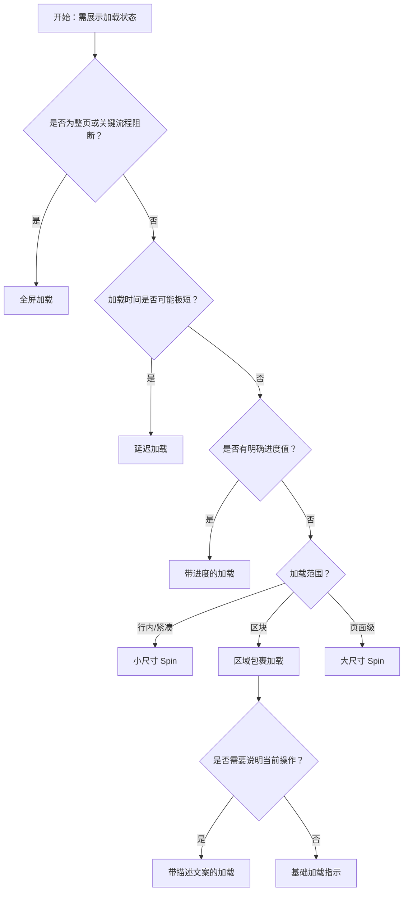

# 1. 简洁易读部份

## 1.0. 组件描述

加载中组件用于表示页面或区块处于等待异步数据或渲染过程中的状态，通过旋转图标或自定义指示符为用户提供明确的加载反馈，有效缓解等待焦虑。

## 1.1. 组件构成

加载中组件由以下基础要素构成，可按需组合使用：

> <!-- 附图占位：建议附上一张示例图，展示 Spin 的指示符、可选描述文案、以及包裹区域的构成关系，标注各要素名称与位置 -->

&emsp;&emsp;1. **指示符** 旋转的加载图标或自定义动画元素，是用户识别「加载中」的核心视觉符号。

&emsp;&emsp;2. **描述文案** 可选，在指示符下方或旁边补充说明，如「加载中…」「提交中…」，增强信息传达。

&emsp;&emsp;3. **包裹区域** 当 Spin 作为包裹层使用时，被包裹的内容在加载期间可被遮罩或半透明化，指示符居中覆盖于其上。

&emsp;&emsp;4. **背景层** 可选，全屏模式下可带半透明遮罩，阻断用户操作直至加载完成。

---

## 1.2. 组件包含哪些不同类型

### 1.2.1 基础加载指示

&emsp;**是什么**：仅包含旋转指示符的最简形态，用于表达「加载中」的通用状态。

> <!-- 附图占位：建议附上一张示例图，展示基础 Spin（仅旋转图标）的视觉形态 -->

&emsp;**简单用法**：必须用于加载状态明确、无需额外说明的场景；可独立出现或覆盖在内容上方；适合轻量、短时加载

&emsp;**典型场景**：按钮点击后的加载、表格刷新、卡片内容加载

> <!-- 附图占位：建议附上一张场景图，展示按钮或卡片区域的基础 Spin 使用方式 -->

&emsp;**替代方案**：若需补充说明，使用带描述文案的 Spin

### 1.2.2 带描述文案的加载

&emsp;**是什么**：在指示符下方或旁侧增加描述文案，如「加载中…」「提交中…」，明确当前状态含义。

> <!-- 附图占位：建议附上一张示例图，展示带描述文案的 Spin（图标 + 文字）的视觉形态 -->

&emsp;**简单用法**：必须用于需要明确告知用户当前在做什么的场景；文案应简洁、与操作语义一致；适合耗时稍长的操作

&emsp;**典型场景**：表单提交、数据导出、页面初始化、保存中

> <!-- 附图占位：建议附上一张场景图，展示表单提交时「提交中…」的 Spin 与文案组合 -->

&emsp;**替代方案**：若操作语义已足够清晰，使用基础加载指示即可

### 1.2.3 区域包裹加载

&emsp;**是什么**：将 Spin 作为包裹层套在内容区块外，加载时内容半透明或遮罩，指示符居中覆盖。

> <!-- 附图占位：建议附上一张示例图，展示 Spin 包裹卡片或表格区域时的遮罩与居中指示符效果 -->

&emsp;**简单用法**：必须用于区块级加载；被包裹内容在加载期间应不可操作；指示符需明显可见、居中展示

&emsp;**典型场景**：卡片内容刷新、表格数据加载、详情区块加载

> <!-- 附图占位：建议附上一张场景图，展示卡片区域被 Spin 包裹时的加载状态 -->

&emsp;**替代方案**：若结构已知且可占位，可考虑用 Skeleton 替代

### 1.2.4 不同尺寸的加载

&emsp;**是什么**：通过小、中、大三种尺寸适配不同层级的加载场景，小尺寸用于行内，大尺寸用于页面级。

> <!-- 附图占位：建议附上一张示例图，展示小、中、大三种尺寸 Spin 的视觉对比 -->

&emsp;**简单用法**：小尺寸用于文本行内、按钮内等紧凑区域；默认尺寸用于卡片、表格等区块；大尺寸用于全页或重要区块加载

&emsp;**典型场景**：行内文本加载用小尺寸、卡片加载用默认、首屏加载用大尺寸

> <!-- 附图占位：建议附上一张场景图，展示不同场景下尺寸选择的对应关系 -->

&emsp;**替代方案**：尺寸需与加载范围匹配，避免小区域用大 Spin 或反之

### 1.2.5 延迟加载

&emsp;**是什么**：在加载开始后延迟一段时间再显示 Spin，避免极短操作时的闪烁，提升体验。

> <!-- 附图占位：建议附上一张示例图，展示延迟显示的逻辑示意（如 200ms 内完成则不显示 Spin） -->

&emsp;**简单用法**：必须用于加载时间不确定、可能极短的场景；延迟时间通常为数百毫秒；若在延迟内完成则不显示 Spin

&emsp;**典型场景**：搜索建议、筛选切换、轻量接口调用

> <!-- 附图占位：建议附上一张场景图，展示快速响应时不闪现 Spin、慢速时才显示的体验差异 -->

&emsp;**替代方案**：若加载通常较慢，可不设延迟直接显示

### 1.2.6 全屏加载

&emsp;**是什么**：带半透明背景的全屏 Spin，用于整页或关键流程的加载，阻断用户操作直至完成。

> <!-- 附图占位：建议附上一张示例图，展示全屏 Spin 的遮罩与居中指示符效果 -->

&emsp;**简单用法**：必须用于整页切换、登录提交、关键流程初始化等需阻断式等待的场景；遮罩应半透明且明显；操作完成后需及时关闭

&emsp;**典型场景**：页面跳转、登录验证、应用初始化、权限校验

> <!-- 附图占位：建议附上一张场景图，展示全屏 Spin 在页面跳转时的使用方式 -->

&emsp;**替代方案**：若非整页阻断，使用区域包裹加载即可

### 1.2.7 带进度的加载

&emsp;**是什么**：在 Spin 基础上增加进度展示，当有明确进度值时显示百分比或进度条，无进度时可使用无限进度预估。

> <!-- 附图占位：建议附上一张示例图，展示带进度的 Spin（指示符 + 进度条/百分比）的视觉形态 -->

&emsp;**简单用法**：有进度值时显示真实百分比；无法获取进度时可使用「预估无限进度」表示进行中；适合上传、导出等可量化场景

&emsp;**典型场景**：文件上传、数据导出、批量处理

> <!-- 附图占位：建议附上一张场景图，展示上传场景中带进度的 Spin 与 Progress 的配合 -->

&emsp;**替代方案**：若进度不可知，使用基础 Spin 或带描述文案的 Spin

---

## 1.3. 各类型典型场景案例

### 1.3.1 区块与全页加载

> <!-- 附图占位：建议附上一张对比图，左侧展示卡片区域用区域包裹 Spin（符合规范），右侧展示全页用全屏 Spin（符合规范） -->

✅ **推荐：** 局部区块用区域包裹；整页或关键流程用全屏 Spin

❌ **不推荐：** 局部加载用全屏 Spin 过度阻断；整页加载用小块 Spin 不够明显

### 1.3.2 延迟与即时显示

> <!-- 附图占位：建议附上一张对比图，左侧展示快速操作延迟显示避免闪烁（符合规范），右侧展示慢速操作即时显示（符合规范） -->

✅ **推荐：** 可能极快完成的操作用延迟显示；明确较慢的操作即时显示

❌ **不推荐：** 所有加载都即时显示，导致快速操作时 Spin 闪烁

### 1.3.3 尺寸与层级匹配

> <!-- 附图占位：建议附上一张对比图，左侧展示不同层级用对应尺寸（符合规范），右侧展示页面级加载用小尺寸（违反规范） -->

✅ **推荐：** 行内用小尺寸、区块用默认、页面级用大尺寸

❌ **不推荐：** 页面级加载使用过小的 Spin，用户难以察觉

---

# 2. 选型指南

## 2.1 选择流程

---

# 3. 细致专业部份（交互与排版规则）

## 3.1 与 Skeleton、Progress 的选型策略

* **Spin**：用于无明确进度或结构未知的加载，仅传达「正在加载」。
* **Skeleton**：用于结构已知、等待数据填充的场景，可完全替代 Spin 并提供更好体验。
* **Progress**：用于有明确进度值的操作，传达「完成了多少」。

当结构已知且可占位时，优先考虑 Skeleton；当有明确进度时，使用 Progress；其余场景使用 Spin。

> <!-- 附图占位：建议附上一张对比图，展示 Spin、Skeleton、Progress 的适用场景差异 -->

## 3.2 延迟显示与防闪烁

* **延迟时间**：通常设为 200～300 毫秒，若加载在此时长内完成则不显示 Spin。
* **目的**：避免快速操作时 Spin 闪现又消失，造成视觉干扰。
* **适用**：搜索建议、筛选、轻量接口等加载时间不确定的场景。对于明确较慢的操作，可不设延迟。

> <!-- 附图占位：建议附上一张示意图，展示延迟逻辑与用户感知的关系 -->

## 3.3 尺寸与层级对应

* **小尺寸**：用于文本行内、按钮内、表格单元格等紧凑区域。
* **默认尺寸**：用于卡片、表格、表单等区块级加载。
* **大尺寸**：用于页面级、首屏、关键流程的加载，需足够显眼。

尺寸选择应与加载范围匹配，避免小区域用大 Spin 造成压迫感，或大区域用小 Spin 导致用户忽略。

> <!-- 附图占位：建议附上一张示例图，展示小、默认、大三种尺寸在不同场景下的使用 -->

## 3.4 全屏加载的使用规范

* **适用场景**：整页切换、登录提交、应用初始化、关键流程必须等待完成的场景。
* **遮罩**：半透明背景需明显，避免用户误以为可操作；可配合描述文案说明当前状态。
* **关闭时机**：加载完成后必须及时关闭，不可长时间保留，以免阻断用户。

> <!-- 附图占位：建议附上一张场景图，展示全屏 Spin 的遮罩、居中指示与描述文案的组合 -->

## 3.5 描述文案的撰写规范

* **简洁**：如「加载中…」「提交中…」「保存中…」，动词 + 中 + 省略号。
* **语义一致**：文案需与当前操作一致，提交用「提交中」，保存用「保存中」。
* **避免冗余**：若操作语义已清晰，可不加描述，仅用指示符即可。

> <!-- 附图占位：建议附上一张示例图，展示不同操作对应的描述文案规范 -->

## 3.6 自定义指示符与品牌一致性

* **自定义**：可替换为品牌 Logo、定制动画等，但需保持「加载中」的语义明确。
* **一致性**：同一应用内加载指示符应统一，避免多种样式混用造成认知负担。
* **可识别性**：自定义指示符需具备动态感，让用户能快速识别为加载状态而非静态装饰。

> <!-- 附图占位：建议附上一张示例图，展示默认指示符与自定义指示符的对比及使用建议 -->

---

## 4.0. 常见问题

### 1. Spin 和 Skeleton 有什么区别？

- **Spin**：用旋转图标表示「正在加载」，不展示内容结构，适合结构未知或全页加载。
- **Skeleton**：用占位块模拟真实内容结构，保持布局稳定，适合结构已知、等待数据填充的场景。在可用场景下，Skeleton 通常能提供更好的体验。

### 2. 什么时候用延迟显示？

当加载时间不确定、可能极短（如数百毫秒内完成）时，建议设置延迟。若加载在延迟时间内完成，则不显示 Spin，避免闪烁。对于明确较慢的操作，可直接显示，无需延迟。

### 3. 全屏 Spin 什么时候用？

整页切换、登录提交、应用初始化、关键流程必须等待完成时使用。使用全屏 Spin 会阻断用户操作，因此需在加载完成后及时关闭，避免长时间占用。
